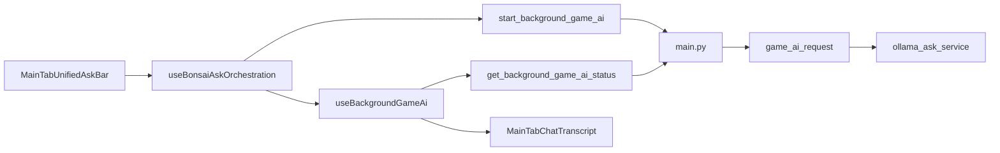

# Code clarity conventions

House style for maintainability refactors across `src/`, `main.py`, and `py_modules/`. See also [glossary.md](glossary.md).

## File header (every meaningful module)

```ts
/**
 * Title: Short noun phrase
 * Purpose: …
 * Used for: …
 * Solves: …
 * Does not: …
 */
```

Python modules use the same fields in a module docstring.

## Method notes (non-obvious only)

```ts
/**
 * Feature: …
 * Input: … Output: …
 */
```

Skip obvious getters, prop passthroughs, and trivial wrappers.

## Structure

1. **Reorder + section labels** first (`// --- Submit ---`, `# --- Ask RPC ---`).
2. **Extract** only when a section has a clear second owner and stays testable alone.
3. **Clarity renames** OK; keep Decky RPC method names stable (`start_background_game_ai`, etc.).

## Exclusions

- Pure data dumps (`characterPlaceholderEmoticonGrids.ts`)
- Generated `dist/`
- CSS token section dumps
- Tiny re-exports, empty `__init__.py`, one-liner shims

## Ask path map

Walk this path in order to trace a Main-tab Ask from UI to Ollama and back (~10 minutes).

| Step | File | Role |
|------|------|------|
| 1 | [`src/components/MainTab.tsx`](../src/components/MainTab.tsx) | Composes preset row, Ask bar, screenshot browser, chat transcript. |
| 2 | [`src/components/MainTabUnifiedAskBar.tsx`](../src/components/MainTabUnifiedAskBar.tsx) | Ask field, mode menu, submit/cancel, attachment chrome. |
| 3 | [`src/index.tsx`](../src/index.tsx) | Wires `useBonsaiAskOrchestration` into `MainTab` props (`onAskOllama`, etc.). |
| 4 | [`src/hooks/useBonsaiAskOrchestration.ts`](../src/hooks/useBonsaiAskOrchestration.ts) | Submit, poll bridge, thread/archive, strategy branches, stream reveal, session restore. |
| 4b | [`src/hooks/useStrategyChecklistSession.ts`](../src/hooks/useStrategyChecklistSession.ts) | Per-game Strategy checklist disk sync (extracted from orchestration hook). |
| 5 | [`src/hooks/useBackgroundGameAi.ts`](../src/hooks/useBackgroundGameAi.ts) | Polls `get_background_game_ai_status` until terminal state. |
| 6 | [`src/utils/deckyCall.ts`](../src/utils/deckyCall.ts) | RPC timeout + error formatting for hung Python calls. |
| 7 | [`main.py`](../main.py) | `start_background_game_ai`, `get_background_game_ai_status`, `abort_background_game_ai`. |
| 8 | [`py_modules/backend/services/game_ai_request.py`](../py_modules/backend/services/game_ai_request.py) | Foreground Ask orchestration (context, KB, sanitizer, Ollama). |
| 9 | [`py_modules/backend/services/ollama_ask_service.py`](../py_modules/backend/services/ollama_ask_service.py) | Ollama HTTP chat/stream for game Ask. |
| 10 | [`src/components/MainTabChatTranscript.tsx`](../src/components/MainTabChatTranscript.tsx) | Renders live/collapsed turns, reply actions, strategy UI. |

**Focus helpers (D-pad only):** [`replyStopRegistry.ts`](../src/utils/replyStopRegistry.ts), [`liveTurnFocusGraph.ts`](../src/utils/liveTurnFocusGraph.ts), [`answerBubbleNavRegistry.ts`](../src/utils/answerBubbleNavRegistry.ts).


