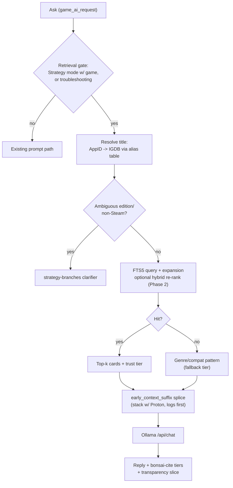

# Knowledge base (offline RAG v1)

Maintainer architecture for the **on-Deck offline strategy + compat knowledge base**. User setup: [troubleshooting.md](troubleshooting.md) § Knowledge base. QA: [testing.md](testing.md) **KB-*** rows. **Phase 2 hybrid** shipped 2026-07-28 (see [archive/roadmap-completed.md](archive/roadmap-completed.md)).

## Overview

v1 grounds Strategy and troubleshooting Asks by **pre-retrieval prompt-splice** into `early_context_suffix` (not model-facing tools). The corpus is **maintainer-built**, **manifest-driven**, and **downloaded on demand** (Hugging Face primary, GitHub Releases mirror). Retrieval is **FTS5 + rule-based query expansion**; **Phase 2** adds optional **hybrid re-rank** (FTS shortlist → `nomic-embed-text` cosine sort) for Strategy when vectors and the embed model are available.

## Retrieval flow



## Runtime components

| Component | Path | Role |
|-----------|------|------|
| Retrieval | `py_modules/backend/services/knowledge_base_service.py` | Gate, AppID/alias resolve, FTS5 search, adaptive byte budget, genre/compat fallback |
| Schema + manifest helpers | `py_modules/backend/services/knowledge_base_schema.py` | SQLite DDL, FTS triggers, `resolve_corpus_db_path`, trust tiers |
| Downloader | `py_modules/backend/services/rag_corpus_download_service.py` | Manifest fetch, curl download, zlib decompress, SHA-256 verify |
| Ask splice | `py_modules/backend/services/game_ai_request.py` | `searching_kb` thinking phase; stack KB + Proton into `early_context_suffix` |
| System prompt | `py_modules/backend/services/ollama_prompts.py` | `bonsai-cite` + spoiler instructions when KB block present |
| Transparency | `py_modules/backend/services/transparency_service.py` | KB slice (sources, bytes, tier) on last Ask |
| UI | `src/components/KnowledgeBaseSection.tsx`, `OllamaTab.tsx` | Download/update/remove, toggle, availability indicator |
| RPC | `main.py` | `start_rag_corpus_download`, `get_rag_corpus_status`, `cancel_rag_corpus_download`, `update_rag_corpus`, `remove_rag_corpus` |

## Maintainer build pipeline

```bash
python scripts/build_rag_db.py --seed --out ./dist/knowledge-base
```

- **Never commit** the corpus to git.
- Emits `corpus.db`, `corpus.db.zlib`, `corpus-manifest.json`, `ATTRIBUTIONS.md`.
- **SoH → OoT** alias lives in the alias table (replaces the hardcoded prompt rule).
- Full crawl + LLM distillation is maintainer-batch work; `--seed` ships a dev/sample DB for QA.
- **Phase 2 (shipped 2026-07-28):** `build_rag_db.py` populates `section_vectors` when local Ollama has `nomic-embed-text`; manifest `embeddings_populated` + `embedding_section_count`.

## Corpus layout on Deck

Default install path: `~/.bonsai/rag/` containing:

- `corpus.db` — read-only SQLite (FTS5 external content over sections)
- `corpus-manifest.json` — version, chunk SHA-256, HF/GitHub URLs

Settings: `rag_corpus_path`, `rag_corpus_version`, `use_local_knowledge_base`.

## Title resolution ladder

1. **Steam AppID** → `games.app_id`
2. **Normalized alias** (shortcut name, display title) → `aliases` table
3. **Canonical title** exact match
4. Miss → genre/compat-pattern fallback (tagged **fallback, no source**)

## Trust tiers + `bonsai-cite`

| Tier | Meaning |
|------|---------|
| `wiki_verified` | Wiki card with `source_version` patch marker |
| `wiki` | Wiki card with URL/license |
| `fallback` | Genre/compat pattern — no per-game source |

Replies should use existing `bonsai-cite` markers; spoilery cards obey `bonsai-spoiler` policy.

## Phasing

| Phase | Scope |
|-------|--------|
| **v1 (shipped)** | FTS5, on-Deck download (or Dev-tab seed), Model A consent, Ollama tab UI |
| **Phase 2 (shipped 2026-07-28)** | Hybrid retrieval for **Strategy / per-game section cards only**: bake vectors in `build_rag_db.py`; query embed via Ollama `/api/embed` (`nomic-embed-text`) on the **same host as Ask**; **FTS shortlist → cosine re-rank**; soft UI hint to install `nomic` (no auto-pull; Ask never blocked). User-facing transparency labels: **Keyword + meaning** (hybrid), **Keyword search**, **Keyword search (embed unavailable)**. Dev-tab vectorized seed first; HF/GitHub publish parallel. |
| **Phase 3** | **Compat / troubleshooting hybrid ranking** (deferred from Phase 2 — **needs research** before design lock); labeled eval sets; compat expansion; Session RAG chip ranking via vectors; structured enemy/item cards; visual maps |

### Phase 2 — locked decisions (2026-07-27)

| Topic | Lock |
|-------|------|
| Hybrid algorithm | FTS top-N shortlist → vector re-rank within resolved `game_id` |
| Missing `nomic-embed-text` | Soft install hint (B2); silent keyword path; never block Ask |
| Query embed host | Same Ollama host as Ask (Deck or LAN) |
| Ship / QA path | Vectorized Dev-tab seed first; production HF download not a code ship gate |
| Compat hybrid | **Out of Phase 2** → Phase 3 research |
| Out of scope | Chip semantic ranking, edition clarifier, sqlite-vss/ANN, new permission, auto-pull nomic, Chroma |

### Transparency retrieval labels (Phase 2)

| User-facing (chip / Show details) | When |
|-----------------------------------|------|
| **Keyword + meaning** | Hybrid ran successfully |
| **Keyword search** | Vectors unused, missing, or corpus has no embeddings |
| **Keyword search (embed unavailable)** | Hybrid attempted; embed failed/timeout — prefer Show details for the parenthetical; chip may stay **Keyword search** |

### Related (not Phase 2 code)

- **Spoiler confidence chip** — Planned Near-term in [roadmap.md](roadmap.md); docs-only until owner decisions; implement later.

## Related docs

- [archive/research/rag-sources-research.md](archive/research/rag-sources-research.md) — source research (superseded for runtime by this doc)
- [development.md](development.md) — contributor index
- [troubleshooting.md](troubleshooting.md) — download, storage, update, removal
- [roadmap.md](roadmap.md) — Spoiler confidence chip (Planned)
