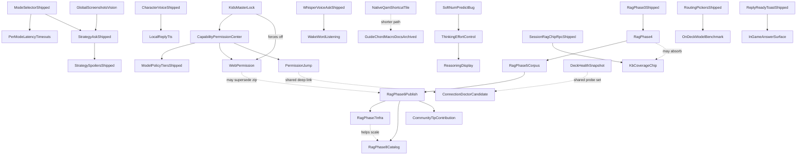

# bonsAI Roadmap

**Next:** [Bugs](#bugs) → [Verify](#verify) → lowest ★ in your lane.

Tracks open defects ([Bugs](#bugs)), on-Deck confirmation ([Verify](#verify)), and the themed backlog ([Backlog](#backlog)). Shipped work: [archive/roadmap-completed.md](archive/roadmap-completed.md) · fixed bugs: [archive/roadmap-bugs-fixed.md](archive/roadmap-bugs-fixed.md). Locked decisions: [audit/maintainer-decisions-locked.md](audit/maintainer-decisions-locked.md) (**D23–D25** locked 2026-08-21, **D26–D31** locked 2026-08-22, **D18** and **D32–D36** locked 2026-08-27/28, **D37** locked 2026-08-29; **D38 deferred** at the maintainer's request pending more data, more games and more questions). RAG session handoff: [audit/session-handoff-2026-08-21.md](audit/session-handoff-2026-08-21.md).

Setup: [troubleshooting.md](troubleshooting.md). QA: [testing.md](testing.md), [testing-manual.md](testing-manual.md). Release: [development.md](development.md), [CHANGELOG.md](../CHANGELOG.md).

**House rule for this file (2026-08-27):** an entry is at most **five lines**, in plain language, and says what a
user would notice — not how the code is wired. Tables and diagrams are exempt. Anything longer goes to
[roadmap-details.md](roadmap-details.md) (open items) or [archive/](archive/) (finished ones) and is **linked, never deleted**,
so no measurement has to be taken twice.

Star ratings use the GTA scale: `★` easiest … `★★★★★` very high complexity; `★★★★★★` extreme scope. Within each list: **ascending stars**; ties alphabetical.

---

## Bugs

Status tags: **OPEN** · **PARTIAL**. Fixed entries move to [archive/roadmap-bugs-fixed.md](archive/roadmap-bugs-fixed.md) with their QA row
intact. Long-form investigation notes live in [roadmap-details.md](roadmap-details.md) — an entry here should be readable in a few
seconds; anything that would otherwise have to be re-measured goes there rather than being deleted.

### Blocking a feature on the couch

- ~~★★★ **You can get stuck inside the Session context panel**~~ — **FIXED, and confirmed on device 2026-08-27.**
  With *Show details* collapsed and *Session context* expanded, Down enters the panel and Up now walks back out to **Retry**,
  then **Helpful**, then the branch buttons — nothing is stranded. Evidence: `runs/SESSION-CTX-TRAP-verify-2026-08-27.json`
  (`escaped: true`, `neverReached: []`). The fix had sat unproven since 2026-08-23.

- ~~★★★ **The D-pad may not escape the full-screen pickers**~~ — **audited on device 2026-08-28. Two pass, one fails badly.**
  The character picker and the AI models hub (which is also where *Browse models* goes) both walk cleanly from the first control to
  **OK** / **Pull selected** at the bottom; the top and bottom presses hold still rather than trapping you. The **try-order picker**
  fails, and is now its own ★★★ entry below. Detail: [roadmap-details.md](roadmap-details.md).

- ~~★★★ **Pressing down in the try-order picker reorders your models instead of moving the highlight**~~ — **FIXED and confirmed on device
  2026-08-28**, the same day it was found. Down now moves the highlight, the list stays put, and three presses reach the buttons at the
  bottom. Reordering moved to each row's own **Up**/**Down** buttons, which already worked. [D36](audit/maintainer-decisions-locked.md)
  option 1, chosen by the maintainer.

- ~~★★ **B does not close the try-order picker**~~ — **FIXED and confirmed on device 2026-08-28**, hours after it was found. B now closes
  it on the first press. The picker was the only one not built on the shared modal frame, so it never inherited B, a title bar, or the
  standard footer — it now uses the same frame as the models hub, which also settles the chrome complaint below.

- ~~★★ **Choosing a character: focus ring now visible**~~ — **CLOSED.** The maintainer confirmed on device 2026-08-27 that focus is visible
  and the picker is usable; the edge behaviour it was still waiting on passed the 2026-08-28 audit above. Nothing left open here.


### Wrong or missing content in a reply

- ★★★★ **The shipping retrieval arm loses to the vector half alone on rows nobody tuned against** — found 2026-08-29 by the first
  measurement against the 92-row blind holdout (**D37**, endorsed the same day). On `holdout`, `vector_only` scores **83.7% top-3 / 64.1%
  top-1** against the shipping `rrf` arm's **79.3% / 56.5%** — **7.6 points of top-1**. On `tune` the two were level (91.5% top-3 each,
  `rrf` marginally ahead on top-1). An arm that ties on the rows its weights were tuned on and loses by that much on rows written blind is
  the textbook shape of **fusion weights that do not generalise**, and catching it is the whole reason a blind holdout exists.
  **Filed as [D38](audit/maintainer-decisions-locked.md#d38--deferred-at-the-maintainers-request-raised-2026-08-29--what-ships-is-beaten-by-half-of-itself-on-the-blind-rows-how-should-that-be-acted-on)
  and DEFERRED 2026-08-29 at the maintainer's request** — more data, more games and more questions
  first. **No weight changes until it is answered, and never by tuning against holdout**, which would burn the only clean gate in the
  fixture. The knot worth remembering: the weights were never tuned (equal, locked 2026-08-09), and `tune` rated the blend the best arm
  available — so the one split it is legal to tune against said "change nothing" while the gate said otherwise. **Groundwork done:** 51
  blind rows added to `tune`, which had none ([audit/kb-blind-tune-rows-2026-08-29.md](audit/kb-blind-tune-rows-2026-08-29.md)). Run of
  record: [archive/research/kb-embed-bakeoff-2026-08-29-arms.md](archive/research/kb-embed-bakeoff-2026-08-29-arms.md).
- ★ **The arms report's verdict line only ever compares `rrf` against `keyword`** — so the 2026-08-29 run printed "no separation" while its
  own table showed `vector_only` 83.7% [76.1, 91.3] against `keyword` 70.7% [60.9, 80.4], the closest thing to a separation these fixtures
  have ever produced. The sentence is not wrong about the pair it names; it just does not look at the pair that moved. Make the verdict
  consider every arm, or say which pair it is judging.
- ★★★★ ~~**Corpus chips vanish about 21 seconds after the panel opens**~~ — **found on device and FIXED at the desk 2026-08-29; device
  re-check owed.** Found while running **PHASE4-CHIPS-01**, and it was the exact failure the Phase 4 chip guarantee was written to prevent,
  just delayed. **Measured, with DRG Survivor running:** a fresh panel open showed one game chip with its **Tip** badge in every 3s sample
  from 0s to 21s; from 24s on, the badge count and the corpus-chip count were both **0** and stayed there — 42 more seconds in that run and
  120 in an earlier one. Reproduced twice, once across a panel reopen. The backend was never at fault: probed directly against real settings
  on the Deck, `get_session_rag_chip_candidates` returned **8 candidates** (6 `strategy` + 2 `compat`) throughout.
  **Neither hypothesis in the first write-up was right** — the guarantee did not fail, and the candidate list did not go empty. The cause is
  simpler and was found by reading the tick: `composeSessionPresets` applies the session-RAG mix **once, when the carousel is seeded**, and
  the auto-advance tick then replenished itself straight from the static preset pool via `getRandomPresetExcluding`, which has no access to
  RAG candidates at all. History caps at `CAROUSEL_HISTORY_MAX` 5 behind a 3-wide window, so at `CAROUSEL_STEP_MS` 5800 the seeded corpus
  chip is carried out of the window after about four ticks — **~23s, against the ~21s measured** — and nothing could ever put another back.
  **The fix** gives rotation the same guarantee the seeding had: `pickNextCarouselChip`
  ([sessionRagComposer.ts](../src/features/preset-carousel/sessionRagComposer.ts)) forces a corpus chip when none is in the **visible
  window** (not merely somewhere in history — that distinction is the bug), rolls the usual ~30% otherwise, dedupes against history, prefers
  game chips over shared Deck tips, and stands down entirely while a frozen QA batch is pinned. Candidates reach the tick through a
  module-level holder, following the precedent `runtimeFrozenChipTexts` sets in [presets.ts](../src/data/presets.ts) for the same reason —
  the alternative was threading a list through six layers and a hand-written memo compare for a value that is global by nature.
  **A second bug fixed with it:** only **one** of the 6 game chips could ever reach the screen; all six now rotate through as history trims.
  **Confirmed on device 2026-08-29, same day**, after a full deploy (61 files verified) with DRG Survivor running: **240 seconds sampled
  every 3s across three fresh panel opens, and a corpus chip was on screen in every single sample — zero gaps**, against the pre-fix
  measurement of "gone from 24s and never back". Chip count rose from one to two on screen, and three different game chips appeared
  (*Glyphid Dreadnought*, *Hollow Bough*, *Exploder*) where before only one could. One honest limit stands: the carousel stops advancing at
  `PRESET_CAROUSEL_ACTIVE_MS` 60s, so the guarantee cannot re-fire after that — it makes a corpus chip very likely to be on screen when
  rotation freezes, not certain. 8 unit tests in `sessionRagComposer.test.ts`.
- ★★★ **The longest game chip labels overflow the QAM column, and are not truncated** — **CONFIRMED on device 2026-08-29 by direct
  measurement**, superseding the ~20px estimate first filed the same day. That estimate was wrong in the safe direction: **the real overflow
  is 86.6px.** With Half-Life 2 running, *"What should I know about Rocket-Propelled Grenade Launcher?"* rendered at **379.8px inside a
  300px slot** — 29% wider than the column, spilling 86.6px past its right edge. Read off the live element with `getBoundingClientRect`,
  not predicted. The next widest chip that appeared, *"How do I beat Hunter-Chopper (helicopter)?"* at 268.3px, fits with 15.9px to spare,
  so the cliff sits between those two.
  **The label does not truncate**, which is the part worth acting on: it is `text-overflow: ellipsis` on a `display: inline` element, and
  `overflow` does not apply to inline boxes, so the ellipsis can never fire and the text simply runs out of the column. Making truncation
  actually work is the cheap fix and a prerequisite for the marquee item in Backlog → Focus / Deck UI.
  **How it was finally caught**, recorded because the earlier attempt failed twice: the longest label in the whole corpus is Half-Life 2's
  at **59 characters**, not the Ocarina one at 52 that `PHASE4-CHIPS-01` names, and it only rendered once the Developer *force session RAG
  chips* override was made to reach rotation as well as seeding (below).
- ★ **Chip rotation is biased to the top of the candidate list** — noticed 2026-08-29 while trying to make a long label appear. The
  guarantee and the roll both take `available[0]`, the first candidate not already in history, and the backend returns candidates in rank
  order. Across three 60s windows the same three chips came round every time (ranks 1–3) and ranks 4–6 never appeared. Not the old bug —
  those chips are reachable now, where before only rank 1 ever showed — but it is why the long labels stayed unobserved. A shuffle among
  eligible candidates, or a rotating start index, would spread it. **With the QA override on, all six appeared in 90s**, so the bias is in
  the roll rather than in reachability.
- ★ ~~**"Force session RAG chips" only forced half the carousel**~~ — **FIXED 2026-08-29.** The Developer override set `ragProbability: 1`
  on the compose path, so it forced the three seeded slots and then rotation went straight back to rolling 0.3. The half it did not force is
  the half a QA row watching the carousel over time is actually reading — which is why the long-label check could not be run even with the
  override on. The published candidate list now carries the probability with it, so the override reaches the tick too. Found by using it.
- ★★ **A troubleshooting question that only describes the symptom reaches no tips** — found 2026-08-28 by the second batch of blind
  holdout rows, before any of them were scored. The compat router reaches a question that **names** a topic and not one that only says
  what is going wrong: *"the game drops me back to the library a few minutes in"* (`V2-BLIND-H55`) never routes, because the word *crash*
  is absent; *"my controller works fine on the desktop but the game doesn't seem to see half my buttons"* (`V2-BLIND-H19`) never routes,
  because the word *input* is absent. **Two of the four blind compat rows miss.** This is the D16 gate doing what it was specified to do —
  word-boundary topic matching replaced the old literal `deck`/`proton` phrase gate — so it is a reach limit rather than a regression, and
  the fix is a maintainer call, not a threshold tweak. Neither row was reworded to make it pass; both are named in the reach pin
  (`tests/test_compat_topic_router.py`). Worth noting the shape: a card-derived question about crashes says *crash*, so this hole was
  invisible until questions were written without reading the cards. Detail:
  [audit/kb-blind-holdout-rows-batch2-2026-08-28.md](audit/kb-blind-holdout-rows-batch2-2026-08-28.md) § 5.

- ★★ ~~**A finished reply forgets which game it was about**~~ — **FIXED and confirmed on device 2026-08-28.** Found on device the same
  day while checking the new DRG Survivor glossary chips (`DRG-GLOSSARY-01`). The chips appear while the answer is still being written and
  are **gone by the time it finishes**: measured 2 of them on screen at 30 characters in, none at the end, with the game running and the
  turn's own snapshot naming it. The cause was one line — [chatSlotTurns.ts](../src/utils/chatSlotTurns.ts) rebuilt every turn from a saved
  chat with `appId: ""`, and only the live branch passed the real value
  ([MainTabChatTranscript.tsx:633](../src/components/MainTabChatTranscript.tsx)), so the reply on screen believed no game was running the
  moment it settled.
  **Fixed at the mapper, not per feature**, because the glossary was only the first thing to notice it — the asked-entity spoiler unwrap
  reads the same value (`:286`), and anything added later that asks "which game was this turn about" would have hit it too. The AppID is
  now recorded on the turn itself: `chat_slot_service.py` stores `app_id` per turn and `main.py` passes it from both writers (the question
  on submit, the answer on completion, including a cancel). A restored turn reads its own AppID, then the question's, then the chat's
  `origin_app_id` — that last step is the only guess, and it exists so chats saved before this change still answer sensibly instead of
  answering `""`. Per-turn rather than per-chat because a saved chat outlives a play session: quit one game, start another, keep asking in
  the same chat, and the older answers must keep the game they were asked under.
  **Confirmed on hardware the same evening** with DRG Survivor running: 2 glossary chips mid-stream and still 2 after the reply finished
  and was written to disk, which is the exact moment they used to vanish. The saved chat holds both states for comparison — this morning's
  turn stored `app_id=''`, tonight's stored `app_id='2321470'`, in a chat whose `origin_app_id` is `''`, so the fallback cannot account for
  it. Full run record in [testing.md](testing.md) under `DRG-GLOSSARY-01`.
  Consent is deliberately *not* persisted per turn (it is a live decision), so a restored turn still re-fences.

- ★★ **Unrelated questions still get game cards stapled on** — **PARTIAL; the maintainer chose to live with it 2026-08-27.** With a game running,
  *"thank you very much"* still attaches a Nitra card and *"what time is it"* attaches three. Two of the six test phrases were fixed by the D28
  floor change; the other two come from the keyword half, and raising that floor pushes against D25. Confirmed on hardware, card for card.
  The residue is judged acceptable because the model mostly ignores an irrelevant card. Tables, method and the D28 numbers:
  [roadmap-details.md](roadmap-details.md#ordinary-phrases-attach-game-cards).

- ★★ **Spoiler warnings appear mid-reply on a game with no story** — **PARTIAL — the *when* is fixed, the *where* is not.** The fence now only
  appears for questions the spoiler check actually flags, but it can still land in the middle of an answer rather than at the end. Root cause of
  the remaining half is known: the asked-entity extractor returns nothing for the one question that fences.
  Workaround while open: turn spoiler masking off in Settings. Detail: [roadmap-details.md](roadmap-details.md#the-spoiler-fence-on-a-no-story-game-lands-mid-reply).
  **Freshly reproduced 2026-08-28** during the automated Batch A re-run: *"how do i beat the twins"* (DRG Survivor, Strategy) came back with
  the tactic wrapped in a `bonsai-spoiler` fence between the opening prose and the closing prose — trace entry `2026-08-28T17:26` in the
  Deck's ask-trace log. Still open, unchanged.

- ~~★ **An answer that arrives instantly loses its branch buttons and checklist**~~ — **NOT A BUG, settled 2026-08-28.** The path that
  builds its own result and drops the strategy payloads only ever runs for local commands — the sanitizer, shortcut setup and the VAC
  check — and none of those ask the model, so there is nothing to lose. The 2026-08-27 note guessed it was unreachable because replies are
  slow; it is unreachable by construction. A comment at the line now says so, so it is not filed a third time.

- ~~★ **The safety guard has not been checked with streaming turned off**~~ — **PASSES, confirmed on device 2026-08-28.** With streaming
  off, a reply that walked through deleting a Proton prefix got the warning, worded the same as with streaming on. Took two questions:
  the first time the model refused to advise deleting at all, so there was nothing to warn about — which is the guard behaving correctly,
  not a pass. Detail: [roadmap-details.md](roadmap-details.md).

### Fixed in code, never confirmed on the Deck

*Each of these has a fix and tests. None has been watched on hardware, so none can be called done.*

- ~~★★ **A carousel chip showed a focus ring while the D-pad was on the tab strip above it**~~ — **FIXED and confirmed on device
  2026-08-28**, the same day it was found (`FOCUS-CHIP-RING-01`). With the ring on a tab icon, no chip carries a highlight of any kind;
  with the ring on a chip, the blue marker and the white ring are on that same chip; Up from the Ask row lands the real gamepad ring on a
  chip and **A fills the Ask field** instead of switching tabs. The tab icons now answer to their own names — *Ask bonsAI*, *Where AI runs*,
  and so on. Full run and evidence files in [testing.md](testing.md). Found during the automated Batch A run, and it fooled both parties at
  once: the maintainer, watching the screen,
  saw the ring on a chip; the automation, reading the real gamepad focus, saw it on a **tab icon**, and pressing A activated the tab rather
  than the chip. Both halves named in the original entry turned out to be real and both are fixed. **The cause:** the carousel is its own
  `Focusable`, so Up out of the Ask bar was crossing a navigation boundary with a plain `focus()` — which moves `activeElement` and leaves
  Steam's ring behind, the failure `navFocusRegistry.ts` was written for in the first place. The chip then drew a ring off `:focus-visible`
  (the DOM's idea of focus) while Steam routed the press somewhere else. It now hands over with `TakeFocus(true)` like the session context
  strip does, and reports whether the ring actually followed instead of whether the element existed. **The paint is honest too:** the blue
  current-row border and the white chip ring only draw when the carousel owns Steam's ring, with a `:not(:has(.gpfocus))` arm so the marker
  still shows on desktop, on touch and in the in-IDE preview, where nothing owns a ring at all. **And the tab icons now have names** —
  `aria-label` per tab, so a probe or a screen reader on the tab strip no longer reads back the whole tab's contents. Evidence for the
  original find: `runs/probe-focus-1.json`, `runs/probe-strip-right.json`. New Settings/QAM focus work must check
  `.cursor/rules/decky-focus-graph.mdc`.

- ★★ **Focus lands on answer text that does nothing when you press A** — **audited on device 2026-08-28; the reported cause was wrong.** The
  Developer chip's JSON sits inside the chip strip, so the ring never lands on it, and stopping on each paragraph is on purpose. The real one
  was next door: a checklist the model got wrong is left in the reply as raw JSON, and *that* is its own stop that does nothing on A.
  **Fixed the same day** — a rejected checklist block is now dropped from the reply, the way a rejected branch block already was.
  Owed: one sighting on device of a reply where this happens. Detail: [roadmap-details.md](roadmap-details.md).
- ~~★★ **Pickers return you to the right tab but not the right control**~~ — **FIXED and confirmed on device 2026-08-28.** Both cases that
  had been failing since 2026-08-04 now land the highlight back on the button you opened the picker from. Two causes, both of them things
  the focus rules already forbid: the code stamped `tabindex="-1"` on the opener and never put it back, quietly removing it from Steam's
  navigation, and it reported success whenever the control merely existed — so two earlier attempts looked like they had worked.
  It now retries until the ring really moves (both cases needed a second try) and says so in the log. Detail: [roadmap-details.md](roadmap-details.md).

### Open, but measure before spending anything

*Each of these was filed from an observation that later work may have already changed. Re-measure first; do not fix from the description.*

- ~~★★ **Show details is missing on a live turn after a successful Ask**~~ — **re-measured on device 2026-08-28: it is there.** A completed
  Strategy Ask showed **Show details** next to **Retry**, as part of the same action row. Closed on the measurement, not on the guess.
- ~~★★ **Answer scrolling by D-pad feels choppy and jumps several lines**~~ — **re-measured on device 2026-08-28: fixed by the 2026-08-07
  work.** Walking a three-paragraph reply gave one stop per paragraph, plus one for the safety notice — a readable step each press, not a
  jump of several lines.
- ★★ **Token streaming reveals text in chunks while a game is running** — **measured properly on device 2026-08-28 with DRG Survivor
  actually running** (the condition earlier passes could not meet). Both halves of the old contradiction are real, at different moments:
  tokens arrive in bursts, and *during a paint burst* the QAM overlay dropped to **47 fps** with a worst frame of **50 ms** (39 frames over
  20 ms in a 3-second sample); *between bursts* it sat at a flat 60 fps, worst frame 17 ms. So the reveal is chunky because delivery is
  bursty, not because painting is slow — the repaint of a burst costs about a quarter of the frame budget for as long as the burst lasts.
  Overlay frames only: the rig reads the QAM's own page and cannot measure the game's frame rate — the maintainer's performance overlay is
  the judge of whether the game itself stutters during a burst. Full numbers in [testing.md](testing.md) **STREAM-11**.
- ~~★★ **The D-pad skips the branch buttons and the feedback row on a live Strategy turn**~~ — **re-measured on device 2026-08-28: it does
  not skip them.** One walk down a finished Strategy reply reached both branch buttons, then **Helpful**, then **Retry** — nothing stepped
  over. **MICRO-04** passes.

### Small and cosmetic

- ~~★ **After reopening the panel, a branch-pick turn's header shows the internal prompt**~~ — **FIXED at the desk 2026-08-28** with
  the same recipe as the per-turn game ID: the caption the user saw now rides on the saved turn (`display_text` through the Ask
  payload's `display_question` → `append_turn` → `ChatSlotTurn` → `questionDisplay` on the collapsed turn), and the header prefers it
  while spoiler unwrap, copy text and follow-up context keep reading the composed prompt. Chats saved before the change show the
  composed prompt as before — the caption was never recorded, so there is nothing to restore for them. Covered by three mapper tests,
  two persistence tests and one end-to-end RPC test. **Device check owed:** make a branch pick, reopen the panel, read the header.

- ★ **The active chip in Show details is hard to spot** — no focus ring, and the "Chip 1 of 6" counter is easy to miss. Filed by the maintainer.
- ~~★ **B on an open glossary popup also backs the ring out of the reply**~~ — **FIXED and proven on-Deck 2026-08-28, and the mechanism is now measured, not guessed.** Instrumentation on the chip showed `onButtonDown` receives the B press and returning true does NOT stop Steam — the only handler Steam honors is `onCancelButton` with `preventDefault()`. One more measured subtlety: the handler's mere *presence* suppresses Steam's back-out even when it does nothing, so it is attached only while the popup is open. Result, verified press by press: first B closes the popup with the ring staying on the term; second B — handler gone — backs out of the pane normally.
- ~~★ **Apply the same B fix to the spoiler fence**~~ — **FIXED and proven on-Deck 2026-08-28 late evening** (`runs/SPOILER-B-02-full-ladder.json`, 5/5). The premise needed one correction: the fence had **no** B handling at all (A-only `onButtonDown`), so B on an expanded spoiler backed the ring out of the whole pane. And the first device run exposed a second, older hole: **A-reveal dropped the ring entirely** — the masked Focusable unmounts on reveal and focus moved to "nothing" (`runs/SPOILER-B-01-reveal-collapse.json`). Both fixed in `BonsaiSpoilerFence`: `onCancelButton` + `preventDefault` on the collapse header re-hides on B (conditionality is free — that header only exists while expanded), and every gamepad toggle now hands the ring to the counterpart element via `focusSpoilerFence` once React commits (touch taps deliberately don't move the ring). Verified ladder: Down parks on the masked fence → A reveals, ring on *tap to hide* → B re-hides, ring back on *tap to show* → second B backs out to Ask. Row **SPOILER-FENCE-B-01**.
- ~~★ **Reaching a glossary chip from below takes Up then Down, not one Up**~~ — **FIXED and proven on-Deck 2026-08-28 the same
  evening** (`runs/DRG-GLOSSARY-03-one-press-up.json`: one Up from *Show details* landed on the nearest chip, 1/1). The reply-actions
  row's Up handlers now try the glossary chip as their *last* fallback — after refinement chips and the thumbs row, so turns that have
  those are unchanged — and cross into the bubble's navigation container with `TakeFocus` via a per-bubble nav handle in
  `answerBubbleElRegistry`, the same shape the Ask-row fix used. One deliberate leftover: on a turn *with* a thumbs row, Up from the
  thumbs still yields to Steam (diverting there could skip the branch-picker chips that sit between); that leg stays two presses.
- ★ **The question overlay is a few pixels out of line** with the native text field underneath it, most visible on a three-line question and on
  the empty-field placeholder.
- ★ **Spoiler false-positive on a named entity** — **PARTIAL.** The mid-stream flash is fixed; the remaining case is narrow.
- ★ **Focus ring gets clipped on grid layouts** — **OPEN, found 2026-08-27.** Tiles sit flush against the edge of their grid, so the
  highlight around a focused tile is cut off instead of drawn in full. Most visible on the AI character picker; check any other
  screen that lays tiles out in a grid. Needs each grid to leave a margin outside its own edge for the ring to fit.
- ★★ **Focus ring styling is inconsistent** between plugin controls and Steam's own — **PARTIAL.** Modal scoping shipped; a blanket rule was
  tried and reverted in favour of Steam's native outline.
- ★★ **The model routing try-order modal** chrome does not match the other full-screen pickers — **cause found 2026-08-28: it is the only
  picker not built on the shared modal frame.** Same root cause as the B entry above, so one change fixes both. The focus half of this
  entry was fixed the same day under D36.

---

## Verify — shipped, QA owed

Code-fixed or shipped; on-Deck / qualitative QA still owed. Detail: [testing.md](testing.md), [testing-manual.md](testing-manual.md). Full writeups: [archive/roadmap-bugs-fixed.md](archive/roadmap-bugs-fixed.md).

**This list is a curated front page, not the QA queue.** [testing.md](testing.md) holds **92** rows, of which **13 are Verified** and 55 Open / 15 Partial (counted 2026-08-17). Work the rows below first because they carry the most recent fixes; when picking up anything else, read testing.md rather than assuming an absence here means coverage.

**The 2026-08-23 parallel bug session left seven fixes proven only at a desk.** Their on-Deck run is planned as two batches of six frozen test chips, grouped by game, in [20-frozen-chip-qa-batches.md](planning/20-frozen-chip-qa-batches.md) — question wording agreed and not to be reworded. Note that a pinned batch **suppresses session RAG chips**, so corpus-chip rows cannot pass until it is cleared.

- ★★★ **Clear cache cleared the screen but not the session** — **fixed and device-confirmed 2026-08-27**, after three separate causes. Two halves stay owed: what a clear does to the **orphan chat slots** it leaves behind (one per clear-and-reask), and clearing **while a reply is still being written** — unit-tested, but not reproducible by hand because this model answers faster than the walk to the button. [why](roadmap-details.md#shipped-qa-owed--why-each-was-built-this-way)
- ★ **A finished voice install survives "Clear all plugin data"** — **VOICE-CLEAR-01** Partial (backend verified; UI half open).
- ★ **Bonsai pot ~1px right of canopy (tab + plugin-list icon)** — fix landed 2026-08-07 (Wave 1 D); **BONSAI-ICON-GEOM-01**. [wave1.md](wave1.md).
- ★ **Developer toggle for "resume last tab" (D15 B)** — shipped 2026-08-04; **TAB-RESUME-MODE-01**, **TAB-RESUME-FOCUS-01** Open/Partial.
- ★ **Install voice engine button when already ready** — fix landed 2026-08-07 (Wave 1 B); **VOICE-REINSTALL-01**. [wave1.md](wave1.md).
- ★ **Rows span the QAM panel width** — bug **fixed 2026-08-16** (`0fcaf00`), measured on-Deck: unified host and Ask row `x=63.99 w=268.02` → `x=48 w=300`, 32px reclaimed. **ASK-WIDTH-01** still Open in testing.md — the *visual* walk was never run, only the probe. Confirm the three Main rows look flush and nothing overflows the 300px column. Writeup: [archive/roadmap-bugs-fixed.md](archive/roadmap-bugs-fixed.md); rule earned: [design-language.md](design-language.md) Rule 1.
- ★ **British spellings found nothing** — *armour* returned nothing while *armor* returned the card. Fixed 2026-08-19 by searching for **both** spellings rather than rewriting the question, so a British spelling can never lose a result an American one finds. **KB-SPELLING-01** owed on device.
- ★ **Static seed tells you to enable KB when it is already on** — fixed 2026-08-07 (Wave 2 F); **PRESET-KB-SEED-01**.
- ★ **Thinking blurb italicizes emojis** — fix landed 2026-08-07 (Wave 1 A); **THINKING-EMOJI-01**. [wave1.md](wave1.md).
- ★ **Thinking line vanishes mid-Ask (lazy status tag)** — fix landed 2026-08-08; **THINKING-SANITIZE-01**. [06-thinking-blurbs-review.md § 10.1](planning/06-thinking-blurbs-review.md#101-landed-2026-08-08--7-items-13).
- ★ **Token streaming stutters once at start** — fix landed 2026-08-07 (Phase A); **STREAM-REVEAL-01**. [05-token-streaming-review.md § 3.1](planning/05-token-streaming-review.md).
- ★ **VAC / `bonsai:vac-check` (Phase 1) — on-device QA** — implementation complete; finish **VAC-02…06** after Tier 0 **SMOKE-F** passes.
- ★ **~22% of Asks show bare emoji for every phase change** — fix landed 2026-08-08; **THINKING-EMOJI-CLUSTER-01**.
- ★★ **Asked-entity extraction (player typing patterns)** — fixed 2026-08-09; **STRAT-ENTITY-01**.
- ★★ **Unfenced spoiler feedback (thumbs-down category)** — shipped **and confirmed on device** 2026-08-28; **SPOILER-FEEDBACK-01** Verified. The chip is there, reachable, and the press reached the backend — `chip_id: "unfenced_spoiler"` landed in the feedback log, which is the `chip_id` bug proven fixed against the real RPC bridge. New refine chip **Unfenced spoiler** next to Bad information / Misidentified game/problem. Also fixed a pre-existing bug where `save_ask_feedback` was missing its `chip_id` parameter, so every refine chip failed silently on the real RPC bridge. Over-fenced sibling skipped — not free enough to bundle in. [spoiler-constitution.md](planning/spoiler-constitution.md).
- ★★ **Device QA — Tier 0–1** — execute Tier 0 smokes (SMOKE-A, C, F) then Tier 1 (SMOKE-B, E, H); update coverage with Pass / Partial / Fail + build id.
- ★★ **Expert mode attached fewer knowledge cards than Strategy** — fixed 2026-08-18; **KB-EXPERT-01** owed, and it re-opens **KB-ASKMODE-01** for a re-run. The route flag asked for Strategy by name, so Expert silently took the small budget. [why](roadmap-details.md#shipped-qa-owed--why-each-was-built-this-way)
- ★★ **KB compat retrieval phrase gate** — fixed 2026-08-06 (**D16**); **KB-ROUTER-01**. [audit/rag-pr2-signoff.md](audit/rag-pr2-signoff.md) § 2.
- ★★ **Named chat slots persist a turn** — bug **fixed 2026-08-16** (`d167f8e`); **CHAT-SLOTS-V2-01…06** all Open and **gated on one check first**: run a single Ask, then confirm (1) no `chat_slots: no slot for request_id=` line in the plugin log and (2) `/home/deck/homebrew/settings/bonsAI/chat_slots/` now exists holding `index.json` plus a slot file with **both** question and answer. Only then run 01…06 — before the fix a reopen test read as "empty thread" and pointed nowhere. Writeup: [archive/roadmap-bugs-fixed.md](archive/roadmap-bugs-fixed.md).
- ★★ **KB coverage chip says "no game running" instead of "could not be matched"** — fixed 2026-08-23; **KB-COVERAGE-NOAPP-01** Open on-Deck. Split the coverage status that used to conflate desktop context with an unmatched running game — see [testing.md](testing.md). Writeup: [archive/roadmap-bugs-fixed.md](archive/roadmap-bugs-fixed.md).
- ★★ **The destructive-advice guard** — built 2026-08-23, and **fixed and confirmed on device 2026-08-27** after it failed to fire on a real reply telling the user to delete a folder. It appends a visible safety notice to a finished reply that describes deleting saves, a Proton prefix or compatdata with no backup step. **Owed: the same check with token streaming off.**
- ★★ **Prompt testing pass** — broader systematic validation beyond shipped prompt-testing MVP matrices.
- ★★ **Session context header is not D-pad focusable** — fixed 2026-08-04; confirm on-Deck.
- ★★ **Show diagnostics folded into Show details** — shipped 2026-08-28. The standalone **Show
  diagnostics** button is gone; the raw `ask_diagnostics` JSON now lives behind the chip ladder's
  **Developer details** chip, same verbose-logging gate as before. Desk-verified only (unit tests,
  typecheck, build) when it shipped; **confirmed on device the same day — DIAG-FOLD-01 Verified.** No button matching "diagnostics"
  survives anywhere, and the raw JSON is where it should be, on chip 6 of 6. The verbose-logging-**off** half was not re-run.
  [testing.md](testing.md).
- ★★ **Thinking blurbs — three writers disagree** — fix landed 2026-08-08; re-verify **THINKING-COPY-01**, **THINKING-SLOW-01**, **THINKING-LIVE-01**, **THINKING-SPOILER-01**. [06-thinking-blurbs-review.md § 10](planning/06-thinking-blurbs-review.md#10-implementation-log).
- ★★ **Wave 4 G slider direction handlers** — Deck-check: **ONBUTTONDOWN-AUDIT-01** (distinguish nothing happens vs double-step; cover Ollama keep-alive, Reply verbosity, Connection timeout sliders).
- ★★ **Your tab is not remembered when you leave and reopen** — **TAB-RESUME-01** Partial (tab + scroll restore; focus-after-reopen separate).
- ★★★ **D11 legacy-loader shim removal** — **D11-SHIM-01** Partial (RPC probe ok; Main-tab Ask UI pass open).
- ★★★ **Ghost in the Shell preset chip decode** — shipped 2026-08-28, replacing the `stream` typewriter mode (`decode` now fills that slot in the picker). Chips arrive as a full-width scrambled green block and lock into the real prompt left to right behind a blinking caret; a Deck whose settings still say `stream` maps forward to `decode` rather than silently resetting to fade. **PRESET-STREAM-ANIM-01** Partial — **measured on device 2026-08-28: a flat 60 fps with all three chips decoding** (479 frames in 8 s, worst gap 50 ms), characters locking every 33–50 ms, and the focus-during-churn walk clean. The three chips never advance in the same frame — they are staggered, so it is three chips mid-decode rather than three in step. **Only the feel is still owed**, and that is a person's call, not a rig's. Writeup: [archive/roadmap-completed.md](archive/roadmap-completed.md).
- ★★★ **KB coverage chip (Show details)** — shipped 2026-08-07 (Wave 3 I); **KB-COVERAGE-01 Partial.** On-Deck 2026-08-16 the live-turn ladder rendered and the chip read `KB: 9 sections` on a Portal 2 Strategy Ask. **Still open: the two negative cases** — KB off must read `KB: off`, and an uncovered title must read `KB: none for this game`. Distinct from the per-turn `kb` retrieval chip; this one is corpus honesty.
- ★★★ **KB download Cancel** — shipped 2026-08-05; **KB-CANCEL-01 is not testable as written, and that is the blocker.** The whole download finishes in about a second on device, so there is no window to press Cancel in. Needs a slower fixture or a throttle before it can be QA'd at all. [why](roadmap-details.md#shipped-qa-owed--why-each-was-built-this-way)
- ★★★ **Kids master lock** — shipped 2026-08-09; on-Deck **KIDS-LOCK-01**, **KIDS-FOCUS-01**, **KIDS-REGRESS-01** (and **KIDS-LOCK-02** if child account) Open. Live CEF Stage 0 confirmation still owed.
- ★★★ **QAMP verification checklist** — per-game profile on/off, QAM Performance reopen, Steam restart/reboot, GPU-clock paths. [testing-manual.md](testing-manual.md) § QAMP.
- ★★★ **Soft reply-length cap and thinking budget** — shipped 2026-08-10. Sub-checks: 02 verified, 01/03/04 automated with on-Deck confirmation owed, 05 needs a real thinking model. [why](roadmap-details.md#shipped-qa-owed--why-each-was-built-this-way)
- ★★★ **Source attribution on knowledge chips** — shipped 2026-08-09; **KB-ATTRIB-01 Partial after 2026-08-16 — one sub-check looks like a fail** and needs a second look before it is called a bug. [why](roadmap-details.md#shipped-qa-owed--why-each-was-built-this-way)
- ★★★ **The eval harness scored every troubleshooting tip against the wrong vector** — fixed 2026-08-21. Two independent id sequences were used as one key, so tips were compared against unrelated vectors. Any eval number from before that date is void. [why](roadmap-details.md#shipped-qa-owed--why-each-was-built-this-way)
- ★ **The eval harness's model sweep could not run at all** — fixed 2026-08-21. A required argument was added to the retrieval helper and two of its four callers were never updated, so the sweep crashed on entry. Any sweep result from before that date is void.
- ★★★ **The vector half of retrieval now has its own recall pass** — fixed 2026-08-18; **KB-RECALL-01** owed on device, **KB-RECALL-02** verified at the desk. It searches the game's cards directly instead of only re-ordering the keyword shortlist. [why](roadmap-details.md#shipped-qa-owed--why-each-was-built-this-way)
- ★★★★ **Card relevance has its second signal (pool margin)** — shipped 2026-08-28, closing the backlog item that D28's thin 0.515 floor retune triggered. The vector recall pass now runs only when the game's best card either stands out from the rest of that game's cards by 0.0395 cosine or clears the floor by the same amount — a junk question is roughly equidistant from everything a game knows, so it fails both, while a genuine paraphrase singles a card out and a broad "how do i play this" question scores high outright. Measured before shipping: all six D28 ordinary phrases now get **zero** cards from the vector half (the two that attach through the keyword half stay, by design under D25/D28), the `kb_eval_v2` tune / tips slices are unchanged to the decimal, holdout gained one top-1 case without being tuned against, and D25's *"the boss"* / *"gels"* keep their cards. **On-Deck re-check done 2026-08-28 — the device matches the desk table card for card**, and **KB-SPELLING-01** is Verified (Deck); the run was driven end to end by the bridge board with the results read from the ask trace. Numbers and the two rejected candidate signals: [audit/kb-second-signal-2026-08-28.md](audit/kb-second-signal-2026-08-28.md).
- ★★★★★ **Global quick-launch macro** — Guide-chord docs in [troubleshooting.md](troubleshooting.md) §5; verification checklist not run on hardware.
- **D-pad reachability sweep blind spot (2026-08-04)** — cross-file nested `Focusable` (spoiler fence) not visible to per-file static analysis; answer on-device per [testing-manual.md](testing-manual.md) focus rows.
- **Reply-language snapshot RPC (2026-08-03 fix)** — verified via `probe_deck_rpc_surface.py`; UI translation spot-check optional.
- **Session RAG / routing merge RPCs (2026-08-02)** — **SESSION-RAG-CHIPS-01** Verified; **ROUTING-MERGE-01** Open.
- **Shell state + tab payload extractions (step 8)** — **SHELL-PAYLOAD-01** Open. Smoke: six tabs, one Ask, Ollama tab after Clear all plugin data.
- **Token streaming Phase B — multi-stop navigation + scroll follow (2026-08-07)** — **STREAM-09**, **STREAM-FOLLOW-01** Open. [05-token-streaming-review.md § 3.2](planning/05-token-streaming-review.md).
- **Voice input `status()` missing (2026-08-03 fix)** — on-Deck retry of live recording still needed. [archive/roadmap-bugs-fixed.md](archive/roadmap-bugs-fixed.md).

---

<a id="planned"></a>

## Backlog

Stars are **effort/risk**. Grouped by **theme**; within each lane sorted ascending by ★.

**GitHub tracking:** Items rated **★★★★★** or **★★★★★★** include a placeholder link to **[bonsAI Issues](https://github.com/qd313/bonsAI/issues)** (replace with a specific issue URL when created).

### Ask / reply

- ★ **Intent packs later review** (keep / quiet / Developer)
  - **Goal:** Decide whether quiet intent-pack search aliases should be deleted, left quiet, or revived under Developer.
  - **Not in scope:** re-shipping Proton journal inject without redesign.
- ★★ **Copy reply to clipboard** (reply micro-action) — **Shipped 2026-08-28, on-Deck confirm Open**
  - **Goal:** One reply action copies visible answer text to host clipboard. Done: Copy button in
    the reply utility row, tries `navigator.clipboard.writeText` → `execCommand('copy')` → host RPC
    (`wl-copy`/`xclip`) in that order, shows Copied / Copy failed on the button itself.
  - **Spike:** [clipboard-spike-2026-08-28.md](audit/clipboard-spike-2026-08-28.md). **Settled on device 2026-08-28 —
    COPY-REPLY-01/02 both Verified.** The browser path wins outright: `navigator.clipboard.writeText` succeeded, the host RPC was never
    called, and the text survived closing and reopening the QAM. The Wayland worry turns out to be moot on stock SteamOS for a blunter
    reason — **`wl-copy`, `xclip`, `xsel` and `wl-paste` are all absent from the device**, so the host-script fallback could not run even
    if it were reached. Keep it for other setups, but it is not the path this Deck uses. Untestable here: whether another application can
    paste the text, since there is no clipboard tool on the device to check with.
  - **Source:** [13-roadmap-feature-ideas.md](planning/13-roadmap-feature-ideas.md) A2.
- ★★ **Preset chip expansion** (incremental content)
  - **Goal:** Add or refresh preset strings as related features land. Wave 1 shipped four prompts; **PRESET-EXPAND-W1-01** open. [wave1.md](wave1.md).
  - **Not in scope:** replacing `fade` default animation; session RAG chips (shipped).
- ★★ **Thinking effort control** — **Phase 1 shipped 2026-08-15; Phase 2 Backlog**
  - **Phase 1 (shipped):** Ollama tab → **Thinking** row, Off / Brief / Balanced / Deep, defaulting **Off**. Sends `think: true` for all three on levels — named levels are gpt-oss-only and qwen3 / deepseek-r1 reject a string (**D21**, superseding doc 16) — with effort carried by the reserved budget (256 / 512 / 1024) added to `num_predict`. A model that cannot think gets one silent retry with thinking off, is remembered for the session, and the user is told once. On-Deck **THINK-EFFORT-04**, **THINK-EFFORT-05** Open.
  - **Phase 2 (Backlog):** Replace the cosmetic `<bonsai-status>` blurb outright with hand-curated bonsAI tips — feature tips ("Ask-mode Speed trims replies for a quick answer") for generic asks, KB-strategy tips ("A run spent only kiting is a run that ends underpowered") for game-specific asks, selected contextually by current game/mode. Not a fallback for otherwise-empty moments — the generic filler copy goes away entirely. Data file shaped like `data/kb/strategy_seed.json`.
  - **Not in scope:** Reply verbosity → token budgets; caveman / lowering `num_predict`; native gpt-oss levels (needs per-model capability detection — see D21).
  - **Related:** **Reasoning display** (below) — once raw `thinking` streams live, it takes over the slot Phase 2 tips otherwise fill.
- ★★ **Make token streaming the default and drop the setting** (maintainer direction 2026-08-23)
  - **Goal:** `bonsai_token_streaming_enabled` goes away and streaming is simply how replies
    arrive. Stated by the maintainer 2026-08-23 as the intended end state, not a proposal.
  - **Gate:** the outstanding streaming bugs are fixed and the reveal performs well on the Deck.
    The live blocker is *Token streaming reveal is chunky under game load* in [Bugs](#bugs),
    measured 2026-08-22 with a game running; the earlier idle-Deck measurement that called it
    smooth does not cover this case.
  - **What it shrinks:** every QA row currently written as "with streaming on and with it off"
    loses half its work — **DESTRUCT-ADVICE-01** most directly, whose accepted limitation only
    exists on the streaming path. Do not spend on hardening the non-streaming path meanwhile.
  - **Two-language removal, so budget for the plumbing:** dropping a boolean is not the reverse of
    adding one. Python is authoritative (**D13**), both settings contracts need the key gone, and
    a Deck whose `settings.json` still carries it must not read as "the setting reset itself".
- ★★ **User-adjustable spoiler fencing** (hide by risk band)
  - **Goal:** Settings control for tap-to-reveal / fence masking by estimated risk band.
  - **Depends on:** spoiler confidence chip; shipped `strategy_spoiler_masking_enabled`.
  - **Related:** [spoiler-constitution.md](planning/spoiler-constitution.md).
- ★★★ **Custom model in Pull Models picker** (custom pull + Ask pin + New badges)
  - **Goal:** Pull any valid Ollama-library tag; **Use for Ask** pin; **New** badge (≤30 days).
  - **Depends on:** shipped Pull Models picker + living overlay merge.
  - **Not in scope:** LAN/remote `ollama pull` (→ **LAN custom model pull**).
- ★★★ **Dynamic keep-alive / smart unload** (research spike)
  - **Goal:** Research-only: hold models loaded vs unload when a game takes focus on Deck APU? Spike decides go/no-go.
  - **Not in scope:** production unload before spike doc.
- ★★★ **Per-mode latency timeouts** (warn vs hard limit profiles)
  - **Goal:** Separate warning and timeout values per selected mode.
  - **Depends on:** Mode selector (shipped).
- ★★★★ **Connection doctor** (guided first-Ask repair — candidate)
  - **Status:** Candidate, not accepted — decide vs **Deck health snapshot** (shared probe set).
  - **Goal:** **Fix this** on Ask failure walks probes → one next action with Ollama-tab deep link.
  - **Source:** [13-roadmap-feature-ideas.md](planning/13-roadmap-feature-ideas.md) § B3.
- ★★★★ **LAN custom model pull** (remote host — decision review)
  - **Goal:** LAN Ask host: add/pull models not in catalog — blocked until mechanism chosen (R1–R4).
  - **Depends on:** **Custom model in Pull Models picker**.
- ★★★★ **Session context and user stash** (deck-first context)
  - **Goal:** Live session facts + user-editable stash notes for Ask; no embeddings/cloud.
  - **Not in scope:** vector DBs; cloud sync.
- ★★★★ **Speed-mode VRAM preload** (dev-toggle; keep a small model warm from boot)
  - **Goal:** On plugin/daemon boot, preload the user's default Ask model into VRAM so the first Ask of a session skips the cold-load penalty. Ships behind a developer toggle first; graduates to user-facing only after the suspend/resume question below is answered on-device.
  - **Model eligibility:** hard ceiling ≤3B params, but steered rather than merely gated — Pull Models picker surfaces vision/thinking-capable distilled models as "recommended for speed mode," and preload auto-substitutes the best shortlisted model if the user's chosen default doesn't qualify.
  - **Sits alongside, not instead of:** the existing Ollama-tab Unload-delay slider (`ollama_keep_alive`, [ollamaKeepAlive.ts](../src/data/ollamaKeepAlive.ts)) — that setting still governs how long a model lingers after use; this only changes when the *first* load happens.
  - **VRAM safety:** check pressure via existing TDP/telemetry chip data before every attempt; skip silently on pressure or an unreachable Ollama host, retry opportunistically next QAM open. No hard retry cap and no background polling — a skipped attempt costs nothing, so it can never contend with a running game.
  - **Open questions:** whether VRAM/model residency survives Deck suspend/resume — boot-only preload may need to also fire on wake — needs on-device research before this can leave the developer toggle.
  - **Related:** **Dynamic keep-alive / smart unload** (below) covers unloading on game focus, a separate question this feature doesn't answer.
- ★★★★★ **Deck health snapshot** (full diagnostics + Ollama)
  - **GitHub:** [bonsAI Issues](https://github.com/qd313/bonsAI/issues) — issue TBD.
  - **Goal:** Read-only diagnostics dump to Desktop; Magic Ask `bonsai:diagnostics`.
- ★★★★★ **Local reply TTS** (Phase 1–2 character voice)
  - **GitHub:** [bonsAI Issues](https://github.com/qd313/bonsAI/issues) — issue TBD.
  - **Goal:** Phase 1 offline TTS play/stop; Phase 2 character-aligned read-aloud (legal gate).
- ★★★★★ **Named chat slots** (labeled threads — redesign only)
  - **GitHub:** [bonsAI Issues](https://github.com/qd313/bonsAI/issues) — issue TBD.
  - **Goal:** Up to 5 named, persistent chats with Main-tab LB/RB carousel (option C). Do not re-ship old mini-list picker.
  - **Status:** Code landed 2026-08-09 (storage, RPC, row UI). **On-Deck QA open** — all **CHAT-SLOTS-V2-01…06** must pass before Completed. **P-0 bumper spike** result still pending on device ([major-redesign.md](major-redesign.md) § 7 R1).
  - **Unblocked 2026-08-16** (`d167f8e`). The data-loss bug that made all six rows unrunnable — every turn dropped before it reached `chat_slots/` — is fixed; run the one-Ask persistence check in [Verify](#verify) before starting 01…06.
  - **Design:** [major-redesign.md](major-redesign.md), [07-named-chat-slots-postmortem.md](planning/07-named-chat-slots-postmortem.md).
- ★★★★★ **On-Deck model benchmark** (measured routing order)
  - **GitHub:** [bonsAI Issues](https://github.com/qd313/bonsAI/issues) — issue TBD.
  - **Goal:** Rank installed models by measured speed/completion; offer as try order (with confirmation).
  - **Depends on:** shipped routing pickers; overlaps **Dynamic keep-alive** measurements.
  - **Source:** [13-roadmap-feature-ideas.md](planning/13-roadmap-feature-ideas.md) § C1.
- ★★★★★ **Reasoning display** (real model `thinking`, not the status blurb)
  - **GitHub:** [bonsAI Issues](https://github.com/qd313/bonsAI/issues) — issue TBD.
  - **Goal:** Read and stream the model's actual `thinking`/reasoning content from Ollama — never consumed today; the Ollama tab only sends the `think` boolean and spends a hidden budget, nothing reads `message.thinking` back. Renders inline with the reply (italic, muted, single-line-truncated while streaming), collapses to a "12s · 340 tokens" summary once the reply completes, expandable to the full transcript. New **thinking** transparency chip shows effort level + actual token spend alongside the existing model/kb chips in `ContextChipLadder`.
  - **No spoiler redaction inside the reasoning body** — the collapse/expand gesture is itself the consent fence, the same shape as an existing `` ```bonsai-spoiler `` fence ([spoilerFenceRegistry.ts](../src/utils/spoilerFenceRegistry.ts), [unwrapAskedEntitySpoilerFences.ts](../src/utils/unwrapAskedEntitySpoilerFences.ts)). A spoiler-risk caveat is instead surfaced once, as a dismissible notice the first time thinking-effort is turned on, plus an inline note on the first reasoning toggle a session sees.
  - **Persistence:** stored per-turn in chat-slot storage so archived/restored turns keep their reasoning text — closes part of the existing "Session context strip never lists archived turns" bug ([chat_slot_service.py](../py_modules/backend/services/chat_slot_service.py)).
  - **Spike required before build:** two open questions, either of which can fail without blocking the rest of the feature — (1) whether Ollama reasoning models interleave thinking with content per-paragraph, or emit one solid reasoning block before any content starts (decides whether **segmented per-paragraph reasoning** — a separate toggle under each paragraph rather than one end-of-turn block — is a real attribution or an approximate backend split of one block); (2) whether a single-line-truncated live display (cheap, current default design) or a bounded multi-line auto-scrolling pane (matches Claude/Cursor's live-thinking treatment, costs more of the 300px column) reads better once real local-model reasoning verbosity is seen on-device. If segmentation isn't feasible, falls back cleanly to the single end-of-turn block.
  - **Depends on:** Thinking effort control Phase 1 (shipped).

### Focus / Deck UI

- ★★★ **Chip labels too long for the column autoscroll** (Netflix-style marquee)
  - **Goal:** A preset or corpus chip whose label does not fit the 300px QAM column scrolls its text
    gently and continuously — the slow, smooth title crawl media apps use — instead of being cut off.
    A cleaner read than truncation, and it lets a long card name be read in full without the user
    doing anything.
  - **Truncation is acceptable in the meantime.** This is a polish item, not a bug fix; the chip
    being readable-but-clipped is a tolerable interim state and should not block anything.
  - **The fit check must be measured at runtime against the real element — never predicted.**
    Compare the rendered label's actual width against its actual container (`getBoundingClientRect`
    / `scrollWidth` on the live node, re-checked when the text, the font or the container changes),
    and only start scrolling when it genuinely overflows. Calculating expected width from character
    counts, a font metric or a canvas measurement is explicitly out — this repo already has the
    receipts for why: an earlier width prediction on this exact element was thrown off by the decode
    animation's substituted glyphs, and design-language rule *measure layout on device* exists for
    the same reason.
  - **Why it is worth doing, measured on device 2026-08-29:** the corpus's longest chip label,
    Half-Life 2's *"What should I know about Rocket-Propelled Grenade Launcher?"*, renders at
    **379.8px inside the 300px slot** — 29% wider than the column, 86.6px past its right edge, read
    off the live element rather than predicted. Truncation is not even the current behaviour: the
    label is `text-overflow: ellipsis` on a `display: inline` element, where the ellipsis cannot
    fire, so today a long label simply spills out. Making truncation work is the sensible first step
    and a prerequisite for this.
  - **What makes it more than a CSS animation**, and the reason for three stars rather than one:
    it has to co-exist with the **decode** reveal (which rewrites the text glyph by glyph, so any
    measurement or animation has to wait for the reveal to settle), with the fade and carousel
    modes, and with D-pad focus — a scrolling label must not disturb the focus ring or the row
    geometry the carousel's translateY math depends on. Deck frame budget is a real constraint here:
    a paint burst on this panel already costs about a quarter of a frame, so the animation wants to
    be compositor-driven (`transform`, not `left`) and to stop when the chip is off screen.
  - **Nice to have:** pause the scroll while the chip has focus so a player reading it with the D-pad
    is not chasing moving text, or scroll only the focused chip.
- ★★★ **Search density UX** (match emphasis + tighter rows)
  - **Goal:** Tighter, more scannable search results with highlighted match tokens.
- ★★★★ **SteamOS Share path** (capture → attach)
  - **Goal:** Faster path from SteamOS Share / capture flows into screenshot attach where APIs allow.
- ★★★★ **SteamOS spin hint card** (immutable spins)
  - **Goal:** Detection + deep link to troubleshooting for immutable spins.

### Knowledge base

- ★★★ **DRG Survivor glossary terms** (tap-to-define jargon) — shipped 2026-08-28 and **walked on device the same evening**. The morning
  failure (chips vanish when the reply settles) was the per-turn game-ID bug, fixed and confirmed separately. The evening added the three
  maintainer asks and proved them on hardware under **DRG-GLOSSARY-02**: full underline (skip-ink off, computed style read on device),
  tap → temporary plain-language popup (peek 4s / full 10s, unit-tested; the tap itself needs one manual finger check), and consistent
  D-pad reachability — the visited-once flag replaced with reading-order geometry, proven by a `deck_runSequence` that landed the ring on
  the chip three passes running (`runs/DRG-GLOSSARY-02-dpad-consistency.json`). Two small D-pad warts found and filed above (B backs out
  of the pane; from-below is Up-then-Down). Remaining: one touch tap, and the Explain-further auto-send on device.
  - Two curated terms, "kiting" and "overclock," both read undefined in the shipped DRG Survivor cards. A DRG Survivor reply that uses one renders it as a tappable inline chip; a floating tooltip (not inline-push) shows a short peek on focus alone, the full definition on A, and an **explain further** chip that auto-sends a new Ask turn. Frontend-only data (`src/data/drgGlossaryTerms.ts`) — no Python retrieval needed for a two-term DRG-only list; the model prompt separately gets a small clause telling it the terms are tap-to-define so it doesn't stop to explain them.
  - **Not in scope:** general jargon-detection across every game's KB content — DRG Survivor only, as planned.
  - The D-pad walk (peek → A → full → B/direction dismiss → explain-further sends) is owed on-device — see **DRG-GLOSSARY-01** in [testing.md](testing.md).
- ★★ **Eval fixture cannot see a recall failure** (paraphrase rows)
  - **Goal:** `kb_eval_v2` has **1** labeled case out of 138 where keyword search returns nothing, so the slice that proves the vector half adds recall is a sample of one. Measured 2026-08-18 by the re-aligned harness. Add paraphrase rows — questions that ask for a card without using its words — until that slice can gate a regression.
  - **Starting material:** the 15 paraphrased questions in [audit/rag-vector-recall-floor-2026-08-18.md](audit/rag-vector-recall-floor-2026-08-18.md) are already written, measured and labelled with the card each one should return. `tests/fixtures/kb_eval_paraphrase_v0.json` (15 rows) exists but the arms run does not read it.
  - **Needs a maintainer call first:** the v2 fixture is approved and the PR2 bake-off was measured against it — new rows change what the numbers mean, so decide whether they join v2, form a v3, or stay a separate reported slice.
  - **Largely overtaken by the blind holdout rows, pending one measurement.** The 15 paraphrase rows joined v2 as `V2-PARA-*` under **D23** (all `tune`), and 56 blind rows joined as `V2-BLIND-*` under **D37** (all `holdout`) — 20 on 2026-08-28 and 36 later the same day, 18 of the second batch written as pure paraphrases sharing no vocabulary with their card. The keyword-blind slice was **3** labeled rows when last measured on 2026-08-28, up from 1. **It has not been re-counted since the second batch**, deliberately — no measurement was run while those rows were written. Re-count it on the next arms run before deciding whether this item is closed.
- ★★★ **KB visual maps** (strategy maps — later wave)
  - **Goal:** Optional visual strategy maps in KB-grounded replies after brief callout cards exist.
  - **Plan / depends on:** [17-kb-online-versus-strategy-content.md](planning/17-kb-online-versus-strategy-content.md) Stage 5; callout cards (OV-3.1). Phase 4 chip work remains orthogonal.
- ★★★★ **KB online / versus strategy content**
  - **Goal:** Online multiplayer strategy — versus, co-op, map callouts — new `section_type` values + spoiler table updates. Tier lists parked. Visual maps later wave in same plan.
  - **Plan:** [17-kb-online-versus-strategy-content.md](planning/17-kb-online-versus-strategy-content.md) (discovery locked 2026-08-09).
  - **Source policy:** WikiTeam / archive.org dumps only; hybrid attribution (short chip + snapshot in `ATTRIBUTIONS.md`).
- ★★★★ **RAG Deck query — corpus expansion (Phase 5)**
  - **Goal:** Corpus maturity after Phase 4 sample paths; session chip vector ranking.
  - **Status:** Seed deepening largely in remediation PR2; remainder depends Phase 4. [knowledge-base.md](knowledge-base.md) § Phase 5.
- ★★★★ **RAG Deck query — extended retrieval (Phase 4)** — **tracks 1–2 shipped 2026-08-19, track 3 blocked**
  - **Goal:** Richer retrieval shapes — chip visibility, structured cards, per-game compat tips.
  - **Track 1 (shipped):** chip guarantee (≥1 corpus chip when candidates exist), game chips preferred over
    shared Deck tips, **Tip** badge on game chips only. The chip pool now draws **one kind at a time** rather than filling from the highest-priority kind first: the track 2 cards took Ocarina of Time to six boss cards and its whole pool became six *"How do I beat X?"*, with its items and enemies unreachable and six boss names offered in a carousel a player is only browsing. Enemy and item cards get their own wording (*"How do I deal with X?"*, *"How do I use X?"*). Costs nothing where a title's cards are lopsided — Left 4 Dead 2 files seventeen cards as `mechanic` and returns the same six chips, reordered. On-Deck **PHASE4-CHIPS-01** — **badge direction passed 2026-08-29**: the **Tip** badge lands on the game chip only, never on a shared compat chip or a static seed. **The clipping direction is blocked** by the vanishing-corpus-chip bug in Bugs above, which keeps 5 of the 6 game chips off the screen, so no long label ever renders to measure.
  - **Track 2 (shipped):** 16 structured cards for the two sample titles — 6 enemy, 6 item, 4 boss —
    authored with labelled lines (`Summary:` / `Weak points:` / `Uses:` / `Phases:` / `Tips:`), plus a
    conditional prompt clause that keeps those labels as light bullets in the reply. Corpus 117 → 133
    sections. Measured against the built corpus with the real embedding model: of 18 questions naming or
    describing a new card, **0 reached one before and 15 after** (16 once the type-recall preference was
    narrowed, below). The misses are pure paraphrases sharing no word with the card —
    `what do i do about the big one that tanks everything`, `something keeps grabbing me and sending me
    to the start`. No regression on the six questions that already worked.
    On-Deck **PHASE4-CARDS-01** — **not waiting on the device.** Its testing was completed 2026-08-22 (all six questions attach the right card first; the prose-only direction passes). What is left is a **maintainer call**, not a run: with `gemma4:e2b-it-qat` the bullets survive on 4 of 6 questions but the card's own labels on only 1 of 6, and whether to strengthen the prompt, route a larger model, or accept prose is the open question. Detail in [testing.md](testing.md).
  - **Track 3 (blocked):** per-game troubleshooting tips need an `app_id` column on `compat_patterns` —
    a **schema v4 bump and a corpus rebuild**, which by Decision 6 (no migration) makes every installed
    corpus stale until re-downloaded. Retrieval side is already built: it is the same recall-plus-flat-
    preference shape D22 introduced, so it reuses `preferred_ids` rather than adding a mechanism.
    Plan: [18-phase4-track3-per-game-compat-tips.md](planning/18-phase4-track3-per-game-compat-tips.md).
  - **Ship-shape lock relaxed:** Phase 4 was locked to ship all three tracks together. Two shipped without
    the third because the blocker is a release action rather than effort, and the two that shipped are the
    visible ones. **Maintainer call owed:** either accept the split or hold tracks 1–2 from the release
    notes until track 3 lands. [knowledge-base.md](knowledge-base.md) § Phase 4.
- ★★★★ **RAG Deck query — retrieval infra (Phase 7)**
  - **Goal:** Optional sqlite-vss/ANN, auto-pull nomic, RRF extensions, vision→KB, demote, packs, intent retrieval.
  - **Status:** FTS+vector shipped in remediation; the locked **meaning-fallback** track (vector list into RRF when FTS is empty/weak) shipped 2026-08-18 as the per-game recall pass — sqlite-vss/ANN is now an optimisation of a path that exists, not a prerequisite. Remainder docs only. [knowledge-base.md](knowledge-base.md) § Phase 7.
- ★★★★★ **Community tip contribution** (corpus inbound path)
  - **GitHub:** [bonsAI Issues](https://github.com/qd313/bonsAI/issues) — issue TBD.
  - **Goal:** Reply → **Suggest as a tip** writes schema-valid card to Desktop + GitHub attach URL.
  - **Depends on:** **RAG Phase 6** public publish — **shipped 2026-08-16, so this is unblocked** ([archive/roadmap-completed.md](archive/roadmap-completed.md)).
  - **Source:** [13-roadmap-feature-ideas.md](planning/13-roadmap-feature-ideas.md) § C2.
- ★★★★★★ **RAG Deck query — catalog corpus (Phase 8)**
  - **GitHub:** [bonsAI Issues](https://github.com/qd313/bonsAI/issues) — issue TBD.
  - **Goal:** Large offline catalog after Phase 6 publish (~top 1000 Steam, ~100 Deck, emulated slice).
  - **Status:** Locked intent only. [knowledge-base.md](knowledge-base.md) § Phase 8.
  - **Depends on:** Phase 6 (shipped 2026-08-16) + likely Phase 7 infra.

### Permissions / safety

- ★★★★ **Web permission** (Ask live search + online deps)
  - **Goal:** Opt-in capability for live web answers; offline Ask + local KB when off.
  - **Status:** Discovery locked; docs only. [web-permission-discovery.md](planning/web-permission-discovery.md).
  - **Depends on:** Capability Permission Center; Kids master lock (shipped — forces Web off when that key lands).
- ★★★★★ **QAMP Phase 2 profiles** (experimental Steam opt-in)
  - **GitHub:** [bonsAI Issues](https://github.com/qd313/bonsAI/issues) — issue TBD.
  - **Status:** Backlog-only. Phase 1 verification in [Verify](#verify).
- ★★★★★ **VAC Phase 2 opponent IDs** (lobby/session API research)
  - **GitHub:** [bonsAI Issues](https://github.com/qd313/bonsAI/issues) — issue TBD.
  - **Status:** Phase 1 complete; on-device QA in [Verify](#verify).
  - **Goal:** Surface live opponent Steam identities for ban checks when metadata allows.

### Platform / upstream

- ★★★ **`scripts/run_python_tests.py` exits 0 when tests fail.** Found 2026-08-28: a run with one real `unittest` failure printed the
  failure in full and then **exited with code 0**. Anything that checks the exit code rather than reading the output — a hook, a CI step,
  an agent chaining `&&` — reads that run as green. CLAUDE.md states the four suites all pass on a clean tree and that any failure is a
  regression, which is exactly the promise this quietly breaks. Fix is to propagate the runner's result; the value to check is already
  computed, it is just not returned.
- ★★ **The studio's remote deploy leaves the plugin unreadable by its own backend** (upstream decky-plugin-studio). Found 2026-08-28:
  `deck_deploy` (remote mode) copies `py_modules/`, `dist/`, `assets/`, `bin/`, `defaults/` onto the Deck as `drwx------ root:root`, so the
  sandboxed plugin process cannot read its own Python and dies at import (`No module named 'backend'` in the loader log). The symptom is
  maximally misleading — the frontend still renders (the loader serves it as root), settings fail to load, and D18's reset makes it look
  like a settings bug; it cost three loader restarts before the log was read. `scripts/build.ps1` deploys do not do this (yesterday's
  directories were `755`). Workaround until fixed upstream: `chmod -R u+rwX,go+rX ~/homebrew/plugins/bonsAI` on the Deck, then restart
  `plugin_loader`. **When a deploy "didn't take", read the loader log before blaming settings.** Filed upstream 2026-08-28 as a
  DPS `docs/ROADMAP.md` row; indexed as **P1-8** in [mcp-setup.md](mcp-setup.md) § DPS findings log.
- ★★★★ **Llama.cpp provider spike** (Deck perf / replacement eval)
  - **Goal:** Research-only go/no-go vs Deck-local Ollama. Deliverable: `docs/archive/spikes/llama-cpp-provider-eval.md`. Prior: [llama-cpp-provider.md](archive/spikes/llama-cpp-provider.md).
- ★★★★ **Steam Input layout parse** (VDF → AI context)
  - **Goal:** Parse controller VDF configs for actionable control context.
  - **Not in scope:** editing/writing controller configs.
- ★★★★★ **Controller macro test rig + live view** (real gamepad input; DPS-owned)
  - **GitHub:** [bonsAI Issues](https://github.com/qd313/bonsAI/issues) — issue TBD.
  - **Goal:** Close the last missing capability for unattended on-Deck QA — [01-qa-automation-plan.md](planning/01-qa-automation-plan.md) **F1**, "there is no input injection on the Deck." A bridge board the Deck sees as a real controller (wired USB on the dock by default, Bluetooth for handheld-geometry runs, both from day one), a macro runner whose steps are gated on real UI state (`gpfocus` markers, never `activeElement` — the P1-5 lesson), and one PipeWire pipeline teeing the QA `.mkv` to file **and** a live analyzer stream for a single encoder's APU cost.
  - **Status:** **Discovery locked 2026-08-23** — decisions L1–L10, architecture, serial protocol, spikes and phasing in [19-controller-macro-test-rig.md](planning/19-controller-macro-test-rig.md). Board ordered 2026-08-24. Next concrete step: spikes S1–S3 (board bring-up, QAM Guide-chord from the bridge pad, tee-pipeline latency + scoped sudoers). **The V1 acceptance flow already ran in practice on 2026-08-28:** the Batch A re-run drove QAM chord → bonsAI panel → six frozen chips (real A-press each on chip and on **ask**) → reply-finished waits → ask-trace readback, unattended, with the existing bridge + CDP tooling — evidence in `runs/` and the KB-SPELLING-01 row. What V1 adds beyond that is the recording tee and the formalized safety interlocks.
  - **This is one track of five.** The program plan — including the two tracks that need no hardware and should land first (CI gate, static focus checks, both above) — is [21-ai-owned-testing-program.md](planning/21-ai-owned-testing-program.md), with effort, milestones and the autonomy boundaries.
  - **Owner split:** primitives (`deck_pad*`, `deck_macroRun`, `deck_stream*`, extension kill switch + always-visible agent-control status) land upstream in decky-plugin-studio per [AGENTS.md](../AGENTS.md); bonsAI keeps only its macro files and CDP assertions (`tests/macros/`). Answers findings-log **P1-5**; retires DPS's "Deck UI cannot be automated in v1" note.
  - **V1 acceptance:** one unattended golden-path smoke — QAM chord → bonsAI tab → question via the existing injector → real A-press on Ask → reply-finished signal → recording, step log and plugin log land on the PC, no human touch after invocation.
  - **Safety (locked):** QAM-open interlock (presses halt if the overlay closes), neutral-on-silence firmware watchdog, extension kill switch; dev tooling only, never shipped inside the plugin.
  - **Depends on / related:** deliberately **not** blocked on **Frozen test chips** (typed-question path first; chip-select macros when chips land). Makes **STREAM-09 / D-PAD-SCROLL-02** and the chunky-streaming row repeatable, but corroborates rather than replaces the poll/paint timestamp instrumentation that row calls for.
- ★★★★★ **Steam Controller copilot** (Ibex gen-2)
  - **GitHub:** [bonsAI Issues](https://github.com/qd313/bonsAI/issues) — issue TBD.
  - **Goal:** AI copy tuned to gen-2 hardware + Steam Input–aligned suggestions.
- ★★★★★ **Wake-word listening** (beta; Deck first)
  - **GitHub:** [bonsAI Issues](https://github.com/qd313/bonsAI/issues) — issue TBD.
  - **Goal:** Opt-in always-on local wake **bonsAI** → STT → quiet Ask.
  - **Depends on:** Whisper voice Ask; Reply ready toast; Voice STT session daemon (shipped).
  - **Feasibility:** [10-wake-word-listening-feasibility.md](planning/10-wake-word-listening-feasibility.md).
- ★★★★★★ **Deep mod AI hints** (install paths + compatdata)
  - **GitHub:** [bonsAI Issues](https://github.com/qd313/bonsAI/issues) — issue TBD.
  - **Goal:** Detect mod frameworks/files; mod-aware AI guidance. [12-deep-mod-ai-hints-feasibility.md](planning/12-deep-mod-ai-hints-feasibility.md).
- ★★★★★★ **In-game answer surface** (no-QAM reply; overlay research)
  - **GitHub:** [bonsAI Issues](https://github.com/qd313/bonsAI/issues) — issue TBD.
  - **Goal:** Read answer without leaving game. Full overlay upstream-gated; unblocked slice: toast carries ~2 lines (suppress Strategy/fenced replies).
  - **Source:** [13-roadmap-feature-ideas.md](planning/13-roadmap-feature-ideas.md) § C3.
- ★★★★★★ **Native QAM shortcut tile** (under Decky; upstream research)
  - **GitHub:** [bonsAI Issues](https://github.com/qd313/bonsAI/issues) — issue TBD.
  - **Goal:** Separate QAM left-rail entry beneath Decky Loader icon.
  - **Feasibility:** [11-native-qam-tile-feasibility.md](planning/11-native-qam-tile-feasibility.md).
- ★★★★★★ **Remote Play diagnostics layer** (streaming host/client)
  - **GitHub:** [bonsAI Issues](https://github.com/qd313/bonsAI/issues) — issue TBD.
  - **Goal:** Streamed gameplay answers weight encode latency and host-vs-client fixes.
  - **Related:** noted (not folded) in [09-steam-frame-companion-feasibility.md](planning/09-steam-frame-companion-feasibility.md) § B8.
- ★★★★★★ **Steam Frame companion UX** (VR / LAN Deck)
  - **GitHub:** [bonsAI Issues](https://github.com/qd313/bonsAI/issues) — issue TBD.
  - **Goal:** Research-first companion workflows for Steam Frame. [09-steam-frame-companion-feasibility.md](planning/09-steam-frame-companion-feasibility.md).

---

## Appendix

### Cross-feature dependency summary

- **Mode selector (shipped)** → **Per-mode latency timeouts**; Strategy Guide path shipped as `strategy` Ask mode.
- **Character voice roleplay (shipped)** → accent intensity, avatars, UI accent theme, Random “?”, running-game suggestions, Pyro easter egg (all shipped); → **Local reply TTS** Phase 2.
- **Whisper voice Ask (shipped)** + mic → **Wake-word listening**.
- **Reply ready toast (shipped)** → required for hands-free wake when QAM closed; → **In-game answer surface** (toast snippet is the unblocked slice).
- **Capability Permission Center** → gates filesystem, Steam/Proton log + screenshot reads, mic, Steam Web API; → planned **Web permission** (Kids Lock forces off); → **Permission jump** shipped.
- **Llama.cpp provider spike** → research-only; related **Dynamic keep-alive / smart unload**.
- **Speed-mode VRAM preload** → boot-time preload, distinct from **Dynamic keep-alive / smart unload**'s unload-on-game-focus question; both are VRAM-residency decisions but answer different halves.
- **Soft** `num_predict` **+ thinking budget** (shipped) → **Thinking effort control** (Phase 1 shipped 2026-08-15; Phase 2 bonsAI tips Backlog) → **Reasoning display** (raw `thinking`, Backlog; segmentation gated on its own spike).
- **DRG Survivor glossary terms** → depends on the existing DRG Survivor KB seed content (`data/kb/strategy_seed.json`) and the shipped focus-graph D-pad convention.
- **Preset carousel (shipped)** → **Preset chip expansion**; **Session RAG preset chips** (shipped).
- **RAG / offline KB** → Phase 2–3 shipped → **retrieval quality remediation** (PR1/PR2 closed 2026-08-09; vector recall pass 2026-08-18) → Phase 4–8 Backlog; **KB visual maps** separate; **Spoiler constitution** runtime encoding shipped 2026-08-07; **Spoiler confidence chip** → fencing + unfenced feedback.
- **Web permission** → citations / allowlist / freshness chip.
- **Native QAM shortcut tile** → shorter path than Guide-chord macro docs ([troubleshooting.md](troubleshooting.md) §5).
- **Steam Input jump Phase 1 (shipped)** → **Steam Input layout parse**.
- **Offline intent packs (quiet)** → **Intent packs later review**.
- **Deck health snapshot** ↔ **Connection doctor** — one probe stack, two presentations; decide before building either.
- **Session RAG chip candidates RPC (shipped)** → **KB coverage chip**; adjacent to **RAG Phase 4** Track 1 visibility.
- **User-owned model routing pickers (shipped)** → **On-Deck model benchmark**; overlaps **Dynamic keep-alive / smart unload**.
- **RAG Phase 6 publish** (shipped 2026-08-16) → **Community tip contribution** (now unblocked).
- **Permission jump** (shipped) → shared deep-link for **Connection doctor**.
- **Ordinary phrases attach game cards** (floor retuned, D28) → **Card relevance has its second signal** (shipped 2026-08-28, see Verify) — the pool-margin gate covers the overlap the floor could not fix; the keyword half's two attachments remain by design under D25/D28.
- **Controller macro test rig** (DPS-owned) → closes QA-plan F1 (on-device input) and findings-log P1-5; **Frozen test chips** → deterministic chip-select macros for it; corroborates **STREAM-09/11** measurement runs.



### Implementation notes

#### Iconography pass — plugin list icon lesson

Decky sizes icons via CSS `font-size`. Font Awesome works because it renders `<svg width="1em">`. An `` with fixed pixels is ignored. Fix: inline SVG into `<svg width="1em" height="1em" fill="currentColor">` (`BonsaiSvgIcon`). Source SVG needs `viewBox` for scaling.
