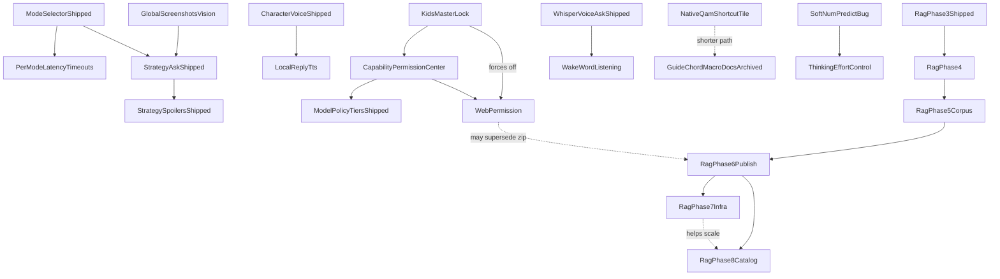

# bonsAI Roadmap

Tracks **bugs and active engineering** ([In Progress](#in-progress)), deferred **QA** ([QA backlog](#qa-backlog)), the **backlog** ([Planned](#planned)), and pointers to shipped work ([Completed](#completed)).

Setup and vision tuning: [troubleshooting.md](troubleshooting.md). QA: [testing.md](testing.md). Release: [development.md](development.md), [CHANGELOG.md](../CHANGELOG.md).

Star ratings use the GTA scale: `★` easiest … `★★★★★` very high complexity; `★★★★★★` extreme scope.

---

## In Progress

Known **defects** only. Deferred QA lives under [QA backlog](#qa-backlog). *QAMP Phase 1 (safe default) is shipped. Phase 2 (experimental profile sync) remains backlog-only.*

### Bugs

- ★ **Strategy spoiler false-positive:** Genre-aware spoiler policy + KB entity match (DRG Survivor boss names); verify **STRAT-SPOIL-DRG-01** on Deck.
- ★ **Question Overlay Alignment Drift:** The 3-line question overlay has minor horizontal spacing mismatch vs native `TextField` internals.
- ★★★ **Fullscreen picker D-pad edge-escape (audit):** Audit **Pull Models**, **Character picker**, **Ollama models hub**, and other `showModal` pickers for below-list / above-list escape (left from row → primary action; right from trailing control → Close).
- ★★ **Main tab answer D-pad scroll choppy / multi-line jumps:** Scrolling the Strategy reply with D-pad Down still advances many lines per press (choppy, hard to read line-by-line). Do not remove scroll-step logic until on-Deck confirmation after multi-day QA. Regression row: **D-PAD-SCROLL-02** in [testing-manual.md](testing-manual.md).
- ★★ **Live-turn transparency UI missing after successful Ask:** Backend `ensure_context_chips_on_snapshot` + slimmer dev chip JSON + frontend `transparencyUiAvailable` gating; verify **CONTEXT-LADDER-01** on Deck.
- ★★ **Strategy live-turn D-pad graph skips branches/feedback:** Geometry scroll gate + yield-to-parent (`return false`) with Focusable branch picker as turn-slot sibling; verify **MICRO-04** on Deck.
- ★★★ **Soft** `num_predict` **+ thinking budget:** `options.num_predict` is a hard Ollama wall (500 Speed/Expert, 900 Strategy) with no overshoot/continue; `"think": False` avoids empty replies when thinking ate the wall (`done_reason=length`, zero content) but leaves quality on the table for thinking models. **Intent:** length preference with small overshoot OK — not a hard cut, not unlimited. **Fix lean:** (1) raise base caps; (2) continuation on `done_reason=length` (small extra budget, capped continues — especially when content empty/short); (3) optional Reply verbosity → answer `num_predict`; (4) **budget thinking separately** (application policy): re-enable thinking with a fixed Deck default effort (`low`/`medium`) plus answer-floor / continue-if-content-starved; log thinking vs content lengths. Ollama has no true dual hard budgets in one completion — levels + continue stand in. **Not in scope:** delete the ceiling entirely; Settings UI for effort (→ **Thinking effort control**); parallel second Ask; spoiler chip work.
- ★★ **Model routing try-order modal focus + chrome:** Text/vision **Set … try order…** fullscreen (`ModelRoutingOrderModal`) — D-pad focus lands on leaf Up/Down buttons and feels broken; layout/chrome does not match other fullscreen pickers (Pull Models / Character picker / Models hub `ConfirmModal` pattern). Screenshot `DeckCapture_20260730_144925`. Discovery locked 2026-07-30. **Defer** — fetch-on-open + save already shipped; polish later.
- ★★ **KB compat retrieval phrase gate:** Troubleshooting KB (compat hybrid / **Keyword + meaning**) only runs when `question_matches_troubleshooting_log_context` matches a **hardcoded phrase list** in `ollama_prompts.py` (preset-style strings like `proton issue`, `why is my game crashing`). Natural-language asks (e.g. `deck sleep resume proton black screen`) skip the KB entirely — no chip, no hybrid, no **Source: shared troubleshooting tips**. **Intent:** when **Use local knowledge base** is on, attempt compat tip retrieval for general troubleshooting-shaped Asks without growing a brittle regex/preset farm in bonsAI. **Fix lean:** broaden gate (e.g. KB-on + not strategy-with-game → compat shortlist; or lightweight intent/heuristic separate from carousel presets); keep Strategy path AppID-gated. Regression: **KB-SMOKE-07/08** queries in [testing-manual.md](testing-manual.md) must pass without adding new hardcoded strings per smoke case. **Phase 4 discovery (2026-07-30):** lean gate fix (**B1**) ships with Phase 4 when implemented — not a separate forever-defer.
- ★★★ **LB/RB tab switch flicker when scrolled:** Switching tabs with shoulder buttons while focus is deep in a scrolled panel (not on tab icons) flashes/jitters. Investigate carousel + remount/scroll/focus survival (partial anti-flicker CSS already on `TabContentsScroll`). Discovery locked 2026-07-29.

---

## QA backlog

Maintainer on-Deck / qualitative work — **not** active feature engineering. Detail and checklists: [testing.md](testing.md), [testing-manual.md](testing-manual.md).

- ★★ **Device QA — Tier 0–1:** Execute Tier 0 smokes (SMOKE-A, C, F) then Tier 1 (SMOKE-B, E, H); update coverage with Pass / Partial / Fail + build id. Tier 2+ before release.
- ★ **VAC / `bonsai:vac-check` (Phase 1) — on-device QA:** Implementation complete; finish **VAC-02…06** after Tier 0 **SMOKE-F** passes.
- ★★★ **QAMP verification checklist:** Per-game profile on/off, QAM Performance reopen, Steam restart/reboot, GPU-clock recommendation paths. See [testing-manual.md](testing-manual.md) § QAMP.
- ★★ **Prompt testing pass:** Broader systematic validation beyond the shipped prompt-testing MVP matrices.

---

## Planned

Stars are **effort/risk** within bands. Grouped by **horizon**; **within each horizon sorted ascending by star rating**.

- **Near-term:** Incremental product work, bounded research spikes.
- **Medium-term:** Larger features inside the plugin + user-hosted stack.
- **Long-term:** ★★★★★★ scope and/or ★★★★★ work gated on upstream APIs or broad surface area.

**GitHub tracking:** Each **Planned** item rated **★★★★★** or **★★★★★★** includes a placeholder link to **[bonsAI Issues](https://github.com/cantcurecancer/bonsAI/issues)** (replace with a specific issue URL when created).

**Planned titles:** Short **noun-first** label (about 3–6 words); secondary context in parentheses. Detail under **Goal** / **Primary work**.

### Near-term

Within this section: ascending stars (★ → ★★★★).

- ★ **Proton journal / intent packs later review** (keep / quiet / Developer — discovery leftover 2026-07-30)
  - **Goal:** Decide whether dormant Proton experiment journal RPCs/store and quiet intent-pack search aliases should be deleted, left quiet, or revived under Developer.
  - **Not in scope:** rewriting unified search ranking; re-shipping journal inject without a redesign.
- ★★ **Preset chip expansion** (streaming / LAN / Steam Input — incremental)
  - **Baseline shipped:** `PRESET_PROMPTS` in [`src/data/presets.ts`](../src/data/presets.ts).
  - **Goal:** Add or refresh preset strings as related features land — content tuning only.
  - **Not in scope:** treating each string batch as a versioned feature ship. AppID/session RAG chips → shipped (**Session RAG preset chips**).
- ★★ **Spoiler confidence chip** (transparency estimate — decisions locked 2026-07-29)
  - **Goal:** Concise Show details context-chip estimate of topic spoiler likelihood on **all Ask modes** — chip label `Spoiler risk: med` (bands `low` / `med` / `high`; keep ≤ ~18 chars).
  - **Status:** Decisions locked; ready to implement (standalone). Distinct from hybrid retrieval.
  - **Discovery locked (2026-07-29):** bands only; score from genre + intent + KB `section_type` + entity match + optional model tag `<bonsai-spoiler-risk>` (~60% when parsed); always show under Show details; v1 transparency-only (no fencing change); heuristic ASAP while streaming; no parallel rater Ask.
  - **Related:** **User-adjustable spoiler fencing**; **Unfenced spoiler feedback**.
  - **Not in scope (v1):** Calibrated ML probability; percent chip copy; parallel rater Ask; changing fencing from this chip.
- ★★ **Unfenced spoiler feedback** (thumbs-down category)
  - **Goal:** After thumbs-down, refinement chip for **unfenced spoilers** (and optional over-fenced sibling). Improves future Asks — does not fix the current turn.
  - **Depends on:** reply micro-actions; **Spoiler confidence chip** signals useful later.
- ★★ **User-adjustable spoiler fencing** (hide by risk band)
  - **Goal:** Settings control for when to apply tap-to-reveal / fence masking from estimated risk — e.g. hide when risk ≥ **high** / **med** / **low**, or **never hide**.
  - **Depends on:** **Spoiler confidence chip**; shipped `strategy_spoiler_masking_enabled`.
- ★★ **Thinking effort control** (Settings Off / Low / Medium / High)
  - **Goal:** User-adjustable Ollama thinking effort mapped to `think: false | "low" | "medium" | "high"` (global v1).
  - **Depends on:** **Soft** `num_predict` **+ thinking budget** (Bugs).
  - **Not in scope:** shipping Settings before the soft-budget bug fix.
- ★★★ **Dynamic keep-alive / smart unload** (research spike — discovery locked 2026-07-29)
  - **Goal:** Research-only: hold models loaded vs unload when a game takes focus, safely on Deck APU shared memory? Spike decides go/no-go. No ship commitment until spike writes outcome.
  - **Not in scope:** promising true per-game VRAM detection; production unload before spike doc.
- ★★★ **Per-mode latency timeouts** (warn vs hard limit profiles)
  - **Goal:** Separate warning and timeout values per selected mode.
  - **Depends on:** Mode selector (shipped).
- ★★★ **Custom model in Pull Models picker** (custom pull + Ask pin + New badges)
  - **Goal:** Pull any valid Ollama-library tag not in curated catalog; **Use for Ask** pin; **New** badge (released within 30 days). Custom pull is backup to living overlay; background catalog refresh when stale.
  - **Primary work:** Phase 1 Pull UI + Ask pin + routing prepend + New badge; Phase 2 hooks to future text model chains.
  - **Depends on:** shipped Pull Models picker + living overlay merge.
  - **Not in scope:** LAN/remote `ollama pull` (→ **LAN custom model pull**); Modelfile UI; full chain editor in v1.
- ★★★ **Search density UX** (match emphasis + tighter rows)
  - **Goal:** Tighter, more scannable results: spacing, wider lines, incremental filtering, highlighted match tokens.
- ★★★ **KB visual maps** (strategy maps — light prelim)
  - **Goal:** Optional visual strategy maps in KB-grounded replies — light prelim discovery only until closer to implementation.
  - **Depends on:** mature strategy corpus + Phase 3/4 retrieval quality.
  - **Note:** Separate roadmap row — not folded into RAG Phase 4–8.
- ★★★★ **Llama.cpp provider spike** (Deck perf / replacement eval)
  - **Goal:** Research-only: can Deck-local llama.cpp beat Deck-local Ollama enough to justify a possible long-term replacement? **No code** in this spike. Supersedes the 2026-05-20 go/no-go in [llama-cpp-provider.md](archive/spikes/llama-cpp-provider.md).
  - **Discovery locked (2026-07-17):** Baseline Deck-local Ollama **gemma4 E2B**; go bar must win **both** game FPS hitch **and** peak GPU memory; load = DRG Survivor. Write [llama-cpp-provider-eval.md](archive/spikes/llama-cpp-provider-eval.md).
  - **Not in scope:** Production provider UI/code; LAN/remote llama.cpp; cloud APIs.
- ★★★★ **SteamOS Share path** (capture → attach)
  - **Goal:** Faster path from SteamOS **Share** / capture flows into screenshot attach where APIs allow.
  - **Not in scope:** kernel framebuffer hacks as default.
- ★★★★ **SteamOS spin hint card** (immutable spins)
  - **Goal:** Detection + deep link to troubleshooting for immutable spins.
  - **Not in scope:** auto-fix firewall rules.
- ★★★★ **RAG Deck query — extended retrieval (Phase 4)**
  - **Goal:** Richer retrieval and content shapes after Phase 3 — session chip **visibility**, structured enemy/item sample cards + light reply bullets, T1 per-game AppID compat tips, lean compat phrase-gate fix.
  - **Status:** Discovery locked 2026-07-30; **docs only** — not implementing yet. Full lock: [knowledge-base.md](knowledge-base.md) § Phase 4.
  - **Discovery locked (2026-07-30):** All three tracks in one ship when implemented. Track 1 = visibility first (**V1+V3+V4**): guarantee ≥1 RAG chip when candidates exist (prefer game RAG → **Tip** badge; compat fallback); reseed so remix actually runs; **Tip** badge on **game** RAG chips only. Track 2 = **C3** corpus + reply shape, **R1** light bullets, **S1** sample on DRG Survivor + OoT/SoH, **F2** fields, both enemies+items, unfenced when user named the entity. Track 3 = **P1** prefer per-game tips then shared; **T1** ~3–5 tips × sample titles; same hybrid; **B1** lean phrase-gate fix; **N1** no game → shared only; **U1** no new Settings.
  - **Depends on:** Phase 3 (shipped 2026-07-29).
  - **Not in scope (Phase 4):** Chip **vector ranking** (→ Phase 5); broad per-game tips beyond T1 (→ Phase 5); structured cards beyond DRG+OoT sample (→ Phase 5); custom UI enemy/item cards / **KB visual maps**; public HF publish (→ Phase 6); sqlite-vss / auto-pull nomic (→ Phase 7).
- ★★★★ **RAG retrieval quality remediation** (hybrid fix + eval honesty — discovery locked 2026-08-02)
  - **Goal:** Fix shipped hybrid defects (nomic prefixes, RRF instead of cosine-only rerank, relevance floor, query/transparency bugs) and re-validate with a deepened seed + honest eval (tune/holdout; no self-referential card→query pairs).
  - **Status:** Decisions locked; **docs only** until PR1. Active plan: [rag-retrieval-quality-remediation-implementation-plan.md](rag-retrieval-quality-remediation-implementation-plan.md). Analysis (archived): [rag-retrieval-quality-remediation-plan.md](rag-retrieval-quality-remediation-plan.md).
  - **Ship shape:** **PR1** = Stages 1–5 infra (provisional loose floor); **PR2** = Stage 6 corpus/eval/kill-switch; maintainer sign-off on cards + eval before bake-off; holdout is the ship gate.
  - **Open:** Compat phrase gate product fix deferred (roadmap Bugs row); eval must report gate-reachable vs overall compat scores.
  - **Not in scope:** sqlite-vss/ANN; auto-pull nomic; public HF; Phase 5 chip ranking / wiki ingest; trust-tier-in-RRF.
- ★★★★ **RAG Deck query — corpus expansion (Phase 5)**
  - **Goal:** Finish Phase 3 **11-title** corpus maturity after Phase 4 sample paths — profiled tips/structured cards + heavier wiki ingest; then session chip **vector ranking** (baked cold-open / live after Ask).
  - **Status:** Discovery locked 2026-07-30; **partially rescoped 2026-08-02** — **strategy seed deepening (~8–12 sections/game) ships in RAG retrieval quality remediation PR2** for eval honesty; Phase 5 keeps the rest. Full lock: [knowledge-base.md](knowledge-base.md) § Phase 5.
  - **Discovery locked (2026-07-30):** Content → ranking. Depth-first on all 11 (no net-new titles); profiled minimum bar (~3–5 tips + strategy sections; enemy/item handful where genre fits); heavier wiki ingest with complete attribution as added; shared tip sheet stays ~as-is; no size budget; Dev-tab install only. Chip ranking hybrid with precomputed cold path; keep ~30% + Phase 4 ≥1 guarantee; no new Settings. Spoiler high-flag metadata only (no runtime). Non-Steam/alias must retrieve (SoE). Speed/Expert light KB only. Exit = content bar + KB-EVAL + smoke on DRG, OoT/SoH, Cyberpunk, RDR2, SoE.
  - **Strict gate amended (2026-08-02):** Seed deepening for remediation eval may proceed **without** waiting for Phase 4 implement + smoke. Remaining Phase 5 work still depends on Phase 4 sample paths where noted.
  - **Depends on:** Phase 4 implementation + on-Deck QA of sample paths (except remediation seed depth — see above).
  - **Not in scope:** Public HF/GitHub publish (→ Phase 6); sqlite-vss/ANN; auto-pull `nomic` (→ Phase 7); catalog-scale titles (→ Phase 8); custom UI cards / **KB visual maps**; new Settings; net-new titles; material shared-tip growth; runtime spoiler behavior from corpus flags; RRF FTS+vector (→ remediation, then Phase 7 for trust/ANN extensions).
- ★★★★ **RAG Deck query — public publish (Phase 6)**
  - **Goal:** First public versioned corpus + manifest (HF primary, GitHub Releases mirror) after Phase 5 maturity + legal scrub — closes **KB-DOWNLOAD** Partial.
  - **Status:** Light discovery locked 2026-07-30; **docs only** — fuller Phase 6 discovery later. Lock: [knowledge-base.md](knowledge-base.md) § Phase 6.
  - **Discovery locked (light, 2026-07-30):** Publish **Phase 5’s matured 11** + shared tips only (not catalog). Full ATTRIBUTIONS / no placeholder licenses on first public tag; NOTICE that sources can err → fix forward. Point-release updates. Manifest **forward-hooks** for future packs/deltas (unused at v1 OK). sqlite-vss/ANN + nomic + Phase 7 optional paths → **Phase 7**; catalog scale → **Phase 8**.
  - **Depends on:** Phase 5 corpus expansion + extended on-Deck KB testing; legal scrub of published zip.
  - **Not in scope:** sqlite-vss/ANN; auto-pull `nomic`; demote/vision→KB (→ Phase 7); core RRF FTS+vector (→ remediation); Steam ~1000 / Deck ~100 / emu catalog (→ Phase 8). Pack/delta **wire format** is Phase 7+ (hooks only in Phase 6).
- ★★★★ **RAG Deck query — retrieval infra (Phase 7)**
  - **Goal:** Optional **sqlite-vss / ANN**; optional **auto-pull `nomic`** (consent); plus optional paths — **RRF extensions** (trust/demote lists; ANN as another RRF list), **vision→entity→retrieve**, retrieval **thumbs + local demote**, **delta/packs**, **named thinking hit**; plus **intent retrieval** (keyword-heavy blend + meaning when FTS weak; gated translate for non-English).
  - **Status:** Tight discovery locked 2026-07-30; **intent / cross-lingual locks extended 2026-07-31**; **RRF FTS+vector pulled forward 2026-08-02** into [RAG retrieval quality remediation](rag-retrieval-quality-remediation-implementation-plan.md). **Docs only** for remaining tracks — fuller discovery later. One umbrella; tracks not gated on each other; UX may ship earlier when deps exist. May spike in parallel with Phase 6; **must not block** first public publish. Full lock: [knowledge-base.md](knowledge-base.md) § Phase 7.
  - **Discovery locked (tight, 2026-07-30):** Silent RRF (FTS+vector+trust; +demote when ready) — **FTS+vector ships in remediation**; trust/demote/ANN extensions remain here. ANN↔RRF deferred (hypothesize ANN as another RRF list); vision same-Ask piggyback (no extra extract call; lean Strategy+screenshot+KB, gate deferred); thumbs `wrong_tip`/`outdated`/`wrong_edition`; demote = JSONL + index, soft then hard, needs `section_id`s; Phase 6 manifest forward-hooks; core + optional packs; delta = goal only; name thinking hits (fence on reply); screenshot+KB preset deferred; first-run wow out.
  - **Discovery locked (intent, 2026-07-31):** From bake-off [kb-embed-bakeoff-2026-07-31.md](archive/research/kb-embed-bakeoff-2026-07-31.md) — keep **`nomic-embed-text`**. Ranking = **C** (strong FTS → keyword-heavy blend; empty/weak FTS → meaning/ANN fallback into RRF). Cross-lingual v1 = **gated translate → English → search** (chat/routing model, not nomic; rare second call; prefer one reply Ask). Fuzzy Deck-term glossary = nice-to-have. **Avoid:** dual vector tables in one zip; mixing a second embed against nomic-baked vectors; routine translate. Multilingual embed only later via **second corpus** or **on-device re-embed** (explicit follow track). **Note (2026-08-02):** bake-off “keyword beat hybrid” conclusion is **under remediation** — do not treat as settled architecture truth until the superseding report lands.
  - **Depends on:** Phase 6 publish path healthy (or spike-only until then). Demote needs KB slice `section_id`s; some UX can precede ANN. Remediation PR1/PR2 preferred before relying on RRF in production.
  - **Not in scope:** Replacing Phase 6 publish; catalog authoring (→ Phase 8); cite-to-source tap; faithfulness chip; abstain; KB browser; cross-encoder; cloud demote sync; first-run wow; multilingual default embed; dual nomic+multilingual vectors in one download.

### Medium-term

Within this section: ascending stars (★★★★ → ★★★★★★).

- ★★★★ **LAN custom model pull** (remote host — decision review)
  - **Goal:** When Ask uses a **LAN Ollama host**, let users add/pull models not in the bonsAI catalog — **blocked until mechanism is chosen** (R1 instructions-only / R2 Deck pull while LAN Ask / R3 remote execution / R4 pin-only).
  - **Depends on:** **Custom model in Pull Models picker** (Deck-local v1).
  - **Not in scope:** shipping without explicit mechanism sign-off.
- ★★★★ **Steam Input layout parse** (VDF → AI context)
  - **Goal:** Parse controller VDF configs and feed actionable control context to AI.
  - **Not in scope:** editing/writing controller configs.
- ★★★★ **Web permission** (Ask live search + online deps — discovery in progress)
  - **Goal:** Opt-in capability so Ask can fetch live answers about current games/patches/news (web search spine). Offline Ask + local KB remain usable when permission is off or network is down. HF AppID card streaming and Ollama catalog freshness are dependents / related follow-ons, not the primary job.
  - **Status:** Discovery in progress (2026-07-30); **docs only** — not implementing yet. Resume discovery or say “ready to plan” to lock a full plan into this bullet.
  - **Discovery locked (2026-07-30):**
    - Spine = **web search for Ask**; HF stream + Ollama catalog updates are dependents/follow-ons (**bundle model C**).
    - Primary user job = live patches/news/current-game answers (not smaller KB first).
    - Offline contract = always usable when Web off or network down; only live/extra bits skipped.
    - Wanted product pieces: **citations in Show details**, **domain allowlist**, **freshness chip**, **HF card stream by AppID**.
    - Auto-search when question looks “current” (**consent A**).
    - Kids Master Lock → Web **forced off** (cannot enable).
    - Enabling Web → **ConfirmModal** explaining in simple terms that Ask text (and maybe game AppID/title) may leave the Deck to a search provider.
    - Search implementation tech = undecided; choose for Deck latency + privacy at implement time.
    - Domain allowlist starter set OK for now (Steam news/changelog, ProtonDB, relevant wikis; HF host for cards).
    - HF stream intended to **replace the big zip download over time**.
    - Ollama “constantly updates models it can pull” = **related follow-on Planned item**, not in this bullet’s ship scope.
  - **Useful ideas deferred / not locked:** per-Ask opt-in, cache+TTL, bandwidth caps, Steam context in query, KB vs web conflict policy (see open decisions).
  - **Depends on:** Capability Permission Center; Kids Master Lock; existing Show details / Source patterns; Strategy spoiler fencing (interaction TBD).
  - **Related (separate):** Ollama Pull Models living catalog refresh / Update AI & models (already partly shipped) — do not merge into this item; track as follow-on if needed. RAG Phases 4–8 (zip/corpus) may need reconcile when HF stream replaces zip.
  - **Not in scope (this item):** shipping search/HF stream code yet; merging catalog refresh into v1; requiring agentic multi-hop search.
  - **Open decision points** (hold for implement / next discovery — do not block this stub):
    1. **“Current” heuristic triggers** — Which intents auto-search? (patch/changelog, news/release, live MP/outage, prices/sales, SteamOS/Proton version, date words, other)
    2. **False-positive preference** — Extra search OK vs prefer miss vs cancelable “Searching web…” affordance
    3. **Latency budget** — +2–5s / +5–15s / progress UI only
    4. **KB vs web conflict** — Web-by-freshness / KB for strategy·web for patches / always both+Show details / defer
    5. **Citations v1** — title+domain+link vs title+domain only; snippet quote optional?
    6. **Freshness chip placement** — Show details only / bubble chip / both; clock = fetched-at vs page published/updated
    7. **Local-only transparency** — Silence when heuristic skips vs quiet “Local only” under Show details
    8. **Roadmap shape vs HF stream** — Search-first then HF phase of same epic / one Planned with phases / two Planned items
    9. **Reconcile with RAG Phases 4–8** — Evolve Phase 6+ to card API / parallel track superseding zip / note conflict and resolve later
    10. **End-state without zip** — Web ON → on-demand AppID cards; Web OFF → local corpus or model-only — confirm
    11. **Metered / weak Wi‑Fi** — Hard skip / soft toast / nothing in v1
    12. **Spoilers + web** — Fence like KB / exclude from Strategy / allow with citation only
  - **Follow-up discovery prompts** (when resuming):
    - Non-goals: upload of screenshots/logs with web search? telemetry?
    - Provider choice constraints (no API key vs user-supplied vs bonsAI-proxied)?
    - Cache retention of search snippets / HF cards on disk (privacy wipe on Clear all data)?
    - Star weight / hard deps on Phase 4–6 (revisit if scope grows)
    - D-pad: Permissions row + ConfirmModal focus graph; any Main-tab “Searching…” control
    - Testing rows: Web on/off, Kids Lock, offline failover, allowlist miss, Show details cites
- ★★★★★ **Named chat slots** (labeled threads — redesign only)
  - **GitHub (tracking placeholder):** [bonsAI Issues](https://github.com/cantcurecancer/bonsAI/issues) — dedicated issue TBD.
  - **History:** We previously implemented named chat slots. It was **seriously bugged** (persistence/picker/overwrite behavior) and was **removed**. Leftover folders on device are harmless — see [troubleshooting.md](troubleshooting.md) § leftover named-chat folders.
  - **Goal:** Multiple labeled threads beyond single persisted QA — **only if redesigned**; do not re-ship the old mini-list / fullscreen picker approach without a clean redesign.
  - **Depends on:** unified Ask state machine.
  - **Not in scope:** re-implementing the failed design; cross-device merge or server-backed sync.
- ★★★★★ **Deck health snapshot** (full diagnostics + Ollama)
  - **GitHub (tracking placeholder):** [bonsAI Issues](https://github.com/cantcurecancer/bonsAI/issues) — dedicated issue TBD.
  - **Goal:** **Read-only** full diagnostics; save markdown/JSON to Desktop when **Save files to Desktop** is on. **Magic Ask** `bonsai:diagnostics` + natural-language confirm modal. No new capability.
  - **Not in scope:** New permission tier; telemetry upload; privileged repair commands.
- ★★★★★ **Local reply TTS** (Phase 1–2 character voice)
  - **GitHub (tracking placeholder):** [bonsAI Issues](https://github.com/cantcurecancer/bonsAI/issues) — dedicated issue TBD.
  - **Dedup:** distinct from Whisper voice Ask (shipped) and **Wake-word listening**. Phase 1 offline TTS play/stop; Phase 2 character-aligned read-aloud (legal research gate before ship).
  - **Not in scope:** Cloud celebrity voice cloning; wake-word; claiming official voices.
- ★★★★★ **Kids master lock** (Steam parental restricted)
  - **GitHub (tracking placeholder):** [bonsAI Issues](https://github.com/cantcurecancer/bonsAI/issues) — dedicated issue TBD.
  - **Goal:** Disable plugin capabilities when Steam reports a restricted kids account.
  - **Depends on:** Capability Permission Center and a detectable Steam signal.
- ★★★★★ **Steam Controller copilot** (Ibex gen-2)
  - **GitHub (tracking placeholder):** [bonsAI Issues](https://github.com/cantcurecancer/bonsAI/issues) — dedicated issue TBD.
  - **Goal:** AI and in-app copy tuned to gen-2 hardware + Steam Input–aligned suggestions.
  - **Not in scope:** Writing controller configs.
- ★★★★★ **Wake-word listening** (beta; Deck first)
  - **GitHub (tracking placeholder):** [bonsAI Issues](https://github.com/cantcurecancer/bonsAI/issues) — dedicated issue TBD.
  - **Goal:** Opt-in always-on local wake on fixed keyword **bonsAI** → STT → quiet Ask. New capability + mic permission; ConfirmModal on enable.
  - **Depends on:** Shipped Whisper voice Ask; Reply ready toast; Voice STT session daemon.
  - **Not in scope (v1):** Custom wake phrases; always-on full Whisper; cloud STT; auto-open QAM on wake.
- ★★★★★★ **Remote Play diagnostics layer** (streaming host/client)
  - **GitHub (tracking placeholder):** [bonsAI Issues](https://github.com/cantcurecancer/bonsAI/issues) — dedicated issue TBD.
  - **Goal:** When gameplay is streamed, answers weight encode latency and host-vs-client fixes.
  - **Not in scope:** Packet inspection or kernel hacks.
- ★★★★★★ **Steam Frame companion UX** (VR / LAN Deck)
  - **GitHub (tracking placeholder):** [bonsAI Issues](https://github.com/cantcurecancer/bonsAI/issues) — dedicated issue TBD.
  - **Goal:** Research-first companion workflows for Steam Frame; comfort/framerate/wrong-display disclaimers.
  - **Not in scope:** Shipping a full VR overlay inside Frame as v1.

### Long-term

Within this section: ascending stars (★★★★ → ★★★★★★).

- ★★★★ **Session context and user stash** (deck-first context)
  - **Goal:** Unified deck-first context for Ask — live session facts + user-editable stash notes. No embeddings/cloud. Explicit alternative to RAG for deck-only quality.
  - **Not in scope:** embeddings, vector DBs, cloud sync, auto web fetch.
- ★★★★★ **QAMP Phase 2 profiles** (experimental Steam opt-in)
  - **GitHub (tracking placeholder):** [bonsAI Issues](https://github.com/cantcurecancer/bonsAI/issues) — dedicated issue TBD.
  - **Status:** Backlog-only. Phase 1 verification lives in [QA backlog](#qa-backlog) / [testing-manual.md](testing-manual.md).
  - **Goal:** Experimental opt-in tying QAMP reflection UX to Steam per-game performance profiles.
  - **Not in scope:** silent sysfs or profile applies without consent.
- ★★★★★ **VAC Phase 2 opponent IDs** (lobby/session API research)
  - **GitHub (tracking placeholder):** [bonsAI Issues](https://github.com/cantcurecancer/bonsAI/issues) — dedicated issue TBD.
  - **Status:** Phase 1 complete; on-device QA still in [QA backlog](#qa-backlog).
  - **Goal:** When metadata allows, surface live opponent Steam identities for ban checks. Research spike first; if no stable API → enhanced manual flow.
  - **Not in scope:** automated reporting or punitive automation.
- ★★★★★★ **Deep mod AI hints** (install paths + compatdata)
  - **GitHub (tracking placeholder):** [bonsAI Issues](https://github.com/cantcurecancer/bonsAI/issues) — dedicated issue TBD.
  - **Goal:** Detect mod frameworks/files; mod-aware AI guidance.
  - **Not in scope:** downloading/installing mods automatically.
- ★★★★★★ **RAG Deck query — catalog corpus (Phase 8)**
  - **GitHub (tracking placeholder):** [bonsAI Issues](https://github.com/cantcurecancer/bonsAI/issues) — dedicated issue TBD.
  - **Goal:** Large offline catalog after Phase 6’s matured-11 publish — sketch: ~top **1000** Steam titles; ~top **100** Steam Deck (priority slice); ~**50 emulated** per era Genesis→Xbox 360/PS3 (~300–500 emu) with verified alias/Non-Steam matching.
  - **Status:** Intent only 2026-07-30; **fuller discovery later**. Not Phase 6 v1.
  - **Depends on:** Phase 6 public publish + legal lessons; likely Phase 7 infra for scale.
  - **Not in scope:** Shipping catalog as the first public HF corpus; thin stubs that drown hybrid retrieval without a tiering plan.
- ★★★★★★ **Native QAM shortcut tile** (under Decky; upstream research)
  - **GitHub (tracking placeholder):** [bonsAI Issues](https://github.com/cantcurecancer/bonsAI/issues) — dedicated issue TBD.
  - **Goal:** Separate QAM left-rail entry for bonsAI beneath the Decky Loader icon (fewer steps than Decky plugin list). Requires upstream Steam/Decky support — plugins cannot register sibling QAM icons from `plugin.json` alone.
  - **Related:** Guide-chord macro docs remain in [troubleshooting.md](troubleshooting.md) §5 for power users; not a casual-user priority (archived from Planned).
  - **Not in scope:** Shipping a forked Steam client or undocumented UI injection as default.

### Reference — vision model fallback order

When a screenshot is attached, `select_ollama_models(..., requires_vision=True)` tries `qwen2.5vl:3b` **first**, then `qwen3.5:4b`, then legacy `llava:7b`, then Tier 2 `gemma4:e2b-it-qat` / `gemma4:e2b`. **Settings → Model policy → Allow high-VRAM model fallbacks** appends large tags after the essentials chain.

---

## Completed

Shipped features live in the archive for readability.

**Full checklist:** [archive/roadmap-completed.md](archive/roadmap-completed.md).

**Archived from Planned (low casual-user value):**

- ★★★★★ **Global quick-launch macro** — Guide-chord → QAM → Decky → bonsAI documentation and verification checklist shipped in [troubleshooting.md](troubleshooting.md) §5. Cool for power users; **not worth further product effort** for casual users. Refresh only if Steam/Decky QAM layout changes or **Native QAM shortcut tile** lands. Detail also in [archive/roadmap-completed.md](archive/roadmap-completed.md).

Coverage for shipped work: [testing.md](testing.md).

---

## Appendix

### Cross-feature dependency summary

- **Mode selector (shipped)** → **Per-mode latency timeouts**; Strategy Guide path shipped as `strategy` Ask mode.
- **Character voice roleplay (shipped)** → accent intensity, avatars, UI accent theme, Random “?”, running-game suggestions, Pyro easter egg (all shipped); → **Local reply TTS** Phase 2.
- **Whisper voice Ask (shipped)** + mic → **Wake-word listening**.
- **Reply ready toast (shipped)** → required for hands-free wake when QAM closed.
- **Capability Permission Center** → gates filesystem, Steam/Proton log + screenshot reads, mic, Steam Web API; web/Steam jumps always allowed; TDP/GPU suggestions read-only (no apply); → planned **Web permission** (Ask live search; Kids Lock forces off).
- **Llama.cpp provider spike** → research-only; related **Dynamic keep-alive / smart unload**.
- **Preset carousel (shipped)** → incremental **Preset chip expansion**; **Session RAG preset chips (shipped)**.
- **RAG / offline KB** → Phase 2–3 shipped → **retrieval quality remediation** (PR1/PR2, docs locked) → Phase 4–8 Planned (4 extended retrieval, 5 corpus expansion remaining after remediation seed depth, 6 public publish, 7 infra — ANN/nomic/RRF extensions/vision→KB/demote/delta-packs/named hit, 8 catalog corpus); **KB visual maps** separate; **Spoiler confidence chip** → fencing + unfenced feedback (distinct from Phase 7 retrieval thumbs); **Web permission** may eventually replace zip download with HF AppID card stream (open decision vs Phases 4–8).
- **Web permission** → citations / allowlist / freshness chip; HF stream + catalog refresh are dependents/follow-ons (catalog not in this bullet).
- **Soft** `num_predict` **+ thinking budget** (Bugs) → **Thinking effort control**.
- **Native QAM shortcut tile** → shorter path than Guide-chord macro docs (§5).
- **Steam Input jump Phase 1 (shipped)** → **Steam Input layout parse**.
- **Offline intent packs (quiet)** → **Proton journal / intent packs later review**.
- **Deck health snapshot** → `steam_logs_read` + Proton log helpers; Desktop save needs `filesystem_write`.

### Implementation notes

#### Iconography pass — plugin list icon lesson

Decky sizes icons via CSS `font-size`. Font Awesome works because it renders `<svg width="1em">`. An `` with fixed pixels is ignored. Fix: inline SVG into `<svg width="1em" height="1em" fill="currentColor">` (`BonsaiSvgIcon`). Source SVG needs `viewBox` for scaling.
