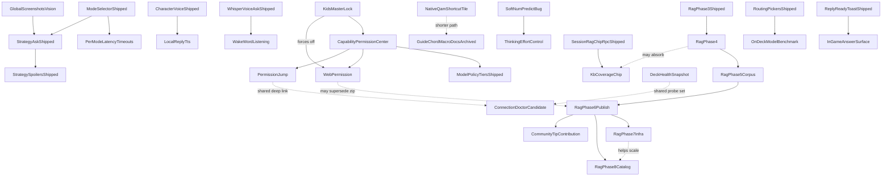

# bonsAI Roadmap

**Next:** [Bugs](#bugs) → [Verify](#verify) → lowest ★ in your lane.

Tracks open defects ([Bugs](#bugs)), on-Deck confirmation ([Verify](#verify)), and the themed backlog ([Backlog](#backlog)). Shipped work: [archive/roadmap-completed.md](archive/roadmap-completed.md) · fixed bugs: [archive/roadmap-bugs-fixed.md](archive/roadmap-bugs-fixed.md). Locked decisions: [audit/maintainer-decisions-locked.md](audit/maintainer-decisions-locked.md) (open **[D18](audit/maintainer-decisions-locked.md#d18--when-loading-settings-fails-four-values-keep-whatever-was-on-screen-bug-or-intent)**).

Setup: [troubleshooting.md](troubleshooting.md). QA: [testing.md](testing.md), [testing-manual.md](testing-manual.md). Release: [development.md](development.md), [CHANGELOG.md](../CHANGELOG.md).

Star ratings use the GTA scale: `★` easiest … `★★★★★` very high complexity; `★★★★★★` extreme scope. Within each list: **ascending stars**; ties alphabetical.

---

## Bugs (v0.5.0 fixes — LB/RB tab switch, thinking blurbs single-writer, streaming reveal tweaks, asked-entity extraction, KB phrase gate / D16, session RAG chip RPC, source attribution on chips, soft num_predict → Verify, …)

Status tags: **OPEN** · **PARTIAL**.

- ★ **Question Overlay Alignment Drift** — **OPEN.** 3-line question overlay has minor horizontal spacing mismatch vs native `TextField` internals.
- ★ **Strategy spoiler false-positive** — **PARTIAL.** Options 1+2+4 landed 2026-08-07; **STRAT-SPOIL-DRG-01** on Deck remains. Detail: [04-strategy-spoiler-false-positive.md](planning/04-strategy-spoiler-false-positive.md), [spoiler-constitution.md](planning/spoiler-constitution.md).
- ★ **Unified input + Ask bar no longer span QAM width** — **OPEN.** Unified-input textarea and Ask bar render narrower than the QAM panel (regression window `40f396f`). **Fix lean:** re-measure host ref / flex row on-Deck; restore `bonsai-full-bleed-row` without breaking avatar caret fix. Files: [MainTabUnifiedAskBar.tsx](../src/components/MainTabUnifiedAskBar.tsx), [section-5.ts](../src/styles/sections/section-5.ts), [useUnifiedInputSurface.ts](../src/features/unified-input/useUnifiedInputSurface.ts).
- ★★ **Focus ring consistency** — **PARTIAL.** `BonsaiModalScope` on portalled modals shipped; blanket `button.gpfocus` rule reverted (native Steam outline preferred). **Fix lean:** modal CSS reach + real `Focusable`s — see [gamepadAndPullModels.ts](../src/styles/sections/gamepadAndPullModels.ts).
- ★★ **Fullscreen pickers return you to the right tab, but not to the right control** — **PARTIAL (1/3 on-Deck).** `modalReturnFocusRegistry` shipped; Models hub → Ollama and desktop-note → Main land on tab strip. **PICKER-FOCUS-01**; next step is instrumentation, not another guess.
- ★★ **Live Ask user bubble shows "…" after reopen** — **OPEN.** User question header empty after QAM close / Steam restart; answer intact. Likely `askThreadDisplayQuestion` lost on session survival. [MainTabChatTranscript.tsx:381](../src/components/MainTabChatTranscript.tsx).
- ★★ **Live-turn transparency UI missing after successful Ask** — **OPEN.** Verify **CONTEXT-LADDER-01** on Deck.
- ★★ **Main tab answer D-pad scroll choppy / multi-line jumps** — **OPEN — re-measure first.** Phase B (2026-08-07) made every answer section a D-pad stop; scroll-step is fallback only. **STREAM-09**, **D-PAD-SCROLL-02** in [testing-manual.md](testing-manual.md).
- ★★ **Model routing try-order modal focus + chrome** — **OPEN (deferred polish).** `ModelRoutingOrderModal` D-pad lands on leaf Up/Down; chrome mismatches other fullscreen pickers. Screenshot `DeckCapture_20260730_144925`.
- ★★ **No destructive-advice guardrail (compatdata / prefix deletes)** — **OPEN.** No production guardrail against reckless compatdata deletes. **Fix lean:** output-side filter on Ask reply path — [12-deep-mod-ai-hints-feasibility.md](planning/12-deep-mod-ai-hints-feasibility.md) § 5.3.
- ★★ **Strategy live-turn D-pad graph skips branches/feedback** — **OPEN.** Verify **MICRO-04** on Deck.
- ★★★ **AppID collision: OoT/SoH seed row uses real Stardew Valley AppID** — **OPEN.** `data/kb/strategy_seed.json` game_id 1 (OoT) carries `app_id: "413150"`, which is Valve's actual Stardew Valley AppID — confirmed as Stardew Valley in [12-deep-mod-ai-hints-feasibility.md:136](planning/12-deep-mod-ai-hints-feasibility.md). A Stardew Valley player matches the OoT row and inherits its cards, genres, and `PROTECT_PROGRESSION_APP_IDS` fencing; OoT/SoH itself never benefits, since SoH is a non-Steam shortcut and already resolves correctly through the `shortcut_name` alias path (`ship of harkinian` → `game_id:1`, independent of `app_id`). **Fix lean:** null `app_id` for game_id 1 (mirror State of Emergency's `app_id: null` + alias pattern), drop `"413150"` from `PROTECT_PROGRESSION_APP_IDS` in both [spoiler_title_profiles.py](../py_modules/backend/services/spoiler_title_profiles.py) and [spoilerTitleProfiles.ts](../src/data/spoilerTitleProfiles.ts), add an OoT/SoH name fallback so protection doesn't regress, and pass `app_name` into `spoiler_risk_service.py`'s currently AppID-only call. 18 files reference the id; `tests/fixtures/kb_eval_v2.json` rows need the same shortcut-keyed conversion already used for SoE — coordinate with maintainer before touching it, since the RAG PR2 bake-off report was measured against current ids.
- ★★★ **Character picker: focus ring invisible, D-pad does not move** — **OPEN (selection fixed).** Modal uses `querySelector` focus helpers — fix CSS reach first, then registered-owner pattern. Blocks AI-character on Deck. [CharacterPickerModal.tsx](../src/components/CharacterPickerModal.tsx).
- ★★★ **Fullscreen picker D-pad edge-escape (audit)** — **OPEN.** Audit Pull Models, Character picker, models hub, other `showModal` pickers for below-list / above-list escape.

---

## Verify (v0.5.0 QA owed — Wave 1 voice/icon/thinking rows, STREAM-09, KB-CANCEL-01, SHELL-PAYLOAD-01, KB-ROUTER-01 / KB-ASKMODE-01, …)

Code-fixed or shipped; on-Deck / qualitative QA still owed. Detail: [testing.md](testing.md), [testing-manual.md](testing-manual.md). Full writeups: [archive/roadmap-bugs-fixed.md](archive/roadmap-bugs-fixed.md).

- ★★★ **Soft** `num_predict` **+ thinking budget** — shipped 2026-08-10; on-Deck **SOFT-PREDICT-01…05** Open. Caps Speed 800 / Deep 1200 / Strategy 1600; soft continue on `done_reason=length` (max 2) with ephemeral **`Continuing…`**; C1 budgets in `ollama_ask_budgets.py` (`think: false` default). Unblocks **Thinking effort control**. Detail: [16-soft-num-predict-thinking-budget.md](planning/16-soft-num-predict-thinking-budget.md).
- ★★★ **Kids master lock** — shipped 2026-08-09; on-Deck **KIDS-LOCK-01**, **KIDS-FOCUS-01**, **KIDS-REGRESS-01** (and **KIDS-LOCK-02** if child account) Open. Live CEF Stage 0 confirmation still owed.
- ★ **Developer toggle for "resume last tab" (D15 B)** — shipped 2026-08-04; **TAB-RESUME-MODE-01**, **TAB-RESUME-FOCUS-01** Open/Partial.
- ★ **Install voice engine button when already ready** — fix landed 2026-08-07 (Wave 1 B); **VOICE-REINSTALL-01**. [wave1.md](wave1.md).
- ★ **Static seed tells you to enable KB when it is already on** — fixed 2026-08-07 (Wave 2 F); **PRESET-KB-SEED-01**.
- ★ **Thinking blurb italicizes emojis** — fix landed 2026-08-07 (Wave 1 A); **THINKING-EMOJI-01**. [wave1.md](wave1.md).
- ★ **Thinking line vanishes mid-Ask (lazy status tag)** — fix landed 2026-08-08; **THINKING-SANITIZE-01**. [06-thinking-blurbs-review.md § 10.1](planning/06-thinking-blurbs-review.md#101-landed-2026-08-08--7-items-13).
- ★ **~22% of Asks show bare emoji for every phase change** — fix landed 2026-08-08; **THINKING-EMOJI-CLUSTER-01**.
- ★ **Bonsai pot ~1px right of canopy (tab + plugin-list icon)** — fix landed 2026-08-07 (Wave 1 D); **BONSAI-ICON-GEOM-01**. [wave1.md](wave1.md).
- ★ **Token streaming stutters once at start** — fix landed 2026-08-07 (Phase A); **STREAM-REVEAL-01**. [05-token-streaming-review.md § 3.1](planning/05-token-streaming-review.md).
- ★ **A finished voice install survives "Clear all plugin data"** — **VOICE-CLEAR-01** Partial (backend verified; UI half open).
- ★ **VAC / `bonsai:vac-check` (Phase 1) — on-device QA** — implementation complete; finish **VAC-02…06** after Tier 0 **SMOKE-F** passes.
- ★★ **Asked-entity extraction (player typing patterns)** — fixed 2026-08-09; **STRAT-ENTITY-01**.
- ★★ **Device QA — Tier 0–1** — execute Tier 0 smokes (SMOKE-A, C, F) then Tier 1 (SMOKE-B, E, H); update coverage with Pass / Partial / Fail + build id.
- ★★ **KB compat retrieval phrase gate** — fixed 2026-08-06 (**D16**); **KB-ROUTER-01**. [audit/rag-pr2-signoff.md](audit/rag-pr2-signoff.md) § 2.
- ★★ **Prompt testing pass** — broader systematic validation beyond shipped prompt-testing MVP matrices.
- ★★ **Session context header is not D-pad focusable** — fixed 2026-08-04; confirm on-Deck.
- ★★ **Thinking blurbs — three writers disagree** — fix landed 2026-08-08; re-verify **THINKING-COPY-01**, **THINKING-SLOW-01**, **THINKING-LIVE-01**, **THINKING-SPOILER-01**. [06-thinking-blurbs-review.md § 10](planning/06-thinking-blurbs-review.md#10-implementation-log).
- ★★ **Your tab is not remembered when you leave and reopen** — **TAB-RESUME-01** Partial (tab + scroll restore; focus-after-reopen separate).
- ★★ **Wave 4 G slider direction handlers** — Deck-check: **ONBUTTONDOWN-AUDIT-01** (distinguish nothing happens vs double-step; cover Ollama keep-alive, Reply verbosity, Connection timeout sliders).
- ★★★ **D11 legacy-loader shim removal** — **D11-SHIM-01** Partial (RPC probe ok; Main-tab Ask UI pass open).
- ★★★ **KB download Cancel** — shipped 2026-08-05; **KB-CANCEL-01** (D-pad reach while downloading).
- ★★★ **QAMP verification checklist** — per-game profile on/off, QAM Performance reopen, Steam restart/reboot, GPU-clock paths. [testing-manual.md](testing-manual.md) § QAMP.
- ★★★ **Source attribution on knowledge chips** — shipped 2026-08-09; **KB-ATTRIB-01**. Distribution still → Phase 6 / [15-corpus-licensing-attribution-plan.md](planning/15-corpus-licensing-attribution-plan.md).
- ★★★★★ **Global quick-launch macro** — Guide-chord docs in [troubleshooting.md](troubleshooting.md) §5; verification checklist not run on hardware.
- **D-pad reachability sweep blind spot (2026-08-04)** — cross-file nested `Focusable` (spoiler fence) not visible to per-file static analysis; answer on-device per [testing-manual.md](testing-manual.md) focus rows.
- **Reply-language snapshot RPC (2026-08-03 fix)** — verified via `probe_deck_rpc_surface.py`; UI translation spot-check optional.
- **Session RAG / routing merge RPCs (2026-08-02)** — **SESSION-RAG-CHIPS-01** Verified; **ROUTING-MERGE-01** Open.
- **Shell state + tab payload extractions (step 8)** — **SHELL-PAYLOAD-01** Open. Smoke: six tabs, one Ask, Ollama tab after Clear all plugin data.
- **Token streaming Phase B — multi-stop navigation + scroll follow (2026-08-07)** — **STREAM-09**, **STREAM-FOLLOW-01** Open. [05-token-streaming-review.md § 3.2](planning/05-token-streaming-review.md).
- **Voice input `status()` missing (2026-08-03 fix)** — on-Deck retry of live recording still needed. [archive/roadmap-bugs-fixed.md](archive/roadmap-bugs-fixed.md).

---

## Backlog

Stars are **effort/risk**. Grouped by **theme**; within each lane sorted ascending by ★.

**GitHub tracking:** Items rated **★★★★★** or **★★★★★★** include a placeholder link to **[bonsAI Issues](https://github.com/cantcurecancer/bonsAI/issues)** (replace with a specific issue URL when created).

### Ask / reply (v0.5.0 — token streaming live markdown, spoiler confidence chip, spoiler constitution runtime, thinking blurbs, reply-language / routing merge RPCs, Caveman reply style, …)

- ★ **Intent packs later review** (keep / quiet / Developer)
  - **Goal:** Decide whether quiet intent-pack search aliases should be deleted, left quiet, or revived under Developer.
  - **Not in scope:** re-shipping Proton journal inject without redesign.
- ★★ **Copy reply to clipboard** (reply micro-action)
  - **Goal:** One reply action copies visible answer text to host clipboard.
  - **Depends on:** shipped reply micro-actions + read clipboard pattern. Spike Wayland selection ownership first.
  - **Source:** [13-roadmap-feature-ideas.md](planning/13-roadmap-feature-ideas.md) A2.
- ★★ **Preset chip expansion** (incremental content)
  - **Goal:** Add or refresh preset strings as related features land. Wave 1 shipped four prompts; **PRESET-EXPAND-W1-01** open. [wave1.md](wave1.md).
  - **Not in scope:** replacing `fade` default animation; session RAG chips (shipped).
- ★★ **Thinking effort control** (Settings Off / Low / Medium / High)
  - **Depends on:** **Soft** `num_predict` **+ thinking budget** (shipped — C1 in Verify).
  - **Phase 1:** Settings Off / Low / Medium / High → `think: false | "low" | "medium" | "high"` using C1 budgets (`resolve_ask_token_budgets`).
  - **Phase 2:** Short thinking one-liners via existing blurbs (not raw model `thinking` by default).
  - **Not in scope:** Reply verbosity → token budgets; caveman / lowering `num_predict`.
- ★★ **Unfenced spoiler feedback** (thumbs-down category)
  - **Goal:** Thumbs-down refinement chip for unfenced spoilers (and optional over-fenced sibling).
  - **Depends on:** reply micro-actions; spoiler confidence chip (shipped).
  - **Related:** [spoiler-constitution.md](planning/spoiler-constitution.md).
- ★★ **User-adjustable spoiler fencing** (hide by risk band)
  - **Goal:** Settings control for tap-to-reveal / fence masking by estimated risk band.
  - **Depends on:** spoiler confidence chip; shipped `strategy_spoiler_masking_enabled`.
  - **Related:** [spoiler-constitution.md](planning/spoiler-constitution.md).
- ★★★ **Custom model in Pull Models picker** (custom pull + Ask pin + New badges)
  - **Goal:** Pull any valid Ollama-library tag; **Use for Ask** pin; **New** badge (≤30 days).
  - **Depends on:** shipped Pull Models picker + living overlay merge.
  - **Not in scope:** LAN/remote `ollama pull` (→ **LAN custom model pull**).
- ★★★ **Dynamic keep-alive / smart unload** (research spike)
  - **Goal:** Research-only: hold models loaded vs unload when a game takes focus on Deck APU? Spike decides go/no-go.
  - **Not in scope:** production unload before spike doc.
- ★★★ **Per-mode latency timeouts** (warn vs hard limit profiles)
  - **Goal:** Separate warning and timeout values per selected mode.
  - **Depends on:** Mode selector (shipped).
- ★★★★ **Connection doctor** (guided first-Ask repair — candidate)
  - **Status:** Candidate, not accepted — decide vs **Deck health snapshot** (shared probe set).
  - **Goal:** **Fix this** on Ask failure walks probes → one next action with Ollama-tab deep link.
  - **Source:** [13-roadmap-feature-ideas.md](planning/13-roadmap-feature-ideas.md) § B3.
- ★★★★ **LAN custom model pull** (remote host — decision review)
  - **Goal:** LAN Ask host: add/pull models not in catalog — blocked until mechanism chosen (R1–R4).
  - **Depends on:** **Custom model in Pull Models picker**.
- ★★★★ **Session context and user stash** (deck-first context)
  - **Goal:** Live session facts + user-editable stash notes for Ask; no embeddings/cloud.
  - **Not in scope:** vector DBs; cloud sync.
- ★★★★★ **Deck health snapshot** (full diagnostics + Ollama)
  - **GitHub:** [bonsAI Issues](https://github.com/cantcurecancer/bonsAI/issues) — issue TBD.
  - **Goal:** Read-only diagnostics dump to Desktop; Magic Ask `bonsai:diagnostics`.
- ★★★★★ **Local reply TTS** (Phase 1–2 character voice)
  - **GitHub:** [bonsAI Issues](https://github.com/cantcurecancer/bonsAI/issues) — issue TBD.
  - **Goal:** Phase 1 offline TTS play/stop; Phase 2 character-aligned read-aloud (legal gate).
- ★★★★★ **Named chat slots** (labeled threads — redesign only)
  - **GitHub:** [bonsAI Issues](https://github.com/cantcurecancer/bonsAI/issues) — issue TBD.
  - **Goal:** Up to 5 named, persistent chats with Main-tab LB/RB carousel (option C). Do not re-ship old mini-list picker.
  - **Status:** Code landed 2026-08-09 (storage, RPC, row UI). **On-Deck QA open** — all **CHAT-SLOTS-V2-01…06** must pass before Completed. **P-0 bumper spike** result still pending on device ([major-redesign.md](major-redesign.md) § 7 R1).
  - **Design:** [major-redesign.md](major-redesign.md), [07-named-chat-slots-postmortem.md](planning/07-named-chat-slots-postmortem.md).
- ★★★★★ **On-Deck model benchmark** (measured routing order)
  - **GitHub:** [bonsAI Issues](https://github.com/cantcurecancer/bonsAI/issues) — issue TBD.
  - **Goal:** Rank installed models by measured speed/completion; offer as try order (with confirmation).
  - **Depends on:** shipped routing pickers; overlaps **Dynamic keep-alive** measurements.
  - **Source:** [13-roadmap-feature-ideas.md](planning/13-roadmap-feature-ideas.md) § C1.

### Focus / Deck UI (v0.5.0 — LB/RB overflow clip, QAM ResizeObserver rebind, global document sweep, onButtonDown audit, ask-bar caret + avatar, permission jump, modal return-focus registry, …)

- ★★★ **Search density UX** (match emphasis + tighter rows)
  - **Goal:** Tighter, more scannable search results with highlighted match tokens.
- ★★★★ **SteamOS Share path** (capture → attach)
  - **Goal:** Faster path from SteamOS Share / capture flows into screenshot attach where APIs allow.
- ★★★★ **SteamOS spin hint card** (immutable spins)
  - **Goal:** Detection + deep link to troubleshooting for immutable spins.

### Knowledge base (v0.5.0 — hybrid RRF + schema v3, D16 topic router, D17 mode-independent game tips, 13-title / 119-card seed, wiki attribution, KB download Cancel, session RAG chips, hybrid kill-switch, …)

- ★★★ **KB visual maps** (strategy maps — later wave)
  - **Goal:** Optional visual strategy maps in KB-grounded replies after brief callout cards exist.
  - **Plan / depends on:** [17-kb-online-versus-strategy-content.md](planning/17-kb-online-versus-strategy-content.md) Stage 5; callout cards (OV-3.1). Phase 4 chip work remains orthogonal.
- ★★★★ **KB online / versus strategy content**
  - **Goal:** Online multiplayer strategy — versus, co-op, map callouts — new `section_type` values + spoiler table updates. Tier lists parked. Visual maps later wave in same plan.
  - **Plan:** [17-kb-online-versus-strategy-content.md](planning/17-kb-online-versus-strategy-content.md) (discovery locked 2026-08-09).
  - **Source policy:** WikiTeam / archive.org dumps only; hybrid attribution (short chip + snapshot in `ATTRIBUTIONS.md`).
- ★★★★ **RAG Deck query — corpus expansion (Phase 5)**
  - **Goal:** Corpus maturity after Phase 4 sample paths; session chip vector ranking.
  - **Status:** Seed deepening largely in remediation PR2; remainder depends Phase 4. [knowledge-base.md](knowledge-base.md) § Phase 5.
- ★★★★ **RAG Deck query — extended retrieval (Phase 4)**
  - **Goal:** Richer retrieval shapes — chip visibility, structured cards, per-game compat tips.
  - **Status:** Discovery locked 2026-07-30; docs only. [knowledge-base.md](knowledge-base.md) § Phase 4.
- ★★★★ **RAG Deck query — public publish (Phase 6)**
  - **Goal:** First public versioned corpus + manifest after Phase 5 + legal scrub.
  - **Status:** Legal scrub plan [15-corpus-licensing-attribution-plan.md](planning/15-corpus-licensing-attribution-plan.md) **DONE** 2026-08-09 (Stages 1–5). Remaining Phase 6 work is packaging/HF publish + on-Deck **KB-ATTRIB-02**. [knowledge-base.md](knowledge-base.md) § Phase 6 / Source attribution.
- ★★★★ **RAG Deck query — retrieval infra (Phase 7)**
  - **Goal:** Optional sqlite-vss/ANN, auto-pull nomic, RRF extensions, vision→KB, demote, packs, intent retrieval.
  - **Status:** FTS+vector shipped in remediation; remainder docs only. [knowledge-base.md](knowledge-base.md) § Phase 7.
- ★★★★★ **Community tip contribution** (corpus inbound path)
  - **GitHub:** [bonsAI Issues](https://github.com/cantcurecancer/bonsAI/issues) — issue TBD.
  - **Goal:** Reply → **Suggest as a tip** writes schema-valid card to Desktop + GitHub attach URL.
  - **Depends on:** **RAG Phase 6** public publish.
  - **Source:** [13-roadmap-feature-ideas.md](planning/13-roadmap-feature-ideas.md) § C2.
- ★★★★★★ **RAG Deck query — catalog corpus (Phase 8)**
  - **GitHub:** [bonsAI Issues](https://github.com/cantcurecancer/bonsAI/issues) — issue TBD.
  - **Goal:** Large offline catalog after Phase 6 publish (~top 1000 Steam, ~100 Deck, emulated slice).
  - **Status:** Locked intent only. [knowledge-base.md](knowledge-base.md) § Phase 8.
  - **Depends on:** Phase 6 + likely Phase 7 infra.

### Permissions / safety (v0.5.0 — permission jump, spoiler constitution / named-entity consent, …)

- ★★★★ **Web permission** (Ask live search + online deps)
  - **Goal:** Opt-in capability for live web answers; offline Ask + local KB when off.
  - **Status:** Discovery locked; docs only. [web-permission-discovery.md](planning/web-permission-discovery.md).
  - **Depends on:** Capability Permission Center; Kids master lock (shipped — forces Web off when that key lands).
- ★★★★★ **QAMP Phase 2 profiles** (experimental Steam opt-in)
  - **GitHub:** [bonsAI Issues](https://github.com/cantcurecancer/bonsAI/issues) — issue TBD.
  - **Status:** Backlog-only. Phase 1 verification in [Verify](#verify).
- ★★★★★ **VAC Phase 2 opponent IDs** (lobby/session API research)
  - **GitHub:** [bonsAI Issues](https://github.com/cantcurecancer/bonsAI/issues) — issue TBD.
  - **Status:** Phase 1 complete; on-device QA in [Verify](#verify).
  - **Goal:** Surface live opponent Steam identities for ban checks when metadata allows.

### Platform / upstream (v0.5.0 — voice STT session daemon, …)

- ★★★★ **Llama.cpp provider spike** (Deck perf / replacement eval)
  - **Goal:** Research-only go/no-go vs Deck-local Ollama. Deliverable: `docs/archive/spikes/llama-cpp-provider-eval.md`. Prior: [llama-cpp-provider.md](archive/spikes/llama-cpp-provider.md).
- ★★★★ **Steam Input layout parse** (VDF → AI context)
  - **Goal:** Parse controller VDF configs for actionable control context.
  - **Not in scope:** editing/writing controller configs.
- ★★★★★ **Steam Controller copilot** (Ibex gen-2)
  - **GitHub:** [bonsAI Issues](https://github.com/cantcurecancer/bonsAI/issues) — issue TBD.
  - **Goal:** AI copy tuned to gen-2 hardware + Steam Input–aligned suggestions.
- ★★★★★ **Wake-word listening** (beta; Deck first)
  - **GitHub:** [bonsAI Issues](https://github.com/cantcurecancer/bonsAI/issues) — issue TBD.
  - **Goal:** Opt-in always-on local wake **bonsAI** → STT → quiet Ask.
  - **Depends on:** Whisper voice Ask; Reply ready toast; Voice STT session daemon (shipped).
  - **Feasibility:** [10-wake-word-listening-feasibility.md](planning/10-wake-word-listening-feasibility.md).
- ★★★★★★ **Deep mod AI hints** (install paths + compatdata)
  - **GitHub:** [bonsAI Issues](https://github.com/cantcurecancer/bonsAI/issues) — issue TBD.
  - **Goal:** Detect mod frameworks/files; mod-aware AI guidance. [12-deep-mod-ai-hints-feasibility.md](planning/12-deep-mod-ai-hints-feasibility.md).
- ★★★★★★ **In-game answer surface** (no-QAM reply; overlay research)
  - **GitHub:** [bonsAI Issues](https://github.com/cantcurecancer/bonsAI/issues) — issue TBD.
  - **Goal:** Read answer without leaving game. Full overlay upstream-gated; unblocked slice: toast carries ~2 lines (suppress Strategy/fenced replies).
  - **Source:** [13-roadmap-feature-ideas.md](planning/13-roadmap-feature-ideas.md) § C3.
- ★★★★★★ **Native QAM shortcut tile** (under Decky; upstream research)
  - **GitHub:** [bonsAI Issues](https://github.com/cantcurecancer/bonsAI/issues) — issue TBD.
  - **Goal:** Separate QAM left-rail entry beneath Decky Loader icon.
  - **Feasibility:** [11-native-qam-tile-feasibility.md](planning/11-native-qam-tile-feasibility.md).
- ★★★★★★ **Remote Play diagnostics layer** (streaming host/client)
  - **GitHub:** [bonsAI Issues](https://github.com/cantcurecancer/bonsAI/issues) — issue TBD.
  - **Goal:** Streamed gameplay answers weight encode latency and host-vs-client fixes.
  - **Related:** noted (not folded) in [09-steam-frame-companion-feasibility.md](planning/09-steam-frame-companion-feasibility.md) § B8.
- ★★★★★★ **Steam Frame companion UX** (VR / LAN Deck)
  - **GitHub:** [bonsAI Issues](https://github.com/cantcurecancer/bonsAI/issues) — issue TBD.
  - **Goal:** Research-first companion workflows for Steam Frame. [09-steam-frame-companion-feasibility.md](planning/09-steam-frame-companion-feasibility.md).

---

## Appendix

### Cross-feature dependency summary

- **Mode selector (shipped)** → **Per-mode latency timeouts**; Strategy Guide path shipped as `strategy` Ask mode.
- **Character voice roleplay (shipped)** → accent intensity, avatars, UI accent theme, Random “?”, running-game suggestions, Pyro easter egg (all shipped); → **Local reply TTS** Phase 2.
- **Whisper voice Ask (shipped)** + mic → **Wake-word listening**.
- **Reply ready toast (shipped)** → required for hands-free wake when QAM closed; → **In-game answer surface** (toast snippet is the unblocked slice).
- **Capability Permission Center** → gates filesystem, Steam/Proton log + screenshot reads, mic, Steam Web API; → planned **Web permission** (Kids Lock forces off); → **Permission jump** shipped.
- **Llama.cpp provider spike** → research-only; related **Dynamic keep-alive / smart unload**.
- **Preset carousel (shipped)** → **Preset chip expansion**; **Session RAG preset chips** (shipped).
- **RAG / offline KB** → Phase 2–3 shipped → **retrieval quality remediation** (PR1/PR2 closed 2026-08-09) → Phase 4–8 Backlog; **KB visual maps** separate; **Spoiler constitution** runtime encoding shipped 2026-08-07; **Spoiler confidence chip** → fencing + unfenced feedback.
- **Web permission** → citations / allowlist / freshness chip.
- **Soft** `num_predict` **+ thinking budget** (shipped; Verify QA) → **Thinking effort control** (Phase 1 effort UI; Phase 2 blurb one-liners).
- **Native QAM shortcut tile** → shorter path than Guide-chord macro docs ([troubleshooting.md](troubleshooting.md) §5).
- **Steam Input jump Phase 1 (shipped)** → **Steam Input layout parse**.
- **Offline intent packs (quiet)** → **Intent packs later review**.
- **Deck health snapshot** ↔ **Connection doctor** — one probe stack, two presentations; decide before building either.
- **Session RAG chip candidates RPC (shipped)** → **KB coverage chip**; adjacent to **RAG Phase 4** Track 1 visibility.
- **User-owned model routing pickers (shipped)** → **On-Deck model benchmark**; overlaps **Dynamic keep-alive / smart unload**.
- **RAG Phase 6 publish** → **Community tip contribution**.
- **Permission jump** (shipped) → shared deep-link for **Connection doctor**.

### Implementation notes

#### Iconography pass — plugin list icon lesson

Decky sizes icons via CSS `font-size`. Font Awesome works because it renders `<svg width="1em">`. An `` with fixed pixels is ignored. Fix: inline SVG into `<svg width="1em" height="1em" fill="currentColor">` (`BonsaiSvgIcon`). Source SVG needs `viewBox` for scaling.
