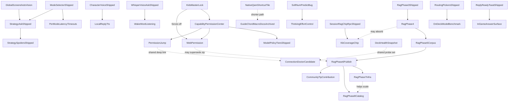

# bonsAI Roadmap

**Next session:** refactor handoff is at [execution order](audit/maintainer-decisions-locked.md#execution-order-locked-amended-2026-08-03) — **every step is complete.** Steps 9 (KB download Cancel), 10 (evidence hygiene / **D4**) and 11 (the deferred friction test) all landed 2026-08-05; step 12 (`main.py` extractions) ran after step 8. **The execution order is closed — what remains is a work list, not a plan.** The friction test's ranked findings are in [audit/03-friction.md](audit/03-friction.md); its top item is the settings/prop plumbing that **D14** deferred, now with outside evidence that it is the largest cost a newcomer pays and that its failure mode is silent. REFACTOR-PLAN Phases 4 (handoff docs) and 5 (postmortem + prevention) have not been run. Sizes re-verified 2026-08-07 after Waves 1–4: `index.tsx` closed step 8 at **1291** and is **1326** today; `main.py` closed step 12 at **2743** and is **2771**. Refactor QA still owed: **SHELL-PAYLOAD-01** and **KB-CANCEL-01** ([testing.md](testing.md)) — the step 8 modal batch (**MODAL-EXTRACT-01…04**) and the step 12 extractions (**MAINPY-EXTRACT-01**) are Verified on-Deck. Other follow-ups: [Needs verification](#needs-verification), open [Bugs](#bugs). Reorg commit: `ba2e5c5` (`git show ba2e5c5`).

**Moved (same commit):** locked maintainer decisions, execution order, and cleanup candidates → [audit/maintainer-decisions-locked.md](audit/maintainer-decisions-locked.md). Fixed-bug writeups → [archive/roadmap-bugs-fixed.md](archive/roadmap-bugs-fixed.md). Web permission discovery → [planning/web-permission-discovery.md](planning/web-permission-discovery.md).

Tracks **bugs** ([In Progress](#in-progress)), deferred **QA** ([QA backlog](#qa-backlog)), the **backlog** ([Planned](#planned)), **needs verification** ([Needs verification](#needs-verification)), and pointers to shipped work ([Completed](#completed)).

Setup and vision tuning: [troubleshooting.md](troubleshooting.md). QA: [testing.md](testing.md). Release: [development.md](development.md), [CHANGELOG.md](../CHANGELOG.md).

Star ratings use the GTA scale: `★` easiest … `★★★★★` very high complexity; `★★★★★★` extreme scope.

---

## In Progress

Known **defects** only. Deferred QA lives under [QA backlog](#qa-backlog). *QAMP Phase 1 (safe default) is shipped. Phase 2 (experimental profile sync) remains backlog-only.*

### Bugs

Status tags: **OPEN** · **PARTIAL** · **FOLDED** (tracked in linked plan) · **NOTE** (recon, not a defect).

- ~~★ **Static seed tells you to enable the knowledge base when it is already on**~~ — **fixed 2026-08-07 (Wave 2 F).** KB-advice static seed gated when `use_local_knowledge_base` is on across all three samplers (`getRandomPresets`, `getContextualPresets`, `getRandomPresetExcluding`) plus timer-driven chip re-samples in `MainTabPresetAnimatedChips`. Unit: `presets.test.ts`. On-Deck: **PRESET-KB-SEED-01** ([testing.md](testing.md)).
- ~~★ **Install voice engine button is actionable when the engine is already ready**~~ — **fix landed 2026-08-07 (Wave 1 B), awaiting on-Deck confirmation.** Settings → Voice input now derives readiness from `binary_ready && model_ready`, shows a ready message, and labels the action **Reinstall voice engine** while keeping the button enabled for reinstall. Re-verify **VOICE-REINSTALL-01** ([testing.md](testing.md)) to close this. Detail: [wave1.md](wave1.md).
- ★ **Strategy spoiler false-positive:** **PARTIAL** — options **1+2+4** landed 2026-08-07; `npm test` / `npm run test:py` / `tsc` / `build` green; **STRAT-SPOIL-DRG-01 not yet run on Deck**, which is all that remains to close it. Three independent defects were fixed: the asked-entity unwrap ran only on the live turn (history turns re-fenced); the low-risk prompt signal was reachable only through the KB corpus (absent with no corpus); and the prompt was additive, leaving the *"avoid late-game boss names"* and KB fence clauses standing next to the addendum that contradicts them. **Named-entity consent is now title-independent** per constitution rule 7 — naming a boss unfences that boss on Hades/OoT too, and relaxes nothing else. **Recon + decisions:** [04-strategy-spoiler-false-positive.md](planning/04-strategy-spoiler-false-positive.md) — ship options **1+2+4**; acceptance = **no fence rendered for the entity named in the question**; mid-stream unwrap = extra credit; option 3 = Deck-fail fallback only. Product rulebook (separate): [spoiler-constitution.md](planning/spoiler-constitution.md).
- ★ **Question Overlay Alignment Drift:** **OPEN.** The 3-line question overlay has minor horizontal spacing mismatch vs native `TextField` internals.
- ★★ **Live Ask user bubble shows "…" after reopen:** **OPEN.** Sometimes when a completed Ask is on screen and you back out of bonsAI (close QAM) or restart Steam and return, the user question bubble shows only `…` instead of the actual question; the AI answer below renders correctly. Screenshot `screenshots/DeckCapture_20260807_210151_game.png` (Ollama models Ask — answer intact, question header empty). **Repro:** finish or leave an Ask visible → close QAM or restart Steam → reopen bonsAI → question header is ellipsis, answer intact. **Likely:** `askThreadDisplayQuestion` / `lastExchange.question` lost on session survival restore while `ollamaResponse` persists — turn header falls back to `buildCollapsedTurnTitle(liveQuestion) || "…"` ([MainTabChatTranscript.tsx:381](../src/components/MainTabChatTranscript.tsx)).
- ~~★ **Thinking blurb italicizes emojis**~~ — **fix landed 2026-08-07 (Wave 1 A), awaiting on-Deck confirmation.** Live Ask thinking line now renders prose italic per segment via `splitThinkingBlurbItalicSegments` / `buildThinkingBlurbTextElement`; emoji grapheme clusters stay upright. Re-verify **THINKING-EMOJI-01** ([testing.md](testing.md)) to close this. Detail: [wave1.md](wave1.md).
- ~~★ **Thinking line vanishes mid-Ask when the model emits a lazy status tag**~~ — **fix landed 2026-08-08, awaiting on-Deck confirmation.** Both sanitizers run on the same string in series — Python on the model tag, TS again on every poll — and only Python fell back to the original when stripping emptied it. So `<bonsai-status>Sure.</bonsai-status>`, exactly the opener the prompt warns against, reached the client as `"Sure."` and sanitized to `""`, which fails the truthiness render gate. TS now mirrors `cleaned or raw`. Parity + idempotency tables in both suites. Re-verify **THINKING-SANITIZE-01** ([testing.md](testing.md)). Detail: [06-thinking-blurbs-review.md § 10.1](planning/06-thinking-blurbs-review.md#101-landed-2026-08-08--7-items-13).
- ~~★ **~22% of Asks show bare emoji for every phase change**~~ — **fix landed 2026-08-08, awaiting on-Deck confirmation.** Every phase pool ends with an emoji-only line and `_pick_template` keyed on `request_id` alone — the same id for every phase of one Ask — so when the bucket landed on that entry it landed there for the whole Ask. Measured 11/50 request ids. `_stable_bucket` now takes a salt and `format_thinking_phase` passes the phase key; the emoji lines stay, they stop clustering (1/5 → 1/3125 per five-phase Ask). Empty salt reproduces the old value exactly, because `composeThinkingBlurb.ts` still mirrors the opener pick. Re-verify **THINKING-EMOJI-CLUSTER-01** ([testing.md](testing.md)).
- ~~★★ **Thinking blurbs — three writers disagree**~~ — **fix landed 2026-08-08, awaiting on-Deck confirmation.** The client composed an opener from a per-mount counter and the backend replaced it ~1.2s later with a different template from a per-plugin-lifetime counter; the two languages also classified intent differently (`Why does Elden Ring crash on launch?` → `troubleshooting` in TS, `generic` in Python), so the line could change pool as well as template. Python is now the only writer: `start_background_game_ai` composes the opener at accept time and returns it, the client renders it behind a constant placeholder for the round trip, and `composeThinkingBlurb.ts` (330 lines of pools and hand-mirrored predicates) is deleted. The resolved AI character is threaded from accept into the request task, because `ai_character_random` defaults **on** and resolving twice would have put a deadpan blurb in front of a witty reply. Landed with it: emitters for `building_context` / `connecting_model` with copy rewritten to be encouraging where an Ask looks hung; the model tag now updating mid-generation instead of freezing on the first tag; and `[[spoiler]]` spans in the model tag rendering as block redactions. **Device pass 1 (2026-08-08) settled one row and reopened another.** THINKING-OPENER-01 **passes** — the placeholder was imperceptible, so the backend-authoritative design stands and the documented fallback is not needed. But the line still froze for a whole Expert+screenshot generation: inviting later `<bonsai-status>` tags only helps when the model emits them, and every other publisher finishes before `ask_ollama` is called. Fixed model-independently in `67d4ad5` — a `generating` phase on the first content token, plus a rotating duration line once a line has been unchanged for 7s. **That is a deliberate, narrow reversal of THINKING-COPY-01**, which forbade time-based rotation; the row is amended to "copy may not change while the work has not, and may not predict how much longer" rather than dropped. Rationale: [06 § 10.4](planning/06-thinking-blurbs-review.md). Still to re-verify: **THINKING-COPY-01**, **THINKING-SLOW-01**, **THINKING-LIVE-01**, **THINKING-SPOILER-01** ([testing.md](testing.md), [testing-manual.md](testing-manual.md)). Detail and decisions: [06-thinking-blurbs-review.md § 10](planning/06-thinking-blurbs-review.md#10-implementation-log).
- ~~★ **Bonsai pot sits ~1px right of the canopy in both the tab icon and the Decky plugin-list icon**~~ — **fix landed 2026-08-07 (Wave 1 D), awaiting on-Deck confirmation.** Trunk/pot path shifted 0.5 user units left in both `BonsaiTreeTabIcon` and `BonsaiSvgIcon` (`M11.5 14.5v3.2m-4.8 0h9.6l-1.1 2.3H7.8l-1.1-2.3Z`); geometry guard in `icons.bonsaiGeometry.test.tsx`. Re-verify **BONSAI-ICON-GEOM-01** ([testing.md](testing.md)) to close this — preview will not reproduce Deck panel scaling; watch for whole glyph appearing half-unit left and canopy ink asymmetry. Detail: [wave1.md](wave1.md).
- ~~★ **Token streaming stutters once at the start, then runs smoothly**~~ — **fix landed 2026-08-07 (Phase A / A4), awaiting on-Deck confirmation.** The reveal parked its frame loop on the first caught-up frame, so a partial that drained faster than the 150ms poll left the text still until React restarted the loop; it now coasts briefly instead, and the rate is derived from the backlog rather than capped at 160 chars/s. Re-verify **STREAM-REVEAL-01** ([testing.md](testing.md)) to close this. Detail: [05-token-streaming-review.md § 3.1](planning/05-token-streaming-review.md).

- ~~★★ **LB/RB tab switch flicker when scrolled**~~ — **fixed 2026-08-07, confirmed on device.** Root cause measured, not inferred: on an **RB** press the tabs-root child's `scrollWidth` transiently inflates (300 → 420) while the outgoing tab is still mounted, Steam scrolls it right to reveal the incoming tab, and the browser then clamps `scrollLeft` down frame by frame as `scrollWidth` collapses — dragging the strip sideways and back over ~350ms with **zero net movement**. `scrollLeft` tracked `scrollWidth - clientWidth` exactly on every frame. **LB never showed it** because scrolling toward 0 is valid at any `scrollWidth`; that asymmetry is what identified the mechanism. Fix: `overflow: clip` (both axes) instead of `hidden` in [section-1.ts](../src/styles/sections/section-1.ts) — a `hidden` box is still a scroll container and is still scrollable programmatically (measured: `scrollLeft` took 119.53 under `hidden`, 0 under `clip`), whereas `clip` removes the scroll container so there is no offset to clamp. Nothing legitimate is lost: that element measures `scrollWidth == clientWidth == 300` at rest, and the carousel's real horizontal scrolling lives on a deeper Steam element the rule does not touch. Post-fix capture: `scrollLeft` pinned at 0 across the whole 420 → 302 collapse, strip `x` constant, carousel slide intact. Detail: [§ 10](planning/03-lbrb-tab-flicker.md#10-resolution--2026-08-07).
  - **Two corrections to the discovery framing, both measured.** The "no-op press" the 2026-08-04 pass built on **is not a no-op** — Steam's `Tabs` *wraps around*, so RB on the rightmost tab switches to the leftmost and produces the longest strip travel of any press. And the symptom was never scroll-depth dependent; it is press-direction dependent. Ranked hypotheses H1–H5 in §§ 1–8 are all superseded: H1 was already falsified, and the surviving suspects (glyph colour churn, Steam focus-class churn, layout-hook re-measure) were each measured **not** to fire across five captured transitions.
  - **Stale `ResizeObserver` found in passing — fixed 2026-08-08, confirmed on device.** `TabContentsScroll` is **replaced on every tab switch** (node identity changed on all five transitions, then on all 22 of a longer verification run). [useQamPanelHeightGuard](../src/hooks/useQamPanelHeightGuard.ts) captured that node once at mount, so its `ResizeObserver` had been watching a detached element since the first tab change of any session and `--bonsai-tab-body-height` silently stopped tracking content. This also answers the §2 UNKNOWN the old recon could not resolve, in favour of "replaced per tab". The hook now re-resolves the pane and re-points the observer, driven by a `MutationObserver` on the ancestor chain — **childList only, no `subtree`**, so a streaming transcript does not generate a mutation record per token, with an `isConnected` early-return so ordinary churn costs a boolean read. Covered by `useQamPanelHeightGuard.test.ts` (5 cases; 3 fail against the pre-fix hook). On-device: 22 switches, pane identity incremented every time, `connected` true throughout, and `--bonsai-tab-body-height` matched the live pane's `clientHeight` on every sample.
  - **Recon corrected 2026-08-07 — [§ 9](planning/03-lbrb-tab-flicker.md#9-corrections--2026-08-07).** Sections 1–8 predate the 2026-08-04 device measurements and two of their load-bearing claims are now false: the top-ranked hypothesis (H1) is a ring swap keyed on `.Active`, which [SteamOS never applies](audit/decky-tab-strip-classes.md), and both the focus probe and the scroll-capture design read the global `document`, which [holds none of our markup](audit/decky-realms.md). **No mechanism for the remaining symptom has been measured.** Next step is `scripts/probe_deck_tab_switch.py` — samples every frame across a shoulder press and reports whether glyph colour, glyph geometry, ancestor transform, strip reserve or the scroll node changed, which maps 1:1 onto the candidate fixes. On-Deck row **TAB-SWITCH-01** now exists in [testing-manual.md](testing-manual.md).
  - **Downgraded and re-scoped 2026-08-04 from a fresh on-Deck pass.** The severe symptom is **gone**: no whole-frame judder, none of the jarring effect that made this ★★★. What remains is narrower and is worth re-aiming the recon at: the **tab icon strip** looks busy and the icons **shuffle**, most reproducibly when pressing **LB on the leftmost tab or RB on the rightmost** — i.e. on a switch that cannot go anywhere. A no-op switch still perturbing the strip points at the strip re-rendering or re-measuring on every shoulder press regardless of whether the active tab changed, which is a much smaller target than the original carousel/remount/scroll hypotheses. Focus retention across a normal LB/RB switch was confirmed **working** in the same pass. Not caused by step 8 — the tab strip content (`DECKY_TAB_TITLES`) was not touched, only how tab bodies are built.
- ★★ **KB compat retrieval phrase gate:** **FIXED 2026-08-06** under decision **D16** — see [audit/rag-pr2-signoff.md](audit/rag-pr2-signoff.md) § 2 for the measurement that forced the call. A separate `compat_topic_router.py` now routes an Ask to the compat corpus when it names a topic the tip sheet covers, instead of when it happens to contain the literal word `deck` or `proton`. Reachability went **3/40 → 39/40** on the drafted intents (**13/13** on the blind holdout) with **0/107** strategy false positives. Kept separate from `question_matches_troubleshooting_log_context` on purpose: that predicate has five consumers, and widening it would also attach Proton logs, re-frame the prompt, change stream tags, and move the client permission hint. On-Deck **KB-ROUTER-01**. Original report below, kept for context.
  

Original report

  Troubleshooting KB (compat hybrid / **Keyword + meaning**) only runs when `question_matches_troubleshooting_log_context` matches a **hardcoded phrase list** in `ollama_prompts.py` (preset-style strings like `proton issue`, `why is my game crashing`). Natural-language asks (e.g. `deck sleep resume proton black screen`) skip the KB entirely — no chip, no hybrid, no **Source: shared troubleshooting tips**. **Intent:** when **Use local knowledge base** is on, attempt compat tip retrieval for general troubleshooting-shaped Asks without growing a brittle regex/preset farm in bonsAI. **Fix lean:** broaden gate (e.g. KB-on + not strategy-with-game → compat shortlist; or lightweight intent/heuristic separate from carousel presets); keep Strategy path AppID-gated. Regression: **KB-SMOKE-07/08** queries in [testing-manual.md](testing-manual.md) must pass without adding new hardcoded strings per smoke case. **Phase 4 discovery (2026-07-30):** lean gate fix (**B1**) ships with Phase 4 when implemented — not a separate forever-defer.
  

- ★★ **Model routing try-order modal focus + chrome:** **OPEN.** Text/vision **Set … try order…** fullscreen (`ModelRoutingOrderModal`) — D-pad focus lands on leaf Up/Down buttons and feels broken; layout/chrome does not match other fullscreen pickers (Pull Models / Character picker / Models hub `ConfirmModal` pattern). Screenshot `DeckCapture_20260730_144925`. Discovery locked 2026-07-30. **Defer** — fetch-on-open + save already shipped; polish later.
- ★★ **Live-turn transparency UI missing after successful Ask:** **OPEN.** Backend `ensure_context_chips_on_snapshot` + slimmer dev chip JSON + frontend `transparencyUiAvailable` gating; verify **CONTEXT-LADDER-01** on Deck.
- ★★ **Strategy live-turn D-pad graph skips branches/feedback:** **OPEN.** Geometry scroll gate + yield-to-parent (`return false`) with Focusable branch picker as turn-slot sibling; verify **MICRO-04** on Deck.
- ★★ **Main tab answer D-pad scroll choppy / multi-line jumps:** **OPEN — but Phase B (2026-08-07) changed what Down does here, so re-measure before doing anything else.** Every section of an answer is now a D-pad stop, streaming and history alike, so Down lands section by section instead of scrolling a fixed step. The scroll-step logic is **untouched**, per the standing note below — it is now the fallback, reached when the walk runs out: inside a single section longer than a screen, and when the next section is still below the fold. So the symptom should be much reduced and is not necessarily gone, and where it survives it is now a *section granularity* question rather than a scroll-step one. Do not remove scroll-step logic until on-Deck confirmation after multi-day QA. Regression row: **D-PAD-SCROLL-02** in [testing-manual.md](testing-manual.md); the new chain is **STREAM-09**.
- **NOTE — Wave 4 G traded one unproven direction path for another on four sliders, 2026-08-07.** Not a confirmed defect, and deliberately not reverted — but it is the next thing to check on a Deck. Wave 4 G removed `onMoveLeft`/`onMoveRight` from `buildDeckThumbNavHandlers` ([DeckFocusSlider.tsx:39](../src/components/deck/DeckFocusSlider.tsx)) and the UI-scale bridge ([SettingsTabUiScaleSection.tsx:121](../src/components/SettingsTabUiScaleSection.tsx)), calling them redundant now that `isDeckDirection*Event` reads a real `GamepadEvent`. They were not redundant: the *old* predicates stringified their argument and matched nothing, which `focusNavigation.test.ts` asserts, so `onMove*` was the only path that worked. **The internal contradiction is the tell — the same commit kept `onMoveUp`/`onMoveDown` on the object it stripped the horizontal pair from.** Whichever handler Steam actually delivers, one of those two decisions is wrong. Restoring both is not the fix (they would double-step if `onButtonDown` does fire), which is why this waits on **ONBUTTONDOWN-AUDIT-01** — rewritten to distinguish *nothing happens* from *two steps / focus escapes*, and to cover **Ollama keep-alive**, **Reply verbosity** and **Connection timeout**, which share the same helper and changed with it. Also worth knowing when reading `.cursor/rules/decky-focus-graph.mdc`: it still names `SettingsTabUiScaleSection.tsx` as the slider-bridge pattern to mirror and still requires vertical **and** horizontal handlers, which that file no longer has.
- **NOTE — D-pad reachability sweep, 2026-08-04 — result: no new unreachable controls, and the method has a blind spot worth knowing.** Prompted by finding two touch-only controls by accident. Three passes over `src/**/*.tsx`: (1) raw `<button>` with no enclosing `Focusable` — **0** after the Session-context fix, the only two hits being a comment and a false positive; (2) clickable `div`/`span`/`img` outside a `Focusable` — **0**; (3) `Focusable` nested inside another `Focusable`, reachable only if the parent yields — 17 sites, of which only **3** have a parent that intercepts vertical movement (`MainTabUnifiedAskBar.tsx:529`, `buildReplyActionsElement.tsx:169` and `:233`), and all three are known-working paths in daily use.
  - **The blind spot: the spoiler fence does not appear in any of these results.** Its `Focusable` is rendered from `MainTabBonsaiAiMarkdownChunk.tsx` while the intercepting parent lives in `buildAnswerBubbleElement.tsx`, so **per-file static analysis cannot see the nesting**. Both real bugs found so far were of the cross-file kind. A future sweep needs to follow component composition, not file text — or the reachability question has to be answered on-device per control, which is what `docs/testing-manual.md` focus rows are for.
- ★★ **Focus ring consistency — half fixed, half reverted 2026-08-04** — **PARTIAL.** **Kept:** wrapping the character picker, desktop-note and plugin-help modals in `BonsaiModalScope`, which is what makes any bonsAI focus styling reach portalled content. **Reverted:** the blanket `button.gpfocus` / `:focus-visible` rule added the same day. It made rings *consistent* by painting bonsAI's **thick rounded ring** onto controls SteamOS already outlines with a **faint white rectangle** — the maintainer wants the native outline, not ours. **The goal stands and the method was wrong:** consistency should come from controls being real Decky `Focusable`s so SteamOS styles them natively, not from widening our own ring. A comment in `gamepadAndPullModels.ts` says not to re-add a catch-all rule. Original diagnosis, still accurate: Maintainer: *"white rings everywhere, follows focus"*, and the Ollama-tab inconsistency and the desktop-note/plugin-help rings all confirmed fixed. **The mechanism already existed and three modals simply did not use it:** `BonsaiModalScope` puts `.bonsai-scope` on portalled content and injects the ring sheet; the models hub and Pull Models used it, the character picker, desktop-note save and plugin help did not. Those three are now wrapped. The second half — plain Decky buttons falling through to `:focus-visible` heuristics — is fixed by a default rule matching `button` / `[role=button]` inside the scope, so a new control is styled by default instead of by remembering to add a class. **Original diagnosis, kept:** Maintainer ask: *"I want white focus rings everywhere, make them all consistent."* Two separate gaps produce this:
  - **Yellow rings: root-caused and fixed 2026-08-04 — they were ours, not Steam's. Confirmed white on-Deck.** Reported as *"the yellow outline stuff is back partially"* (`screenshots/DeckCapture_20260804_135650_game.png`). Measured on device: a focused `.bonsai-preset-glass` chip computes `outline: rgba(241, 196, 15, 0.92) solid 2px` — that is bonsAI's own ring, not a `:focus-visible` fallback. `buildGamepadFocusRingStylesheet` drew it with `var(--bonsai-ui-tab-focus-1/-2, <white>)`, and those variables are the **tab strip's accent pair**, set from the active AI character in [characterUiAccent.ts:153](../src/data/characterUiAccent.ts) — `#f1c40f` gold for Ali G and the TF2 Announcer. So the gamepad ring silently followed the character: gold here, purple for Shadowheart, and so on. **The white fallbacks written in that file show white was the intent all along** — it only ever looked white because no character accent was applied. It turned yellow once character selection started sticking (`c9ad633`), which is why it reads as a regression of an unrelated fix. **Fix:** the gamepad ring is now white literals, independent of accent, matching the maintainer ask *"white focus rings everywhere"*. The tab strip keeps its accent tint ([section-1.ts:204](../src/styles/sections/section-1.ts)), where the same variables are correct. **Reversible in one place** if accent-tinted rings turn out to be wanted after all.
  - **Modals get no bonsAI focus styling whatsoever.** The scoped stylesheet is emitted inside the scope div ([BonsaiPluginShell.tsx:20-21](../src/components/BonsaiPluginShell.tsx)) and **every rule is prefixed `.bonsai-scope …`** ([gamepadAndPullModels.ts](../src/styles/sections/gamepadAndPullModels.ts) defines the white `.gpfocus` / `:focus-visible` rings). `showModal` portals its content **outside** that div, so not one of those selectors matches inside the character picker, the models hub, or any other picker. That is why the character picker shows no ring anywhere — **not** a missing focus claim, which is what two attempted fixes wrongly assumed.
  - **In-panel buttons are styled by enumerated class, so unclassed ones fall through to Steam's default.** The white rings are attached to specific bonsAI classes (`bonsai-chat-secondary-btn`, `bonsai-preset-glass`, `bonsai-preset-help-chip`, …). Plain Decky `Button`s in the Ollama install row — **Browse models**, **Install options**, **Test connection** — carry none, so they fall back to `:focus-visible`, whose heuristics make the ring *sometimes yellow, sometimes invisible*. **Update AI 7 models** has a bonsAI class and shows white, which is exactly the inconsistency reported. Recordings: `DeckRecord_20260804_113056_game.mkv`, `DeckRecord_20260804_113728_game.mkv`.
  - **Fix lean (needs a maintainer nod before it ships — it touches CSS reach):** give the ring rules a selector that also matches modal content — either drop the `.bonsai-scope` ancestor for bonsAI-specific class selectors, which is safe because those class names are ours, or put a `bonsai-focus-ring` class on each modal root and repeat the rules for it. Then broaden from enumerated classes to a general rule for buttons inside those roots, so a new control is styled by default rather than by remembering to add a class. **Do not emit the rules fully unprefixed** — they would style Steam's own UI outside the plugin.
- ~~★ **Fullscreen pickers return you to the right tab, but not to the right control**~~ — **PARTIAL on Deck (1 of 3 pass).** Code shipped 2026-08-04; New `modalReturnFocusRegistry`: each opener control registers its element by id while mounted, its own `onClick` arms that id, and the modal-close path focuses it one animation frame after the tab is restored. **Registry rather than a DOM query on purpose** — `.cursor/rules/decky-focus-graph.mdc` forbids `querySelector` / `document.activeElement` for focus targets because they miss under Decky and land focus somewhere wrong. Wired for all four: plugin help, desktop-note save, character picker (Settings), models hub. Focus target ladder copied from `replyStopRegistry` — Decky's `.Panel.Focusable` wrapper first, then the native button. **If the opener is not mounted when the modal closes, nothing happens**, which is exactly the previous behavior, so a miss cannot be worse than before. **11 tests.**
  - **On-Deck result 2026-08-04: 1 of 3 tested passes.** **Character picker → Settings: works** — closing lands on the AI-character button. **Models hub → Ollama: fails.** **Desktop-note save → Main: fails.** Both failures land focus in the **tab icon row at the top**, not merely on the wrong control. Plugin help was skipped (chip previously dismissed, so it does not render).
  - **What the failure shape rules out.** Landing on the tab strip is where Decky puts focus when a tab body (re)mounts, so either the restore never ran, or it ran and was then overridden. The registry cannot tell those apart, and `.cursor/rules/decky-focus-graph.mdc` forbids settling it with a `document.activeElement` check. **Next step is instrumentation, not another guess:** log the `restoreModalReturnFocus()` return value through `bonsaiDebugLog` / `dbg_fe_log` on device, then apply one evidence-backed fix. If it returns true and focus still ends up on the strip, the fix is re-asserting after the tab body settles; if false, the opener is not registered at that moment and the fix is in the timing of registration, not of focus.
  - **Why Settings passing is a useful clue:** the two failing returns are to **Main** and **Ollama**, the two tabs with their own mount-time focus wiring; Settings has none. That is consistent with "restored, then stolen" rather than "never ran".
- ★★★ **Character picker: focus ring is invisible, D-pad does not move, so you cannot pick a character** — **OPEN (selection fixed).** Reported on-Deck 2026-08-04 as *"select a character, it stays on random"* plus *"the focus ring on that screen is invisible so you can't navigate via dpad"*. **These are one bug, not two, and the save path is innocent** — `useCharacterPickerModal.onOK` applies the choice locally and then writes it ([useCharacterPickerModal.tsx:64-83](../src/features/plugin-shell/useCharacterPickerModal.tsx)); it stays on random because the selection never moves off random, so OK commits what was already there. **Not caused by the step 8 extraction:** `CharacterPickerModal.tsx` was untouched by it (last real changes are `4b62886`, `7983414`, `3191b18`), and the extraction moved the opener, not the modal. **Root cause is in the modal's own focus graph:** it drives D-pad focus with `shell.querySelector(...)` lookups ([CharacterPickerModal.tsx:192-231](../src/components/CharacterPickerModal.tsx) — `focusRandomToggle`, `focusCustomCharacterField`, and friends). `.cursor/rules/decky-focus-graph.mdc` names that exact pattern as one that **misses on Deck and yields wrong spatial nav**, which is precisely the reported symptom: nothing visibly focused, D-pad inert. **Fix lean:** convert those helpers to the registered-owner pattern (`replyStopRegistry` / the new `modalReturnFocusRegistry`) instead of DOM queries. This is the same class as the document-sweep entry and they should be fixed together. **Blocks the AI-character feature entirely on a Deck** — it is only usable with a mouse today, which is why it rates higher than the picker-escape audit.
  - **Two attempted fixes failed, 2026-08-04, and the reason matters.** Both assumed nothing was *claiming* focus and added claims — first for the locked state, then unconditionally. Neither changed what the maintainer saw. The root cause is the entry above: **modal content is outside `.bonsai-scope`, so bonsAI's white ring CSS cannot match it**. Focus may well have been landing correctly the whole time with nothing drawn to show it. **Fix the CSS reach first, then re-test before touching the focus claims again** — and be prepared to revert them if the ring alone solves it, since an unnecessary claim fights Decky for the starting position.
  - **Selection not sticking — fixed 2026-08-04** (`patchPendingSessionSettingsSnapshot` after save, matching models hub). Re-test D-pad navigation after CSS reach is fixed.
- ★★★ **Fullscreen picker D-pad edge-escape (audit):** **OPEN.** Audit **Pull Models**, **Character picker**, **Ollama models hub**, and other `showModal` pickers for below-list / above-list escape (left from row → primary action; right from trailing control → Close).
- ★★★ **Soft** `num_predict` **+ thinking budget:** **OPEN.** `options.num_predict` is a hard Ollama wall (500 Speed/Expert, 900 Strategy) with no overshoot/continue; `"think": False` avoids empty replies when thinking ate the wall (`done_reason=length`, zero content) but leaves quality on the table for thinking models. **Intent:** length preference with small overshoot OK — not a hard cut, not unlimited. **Fix lean:** (1) raise base caps; (2) continuation on `done_reason=length` (small extra budget, capped continues — especially when content empty/short); (3) optional Reply verbosity → answer `num_predict`; (4) **budget thinking separately** (application policy): re-enable thinking with a fixed Deck default effort (`low`/`medium`) plus answer-floor / continue-if-content-starved; log thinking vs content lengths. Ollama has no true dual hard budgets in one completion — levels + continue stand in. **Not in scope:** delete the ceiling entirely; Settings UI for effort (→ **Thinking effort control**); parallel second Ask; spoiler chip work.

---

> **Decisions needed / locked / execution order / cleanup candidates** moved to [audit/maintainer-decisions-locked.md](audit/maintainer-decisions-locked.md) (commit `ba2e5c5`). **One decision is open — [D18](audit/maintainer-decisions-locked.md#d18--when-loading-settings-fails-four-values-keep-whatever-was-on-screen-bug-or-intent)** (a failed `load_settings` leaves four values unreset; raised 2026-08-05 by the step 11 friction test). D1–D17 locked; implement from that file.

---

## QA backlog

Maintainer on-Deck / qualitative work — **not** active feature engineering. Detail and checklists: [testing.md](testing.md), [testing-manual.md](testing-manual.md).

- ★★ **Device QA — Tier 0–1:** Execute Tier 0 smokes (SMOKE-A, C, F) then Tier 1 (SMOKE-B, E, H); update coverage with Pass / Partial / Fail + build id. Tier 2+ before release.
- ★ **VAC / `bonsai:vac-check` (Phase 1) — on-device QA:** Implementation complete; finish **VAC-02…06** after Tier 0 **SMOKE-F** passes.
- ★★★ **QAMP verification checklist:** Per-game profile on/off, QAM Performance reopen, Steam restart/reboot, GPU-clock recommendation paths. See [testing-manual.md](testing-manual.md) § QAMP.
- ★★ **Prompt testing pass:** Broader systematic validation beyond the shipped prompt-testing MVP matrices.

---

## Planned

Stars are **effort/risk** within bands. Grouped by **horizon**; **within each horizon sorted ascending by star rating**.

- **Near-term:** Incremental product work, bounded research spikes.
- **Medium-term:** Larger features inside the plugin + user-hosted stack.
- **Long-term:** ★★★★★★ scope and/or ★★★★★ work gated on upstream APIs or broad surface area.

**GitHub tracking:** Each **Planned** item rated **★★★★★** or **★★★★★★** includes a placeholder link to **[bonsAI Issues](https://github.com/cantcurecancer/bonsAI/issues)** (replace with a specific issue URL when created).

**Planned titles:** Short **noun-first** label (about 3–6 words); secondary context in parentheses. Detail under **Goal** / **Primary work**.

### Near-term

Within this section: ascending stars (★ → ★★★★).

- ★ **Intent packs later review** (keep / quiet / Developer — discovery leftover 2026-07-30)
  - **Goal:** Decide whether the quiet intent-pack search aliases should be deleted, left quiet, or revived under Developer.
  - **Proton journal half closed 2026-08-02.** The 5 journal RPCs and `proton_experiment_journal_service.py` are gone (`309c386`, `ebdc0f2`); only the file wipe survived, relocated into `plugin_data_reset.py` because **Clear all data** still needs it. The last of the plumbing — the `journal_text` parameter on `stack_context_blocks` — was removed on the Ask path in the cleanup pass. Reviving the feature now means rebuilding the store, not re-enabling a flag.
  - **Not in scope:** rewriting unified search ranking; re-shipping journal inject without a redesign.
- ★★ **Preset chip expansion** (streaming / LAN / Steam Input — incremental)
  - **Baseline shipped:** `PRESET_PROMPTS` in [`src/data/presets.ts`](../src/data/presets.ts).
  - **Wave 1 landed 2026-08-07:** four prompts — Find LAN, quick-launch chord, two token-streaming beta strings. Unit coverage in `presets.test.ts`; on-Deck **PRESET-EXPAND-W1-01** open. Detail: [wave1.md](wave1.md).
  - **Goal:** Add or refresh preset strings as related features land — content tuning only.
  - **Not in scope:** treating each string batch as a versioned feature ship. AppID/session RAG chips → shipped (**Session RAG preset chips**).
  - **Not in scope:** replacing `fade` as the default (`DEFAULT_PRESET_CHIP_ANIMATION`); changing which prompts are sampled; the other four styles considered in the same pass (`odometer` per-slot roll, `settle` scale-in, `sweep` mask wipe, `sprout` clip-path unfurl) — `sweep` in particular needs an on-Deck measurement first, since animating `mask-position` is not reliably compositor-accelerated there.
- ★★ **Unfenced spoiler feedback** (thumbs-down category)
  - **Goal:** After thumbs-down, refinement chip for **unfenced spoilers** (and optional over-fenced sibling). Improves future Asks — does not fix the current turn.
  - **Depends on:** reply micro-actions; **Spoiler confidence chip** signals useful later.
- ★★ **User-adjustable spoiler fencing** (hide by risk band)
  - **Goal:** Settings control for when to apply tap-to-reveal / fence masking from estimated risk — e.g. hide when risk ≥ **high** / **med** / **low**, or **never hide**.
  - **Depends on:** **Spoiler confidence chip**; shipped `strategy_spoiler_masking_enabled`.
  - **Related:** **Spoiler constitution** (when risk bands should drive mask vs soft-omit).
- ★★ **Thinking effort control** (Settings Off / Low / Medium / High)
  - **Goal:** User-adjustable Ollama thinking effort mapped to `think: false | "low" | "medium" | "high"` (global v1).
  - **Depends on:** **Soft** `num_predict` **+ thinking budget** (Bugs).
  - **Not in scope:** shipping Settings before the soft-budget bug fix.
- ★★★ **Dynamic keep-alive / smart unload** (research spike — discovery locked 2026-07-29)
  - **Goal:** Research-only: hold models loaded vs unload when a game takes focus, safely on Deck APU shared memory? Spike decides go/no-go. No ship commitment until spike writes outcome.
  - **Not in scope:** promising true per-game VRAM detection; production unload before spike doc.
- ★★★ **Per-mode latency timeouts** (warn vs hard limit profiles)
  - **Goal:** Separate warning and timeout values per selected mode.
  - **Depends on:** Mode selector (shipped).
- ★★★ **Custom model in Pull Models picker** (custom pull + Ask pin + New badges)
  - **Goal:** Pull any valid Ollama-library tag not in curated catalog; **Use for Ask** pin; **New** badge (released within 30 days). Custom pull is backup to living overlay; background catalog refresh when stale.
  - **Primary work:** Phase 1 Pull UI + Ask pin + routing prepend + New badge; Phase 2 hooks to future text model chains.
  - **Depends on:** shipped Pull Models picker + living overlay merge.
  - **Not in scope:** LAN/remote `ollama pull` (→ **LAN custom model pull**); Modelfile UI; full chain editor in v1.
- ★★★ **Search density UX** (match emphasis + tighter rows)
  - **Goal:** Tighter, more scannable results: spacing, wider lines, incremental filtering, highlighted match tokens.
- ★★★ **KB visual maps** (strategy maps — light prelim)
  - **Goal:** Optional visual strategy maps in KB-grounded replies — light prelim discovery only until closer to implementation.
  - **Depends on:** mature strategy corpus + Phase 3/4 retrieval quality.
  - **Note:** Separate roadmap row — not folded into RAG Phase 4–8.
- ★★★ **Kids master lock** (Steam parental restricted)
  - **Goal:** Disable plugin capabilities when Steam reports parental controls locked on this account. Ask, local Ollama and the offline knowledge base keep working.
  - **Signal confirmed 2026-08-03:** `SteamClient.Parental.RegisterForParentalSettingsChanges` — the top-level `locked` boolean, no protobuf decode needed. Present in `@decky/ui@4.11.3`, used by Steam's own client for its Family View gating, with third-party plugin prior art. Research: [08-kids-master-lock-feasibility.md](planning/08-kids-master-lock-feasibility.md).
  - **Plan:** [14-kids-master-lock-implementation-plan.md](planning/14-kids-master-lock-implementation-plan.md) — **Stage 0 is a blocking on-Deck spike**; no code until it returns.
  - **Re-starred ★★★★★ → ★★★ and moved Medium-term → Near-term (2026-08-07):** the old rating priced in *"is there a detectable Steam signal?"*, which the research closed. Rises to ★★★★ only if the spike shows a Steam Families child account needs the protobuf blob decoded.
  - **Depends on:** Capability Permission Center (shipped). The Steam-signal dependency is closed.
  - **Blocks:** **Web permission** (Medium-term) — that entry commits Web to **forced off** under this lock; shipping Web first leaves the claim unenforced in the one feature whose whole risk is Ask text leaving the Deck.
  - **Not in scope:** Content filtering of model output; a bonsAI-side PIN or unlock; per-feature `enabled_features` mapping; persisting lock state in `settings.json`; blocking Ask or local Ollama.
- ★★★★ **Llama.cpp provider spike** (Deck perf / replacement eval)
  - **Goal:** Research-only: can Deck-local llama.cpp beat Deck-local Ollama enough to justify a possible long-term replacement? **No code** in this spike. Supersedes the 2026-05-20 go/no-go in [llama-cpp-provider.md](archive/spikes/llama-cpp-provider.md).
  - **Discovery locked (2026-07-17):** Baseline Deck-local Ollama **gemma4 E2B**; go bar must win **both** game FPS hitch **and** peak GPU memory; load = DRG Survivor. Write `docs/archive/spikes/llama-cpp-provider-eval.md` (the spike's deliverable — does not exist yet).
  - **Not in scope:** Production provider UI/code; LAN/remote llama.cpp; cloud APIs.
- ★★★★ **SteamOS Share path** (capture → attach)
  - **Goal:** Faster path from SteamOS **Share** / capture flows into screenshot attach where APIs allow.
  - **Not in scope:** kernel framebuffer hacks as default.
- ★★★★ **SteamOS spin hint card** (immutable spins)
  - **Goal:** Detection + deep link to troubleshooting for immutable spins.
  - **Not in scope:** auto-fix firewall rules.
- ★★★★ **RAG Deck query — extended retrieval (Phase 4)**
  - **Goal:** Richer retrieval and content shapes after Phase 3 — session chip **visibility**, structured enemy/item sample cards + light reply bullets, T1 per-game AppID compat tips, lean compat phrase-gate fix.
  - **Status:** Discovery locked 2026-07-30; **docs only** — not implementing yet. Full lock: [knowledge-base.md](knowledge-base.md) § Phase 4.
  - **Discovery locked (2026-07-30):** All three tracks in one ship when implemented. Track 1 = visibility first (**V1+V3+V4**): guarantee ≥1 RAG chip when candidates exist (prefer game RAG → **Tip** badge; compat fallback); reseed so remix actually runs; **Tip** badge on **game** RAG chips only. Track 2 = **C3** corpus + reply shape, **R1** light bullets, **S1** sample on DRG Survivor + OoT/SoH, **F2** fields, both enemies+items, unfenced when user named the entity. Track 3 = **P1** prefer per-game tips then shared; **T1** ~3–5 tips × sample titles; same hybrid; **B1** lean phrase-gate fix; **N1** no game → shared only; **U1** no new Settings.
  - **Depends on:** Phase 3 (shipped 2026-07-29).
  - **Not in scope (Phase 4):** Chip **vector ranking** (→ Phase 5); broad per-game tips beyond T1 (→ Phase 5); structured cards beyond DRG+OoT sample (→ Phase 5); custom UI enemy/item cards / **KB visual maps**; public HF publish (→ Phase 6); sqlite-vss / auto-pull nomic (→ Phase 7).
- ★★★★ **KB online / versus strategy content** (gap found 2026-08-06 during PR2 query drafting)
  - **Goal:** Cover **online multiplayer** strategy for any title that has it — versus, co-op coordination, map callouts, tier lists — not just single-player progression. Applies to every online title the corpus carries, now and later.
  - **Why it is a gap, not a nicety:** the corpus is beginner-and-singleplayer shaped end to end. Card types are `boss` / `area` / `dungeon` / `quest`, which cannot express *"death charge spots on the roof of No Mercy"*, *"rank melee weapons"*, or *"best infected coordination spots on Dark Carnival"*. Those are the questions experienced players actually ask, and the corpus has **no content and no card shape** for any of them. Of the current 11 titles the affected set is small — L4D2 versus/survival, BG3 co-op, RDR2 Online — but the rule is forward-looking.
  - **Needs before content:** new `section_type` values. At minimum a **ranking/tier-list** shape ("rank melee weapons") and a **map-callout** shape ("death charge spots on X"); both are lists, which the current one-card-one-paragraph format handles badly.
  - **Source (proposed 2026-08-06):** [left4dead.fandom.com](https://left4dead.fandom.com/wiki/Left_4_Dead_2) — same class of source as the Ocarina of Time cards already shipped (`zelda.fandom.com`, recorded as `CC-BY-SA-3.0`), so it needs no new policy, only the same obligations. **Verify the licence in the wiki's own footer before ingesting and record whatever it actually says per card** — the licence page could not be read from the build machine (Fandom returns HTTP 402 to it), and Fandom has been moving wikis between CC BY-SA versions, so the version must not be assumed from the Zelda cards. **ShareAlike is the part with teeth:** distilled cards are adaptations, so the corpus inherits the licence, and that has to be stated in `ATTRIBUTIONS.md` and the public NOTICE before first publish — not after.
  - **How to fetch it, preferred order:** (1) **Fandom's own database dump** (`Special:Statistics` → database download) — official, one request, no rate-limit or ToS friction; (2) the **MediaWiki API** (`/api.php`) with rate limiting and an honest User-Agent, for a handful of named pages; (3) a **WikiTeam dump from archive.org** if the first two fail or a fixed snapshot is wanted. All three land the same CC BY-SA obligations — how the text is obtained does not change what is owed for redistributing it.
  - **On Wikibot** ([archiveteam](https://wiki.archiveteam.org/index.php/Wikibot)): it is an **IRC bot that dumps MediaWiki/DokuWiki/PukiWiki instances to the Internet Archive's WikiTeam collection** — a preservation tool, not an ingestion pipeline, and not something we would run. Its *output* is route (3) above: if a `left4dead.fandom.com` dump already exists in that collection, extracting from it beats fetching pages ourselves. Worth checking archive.org first.
  - **Other sources:** **Liquipedia** (CC BY-SA 3.0) is clean but thin for these titles. **Community competitive docs** (config/ruleset wikis, league guides) need a per-source licence check — several carry none. **Steam Community Guides and GameFAQs are out**: user-authored under platform ToS with no redistribution grant, the same reasoning that already excludes ProtonDB and Reddit bulk.
  - **Not in scope:** live match data, ladder/rank lookups, anything needing network at Ask time.
  - **Depends on:** nothing shipped — can start once card types are decided. Independent of remediation PR2, which deliberately keeps the existing 11 titles and adds no new types.
- ★★★★ **RAG retrieval quality remediation** (hybrid fix + eval honesty — discovery locked 2026-08-02)
  - **Goal:** Fix shipped hybrid defects (nomic prefixes, RRF instead of cosine-only rerank, relevance floor, query/transparency bugs) and re-validate with a deepened seed + honest eval (tune/holdout; no self-referential card→query pairs).
  - **Status:** **PR1 (Stages 1–5) shipped 2026-08-05** — five commits, `d111491`…`82d379f`. **PR2 (Stage 6) started 2026-08-06**: seed corpus rebuilt at schema v3 and verified running the hybrid path live; stage 6a (hybrid kill-switch setting) landed. Active plan: [rag-retrieval-quality-remediation-implementation-plan.md](rag-retrieval-quality-remediation-implementation-plan.md). Analysis (archived): [archive/rag-retrieval-quality-remediation-plan.md](archive/rag-retrieval-quality-remediation-plan.md). What PR1 changed, with a before/after table: [knowledge-base.md](knowledge-base.md) § Retrieval quality remediation.
  - **PR1 landed:** task prefixes paired and owned by one module (the eval imports them); corpus schema **v3** + `embedding_variant`, with a gate that fails closed on a v2 corpus; RRF over FTS+vector on **both** strategy and compat; loose BM25 floor + column weighting; retrieval searches the user's question rather than the follow-up header or the app name; stopword filtering; manifest-first vector checks, cached availability, batched builder, single-file corpus (`VACUUM` + `immutable=1`); lowest-tier trust labels, whole-card budget drops, transparency built after stacking; `keyword_hybrid_disabled` literal + label.
  - **Two things worth knowing before PR2.** (1) **Naive RRF re-creates the exile it removes** — a card missing from the vector list scores 0 from it, and on a 30-card shortlist the worst vectored card then beats the best keyword hit; missing entries are backfilled one rank past the end, and that backfill rank is another PR2 knob. (2) **`ORDER BY rank` is the *unweighted* bm25**, so column weights do nothing to ordering unless the ORDER BY repeats the weighted expression.
  - **Every fusion constant is provisional and must not be tuned on the current seed** — 22 sections against `HYBRID_FTS_SHORTLIST_K = 30` means the shortlist swallows the corpus and any number derived from it measures the harness. PR2 deepens the seed first, then tunes on **tune** and gates on **holdout**.
  - **PR1 QA owed on Deck:** **KB-RRF-01**, **KB-VARIANT-01**, **KB-FLOOR-01**, **KB-FOLLOWUP-01**, **KB-TRANSPARENCY-01** ([testing.md](testing.md)); **KB-SMOKE-02/04 re-opened** because PR1 changed the behaviour its Verified evidence described. **Existing corpora must be rebuilt** — schema v3 has no migration (Decision 6).
  - **PR2 stage 6a landed 2026-08-06:** `rag_hybrid_retrieval_enabled` (default **on**) with a Developer-tab toggle under *Knowledge base (dev QA)*. Checked **before** the corpus-format gate so the switch reports itself rather than blaming the corpus. QA owed: **KB-KILLSWITCH-01**, **FOCUS-GRAPH-DEV-KB-01**.
  - **PR2 stage 6b landed 2026-08-06, and it measured the Q8 gap:** the eval now runs keyword / vector-only / RRF on one corpus with bootstrap CIs, honours a tune/holdout split, and derives gate reachability from the live `should_retrieve_knowledge`. **Only 3 of 18 compat fixtures reach retrieval in production** — 83% of the compat eval set is traffic the phrase gate never routes, which is why the 2026-07-31 bake-off's compat half is now flagged as measuring nothing. Strategy is 22/22 reachable. First arm run (tune split, current shallow corpus) shows keyword 90.0% top-3, vector-only 90.0%, RRF 85.0%, **all intervals overlapping** — no separation, and not a number to act on until the corpus is deepened.
  - **PR2 stage 6c landed 2026-08-06 and is now BLOCKED on maintainer sign-off:** 147 query intents drafted **before** any card exists (R1), tune 102 / holdout 45, 10 topics per title across the existing 11 titles. The no-verbatim-echo rule is a passing test, not a review item. **Sign-off packet: [audit/rag-pr2-signoff.md](audit/rag-pr2-signoff.md).** It carries one question that changes PR2's shape: the compat phrase gate needs the literal word `deck` or `proton`, so **only 3 of 40** new compat intents reach retrieval — and **0 of 19** phrased the way a player types. Roughly 24 of the corpus's 27 compat topics are unreachable in production. Q8 stays deferred or the gate widens; that is a product call.
  - **The holdout split is empty on purpose.** Every existing fixture was written from the card it matches, so none can serve as a ship gate (R1). The eval says so out loud rather than reporting a tie.
  - **D16 locked and shipped 2026-08-06 — the gate is widened, not deferred.** New `compat_topic_router.py` routes on corpus topics rather than on the literal words `deck` / `proton`. Reachability **3/40 → 39/40** on the drafted intents, **13/13** on the blind holdout split (rules were written without reading it), **0/107** strategy false positives. Old fixtures go 3/18 → 18/18. A drift test fails if a corpus topic has no routing rule — the failure mode that made eight anti-cheat tips unreachable. The one remaining miss (`V1-C-04`) names no troubleshooting term at all and is left as a recorded miss rather than patched for. On-Deck **KB-ROUTER-01**.
  - **D17 locked and shipped 2026-08-06 — game knowledge is no longer gated on the Ask mode toggle.** Strategy cards required Strategy mode, so Speed and Expert attached nothing for the same question about the same running game; Expert is where somebody stuck on a hard fight most likely is. Mode still sets *how many* cards (1 / 3 / 5). Two guards on the new route: a higher relevance bar (`IMPLICIT_ROUTE_RELEVANCE_FLOOR`, **provisional**, tuned in 6d) and no generic genre-card consolation, so an ordinary Ask made while a game is open does not grow a boilerplate block. Details and the two bugs found while shipping it — a cross-game leak and the porter stemmer clearing the floor — in [audit/maintainer-decisions-locked.md](audit/maintainer-decisions-locked.md) § D17. On-Deck **KB-ASKMODE-01**.
  - **Query intents need re-authoring before cards (maintainer review 2026-08-06).** The drafted set is written in full sentences and assumes players describe rather than name. Both are wrong for the target: Deck / Steam Frame / couch-with-a-controller input is terse, and players *do* know the names the game puts on screen — Deathclaw, Tank, Witch, Water Temple, Los Santos. The genuinely vague cases are hard-to-recall names (Volvagia, Twinrova) and unfamiliar terminology (DRG). The set is also uniformly beginner-level and needs a beginner / familiar / power-user mix per title. Authoring rules: [audit/rag-eval-query-style.md](audit/rag-eval-query-style.md).
  - **Open:** eval reports gate-reachable vs overall compat scores as of stage 6b; PR2 stage 6d still blocked on card sign-off; **online/versus content is a separate tracked feature**, not part of PR2.
  - **Not in scope:** sqlite-vss/ANN; auto-pull nomic; public HF; Phase 5 chip ranking / wiki ingest; trust-tier-in-RRF.
- ★★★★ **RAG Deck query — corpus expansion (Phase 5)**
  - **Goal:** Finish Phase 3 **11-title** corpus maturity after Phase 4 sample paths — profiled tips/structured cards + heavier wiki ingest; then session chip **vector ranking** (baked cold-open / live after Ask).
  - **Status:** Discovery locked 2026-07-30; **partially rescoped 2026-08-02** — **strategy seed deepening (~8–12 sections/game) ships in RAG retrieval quality remediation PR2** for eval honesty; Phase 5 keeps the rest. Full lock: [knowledge-base.md](knowledge-base.md) § Phase 5.
  - **Discovery locked (2026-07-30):** Content → ranking. Depth-first on all 11 (no net-new titles); profiled minimum bar (~3–5 tips + strategy sections; enemy/item handful where genre fits); heavier wiki ingest with complete attribution as added; shared tip sheet stays ~as-is; no size budget; Dev-tab install only. Chip ranking hybrid with precomputed cold path; keep ~30% + Phase 4 ≥1 guarantee; no new Settings. Spoiler high-flag metadata only (no runtime). Non-Steam/alias must retrieve (SoE). Speed/Expert light KB only. Exit = content bar + KB-EVAL + smoke on DRG, OoT/SoH, Cyberpunk, RDR2, SoE.
  - **Strict gate amended (2026-08-02):** Seed deepening for remediation eval may proceed **without** waiting for Phase 4 implement + smoke. Remaining Phase 5 work still depends on Phase 4 sample paths where noted.
  - **Depends on:** Phase 4 implementation + on-Deck QA of sample paths (except remediation seed depth — see above).
  - **Not in scope:** Public HF/GitHub publish (→ Phase 6); sqlite-vss/ANN; auto-pull `nomic` (→ Phase 7); catalog-scale titles (→ Phase 8); custom UI cards / **KB visual maps**; new Settings; net-new titles; material shared-tip growth; runtime spoiler behavior from corpus flags; RRF FTS+vector (→ remediation, then Phase 7 for trust/ANN extensions).
- ★★★★ **RAG Deck query — public publish (Phase 6)**
  - **Goal:** First public versioned corpus + manifest (HF primary, GitHub Releases mirror) after Phase 5 maturity + legal scrub — closes **KB-DOWNLOAD** Partial.
  - **Status:** Light discovery locked 2026-07-30; **docs only** — fuller Phase 6 discovery later. Lock: [knowledge-base.md](knowledge-base.md) § Phase 6.
  - **Discovery locked (light, 2026-07-30):** Publish **Phase 5’s matured 11** + shared tips only (not catalog). Full ATTRIBUTIONS / no placeholder licenses on first public tag; NOTICE that sources can err → fix forward. Point-release updates. Manifest **forward-hooks** for future packs/deltas (unused at v1 OK). sqlite-vss/ANN + nomic + Phase 7 optional paths → **Phase 7**; catalog scale → **Phase 8**.
  - **Depends on:** Phase 5 corpus expansion + extended on-Deck KB testing; legal scrub of published zip.
  - **Not in scope:** sqlite-vss/ANN; auto-pull `nomic`; demote/vision→KB (→ Phase 7); core RRF FTS+vector (→ remediation); Steam ~1000 / Deck ~100 / emu catalog (→ Phase 8). Pack/delta **wire format** is Phase 7+ (hooks only in Phase 6).
- ★★★★ **RAG Deck query — retrieval infra (Phase 7)**
  - **Goal:** Optional **sqlite-vss / ANN**; optional **auto-pull `nomic`** (consent); plus optional paths — **RRF extensions** (trust/demote lists; ANN as another RRF list), **vision→entity→retrieve**, retrieval **thumbs + local demote**, **delta/packs**, **named thinking hit**; plus **intent retrieval** (keyword-heavy blend + meaning when FTS weak; gated translate for non-English).
  - **Status:** Tight discovery locked 2026-07-30; **intent / cross-lingual locks extended 2026-07-31**; **RRF FTS+vector pulled forward 2026-08-02** into [RAG retrieval quality remediation](rag-retrieval-quality-remediation-implementation-plan.md). **Docs only** for remaining tracks — fuller discovery later. One umbrella; tracks not gated on each other; UX may ship earlier when deps exist. May spike in parallel with Phase 6; **must not block** first public publish. Full lock: [knowledge-base.md](knowledge-base.md) § Phase 7.
  - **Discovery locked (tight, 2026-07-30):** Silent RRF (FTS+vector+trust; +demote when ready) — **FTS+vector ships in remediation**; trust/demote/ANN extensions remain here. ANN↔RRF deferred (hypothesize ANN as another RRF list); vision same-Ask piggyback (no extra extract call; lean Strategy+screenshot+KB, gate deferred); thumbs `wrong_tip`/`outdated`/`wrong_edition`; demote = JSONL + index, soft then hard, needs `section_id`s; Phase 6 manifest forward-hooks; core + optional packs; delta = goal only; name thinking hits (fence on reply); screenshot+KB preset deferred; first-run wow out.
  - **Discovery locked (intent, 2026-07-31):** From bake-off [kb-embed-bakeoff-2026-07-31.md](archive/research/kb-embed-bakeoff-2026-07-31.md) — keep **`nomic-embed-text`**. Ranking = **C** (strong FTS → keyword-heavy blend; empty/weak FTS → meaning/ANN fallback into RRF). Cross-lingual v1 = **gated translate → English → search** (chat/routing model, not nomic; rare second call; prefer one reply Ask). Fuzzy Deck-term glossary = nice-to-have. **Avoid:** dual vector tables in one zip; mixing a second embed against nomic-baked vectors; routine translate. Multilingual embed only later via **second corpus** or **on-device re-embed** (explicit follow track). **Note (2026-08-02):** bake-off “keyword beat hybrid” conclusion is **under remediation** — do not treat as settled architecture truth until the superseding report lands.
  - **Depends on:** Phase 6 publish path healthy (or spike-only until then). Demote needs KB slice `section_id`s; some UX can precede ANN. Remediation PR1/PR2 preferred before relying on RRF in production.
  - **Not in scope:** Replacing Phase 6 publish; catalog authoring (→ Phase 8); cite-to-source tap; faithfulness chip; abstain; KB browser; cross-encoder; cloud demote sync; first-run wow; multilingual default embed; dual nomic+multilingual vectors in one download.

### Medium-term

Within this section: ascending stars (★★★★ → ★★★★★★).

- ★★★★ **LAN custom model pull** (remote host — decision review)
  - **Goal:** When Ask uses a **LAN Ollama host**, let users add/pull models not in the bonsAI catalog — **blocked until mechanism is chosen** (R1 instructions-only / R2 Deck pull while LAN Ask / R3 remote execution / R4 pin-only).
  - **Depends on:** **Custom model in Pull Models picker** (Deck-local v1).
  - **Not in scope:** shipping without explicit mechanism sign-off.
- ★★★★ **Steam Input layout parse** (VDF → AI context)
  - **Goal:** Parse controller VDF configs and feed actionable control context to AI.
  - **Not in scope:** editing/writing controller configs.
- ★★★★ **Web permission** (Ask live search + online deps)
  - **Goal:** Opt-in capability so Ask can fetch live answers about current games/patches/news (web search spine). Offline Ask + local KB remain usable when Web is off.
  - **Status:** Discovery locked 2026-07-30; **docs only** — not implementing yet. Full discovery: [web-permission-discovery.md](planning/web-permission-discovery.md).
  - **Depends on:** Capability Permission Center; Kids Master Lock; Show details / Source patterns.
  - **Not in scope:** shipping search/HF stream code in v1.
- ★★★★ **Connection doctor** (guided first-Ask repair — candidate, proposed 2026-08-07)
  - **Status:** **Candidate, not accepted.** Decide first whether this is a standalone row or **Phase 1 of Deck health snapshot** — the two share a probe set, and building both means maintaining two probe stacks.
  - **Goal:** When the first Ask fails, walk the user to a working Ollama instead of handing them a toast and a docs link.
  - **v1 shape:** a **Fix this** action on Ask failure that runs the probes the backend already has, in order — host reachable? (`test_ollama_connection`, [main.py:943](../main.py)) → anything advertising on LAN? (`discover_mdns_ollama_hosts`, [:1084](../main.py)) → is local Ollama installed and running? (`get_local_ollama_setup_status`, [:1207](../main.py)) → is any model pulled? — then state exactly one next action per outcome, deep-linking to the Ollama-tab control that performs it.
  - **Why now:** the probes are all shipped and each is separately reachable, but a new user whose first Ask fails gets a toast ([bonsaiReplyReadyToast.ts:59-73](../src/utils/bonsaiReplyReadyToast.ts)) and a docs link. [Q2 README redesign](planning/02-readme-redesign-plan.md) found the same new-user cliff from the docs side; this is the in-plugin half.
  - **Depends on:** those four shipped probes; Ollama tab controls; named hosts; compat KB troubleshooting tips. Shares the deep-link mechanism with shipped **Permission jump** (see [archive/roadmap-completed.md](archive/roadmap-completed.md)).
  - **Related:** **Deck health snapshot** (read-only dump). If both ship: the doctor is the interactive front end, the snapshot is the dump — one probe stack, two presentations.
  - **Not in scope (v1):** editing firewall or network config; running installs without consent; a read-only diagnostics dump; anything web (→ **Web permission**).
  - **★★★★ justification:** no new capability, but a stateful multi-step flow on the Deck's hardest surface (D-pad through a decision tree), sitting on the Ask lifecycle mid-**D3**, and every branch needs on-Deck QA against a *deliberately broken* setup — a QA fixture that does not exist yet.
  - **Source:** [13-roadmap-feature-ideas.md](planning/13-roadmap-feature-ideas.md) § B3.

- ★★★★★ **Named chat slots** (labeled threads — redesign only)
  - **GitHub (tracking placeholder):** [bonsAI Issues](https://github.com/cantcurecancer/bonsAI/issues) — dedicated issue TBD.
  - **History:** We previously implemented named chat slots. It was **seriously bugged** (persistence/picker/overwrite behavior) and was **removed**. Leftover folders on device are harmless — see [troubleshooting.md](troubleshooting.md) § leftover named-chat folders.
  - **Goal:** Multiple labeled threads beyond single persisted QA — **only if redesigned**; do not re-ship the old mini-list / fullscreen picker approach without a clean redesign.
  - **Depends on:** unified Ask state machine.
  - **Not in scope:** re-implementing the failed design; cross-device merge or server-backed sync.
- ★★★★★ **Deck health snapshot** (full diagnostics + Ollama)
  - **GitHub (tracking placeholder):** [bonsAI Issues](https://github.com/cantcurecancer/bonsAI/issues) — dedicated issue TBD.
  - **Goal:** **Read-only** full diagnostics; save markdown/JSON to Desktop when **Save files to Desktop** is on. **Magic Ask** `bonsai:diagnostics` + natural-language confirm modal. No new capability.
  - **Not in scope:** New permission tier; telemetry upload; privileged repair commands.
- ★★★★★ **Local reply TTS** (Phase 1–2 character voice)
  - **GitHub (tracking placeholder):** [bonsAI Issues](https://github.com/cantcurecancer/bonsAI/issues) — dedicated issue TBD.
  - **Dedup:** distinct from Whisper voice Ask (shipped) and **Wake-word listening**. Phase 1 offline TTS play/stop; Phase 2 character-aligned read-aloud (legal research gate before ship).
  - **Not in scope:** Cloud celebrity voice cloning; wake-word; claiming official voices.
- ★★★★★ **Steam Controller copilot** (Ibex gen-2)
  - **GitHub (tracking placeholder):** [bonsAI Issues](https://github.com/cantcurecancer/bonsAI/issues) — dedicated issue TBD.
  - **Goal:** AI and in-app copy tuned to gen-2 hardware + Steam Input–aligned suggestions.
  - **Not in scope:** Writing controller configs.
- ★★★★★ **Wake-word listening** (beta; Deck first)
  - **GitHub (tracking placeholder):** [bonsAI Issues](https://github.com/cantcurecancer/bonsAI/issues) — dedicated issue TBD.
  - **Goal:** Opt-in always-on local wake on fixed keyword **bonsAI** → STT → quiet Ask. New capability + mic permission; ConfirmModal on enable.
  - **Depends on:** Shipped Whisper voice Ask; Reply ready toast; Voice STT session daemon.
  - **Not in scope (v1):** Custom wake phrases; always-on full Whisper; cloud STT; auto-open QAM on wake.
- ★★★★★★ **Remote Play diagnostics layer** (streaming host/client)
  - **GitHub (tracking placeholder):** [bonsAI Issues](https://github.com/cantcurecancer/bonsAI/issues) — dedicated issue TBD.
  - **Goal:** When gameplay is streamed, answers weight encode latency and host-vs-client fixes.
  - **Not in scope:** Packet inspection or kernel hacks.
- ★★★★★★ **Steam Frame companion UX** (VR / LAN Deck)
  - **GitHub (tracking placeholder):** [bonsAI Issues](https://github.com/cantcurecancer/bonsAI/issues) — dedicated issue TBD.
  - **Goal:** Research-first companion workflows for Steam Frame; comfort/framerate/wrong-display disclaimers.
  - **Not in scope:** Shipping a full VR overlay inside Frame as v1.

### Long-term

Within this section: ascending stars (★★★★ → ★★★★★★).

- ★★★★ **Session context and user stash** (deck-first context)
  - **Goal:** Unified deck-first context for Ask — live session facts + user-editable stash notes. No embeddings/cloud. Explicit alternative to RAG for deck-only quality.
  - **Not in scope:** embeddings, vector DBs, cloud sync, auto web fetch.
- ★★★★★ **QAMP Phase 2 profiles** (experimental Steam opt-in)
  - **GitHub (tracking placeholder):** [bonsAI Issues](https://github.com/cantcurecancer/bonsAI/issues) — dedicated issue TBD.
  - **Status:** Backlog-only. Phase 1 verification lives in [QA backlog](#qa-backlog) / [testing-manual.md](testing-manual.md).
  - **Goal:** Experimental opt-in tying QAMP reflection UX to Steam per-game performance profiles.
  - **Not in scope:** silent sysfs or profile applies without consent.
- ★★★★★ **VAC Phase 2 opponent IDs** (lobby/session API research)
  - **GitHub (tracking placeholder):** [bonsAI Issues](https://github.com/cantcurecancer/bonsAI/issues) — dedicated issue TBD.
  - **Status:** Phase 1 complete; on-device QA still in [QA backlog](#qa-backlog).
  - **Goal:** When metadata allows, surface live opponent Steam identities for ban checks. Research spike first; if no stable API → enhanced manual flow.
  - **Not in scope:** automated reporting or punitive automation.
- ★★★★★ **On-Deck model benchmark** (measured routing order; proposed 2026-08-07)
  - **GitHub (tracking placeholder):** [bonsAI Issues](https://github.com/cantcurecancer/bonsAI/issues) — dedicated issue TBD.
  - **Goal:** Rank the models actually installed on *this* Deck by measured speed and completion, and offer that ranking as the try order instead of a hand-sorted list.
  - **The numbers already exist and go straight to the log.** `eval_count` / `prompt_eval_count` / `done_reason` are read off every stream ([ollama_service.py:610](../py_modules/backend/services/ollama_service.py)) and `elapsed_seconds` already reaches the UI. Routing order is user-owned (**Set text/vision model try order…**, `resolve_routing_order`) but users have no data with which to order it.
  - **Go/no-go gate:** a spike proving run-to-run variance is small enough that the ranking is stable. A bench run while a game holds the APU, on battery, or thermally throttled gives a different answer than one on the dock, and the Deck has no stable idle state to measure from. **If variance wins, descope** to a one-shot "how fast is this model here?" readout and stop.
  - **Depends on:** shipped user-owned routing pickers + `ollama_routing.py`; keep-alive. Overlaps **Dynamic keep-alive / smart unload** — run that spike first, or share its measurements.
  - **Not in scope:** benchmarking LAN hosts; any quality or "which model is smarter" scoring — speed and completion only; auto-applying a new order without confirmation; publishing results anywhere.
  - **★★★★★ justification:** measurement validity is the real cost, not the code. Also minutes of model loading (needs cancel + progress UI), interaction with keep-alive, and it writes a setting the user owns.
  - **Source:** [13-roadmap-feature-ideas.md](planning/13-roadmap-feature-ideas.md) § C1.
- ★★★★★ **Community tip contribution** (corpus inbound path; proposed 2026-08-07)
  - **GitHub (tracking placeholder):** [bonsAI Issues](https://github.com/cantcurecancer/bonsAI/issues) — dedicated issue TBD.
  - **Goal:** Let a user who knows a fix turn it into a KB tip card the project can actually accept — without bonsAI running a server or collecting anything.
  - **v1 shape:** a reply → **Suggest as a tip** action that writes a schema-valid card (the corpus's own section format, plus AppID and source attribution) to `~/Desktop/bonsAI_logs/` and shows the GitHub URL to attach it to. Entirely local; the transport is the user's own browser on their own machine.
  - **Why it belongs to the corpus track:** the KB ceiling is content, not retrieval, and the one signal users already give is discarded — `save_ask_feedback` ([main.py:1963](../main.py)) appends JSONL that nothing reads back (`feedback_service.py` exposes only `feedback_log_path` and `append_ask_feedback`).
  - **Depends on:** **RAG Phase 6** (public corpus + ATTRIBUTIONS + legal scrub) — there is no point accepting contributions before there is a published corpus to contribute to. Shipped: Desktop notes + `filesystem_write`, thumbs feedback, corpus schema.
  - **Not in scope:** any upload from the plugin; telemetry; auto-merge; writing unreviewed cards into the local corpus; wiki scraping (→ Phase 5/7).
  - **★★★★★ justification:** the cost is not the code — it is moderation, licensing and attribution of user-submitted text, and a review pipeline the maintainer runs forever. A PII scrub cannot be fully guaranteed, so the copy must say plainly *"you are publishing this."*
  - **Source:** [13-roadmap-feature-ideas.md](planning/13-roadmap-feature-ideas.md) § C2.
- ★★★★★★ **Deep mod AI hints** (install paths + compatdata)
  - **GitHub (tracking placeholder):** [bonsAI Issues](https://github.com/cantcurecancer/bonsAI/issues) — dedicated issue TBD.
  - **Goal:** Detect mod frameworks/files; mod-aware AI guidance.
  - **Not in scope:** downloading/installing mods automatically.
- ★★★★★★ **RAG Deck query — catalog corpus (Phase 8)**
  - **GitHub (tracking placeholder):** [bonsAI Issues](https://github.com/cantcurecancer/bonsAI/issues) — dedicated issue TBD.
  - **Goal:** Large offline catalog after Phase 6’s matured-11 publish — sketch: ~top **1000** Steam titles; ~top **100** Steam Deck (priority slice); ~**50 emulated** per era Genesis→Xbox 360/PS3 (~300–500 emu) with verified alias/Non-Steam matching.
  - **Status:** Intent only 2026-07-30; **fuller discovery later**. Not Phase 6 v1.
  - **Depends on:** Phase 6 public publish + legal lessons; likely Phase 7 infra for scale.
  - **Not in scope:** Shipping catalog as the first public HF corpus; thin stubs that drown hybrid retrieval without a tiering plan.
- ★★★★★★ **Native QAM shortcut tile** (under Decky; upstream research)
  - **GitHub (tracking placeholder):** [bonsAI Issues](https://github.com/cantcurecancer/bonsAI/issues) — dedicated issue TBD.
  - **Goal:** Separate QAM left-rail entry for bonsAI beneath the Decky Loader icon (fewer steps than Decky plugin list). Requires upstream Steam/Decky support — plugins cannot register sibling QAM icons from `plugin.json` alone.
  - **Related:** Guide-chord macro docs remain in [troubleshooting.md](troubleshooting.md) §5 for power users; not a casual-user priority (archived from Planned).
  - **Not in scope:** Shipping a forked Steam client or undocumented UI injection as default.
- ★★★★★★ **In-game answer surface** (no-QAM reply; overlay research — proposed 2026-08-07)
  - **GitHub (tracking placeholder):** [bonsAI Issues](https://github.com/cantcurecancer/bonsAI/issues) — dedicated issue TBD.
  - **Goal:** Read an answer without leaving the game.
  - **What already works, and its ceiling.** The shipped **Reply ready toast** proves bonsAI can put something on screen with the QAM closed — and it is capped at a title plus *"Tap to open"* ([bonsaiReplyReadyToast.ts:44](../src/utils/bonsaiReplyReadyToast.ts)). Anything past that (a persistent, scrollable, dismissible overlay over gameplay) needs a surface Decky plugins do not have: Steam's in-game overlay is closed, and gamescope layer injection is not a supported plugin API. **Native QAM shortcut tile** is the adjacent upstream ask and only shortens the path *into* the QAM — it does not remove the need to open it.
  - **The slice that is not blocked (★★):** extend the toast to carry the first ~2 lines of the reply. One hard guardrail — **spoiler fencing does not exist in a toast**, so a snippet must be suppressed for Strategy mode and for any reply containing a fence; same leak class as **STREAM-03**. Worth splitting out as its own Near-term row rather than leaving a cheap win buried in a ★★★★★★ item.
  - **Depends on:** shipped Reply ready toast, background Ask, spoiler fence detection. **Blocked** beyond the snippet on an upstream overlay surface.
  - **Not in scope:** a forked Steam client or undocumented UI injection (the same line **Native QAM shortcut tile** draws); rendering into the game process; input capture during gameplay.
  - **★★★★★★ justification:** the full form is upstream-gated with no known API, and the guardrail — spoilers on a surface that cannot mask — is a product problem, not plumbing.
  - **Source:** [13-roadmap-feature-ideas.md](planning/13-roadmap-feature-ideas.md) § C3.

---

## Needs verification

Code-fixed or shipped; on-Deck / qualitative QA still owed. Detail: [testing.md](testing.md), [testing-manual.md](testing-manual.md). Full writeups: [archive/roadmap-bugs-fixed.md](archive/roadmap-bugs-fixed.md).

- ★★★★★ **Global quick-launch macro** — Guide-chord → QAM → Decky → bonsAI documentation in [troubleshooting.md](troubleshooting.md) §5. Shipped; verification checklist not run on hardware.
- ~~★★ **Session context header is not D-pad focusable**~~ — fixed 2026-08-04; confirm on-Deck.
- ~~★ **Developer toggle for "resume last tab" (D15 B)**~~ — shipped 2026-08-04 as three-way control; **TAB-RESUME-MODE-01**, **TAB-RESUME-FOCUS-01** Open/Partial in [testing.md](testing.md).
- ~~★★ **Your tab is not remembered when you leave and reopen the plugin**~~ — **TAB-RESUME-01** Partial — tab + scroll restore; focus-after-reopen gap tracked separately.
- ~~★ **A finished voice install survives "Clear all plugin data"**~~ — **VOICE-CLEAR-01** Partial (backend verified; UI half open).
- **Voice input `status()` missing (2026-08-03 fix)** — on-Deck retry of a live recording still needed ([archive/roadmap-bugs-fixed.md](archive/roadmap-bugs-fixed.md)).
- **Reply-language snapshot RPC (2026-08-03 fix)** — verified on-device via `probe_deck_rpc_surface.py`; UI translation path spot-check optional.
- **Session RAG / routing merge RPCs (2026-08-02)** — **SESSION-RAG-CHIPS-01** Verified; **ROUTING-MERGE-01** Open ([testing.md](testing.md)).
- **D11 legacy-loader shim removal** — **D11-SHIM-01** Partial (RPC probe ok; Main-tab Ask UI pass open).
- **Shell state + tab payload extractions (step 8)** — **SHELL-PAYLOAD-01** Open ([testing.md](testing.md)). No new D-pad surface, so it needs a smoke, not a full pass: open each of the six tabs, confirm controls respond, run one Ask end to end, and look specifically at the **Ollama tab after Clear all plugin data** (its remount key moved into `useOllamaTabPayload`).
- **Token streaming Phase B — multi-stop navigation + scroll follow (2026-08-07)** — **STREAM-09** (rewritten) and **STREAM-FOLLOW-01** Open ([testing.md](testing.md)). Every answer section is a D-pad stop now, streaming and history alike, and the transcript follows new text while you are watching the end of it. **The one thing that needs a device rather than a preview:** the spoiler fence proved *one* nested `Focusable` inside the answer bubble on 2026-08-04; this creates one per section, and three levels deep where a section holds a masked spoiler. Whether Steam's graph survives that under a QAM remount and mid-stream height growth is unproven, and it is also unproven whether Steam routes a press to a nested `Focusable`'s `onMove*` at all — which is why the stops handle direction through `onButtonDown` alone. If focus dies there the fallback is the same registry driven by imperative focus, without the nested `Focusable`s; nothing else in Phase B depends on the nesting. Detail: [05-token-streaming-review.md § 3.2](planning/05-token-streaming-review.md).
- **KB download Cancel (step 9)** — **KB-CANCEL-01** Open ([testing.md](testing.md)). Shipped 2026-08-05 with 6 mutation-checked tests. The D-pad half is what needs a Deck: while a download runs, Cancel is the action row's **only** enabled stop, so if it is not reachable the row is a dead end exactly as it was before the fix.

---

## Completed

Shipped features: [archive/roadmap-completed.md](archive/roadmap-completed.md). Fixed bugs (full notes): [archive/roadmap-bugs-fixed.md](archive/roadmap-bugs-fixed.md).

Recent bug fixes (verified on-Deck unless noted in Needs verification):

- ~~★★ **Session RAG chip candidate pool is 86% filler**~~ — fixed 2026-08-03; detail in [archive/roadmap-bugs-fixed.md](archive/roadmap-bugs-fixed.md).
- ~~★★ **Preset chips never re-roll once a session survival snapshot exists**~~ — fixed 2026-08-03.
- ~~★ **Session RAG chips are hard to QA — 30% per-slot probability**~~ — fixed 2026-08-03 (Developer QA toggle).
- ~~★★★ **Session RAG chips could never appear: the mount reseed raced `load_settings`**~~ — fixed 2026-08-03; **SESSION-RAG-CHIPS-01** Verified.
- ~~★★★ **Spoiler "tap to reveal" cannot be focused with a D-pad**~~ — fixed 2026-08-04; confirmed on-Deck.
- ~~★★★ **Nothing below Retry / Show details is reachable by D-pad**~~ — fixed 2026-08-04; confirmed on-Deck.
- ~~★★ **No persistent indicator of which tab you are on**~~ — fixed 2026-08-04; **TAB-MARKER-01** Verified.
- ~~★ **Stopping an Ask in its first second keeps markup debris as the answer**~~ — fixed and verified 2026-08-04.
- ~~★★ **Your tab is not remembered when you leave and reopen the plugin**~~ — fixed 2026-08-04 (D15 B); focus-after-reopen is follow-up.
- ~~★ **Fullscreen pickers return you to the right tab, but not to the right control**~~ — partial on-Deck; remains **PARTIAL** under [Bugs](#bugs) (**PICKER-FOCUS-01**).

Coverage for shipped work: [testing.md](testing.md).

---

> **Cleanup candidates (locked and executed 2026-08-02)** moved to [audit/maintainer-decisions-locked.md](audit/maintainer-decisions-locked.md#cleanup-candidates--locked-and-executed-2026-08-02) (commit `ba2e5c5`).

## Appendix

### Cross-feature dependency summary

- **Mode selector (shipped)** → **Per-mode latency timeouts**; Strategy Guide path shipped as `strategy` Ask mode.
- **Character voice roleplay (shipped)** → accent intensity, avatars, UI accent theme, Random “?”, running-game suggestions, Pyro easter egg (all shipped); → **Local reply TTS** Phase 2.
- **Whisper voice Ask (shipped)** + mic → **Wake-word listening**.
- **Reply ready toast (shipped)** → required for hands-free wake when QAM closed; → **In-game answer surface** (the toast is the only non-QAM surface that exists — its ★★ snippet slice is the unblocked part of that item).
- **Capability Permission Center** → gates filesystem, Steam/Proton log + screenshot reads, mic, Steam Web API; web/Steam jumps always allowed; TDP/GPU suggestions read-only (no apply); → planned **Web permission** (Ask live search; Kids Lock forces off); → **Permission jump** shipped (deny → Open Permissions → focused toggle + Back).
- **Llama.cpp provider spike** → research-only; related **Dynamic keep-alive / smart unload**.
- **Preset carousel (shipped)** → incremental **Preset chip expansion**; **Session RAG preset chips (shipped)**.
- **RAG / offline KB** → Phase 2–3 shipped → **retrieval quality remediation** (PR1/PR2, docs locked) → Phase 4–8 Planned (4 extended retrieval, 5 corpus expansion remaining after remediation seed depth, 6 public publish, 7 infra — ANN/nomic/RRF extensions/vision→KB/demote/delta-packs/named hit, 8 catalog corpus); **KB visual maps** separate; **Spoiler constitution** runtime encoding shipped 2026-08-07 (soft-omit / adjustable fencing still Planned); **Spoiler confidence chip** → fencing + unfenced feedback (distinct from Phase 7 retrieval thumbs); **Web permission** may eventually replace zip download with HF AppID card stream (open decision vs Phases 4–8).
- **Web permission** → citations / allowlist / freshness chip; HF stream + catalog refresh are dependents/follow-ons (catalog not in this bullet).
- **Soft** `num_predict` **+ thinking budget** (Bugs) → **Thinking effort control**.
- **Native QAM shortcut tile** → shorter path than Guide-chord macro docs (§5).
- **Steam Input jump Phase 1 (shipped)** → **Steam Input layout parse**.
- **Offline intent packs (quiet)** → **Proton journal / intent packs later review**.
- **Deck health snapshot** → `steam_logs_read` + Proton log helpers; Desktop save needs `filesystem_write`; **shares its probe set with Connection doctor** (candidate) — decide one probe stack, two presentations, before either is built.
- **Session RAG chip candidates RPC (shipped)** → shipped **KB coverage chip** (Show details `kb_coverage` chip); adjacent to **RAG Phase 4** Track 1 visibility.
- **User-owned model routing pickers (shipped)** → **On-Deck model benchmark** (measured order); overlaps **Dynamic keep-alive / smart unload** on Deck measurement.
- **RAG Phase 6 publish** → **Community tip contribution** (no inbound path is meaningful before there is a published corpus); reuses shipped Desktop notes + thumbs feedback.
- **Permission jump** (shipped) → shared tab deep-link in `permissionDeepLink.ts` / `permissionJumpRegistry.ts` for **Connection doctor** (Medium-term).

### Implementation notes

#### Iconography pass — plugin list icon lesson

Decky sizes icons via CSS `font-size`. Font Awesome works because it renders `<svg width="1em">`. An `` with fixed pixels is ignored. Fix: inline SVG into `<svg width="1em" height="1em" fill="currentColor">` (`BonsaiSvgIcon`). Source SVG needs `viewBox` for scaling.
