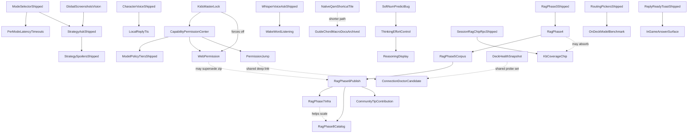

# bonsAI Roadmap

**Next:** [Bugs](#bugs) → [Verify](#verify) → lowest ★ in your lane.

Tracks open defects ([Bugs](#bugs)), on-Deck confirmation ([Verify](#verify)), and the themed backlog ([Backlog](#backlog)). Shipped work: [archive/roadmap-completed.md](archive/roadmap-completed.md) · fixed bugs: [archive/roadmap-bugs-fixed.md](archive/roadmap-bugs-fixed.md). Locked decisions: [audit/maintainer-decisions-locked.md](audit/maintainer-decisions-locked.md) (open **D18**; **D23–D25** locked 2026-08-21, **D26–D31** locked 2026-08-22). RAG session handoff: [audit/session-handoff-2026-08-21.md](audit/session-handoff-2026-08-21.md).

Setup: [troubleshooting.md](troubleshooting.md). QA: [testing.md](testing.md), [testing-manual.md](testing-manual.md). Release: [development.md](development.md), [CHANGELOG.md](../CHANGELOG.md).

Star ratings use the GTA scale: `★` easiest … `★★★★★` very high complexity; `★★★★★★` extreme scope. Within each list: **ascending stars**; ties alphabetical.

---

## Bugs (v0.5.0 fixes — LB/RB tab switch, thinking blurbs single-writer, streaming reveal tweaks, asked-entity extraction, KB phrase gate / D16, session RAG chip RPC, source attribution on chips, QAM row width, chat-slot persistence, soft num_predict → Verify, …)

Status tags: **OPEN** · **PARTIAL**. Fixed entries move to [archive/roadmap-bugs-fixed.md](archive/roadmap-bugs-fixed.md) with their QA row in [Verify](#verify) — nothing marked FIXED stays in this list. Last checked against the code **2026-08-17**.

- ★★ **Ordinary phrases attach game cards** — **PARTIAL, D28 option 2 implemented 2026-08-23.** With a game running in Strategy mode, questions unrelated to the game still get cards stapled on: *"one sentence"* → Praetorian, *"thank you very much"* → Nitra, *"what time is it"* and *"please repeat that"* → three cards each (Deck, corpus `2026.08.22`, DRG Survivor running). This is the regression direction **KB-SPELLING-01** says must not happen, but **not for the reason that row predicts** — the British-spelling exemption set is innocent, the query is not expanded and the card scores `bm25=0.00`. Hybrid on/off splits the blame: the new vector recall pass (`bf16b35`) supplies the card alone for two of the four, while the other two attach on the keyword half by itself — so the Strategy explicit-route floor of **1.0** is the underlying cause and the vector recall widens it. Invisible to `kb_eval_v2`, because every approved question is a real question about a real game. **[D28](audit/maintainer-decisions-locked.md#d28--ordinary-phrases-attach-game-cards-how-hard-should-the-floor-be) locked 2026-08-22: option 2 — give the vector half its own floor, separate from BM25's.** The precondition cleared the same morning (D23 landed in `e606b82`), so the floor is tuned once against one baseline. `BM25_RELEVANCE_FLOOR` stays at 1.0 as instructed (raising it pushes against D25).
  - **Implemented 2026-08-23:** `VECTOR_RECALL_FLOOR` raised `py_modules/backend/services/knowledge_base_service.py:148` from 0.50 to 0.515, against a fresh local repro (real `nomic-embed-text` via a local Ollama, real seed cards for the six phrases and the seven `V2-PARA-*` strategy rows in `kb_eval_v2.json` — script not committed). The two ranges overlap (noise up to 0.5308, a genuine paraphrase hit as low as 0.4302), so no single floor separates them cleanly; 0.515 was chosen to sit just above "one sentence"'s noise score (0.5034) and just below the lowest genuine score this change must not break (Mind Flayer / `V2-PARA-S04`, 0.5169).
  - **Re-measured all six phrases end-to-end** through `retrieve_knowledge_context` against the real test corpus (`build/knowledge-base-test/corpus.db`, real embeddings, real local Ollama for the query) rather than eyeballed:

    | Phrase | Before | After |
    |---|---|---|
    | "one sentence" | Praetorian | clean (genre fallback only) |
    | "please repeat that" | Glyphid Dreadnought, Nitra, Dreadnought Twins | Glyphid Dreadnought only |
    | "thank you very much" | Nitra | **unchanged — Nitra still attaches** |
    | "what time is it" | Glyphid Dreadnought, Praetorian, Classes | **unchanged — all three still attach** |
    | "our team" | clean (genre fallback only) | unchanged |
    | "four hours" | clean (genre fallback only) | unchanged |

    Matches D28's own prediction exactly: the two BM25-driven phrases are untouched (fixing them would mean touching `BM25_RELEVANCE_FLOOR`, out of scope here), "one sentence" is fully clean, and "please repeat that" is reduced but not clean. **Still OPEN, re-scoped to the two BM25-driven phrases and the residual `Glyphid Dreadnought` on "please repeat that"** — a keyword-side fix is a separate decision.
- ★★ **D-pad cannot reach the spoiler reveal — recurring, and the recurrence is the bug** — **OPEN, re-reported 2026-08-22 with a recording** (`recordings/DeckRecord_20260822_165441_game.mkv`, Deep Rock Galactic: Survivor, corpus `2026.08.22`). The *Spoiler — tap to show* block never takes a focus ring on any D-pad path in 18 seconds of navigation; the only way to open it is the touchscreen. **This has been fixed and has come back before**, which is why the maintainer asked for a permanent fix rather than another patch — treat the reproduction as secondary and the *reason it keeps regressing* as the actual work. **What the machinery already looks like:** the fence is a real `Focusable` with `onActivate` and an `isOkDeckButtonEvent` guard ([MainTabBonsaiAiMarkdownChunk.tsx:120-145](../src/components/MainTabBonsaiAiMarkdownChunk.tsx#L120-L145)) and it registers itself into a dedicated registry (`spoilerFenceRegistry`) consumed by `answerBubbleNavigation.ts`, so this is **not** a missing-Focusable bug — something upstream is not routing to the registry, or is de-registering early. **Do not fix this from the screen.** The existing note under *Focus / D-pad* already records why it keeps escaping review: *"cross-file nested `Focusable` (spoiler fence) not visible to per-file static analysis"* (2026-08-04) — so any fix that is not accompanied by a check that runs in CI will regress again. **Deep research owed** before touching it: who owns focus order inside an answer bubble, why the registry is bypassed, and what test could have caught each past regression.
- ★★ **Focus inside the answer bubble lands on text that does nothing** — **OPEN, found 2026-08-22** from the same recording. Stepping the D-pad through a finished reply parks the focus ring on non-interactive prose — the *"Here's the lowdown:"* line inside the answer, and the raw JSON block under *Full transparency snapshot* — before reaching real controls. Two consequences: the user presses A on something inert and nothing happens, and the reachable-control count is inflated so a genuinely unreachable control (the spoiler fence above) looks like it is merely further down the list. Likely `answerStopRegistry` creating stops on text nodes; that file's own header says it handles stops *"other than the masked-spoiler diversion, which stays in `spolierFenceRegistry` and runs first"* — worth checking whether "runs first" still holds. **Research alongside the spoiler bug — same subsystem, and a fix to either can move the other.**
- ★★ **Chip carousel is a one-way trip — no way back from 6 of 6** — **OPEN, found 2026-08-22** (recording as above; *Chip 6 of 6* is on screen for most of it). Once the carousel reaches the last chip there is no D-pad path back through the earlier chips, so a chip you scrolled past is gone for the rest of the session. Compounding it, **D-pad Up from *Show diagnostics* jumps to *Hide details*** rather than to the control directly above, so the chip row is skipped entirely on the way back up. **This directly blocks QA:** the guaranteed-corpus-chip and *Tip*-badge checks in **PHASE4-CHIPS-01** require watching the pool cycle, and a pool that cannot be re-entered cannot be watched. Related to the frozen-test-chip work below, which would make chip QA deterministic rather than a rotation you have to catch.
- ★★★ **24 maintainer-written cards claimed `wiki_verified` — the strongest trust tier, with no wiki behind them** — **FIXED 2026-08-22, same day; QA-TRUST-TIER-01 Open on-Deck.** on device (`recordings/DeckRecord_20260822_17*_game.mkv`; *Show details → Local knowledge base* reads **Trust tier: wiki_verified** on every Deep Rock Survivor Ask). **The cards have no source at all:** `Exploder`, `Red Sugar` and `Dreadnought Twins` are all `source_url = ''`, `source_license = bonsAI-maintainer`. **Cause is a one-line ordering fault** — [`_trust_tier_for_row`](../py_modules/backend/services/knowledge_base_service.py#L598) tests `source_version` **before** `source_url`, and these cards carry `source_version = "seed-1.1"`, which is a *seed build tag*, not a wiki revision. So a card with no URL and a build tag outranks a real wiki card that lacks a revision. **Scope: 24 of the 74 maintainer-authored sections, across 9 titles** (`seed-1.0` and `seed-1.1`) — and it lands hardest on the **Phase 4 cards just published in `2026.08.22`**, 17 of the 24 being the new Deep Rock and Ocarina enemy/item/boss cards. **Why it matters more than a label:** the tier is stated to the *model* as well as the user ([ollama_prompts.py:1087](../py_modules/backend/services/ollama_prompts.py#L1087)), so the model is being told to trust unsourced advice as wiki-verified, and the block header takes the **weakest** tier present precisely so it cannot overstate its contents — that guard is being defeated one level down. Contrast Ocarina's older cards, which correctly read `fallback_no_source`. **Fixed by requiring the URL first** — both wiki tiers now demand a `source_url`, which is what the tier names always meant, and is what the compat sibling `_trust_tier_for_compat_row` already did (the sections path was the outlier, not the convention). **Measured against the real corpus before and after:** 74 maintainer cards now read `fallback_no_source` (24 of them were `wiki_verified`), and all **59** genuinely wiki-sourced cards are **unchanged** at `wiki_no_patch`. `wiki_verified` is now unclaimed by any card, which is correct and what `ATTRIBUTIONS.md` already told users: wiki cards are *"marked `wiki` rather than `wiki_verified`: we know which wiki and when, but not which game patch."* Behaviour now matches the documented intent. **No corpus re-publish needed** — the tier is derived at query time, so the fix reaches the already-installed `2026.08.22` corpus. Derivation had **no test at all** before this; 4 added in `test_knowledge_base_service.py`.
- ★ **Question Overlay Alignment Drift** — **OPEN.** 3-line question overlay has minor horizontal spacing mismatch vs native `TextField` internals. **Second symptom captured 2026-08-22** (`screenshots/DeckCapture_20260822_164957_game.png`, red arrow): in the empty Ask field the **caret sits left of where the placeholder text begins** — it renders immediately after the AI-character avatar, with a visible gap before *"Describe the level, boss, or puzzle you're stuck on."* — so the caret does not mark where typing will actually start. Probably the same root cause as this row and as **ASK-CARET-CHAR-01** in [testing.md](testing.md) (caret behaviour with the AI character avatar present, which is exactly the configuration in the capture); check whether all three are one bug before fixing them separately. Per [design-language.md](design-language.md), measure on device — a screenshot cannot show which element owns the offset.
- ★ **`KB-NEWTITLE-01` is used as the ID for two different QA rows** — **OPEN, found 2026-08-22; decision locked same day as [D30](audit/maintainer-decisions-locked.md#d30--which-of-the-two-kb-newtitle-01-rows-keeps-the-id).** In [testing.md](testing.md), *"KB reaches a title named in the question (D19)"* and *"Every corpus title has cards"* both carry `KB-NEWTITLE-01`. They test different things. **The call:** the D19 row keeps the ID; *Every corpus title has cards* becomes **`KB-COVERAGE-ALL-01`** — it is cited nowhere outside its own table row, so the rename breaks no live reference. Fix the stale "119 sections" in that row in the same edit (it is **133** as of corpus `2026.08.22`).
- ★ **Two different decisions are both filed as D19** — **OPEN, found 2026-08-18; decision locked 2026-08-22 as [D31](audit/maintainer-decisions-locked.md#d31--which-of-the-two-d19s-keeps-the-number): the live one keeps D19, the superseded corpus-licence one becomes D19b.** [maintainer-decisions-locked.md](audit/maintainer-decisions-locked.md) uses **D19** twice: the corpus licence question (*mixed CC BY / BY-SA in one file*, superseded by D20 on 2026-08-14) and *Can you reach the strategy corpus without the game running?* (locked 2026-08-17). A reference reading "see D19" is ambiguous, and the live one is cited by the ★★ *You cannot ask about a game unless it is running* bug — so the risk is implementing against the wrong lock. **Not fixed in passing on purpose:** renaming either breaks references in roadmap.md, the bug list and the decision file's own index, so it is a maintainer call which number moves. A collision note is in place meanwhile. Prior art for the hazard: D21 carries its own numbering note because commit `e049ace` cited it as D18.
- ★★ **The spoiler fence on a no-story game is question-dependent, and it now lands mid-reply** — **OPEN, found 2026-08-22** across one screenshot and three recordings, all Deep Rock Galactic: Survivor, Strategy mode, corpus `2026.08.22`, same session and same model (`gemma4:e2b-it-qat`). Distinct from the false-positive row below, which is about the fence appearing at all; this is about **when** it appears and **where** it lands, and the two observations point away from "the model is just flaky".
  - **It tracks the question, not the turn.** *"how do i deal with the exploders"* fenced on **both** captures — `DeckCapture_20260822_164957_game.png` and `DeckRecord_20260822_172630_game.mkv`, two independent generations with visibly different wording. *"what is red sugar for"* (`DeckRecord_20260822_173005`) and *"how do i beat the twins"* (`DeckRecord_20260822_172800`) fenced on **neither**. Two samples of one question is not proof, but a per-question correlation is a far more tractable bug than per-turn randomness, and it is the first thing to test: **re-run each of the three questions several times and record the fence rate per question before touching any code.** If it holds, the cause is in what that question retrieves or how its entity is resolved, not in model temperature.
  - **A lead on why that question and not the others.** The three cards differ by `section_type` — `Exploder` is **enemy**, `Red Sugar` is **item**, `Dreadnought Twins` is **boss**. The low-risk addendum's wording only names *"boss and elite enemy names"* and *"boss/enemy guidance"* ([ollama_prompts.py:261-300](../py_modules/backend/services/ollama_prompts.py#L261-L300)), and the named-entity discount runs through `_ENTITY_FILLER`, which drops words like *"boss"* and *"the boss"* but has no equivalent handling for a plural common noun like *"exploders"*. Worth checking whether `asked_entity` resolves for *twins* and *red sugar* but not for *exploders*, which would explain the split exactly.
  - **The placement changed, and that part is genuine variance.** In the earlier screenshot the fence sat at the **end** of the reply; in the recording the same question put it **in the middle**, between the opening line and *"Here's the lowdown:"*, splitting the answer in half. Mid-reply is materially worse than trailing — it interrupts the thing the user is reading mid-fight, which is the exact scenario Phase 4 track 2 restructured these cards for. Check whether this followed the 2026-08-15 `prepareStreamMarkdown` / `unwrapOpenSpoilerFence` change, since that is the most recent thing to touch where a fence is recognised during streaming. **Cross-title placement data, same evening** (`recordings/DeckRecord_20260822_195545/200257/200436/201647_game.mkv`): on Ship of Harkinian the fence landed **mid-reply** on the water-temple-boss and sink-underwater asks, at the **very top** of the reply on the bottles ask (before any prose at all), and on Fallout 4 it trailed at the **end** — all three positions in one session, same model. Those titles fence by design (`protect_progression` / narrative), so they say nothing about the false positive; they make the placement variance a cross-title fact rather than a Deep Rock quirk.
  - **Cheap mitigation while it is open:** `strategy_spoiler_masking_enabled` off in settings removes the fence for QA runs without a code change. Not a fix — it disables fencing everywhere, including the titles that need it.
  - **The lead is confirmed, at the desk, 2026-08-22 — `asked_entity` is empty for exactly the question that fenced.** Run against `extract_strategy_asked_entity` with the three card names passed as `known_entities`: *exploders* → `''`, *red sugar* → `'Red Sugar'`, *twins* → `'twins'`. A 3-of-3 match with what was observed on device, and it needs no hardware to reproduce. **Two independent gaps produce the miss, and both must be fixed or neither helps:** *"deal with"* is not in `_ENTITY_VERB_FIRST_PATTERNS` (which carries `beat|defeat|kill|fight|survive|use|counter|play as`), and `_match_known_entity` is word-boundary exact, so the card *Exploder* does not match the plural *exploders* — confirmed by the singular form resolving correctly.
  - **What the empty entity actually costs, and it is bigger than the discount.** [`_strategy_spoiler_low_risk_addendum`](../py_modules/backend/services/ollama_prompts.py#L261-L305) has three arms. With an entity it says *"do NOT wrap ... in `bonsai-spoiler` fences"*; with `kb_entity_match` it says *"do NOT fence KB-backed boss/enemy guidance"*; with neither it says only *"boss and elite enemy names are not narrative spoilers — keep mechanical coaching visible."* **The third arm is the only one carrying no explicit negative instruction.** And the second arm cannot rescue the first, because `kb_text_covers_asked_entity` returns `False` on an empty entity before it looks at the cards at all — so one extraction miss knocks out *both* arms that tell the model not to fence, with the Exploder card sitting in the prompt unused. **The title-level fact is the stronger one and is not being used:** the game is already known to be `low_narrative`, which is a better reason not to fence than knowing what was asked. **Fix lean: give the third arm the same explicit instruction**, and treat the two extraction gaps as a separate, smaller improvement — that way the fix does not depend on entity extraction succeeding for every phrasing a player might use.
  - **This bug is two bugs, and they belong in different places.** *When* the fence appears is backend prompt wording, traced above, and needs no device. *Where* it lands — mid-reply rather than trailing — is unexplained and is about how a reply is segmented, so it sits with the answer-bubble focus bugs above: the fence is a focus stop as well as a render decision, and `prepareStreamMarkdown` decides both. **The fence-rate-per-question measurement is now optional for the first half and still worth running for the second.**

- ★ **Strategy spoiler false-positive** — **PARTIAL.** Options 1+2+4 landed 2026-08-07. **Fixed 2026-08-15:** the mid-stream mask chip (R4) no longer flashes for a fence the turn already qualifies to unwrap — `prepareStreamMarkdown` now accepts an `unwrapOpenSpoilerFence` callback built from the same eligibility gate as the closed-fence unwrap, so a qualifying fence streams as prose from the first token instead of masking until it closes. **STRAT-SPOIL-DRG-01** on Deck remains — only the three ship-gate rows (DRG-01, DRG-01d, DRG-01b/c). **Reproduced on device 2026-08-22** (`screenshots/DeckCapture_20260822_164957_game.png`, corpus `2026.08.22`): *"how do i deal with the exploders"* on Deep Rock Galactic: Survivor came back with a *Spoiler — tap to show* block. **The classification is not the fault** — DRG is correctly `low_narrative` in both languages ([spoiler_title_profiles.py:18](../py_modules/backend/services/spoiler_title_profiles.py#L18)), and the prompt correctly carries the low-risk addendum telling the model *not* to fence routine boss/enemy guidance ([ollama_prompts.py:261-300](../py_modules/backend/services/ollama_prompts.py#L261-L300)). **The model fenced anyway.** So the real finding is that fencing on a low-narrative title is enforced only by asking the model nicely, with no post-check on the way out — and a survivor-style roguelike with no campaign is the clearest case where a fence is simply wrong. **Deep research owed:** whether a low-narrative title should strip `bonsai-spoiler` fences programmatically after generation rather than trusting prompt compliance, and what that costs on the titles where fencing is load-bearing. **See also the entry above** (2026-08-22): the fence appears to be **question-dependent** rather than random, and has started landing mid-reply — establish that before deciding whether stripping is the right fix, because a per-question cause would not need stripping at all. Detail: [04-strategy-spoiler-false-positive.md](planning/04-strategy-spoiler-false-positive.md), [spoiler-constitution.md](planning/spoiler-constitution.md).
- ★★ **Focus ring consistency** — **PARTIAL.** `BonsaiModalScope` on portalled modals shipped; blanket `button.gpfocus` rule reverted (native Steam outline preferred). **Fix lean:** modal CSS reach + real `Focusable`s — see [gamepadAndPullModels.ts](../src/styles/sections/gamepadAndPullModels.ts).
- ★★ **Session context strip never lists archived turns** — **OPEN, found 2026-08-17.** `SessionContextStrip` builds its rows from `archivedTurns.filter((t) => t.transparency && …)` ([SessionContextStrip.tsx:50](../src/components/SessionContextStrip.tsx)), but slot-restored turns always carry `transparency: null` — [chatSlotTurns.ts:28](../src/utils/chatSlotTurns.ts) hardcodes it, because the Python slot store persists no snapshot. So the strip reads *"Session context (1 turn)"* however many times you have asked, and every turn but the live one is invisible to it. Same root cause as the Show details regression fixed the same day. **Fix lean:** persist transparency snapshots in [chat_slot_service.py](../py_modules/backend/services/chat_slot_service.py) — a frontend-only borrow can reach the newest turn but never the ones before it.
- ★★ **"Running game could not be matched" claims a game is running when none is** — **OPEN, found 2026-08-17.** `kb_coverage_chip_label` maps both `no_sections` and `app_unresolved` to `KB: none for this game` ([transparency_service.py:209](../py_modules/backend/services/transparency_service.py)), and the Show details bullet reads *"Running game could not be matched to corpus entries."* With **no game running at all** that sentence asserts something false and sends the reader looking for a matching failure that did not happen. Copy fix; the status split may need a fourth state.
- ★★ **Fullscreen pickers return you to the right tab, but not to the right control** — **PARTIAL (1/3 on-Deck).** `modalReturnFocusRegistry` shipped; Models hub → Ollama and desktop-note → Main land on tab strip. **PICKER-FOCUS-01**; next step is instrumentation, not another guess.
- ★★ **Live Ask user bubble shows "…" after reopen** — **OPEN. Hypothesis corrected 2026-08-17 by code check — it is not a session-survival loss.** `askThreadDisplayQuestion` *is* carried end to end by the survival snapshot: declared at [bonsaiSessionSurvival.ts:44](../src/utils/bonsaiSessionSurvival.ts), written at [index.tsx:707](../src/index.tsx), restored at [useBonsaiAskOrchestration.ts:1292](../src/hooks/useBonsaiAskOrchestration.ts) and again as the `useState` initialiser at `:224`. So a plain QAM close/reopen should keep it. **The mechanism that does explain "answer intact, question blank" is the backend rehydration path**, which is the only source that outlives the in-memory snapshot (a Steam restart): `get_background_game_ai_status` ([main.py:2729](../main.py)) returns `response` / `partial_response` and **no `question` key at all** ([main.py:2441](../main.py) writes the terminal state), and the poll handler at [useBonsaiAskOrchestration.ts:510-518](../src/hooks/useBonsaiAskOrchestration.ts) calls `setOllamaResponse(...)` without ever calling `setAskThreadDisplayQuestion(...)`. The answer therefore comes back and the question cannot. It then renders as `…` because the live-turn header has no fallback — [MainTabChatTranscript.tsx:381](../src/components/MainTabChatTranscript.tsx) is `buildCollapsedTurnTitle(liveQuestion) || "…"`, while the same file's collapsed-turn label at `:697` does fall back through `lastExchange?.question`, and `showLiveTurn` at `:198` is true on the response alone. **Fix lean:** carry `question` in the background-Ask state and restore it in the poll (the durable fix); the header fallback at `:381` is a one-line mitigation that stops the `…` but still shows the wrong question if `lastExchange` is stale. **Reproduced on-Deck 2026-08-22** (`recordings/DeckRecord_20260822_200436_game.mkv`): QAM closed and reopened while the Ask was still in the **thinking phase** — the answer completed after reopen but the user bubble read `…`, confirming the background-rehydration path fires on a plain reopen whenever the Ask was still in flight (the survival snapshot only covers a question whose exchange already exists). The feedback row (*Was this helpful?*) appearing under the restored reply is **not** normal — see the *Feedback and Retry are unreachable after a normal Ask* entry below: the rehydrated path is the only path that ever shows it, which is how the maintainer spotted that it is missing everywhere else. **Follow-on symptom on the next Ask** (`recordings/DeckRecord_20260822_201647_game.mkv`): the new question *what should i keep in my bottles* rendered **twice**, as two identical stacked user bubbles, from the first frame of the Ask — consistent with the turn that lost its question falling back through `lastExchange?.question` and wearing the next ask's text, exactly the stale-fallback hazard this entry names. Verify against the `:697` fallback chain when fixing; the duplicate is likely the same fix, not a second bug.
- ★★ **Live-turn transparency UI missing after successful Ask** — **OPEN, but the premise is now doubtful — retest before spending on it.** Filed as a blocker for **CONTEXT-LADDER-01**; on 2026-08-16 (build `6329577`, corpus `2026.08.16`) a live-turn **Show details** rendered the chip ladder cleanly on a Portal 2 Strategy Ask — 6 chips, no wrap fault, screenshot `DeckCapture_20260816_233808_game` — which is the opposite of this report. testing.md records that as "the CONTEXT-LADDER-01 blocker did not materialise" on the **KB-COVERAGE-01** row. Either it was fixed in passing or the original was environment-specific. **Next step: re-run CONTEXT-LADDER-01 on Deck and either close this or capture the conditions that reproduce it** — do not re-open an investigation on the old description.
- ★★ **Main tab answer D-pad scroll choppy / multi-line jumps** — **OPEN — re-measure first.** Phase B (2026-08-07) made every answer section a D-pad stop; scroll-step is fallback only. **STREAM-09**, **D-PAD-SCROLL-02** in [testing-manual.md](testing-manual.md).
- ★★ **Feedback and Retry are unreachable after a normal Ask** — **OPEN, found 2026-08-23 by the maintainer** (screenshot `DeckCapture_20260822_231338_game.png`: completed *what time is it* Ask on Left 4 Dead 2 shows *Show details* and diagnostics but no thumbs row). The *Was this helpful?* row, **Retry**, and the refinement chips render only when the **live** turn is the expanded one ([MainTabChatTranscript.tsx:576-585](../src/components/MainTabChatTranscript.tsx#L576-L585)), and the archived-turn branch passes `showFeedback: false` with no `onRetry` on purpose ([MainTabChatTranscript.tsx:397](../src/components/MainTabChatTranscript.tsx#L397) — "Feedback, Retry and refinement chips stay live-only"). But after every completed Ask the slot reload finds no pending question and expands the **newest archived turn**, not live ([useChatSlots.ts:57](../src/hooks/useChatSlots.ts#L57)) — so on the normal path the whole action row is dead code. **The one path that shows it is itself a bug:** the background-rehydration reopen (the `…` entry above) restores the answer into live state without the archive-and-swap, which is why thumbs appeared only after closing the QAM mid-thinking (`DeckRecord_20260822_200436_game.mkv`). Same family as the 2026-08-17 *Show details* regression, which was fixed by teaching the archived branch to render that one control — feedback, Retry and the chips were left behind. **Fix lean:** either wire feedback/Retry through the newest archived turn (rating must land on the exchange it belongs to), or keep the live turn expanded after completion; pick one, do not split the difference per control again.
- ★★ **Token streaming reveal is chunky under game load** — **OPEN, measured 2026-08-22.** STREAM-REVEAL-01 (2026-08-04) measured the reveal *smooth* on Deck and downgraded risk R3 in [05-token-streaming-review.md](planning/05-token-streaming-review.md), but that run left **STREAM-11** open: frame cost under game load unverified. New capture with Ship of Harkinian running (`recordings/DeckRecord_20260822_201647_game.mkv`, *what should i keep in my bottles*, `gemma4:e2b-it-qat`, streaming on): `freezedetect` over the answer region shows the text **fully static for stretches of 3.2s, 2.3s, 2.1s, 3.9s and 3.7s** during the first ~18s of streaming, with visible updates only in brief bursts between them — the opposite of the designed drip (backend flush 120ms, frontend poll 150ms, RAF reveal). The final ~10s update every 0.3–1s, so cadence improves as generation goes on. **The video cannot separate token arrival from render:** gaps this long mean either Ollama produced nothing for seconds under GPU contention with the game, or the poll/reveal pipeline stalled after catching up. **Next step is instrumentation, not code:** log poll-delivery timestamps and reveal-paint timestamps on-Deck under game load and diff the two series — whichever side owns the gaps owns the bug. STREAM-REVEAL-01's smooth result stands only for the idle-Deck case and must not be cited against this.
- ★★ **Model routing try-order modal focus + chrome** — **OPEN (deferred polish).** `ModelRoutingOrderModal` D-pad lands on leaf Up/Down; chrome mismatches other fullscreen pickers. Screenshot `DeckCapture_20260730_144925`.
- ★★ **No destructive-advice guardrail (compatdata / prefix deletes)** — **OPEN.** No production *output-side* guardrail against reckless compatdata deletes. One prompt-side mitigation exists and is easy to mistake for the fix — [ollama_prompts.py:926](../py_modules/backend/services/ollama_prompts.py) asks the model to flag irreversible actions (delete / wipe / format / remove prefix or compatdata) — but nothing inspects the reply, so a model that ignores the instruction is unguarded. **Fix lean:** output-side filter on Ask reply path — [12-deep-mod-ai-hints-feasibility.md](planning/12-deep-mod-ai-hints-feasibility.md) § 5.3.
- ★★ **Strategy live-turn D-pad graph skips branches/feedback** — **OPEN.** Verify **MICRO-04** on Deck.
- ★★★ **AppID collision: OoT/SoH seed row used the real Stardew Valley AppID** — fixed 2026-08-21; **KB-APPID-01** Open (on-Deck). `data/kb/strategy_seed.json` game_id 1 carried `app_id: "413150"`, which is Valve's actual Stardew Valley AppID. Reproduced before the fix: a Stardew Valley session asking *"how do i make more money on my farm"* attached **three Ocarina of Time cards**, and `resolve_title_spoiler_profile` returned `protect_progression` — so a Stardew player also inherited Zelda's progression fencing. The Phase 4 cards made it worse by eight cards before this was fixed. **The prerequisite the earlier note asked for already existed:** the name tables added for D19 on 2026-08-19 protect both *Ocarina of Time* and *Ship of Harkinian* without an AppID, so removing 413150 costs no fencing. Now `app_id: null` with `igdb_id: "emudeck-oot-n64"` — the same shape State of Emergency already used, and required by the schema's `app_id IS NOT NULL OR igdb_id IS NOT NULL` check — plus the canonical title added to the alias table so a running session still resolves by name. **The eval fixture was the one real blocker and measurement dissolved it:** the 13 `kb_eval_v2` rows keyed by the borrowed AppID became `shortcut` rows, and **every arm on every split scored identically to the decimal** before and after — keyword, vector-only, rerank-only and RRF, tune and holdout, compat and strategy. The rows test what they always tested. Four TypeScript tests used 413150 as a stand-in for *any* narrative title and were repointed to Red Dead Redemption 2; they kept passing after the change for the wrong reason, which is the failure mode CLAUDE.md rule 6 names.
- ★★★ **Character picker: focus ring invisible, D-pad does not move** — **OPEN (selection fixed).** Modal uses `querySelector` focus helpers — fix CSS reach first, then registered-owner pattern. Blocks AI-character on Deck. [CharacterPickerModal.tsx](../src/components/CharacterPickerModal.tsx).
- ★★★ **Fullscreen picker D-pad edge-escape (audit)** — **OPEN.** Audit Pull Models, Character picker, models hub, other `showModal` pickers for below-list / above-list escape.

---

## Verify (v0.5.0 QA owed — CHAT-SLOTS-V2, ASK-WIDTH-01, Wave 1 voice/icon/thinking rows, STREAM-09, SHELL-PAYLOAD-01, KB-ROUTER-01 / KB-ASKMODE-01, …)

Code-fixed or shipped; on-Deck / qualitative QA still owed. Detail: [testing.md](testing.md), [testing-manual.md](testing-manual.md). Full writeups: [archive/roadmap-bugs-fixed.md](archive/roadmap-bugs-fixed.md).

**This list is a curated front page, not the QA queue.** [testing.md](testing.md) holds **92** rows, of which **13 are Verified** and 55 Open / 15 Partial (counted 2026-08-17). Work the rows below first because they carry the most recent fixes; when picking up anything else, read testing.md rather than assuming an absence here means coverage.

- ★ **A finished voice install survives "Clear all plugin data"** — **VOICE-CLEAR-01** Partial (backend verified; UI half open).
- ★ **Bonsai pot ~1px right of canopy (tab + plugin-list icon)** — fix landed 2026-08-07 (Wave 1 D); **BONSAI-ICON-GEOM-01**. [wave1.md](wave1.md).
- ★ **Developer toggle for "resume last tab" (D15 B)** — shipped 2026-08-04; **TAB-RESUME-MODE-01**, **TAB-RESUME-FOCUS-01** Open/Partial.
- ★ **Install voice engine button when already ready** — fix landed 2026-08-07 (Wave 1 B); **VOICE-REINSTALL-01**. [wave1.md](wave1.md).
- ★ **Rows span the QAM panel width** — bug **fixed 2026-08-16** (`0fcaf00`), measured on-Deck: unified host and Ask row `x=63.99 w=268.02` → `x=48 w=300`, 32px reclaimed. **ASK-WIDTH-01** still Open in testing.md — the *visual* walk was never run, only the probe. Confirm the three Main rows look flush and nothing overflows the 300px column. Writeup: [archive/roadmap-bugs-fixed.md](archive/roadmap-bugs-fixed.md); rule earned: [design-language.md](design-language.md) Rule 1.
- ★ **British spelling finds nothing** — fixed 2026-08-19; **KB-SPELLING-01** Open. `armour` returned nothing while `armor` returned the card. The query is now **widened, never rewritten** — both spellings go in and `_fts_match_query` ORs its tokens, so a British question reaches a US-spelled card and a card written in British English still reaches its own question; substituting one for the other would only move the blind spot. Suffix rules (`-our`/`-ise`/`-tre`/`-ence`/`-logue`/`-yse`) plus a word list where a rule would misfire, with an exemption set so *our* does not become *or* and *four hours* survives. No corpus rebuild. Caught two of my own tests, which had been written against `armoured` and no longer exercised the empty-keyword path they were testing — their questions moved, their assertions did not.
- ★ **You cannot ask for "the boss" — a card's type is not searchable** — fixed 2026-08-19; **KB-TYPE-01** Open. `sections_fts` indexes `(name, card)` only, so *"how do i beat the boss"* returned 0 candidates on a title whose boss card was right there, and the vector half did not rescue it. Fixed by **query-time type recall** (option b of the three in the original report): a generic type word pulls that game's cards of that type into the pool and marks them preferred, reusing the same flat `RRF_W_TOPIC` signal D22 introduced for compat. Chosen over indexing `section_type` in FTS because it needs no schema change and no corpus rebuild, so it reaches an already-installed corpus — and it is easy to reverse. Verified across three titles: DRG → Dreadnought, Hades → Theseus and Asterius, OoT → Volvagia/Gohma/Twinrova, and *"what dungeon should i do first"* → the dungeon card. Explicit route only, and a named card still outranks its own kind. **Narrowed 2026-08-19** once the Phase 4 cards took Ocarina of Time from three boss cards to six: the preference now applies only to kinds the keyword half missed entirely. `_sections_of_type` returns the game's first three cards of the kind **by section_id** — authoring order, no relevance in it — so preferring them unconditionally promoted an arbitrary slice over a real match. *"how do i beat the water temple boss"* returned Queen Gohma, Volvagia and Twinrova and dropped **Morpha**, whose card opens *"The Water Temple boss"*. Per kind rather than all-or-nothing, so a question naming two types can still rescue the half that found nothing. The rescue direction is unchanged and pinned by its own test. **Maintainer note:** this was one of the three options in the bug and you were mid-flight, so I took the reversible one; say the word if you want the FTS-index version instead.
- ★ **Static seed tells you to enable KB when it is already on** — fixed 2026-08-07 (Wave 2 F); **PRESET-KB-SEED-01**.
- ★ **Thinking blurb italicizes emojis** — fix landed 2026-08-07 (Wave 1 A); **THINKING-EMOJI-01**. [wave1.md](wave1.md).
- ★ **Thinking line vanishes mid-Ask (lazy status tag)** — fix landed 2026-08-08; **THINKING-SANITIZE-01**. [06-thinking-blurbs-review.md § 10.1](planning/06-thinking-blurbs-review.md#101-landed-2026-08-08--7-items-13).
- ★ **Token streaming stutters once at start** — fix landed 2026-08-07 (Phase A); **STREAM-REVEAL-01**. [05-token-streaming-review.md § 3.1](planning/05-token-streaming-review.md).
- ★ **VAC / `bonsai:vac-check` (Phase 1) — on-device QA** — implementation complete; finish **VAC-02…06** after Tier 0 **SMOKE-F** passes.
- ★ **~22% of Asks show bare emoji for every phase change** — fix landed 2026-08-08; **THINKING-EMOJI-CLUSTER-01**.
- ★★ **Asked-entity extraction (player typing patterns)** — fixed 2026-08-09; **STRAT-ENTITY-01**.
- ★★ **You cannot ask about a game unless it is running** — fixed 2026-08-19 (**D19**); **KB-NEWTITLE-01** Open on-Deck. `resolve_title_from_question` scans the question against the alias table as a last resort, only when Steam supplies neither an AppID nor a name, so a running game always wins. Longest alias wins, word boundaries, 3-character minimum. Verified locally: *hl2 ravenholm* → Ravenholm, *drg survivor what class* → Classes, *how do gels work in portal 2* → Gels, *what is the best way to beat volvagia in oot* → Volvagia. **Two things the fix turned up:** a canonical title carrying punctuation (*The Legend of Zelda: Ocarina of Time*) never matched its own normalised form, so OoT resolved to nothing and fell through to the genre card; and the spoiler profile was unreachable by name, which D19 explicitly rules out — the name tables now carry the same two profiles in **both languages**, moved together with `tests/contracts/spoiler-title-profiles.json` (that contract caught the change, as designed). **On-Deck still owes** the negative direction: with a game running, a question naming a different title must still answer about the running game.
- ★★ **Device QA — Tier 0–1** — execute Tier 0 smokes (SMOKE-A, C, F) then Tier 1 (SMOKE-B, E, H); update coverage with Pass / Partial / Fail + build id.
- ★★ **Expert mode attaches fewer knowledge cards than Strategy** — fixed 2026-08-18; **KB-EXPERT-01** Open, and it re-opens **KB-ASKMODE-01** for a re-run. The route flag asked for Strategy *by name* (`!= "strategy"`), so Expert carried the largest card budget (5) and the strictest relevance floor (4.0 against 1.0) at once. Now keyed off `_DECLARED_GAME_ASK_MODES`, the one definition of "the user declared this Ask to be about the game" — which the vector recall pass reads too, so Expert gained both together. Reproduced on the seed corpus before the fix and measured after: DRG Survivor *"what class should i pick"* Strategy 2 / Expert **1 → 2**; *"what should i upgrade"* Strategy 3 / Expert **1 → 3**. **On-Deck still owes** the count check against a real corpus — note it cannot be read off the screen, the Show details ladder prints no card count; use `scripts/probe_deck_kb_retrieval.py`. Writeup: [archive/roadmap-bugs-fixed.md](archive/roadmap-bugs-fixed.md).
- ★★ **Compat retrieval returns a tip from the wrong topic** — fixed 2026-08-18 (**D22**); **KB-ROUTER-02** Open on-Deck. The D16 router worked out the topic and retrieval discarded it. **The bug report's premise was half wrong and the fix changed because of it:** the on-topic tips were not out-ranked, they were **absent** — 0 of 8 storage tips and 0 of 10 steam_input tips ever reached the candidate list, because the questions share no vocabulary with them. So the topic now opens a recall path first and acts as a preference second. All four KB-ROUTER-01 sentences return an on-topic tip first (was 1 of 4); compat tune top-3 81% → 100%, and 96% on a Deck with no embed model, since the fix does not depend on one. Weight is the weakest that works, and a test pins that a clearly better off-topic tip can still win — raise it and D22 stops holding. Measurement: [audit/rag-compat-topic-preference-2026-08-18.md](audit/rag-compat-topic-preference-2026-08-18.md).
- ★★ **KB compat retrieval phrase gate** — fixed 2026-08-06 (**D16**); **KB-ROUTER-01**. [audit/rag-pr2-signoff.md](audit/rag-pr2-signoff.md) § 2.
- ★★ **Named chat slots persist a turn** — bug **fixed 2026-08-16** (`d167f8e`); **CHAT-SLOTS-V2-01…06** all Open and **gated on one check first**: run a single Ask, then confirm (1) no `chat_slots: no slot for request_id=` line in the plugin log and (2) `/home/deck/homebrew/settings/bonsAI/chat_slots/` now exists holding `index.json` plus a slot file with **both** question and answer. Only then run 01…06 — before the fix a reopen test read as "empty thread" and pointed nowhere. Writeup: [archive/roadmap-bugs-fixed.md](archive/roadmap-bugs-fixed.md).
- ★★ **Prompt testing pass** — broader systematic validation beyond shipped prompt-testing MVP matrices.
- ★★ **Session context header is not D-pad focusable** — fixed 2026-08-04; confirm on-Deck.
- ★★ **Thinking blurbs — three writers disagree** — fix landed 2026-08-08; re-verify **THINKING-COPY-01**, **THINKING-SLOW-01**, **THINKING-LIVE-01**, **THINKING-SPOILER-01**. [06-thinking-blurbs-review.md § 10](planning/06-thinking-blurbs-review.md#10-implementation-log).
- ★★ **Wave 4 G slider direction handlers** — Deck-check: **ONBUTTONDOWN-AUDIT-01** (distinguish nothing happens vs double-step; cover Ollama keep-alive, Reply verbosity, Connection timeout sliders).
- ★★ **Your tab is not remembered when you leave and reopen** — **TAB-RESUME-01** Partial (tab + scroll restore; focus-after-reopen separate).
- ★★★ **D11 legacy-loader shim removal** — **D11-SHIM-01** Partial (RPC probe ok; Main-tab Ask UI pass open).
- ★★★ **KB coverage chip (Show details)** — shipped 2026-08-07 (Wave 3 I); **KB-COVERAGE-01 Partial.** On-Deck 2026-08-16 the live-turn ladder rendered and the chip read `KB: 9 sections` on a Portal 2 Strategy Ask. **Still open: the two negative cases** — KB off must read `KB: off`, and an uncovered title must read `KB: none for this game`. Distinct from the per-turn `kb` retrieval chip; this one is corpus honesty.
- ★★★ **KB download Cancel** — shipped 2026-08-05; **KB-CANCEL-01 — not testable as written, and that is the blocker.** Attempted on-Deck 2026-08-16 and abandoned: at 758502 bytes the whole download-decompress-install cycle takes **~0.9 s** (Deck log `Downloading…` 23:32:37.711 → `Knowledge base installed` 23:32:38.610), so there is no cancel window to press. What looked like a Cancel pass was the **storage picker** (`onPrimaryClick = installed ? runUpdate : openStoragePicker`, [KnowledgeBaseSection.tsx:527](../src/components/KnowledgeBaseSection.tsx)) — press one opens the internal/SD modal, press two starts the download. **To run this row at all the download has to be slowed** — throttle the link (`tc qdisc`), point the fetch at a stalled host, or add a dev-only delay. Until then the six frontend tests are the only coverage and the D-pad-reach half (the part unit tests cannot judge) is unproven.
- ★★★ **Kids master lock** — shipped 2026-08-09; on-Deck **KIDS-LOCK-01**, **KIDS-FOCUS-01**, **KIDS-REGRESS-01** (and **KIDS-LOCK-02** if child account) Open. Live CEF Stage 0 confirmation still owed.
- ★★★ **QAMP verification checklist** — per-game profile on/off, QAM Performance reopen, Steam restart/reboot, GPU-clock paths. [testing-manual.md](testing-manual.md) § QAMP.
- ★★★ **Soft** `num_predict` **+ thinking budget** — shipped 2026-08-10; **02 Verified, 01/03/04 Partial (automated, on-Deck confirm owed), 05 Open** (needs a real thinking model). Caps Speed 800 / Expert 1200 / Strategy 1600; soft continue on `done_reason=length` (max 2) with ephemeral **`Continuing…`**; C1 budgets in `ollama_ask_budgets.py` (`think: false` default). **Fixed 2026-08-15:** the cap table was keyed `deep` — the mode's pre-2026-06-26 name — so Expert silently ran on the Speed cap (800, not 1200) since the caps shipped; **EXPERT-CAP-01**. **Fixed 2026-08-15:** Stop landing within 120ms of the cue could persist `Continuing…` into the saved reply — `_update_partial_response`'s throttle dropped the cue-clear write; now a shrinking partial always bypasses the throttle, plus a client-side `stripSoftContinueCue` backstop. Unblocks **Thinking effort control**. Detail: [16-soft-num-predict-thinking-budget.md](planning/16-soft-num-predict-thinking-budget.md).
- ★★★ **Source attribution on knowledge chips** — shipped 2026-08-09; **KB-ATTRIB-01 Partial after on-Deck 2026-08-16 — one sub-check looks like a fail.** The positive case passes: a Portal 2 (`620`) Strategy Ask surfaced `theportalwiki.com · CC-BY-4.0 · as of 2026-08-09` under Show details with the card beneath it, credit accent on the block and a capture date that is not today's. **What did not pass:** the row requires the credit accent be *visibly distinct* from the amber an `open_weight` model chip uses, with both on screen — they were (`Routed gemma4:e2b-it-qat` four rows above), and in `DeckCapture_20260816_233808_game` **the two ambers read as the same colour**. Needs a maintainer eye on the panel and then most likely a token change in [design-tokens.md](design-tokens.md). Also still owed: the negative case (a maintainer-authored-only reply must show no accent and no credit block). **KB-ATTRIB-02** (published corpus ships `ATTRIBUTIONS.md`) is Verified on Deck.
- ★★★ **The eval harness scored every troubleshooting tip against the wrong vector** — fixed 2026-08-21. It kept **one** vector map keyed by `CorpusDoc.doc_id`, and `compat_patterns.pattern_id` and `sections.section_id` are independent sequences that both land in that field — so a section card's vector overwrote the tip's for every id in both tables, **122 of 124 tips** at the current corpus size. Production has never had this problem: it stores `section_vectors` and `compat_pattern_vectors` in separate tables. **Nothing that ships changed; what we could truthfully say about it did.** Corrected on the same corpus, tips only: vector-only top-3 **12.5% → 67.5%**, fusion **57.5% → 72.5%** against keyword's unchanged 65.0%. Across all labelled tuning rows, fusion top-3 **89.2% → 94.1%** against keyword's unchanged 88.2% — so the harness had been reporting that fusion barely beat keyword when it beats it by about six points. The `keyword` arm uses no vectors and is identical in both runs, which is what confirms the diagnosis. **The holdout ship gate is unchanged and still cannot separate the arms** (n=36, 83.3% both) — the correction did not buy a verdict. Prior reports carry a correction banner; [archive/research/kb-embed-bakeoff-2026-08-21-arms.md](archive/research/kb-embed-bakeoff-2026-08-21-arms.md) is the current one. **Does not disturb the compat recall decision taken 2026-08-18** — that was measured through the production service, not this harness.
- ★ **The eval harness's model sweep could not run at all** — fixed 2026-08-21. `_hybrid_retrieve` gained a required `with_recall` argument on 2026-08-18 and two of its four call sites were never updated — `_evaluate_model` and `_evaluate_spanish_probe` — so any run without `--arms-only` raised `TypeError` before scoring a single case. Three days of runs used `--arms-only`, which is why nothing noticed. The model sweep and the Spanish probe both work again and take the recall pass, so they measure the pipeline that ships. Found while re-scoring the corpus after the Phase 4 cards.
- ★★★ **Vector half of hybrid retrieval has its own recall pass** — fixed 2026-08-18; **KB-RECALL-01** Open (on-Deck), **KB-RECALL-02** Verified (PC). The vector half no longer re-orders a keyword shortlist — it searches the resolved game's sections itself and RRF fuses two real lists, so a card that shares no keyword with the question is reachable. On `kb_eval_v2` (98 labeled strategy rows) top-3 went **95.9% → 100.0%** with **zero** regressions; the four queries measured on Deck 2026-08-17 now attach. **What a Deck still has to answer:** the pass costs an embed round trip (793–900 ms on device, ~28 ms against a PC Ollama), and it is gated to the **explicit** route so an Ask that merely happened while a game was open pays nothing — confirm both halves of that on hardware. Floor is measured, not guessed, and the two distributions **overlap**: [audit/rag-vector-recall-floor-2026-08-18.md](audit/rag-vector-recall-floor-2026-08-18.md). Writeup: [archive/roadmap-bugs-fixed.md](archive/roadmap-bugs-fixed.md).
- ★★★★★ **Global quick-launch macro** — Guide-chord docs in [troubleshooting.md](troubleshooting.md) §5; verification checklist not run on hardware.
- **D-pad reachability sweep blind spot (2026-08-04)** — cross-file nested `Focusable` (spoiler fence) not visible to per-file static analysis; answer on-device per [testing-manual.md](testing-manual.md) focus rows.
- **Reply-language snapshot RPC (2026-08-03 fix)** — verified via `probe_deck_rpc_surface.py`; UI translation spot-check optional.
- **Session RAG / routing merge RPCs (2026-08-02)** — **SESSION-RAG-CHIPS-01** Verified; **ROUTING-MERGE-01** Open.
- **Shell state + tab payload extractions (step 8)** — **SHELL-PAYLOAD-01** Open. Smoke: six tabs, one Ask, Ollama tab after Clear all plugin data.
- **Token streaming Phase B — multi-stop navigation + scroll follow (2026-08-07)** — **STREAM-09**, **STREAM-FOLLOW-01** Open. [05-token-streaming-review.md § 3.2](planning/05-token-streaming-review.md).
- **Voice input `status()` missing (2026-08-03 fix)** — on-Deck retry of live recording still needed. [archive/roadmap-bugs-fixed.md](archive/roadmap-bugs-fixed.md).

---

<a id="planned"></a>

## Backlog

Stars are **effort/risk**. Grouped by **theme**; within each lane sorted ascending by ★.

**GitHub tracking:** Items rated **★★★★★** or **★★★★★★** include a placeholder link to **[bonsAI Issues](https://github.com/qd313/bonsAI/issues)** (replace with a specific issue URL when created).

### Ask / reply (v0.5.0 — token streaming live markdown, spoiler confidence chip, spoiler constitution runtime, thinking blurbs, reply-language / routing merge RPCs, Caveman reply style, …)

- ★ **Intent packs later review** (keep / quiet / Developer)
  - **Goal:** Decide whether quiet intent-pack search aliases should be deleted, left quiet, or revived under Developer.
  - **Not in scope:** re-shipping Proton journal inject without redesign.
- ★★ **Copy reply to clipboard** (reply micro-action)
  - **Goal:** One reply action copies visible answer text to host clipboard.
  - **Depends on:** shipped reply micro-actions + read clipboard pattern. Spike Wayland selection ownership first.
  - **Source:** [13-roadmap-feature-ideas.md](planning/13-roadmap-feature-ideas.md) A2.
- ★★ **Preset chip expansion** (incremental content)
  - **Goal:** Add or refresh preset strings as related features land. Wave 1 shipped four prompts; **PRESET-EXPAND-W1-01** open. [wave1.md](wave1.md).
  - **Not in scope:** replacing `fade` default animation; session RAG chips (shipped).
- ★★ **Thinking effort control** — **Phase 1 shipped 2026-08-15; Phase 2 Backlog**
  - **Phase 1 (shipped):** Ollama tab → **Thinking** row, Off / Brief / Balanced / Deep, defaulting **Off**. Sends `think: true` for all three on levels — named levels are gpt-oss-only and qwen3 / deepseek-r1 reject a string (**D21**, superseding doc 16) — with effort carried by the reserved budget (256 / 512 / 1024) added to `num_predict`. A model that cannot think gets one silent retry with thinking off, is remembered for the session, and the user is told once. On-Deck **THINK-EFFORT-04**, **THINK-EFFORT-05** Open.
  - **Phase 2 (Backlog):** Replace the cosmetic `<bonsai-status>` blurb outright with hand-curated bonsAI tips — feature tips ("Ask-mode Speed trims replies for a quick answer") for generic asks, KB-strategy tips ("A run spent only kiting is a run that ends underpowered") for game-specific asks, selected contextually by current game/mode. Not a fallback for otherwise-empty moments — the generic filler copy goes away entirely. Data file shaped like `data/kb/strategy_seed.json`.
  - **Not in scope:** Reply verbosity → token budgets; caveman / lowering `num_predict`; native gpt-oss levels (needs per-model capability detection — see D21).
  - **Related:** **Reasoning display** (below) — once raw `thinking` streams live, it takes over the slot Phase 2 tips otherwise fill.
- ★★ **Unfenced spoiler feedback** (thumbs-down category)
  - **Goal:** Thumbs-down refinement chip for unfenced spoilers (and optional over-fenced sibling).
  - **Depends on:** reply micro-actions; spoiler confidence chip (shipped).
  - **Related:** [spoiler-constitution.md](planning/spoiler-constitution.md).
- ★★ **User-adjustable spoiler fencing** (hide by risk band)
  - **Goal:** Settings control for tap-to-reveal / fence masking by estimated risk band.
  - **Depends on:** spoiler confidence chip; shipped `strategy_spoiler_masking_enabled`.
  - **Related:** [spoiler-constitution.md](planning/spoiler-constitution.md).
- ★★★ **Custom model in Pull Models picker** (custom pull + Ask pin + New badges)
  - **Goal:** Pull any valid Ollama-library tag; **Use for Ask** pin; **New** badge (≤30 days).
  - **Depends on:** shipped Pull Models picker + living overlay merge.
  - **Not in scope:** LAN/remote `ollama pull` (→ **LAN custom model pull**).
- ★★★ **Dynamic keep-alive / smart unload** (research spike)
  - **Goal:** Research-only: hold models loaded vs unload when a game takes focus on Deck APU? Spike decides go/no-go.
  - **Not in scope:** production unload before spike doc.
- ★★★ **Per-mode latency timeouts** (warn vs hard limit profiles)
  - **Goal:** Separate warning and timeout values per selected mode.
  - **Depends on:** Mode selector (shipped).
- ★★★★ **Connection doctor** (guided first-Ask repair — candidate)
  - **Status:** Candidate, not accepted — decide vs **Deck health snapshot** (shared probe set).
  - **Goal:** **Fix this** on Ask failure walks probes → one next action with Ollama-tab deep link.
  - **Source:** [13-roadmap-feature-ideas.md](planning/13-roadmap-feature-ideas.md) § B3.
- ★★★★ **LAN custom model pull** (remote host — decision review)
  - **Goal:** LAN Ask host: add/pull models not in catalog — blocked until mechanism chosen (R1–R4).
  - **Depends on:** **Custom model in Pull Models picker**.
- ★★★★ **Session context and user stash** (deck-first context)
  - **Goal:** Live session facts + user-editable stash notes for Ask; no embeddings/cloud.
  - **Not in scope:** vector DBs; cloud sync.
- ★★★★ **Speed-mode VRAM preload** (dev-toggle; keep a small model warm from boot)
  - **Goal:** On plugin/daemon boot, preload the user's default Ask model into VRAM so the first Ask of a session skips the cold-load penalty. Ships behind a developer toggle first; graduates to user-facing only after the suspend/resume question below is answered on-device.
  - **Model eligibility:** hard ceiling ≤3B params, but steered rather than merely gated — Pull Models picker surfaces vision/thinking-capable distilled models as "recommended for speed mode," and preload auto-substitutes the best shortlisted model if the user's chosen default doesn't qualify.
  - **Sits alongside, not instead of:** the existing Ollama-tab Unload-delay slider (`ollama_keep_alive`, [ollamaKeepAlive.ts](../src/data/ollamaKeepAlive.ts)) — that setting still governs how long a model lingers after use; this only changes when the *first* load happens.
  - **VRAM safety:** check pressure via existing TDP/telemetry chip data before every attempt; skip silently on pressure or an unreachable Ollama host, retry opportunistically next QAM open. No hard retry cap and no background polling — a skipped attempt costs nothing, so it can never contend with a running game.
  - **Open questions:** whether VRAM/model residency survives Deck suspend/resume — boot-only preload may need to also fire on wake — needs on-device research before this can leave the developer toggle.
  - **Related:** **Dynamic keep-alive / smart unload** (below) covers unloading on game focus, a separate question this feature doesn't answer.
- ★★★★★ **Deck health snapshot** (full diagnostics + Ollama)
  - **GitHub:** [bonsAI Issues](https://github.com/qd313/bonsAI/issues) — issue TBD.
  - **Goal:** Read-only diagnostics dump to Desktop; Magic Ask `bonsai:diagnostics`.
- ★★★★★ **Local reply TTS** (Phase 1–2 character voice)
  - **GitHub:** [bonsAI Issues](https://github.com/qd313/bonsAI/issues) — issue TBD.
  - **Goal:** Phase 1 offline TTS play/stop; Phase 2 character-aligned read-aloud (legal gate).
- ★★★★★ **Named chat slots** (labeled threads — redesign only)
  - **GitHub:** [bonsAI Issues](https://github.com/qd313/bonsAI/issues) — issue TBD.
  - **Goal:** Up to 5 named, persistent chats with Main-tab LB/RB carousel (option C). Do not re-ship old mini-list picker.
  - **Status:** Code landed 2026-08-09 (storage, RPC, row UI). **On-Deck QA open** — all **CHAT-SLOTS-V2-01…06** must pass before Completed. **P-0 bumper spike** result still pending on device ([major-redesign.md](major-redesign.md) § 7 R1).
  - **Unblocked 2026-08-16** (`d167f8e`). The data-loss bug that made all six rows unrunnable — every turn dropped before it reached `chat_slots/` — is fixed; run the one-Ask persistence check in [Verify](#verify) before starting 01…06.
  - **Design:** [major-redesign.md](major-redesign.md), [07-named-chat-slots-postmortem.md](planning/07-named-chat-slots-postmortem.md).
- ★★★★★ **On-Deck model benchmark** (measured routing order)
  - **GitHub:** [bonsAI Issues](https://github.com/qd313/bonsAI/issues) — issue TBD.
  - **Goal:** Rank installed models by measured speed/completion; offer as try order (with confirmation).
  - **Depends on:** shipped routing pickers; overlaps **Dynamic keep-alive** measurements.
  - **Source:** [13-roadmap-feature-ideas.md](planning/13-roadmap-feature-ideas.md) § C1.
- ★★★★★ **Reasoning display** (real model `thinking`, not the status blurb)
  - **GitHub:** [bonsAI Issues](https://github.com/qd313/bonsAI/issues) — issue TBD.
  - **Goal:** Read and stream the model's actual `thinking`/reasoning content from Ollama — never consumed today; the Ollama tab only sends the `think` boolean and spends a hidden budget, nothing reads `message.thinking` back. Renders inline with the reply (italic, muted, single-line-truncated while streaming), collapses to a "12s · 340 tokens" summary once the reply completes, expandable to the full transcript. New **thinking** transparency chip shows effort level + actual token spend alongside the existing model/kb chips in `ContextChipLadder`.
  - **No spoiler redaction inside the reasoning body** — the collapse/expand gesture is itself the consent fence, the same shape as an existing `` ```bonsai-spoiler `` fence ([spoilerFenceRegistry.ts](../src/utils/spoilerFenceRegistry.ts), [unwrapAskedEntitySpoilerFences.ts](../src/utils/unwrapAskedEntitySpoilerFences.ts)). A spoiler-risk caveat is instead surfaced once, as a dismissible notice the first time thinking-effort is turned on, plus an inline note on the first reasoning toggle a session sees.
  - **Persistence:** stored per-turn in chat-slot storage so archived/restored turns keep their reasoning text — closes part of the existing "Session context strip never lists archived turns" bug ([chat_slot_service.py](../py_modules/backend/services/chat_slot_service.py)).
  - **Spike required before build:** two open questions, either of which can fail without blocking the rest of the feature — (1) whether Ollama reasoning models interleave thinking with content per-paragraph, or emit one solid reasoning block before any content starts (decides whether **segmented per-paragraph reasoning** — a separate toggle under each paragraph rather than one end-of-turn block — is a real attribution or an approximate backend split of one block); (2) whether a single-line-truncated live display (cheap, current default design) or a bounded multi-line auto-scrolling pane (matches Claude/Cursor's live-thinking treatment, costs more of the 300px column) reads better once real local-model reasoning verbosity is seen on-device. If segmentation isn't feasible, falls back cleanly to the single end-of-turn block.
  - **Depends on:** Thinking effort control Phase 1 (shipped).

### Focus / Deck UI (v0.5.0 — LB/RB overflow clip, QAM ResizeObserver rebind, global document sweep, onButtonDown audit, ask-bar caret + avatar, permission jump, modal return-focus registry, …)

- ★★★ **Frozen test chips** (pin an exact QA question into the carousel) — **requested by the maintainer 2026-08-22, and the request is a standing working agreement, not just a feature.** See [CLAUDE.md](../CLAUDE.md) § Testing on the Deck.
  - **Goal:** Let a session pin a named set of exact questions as preset chips and **freeze them in
    the rotation**, so on-device QA is one press per case instead of thumb-typing a sentence into
    the on-screen keyboard. Cleared explicitly, not on the next reseed.
  - **Why it is worth building.** Every KB QA row quotes a verbatim sentence, and several are
    chosen precisely because of which words they do *not* contain — **KB-ROUTER-01**'s four
    sentences avoid "deck" and "proton" deliberately, so one stray word silently tests something
    else. `scripts/deck_send_ask.py` exists for this reason and only solves half of it: it types
    the question but will not press Ask, and it needs the QAM open on the right tab with an SSH
    session live. A frozen chip is reachable with the D-pad and survives a reseed.
  - **It also unblocks chip QA itself.** **PHASE4-CHIPS-01** has to watch a rotation to judge the
    guarantee and the **Tip** badge, and the carousel currently cannot be walked backwards (see
    Bugs) — a deterministic pinned set removes the timing problem entirely.
  - **What exists:** `dev_force_session_rag_chips` (boolean, Developer tab) forces corpus chips on,
    but there is **no way to pin specific chip text** — that is the gap. `sessionRagComposer.ts`
    already composes and reseeds the pool, so the freeze belongs there rather than in a new system.
  - **Shape:** a dev-only list of pinned questions in settings, consumed by the composer ahead of
    the normal pool, exempt from reseed, and visibly marked as test chips so a frozen set is never
    mistaken for real corpus output. Needs a focus-graph entry per CLAUDE.md.
  - **Confirmation is part of the design, not politeness:** the maintainer wants to approve the
    exact question set before it is pinned, because a wrong sentence invalidates the row it was
    meant to test.
- ★★ **Fold "Show diagnostics" into "Show details"** (one reply-inspection surface)
  - **Goal:** One place to inspect a reply. Today the panel carries **two** disclosure buttons doing
    the same job at different depths — **Show details** (the context chip ladder: retrieval method,
    coverage, trust tier, source credit) and **Show diagnostics** (`ask_diagnostics` raw JSON:
    models before/after policy, routing strategy, attachment counts). They sit adjacent, look alike,
    and neither name says which is which. It cost a QA cycle on 2026-08-17: the raw-JSON panel was
    opened while looking for the source-credit line, which only ever renders in the other one.
  - **Fix lean:** keep **Show details** as the single entry point and move the diagnostics JSON
    behind the existing **Developer details** chip already in the ladder — the ladder is the natural
    home for it, and that chip is already the "deeper than the chips" affordance. Then drop the
    second button. Gating stays as-is: diagnostics render only with desktop verbose logging on
    ([MainTabChatTranscript.tsx:651](../src/components/MainTabChatTranscript.tsx)).
  - **Watch for:** the diagnostics block owns a `registerNavFocus("ask-diagnostics", …)` entry and
    `focusDownFromReplyUtilityRow` falls through to it ([liveTurnFocusGraph.ts:221](../src/utils/liveTurnFocusGraph.ts)).
    Removing the button without updating that chain leaves a D-pad step pointing at nothing — the
    same class of gap that made the archived-turn Show details row unreachable the same day.
- ★★★ **Ghost in the Shell preset chip decode** (replaces the `stream` typewriter mode)
  - **Goal:** Replace the plain left-to-right typewriter on preset chips with the *Ghost in the
    Shell* title-sequence look: each chip arrives as a full-width block of scrambled green glyphs
    that resolve into the real prompt, character by character, behind a blinking block caret. It is
    a **replacement, not a fifth mode** — `stream` goes away, its slot in the mode list is taken by
    the new one.
  - **What exists today.** Mode `stream` (Wave 4 J) already owns the whole scaffold: the enum
    ([bonsaiSettingsSchema.ts:48](../src/data/bonsaiSettingsSchema.ts) plus
    `PRESET_CHIP_ANIMATION_OPTIONS` at `:253`), the Python allow-list
    `_VALID_PRESET_CHIP_ANIMATION` ([settings_service.py:129](../py_modules/backend/services/settings_service.py)),
    the Developer tab picker ([DeveloperTab.tsx:412](../src/components/DeveloperTab.tsx)), the caret
    CSS ([section-4.ts:93](../src/styles/sections/section-4.ts)), and the reveal loop
    `MainTabPresetStreamSlots` ([MainTabPresetAnimatedChips.tsx:217](../src/components/MainTabPresetAnimatedChips.tsx)).
    So this is a rewrite of one function plus a rename, not new plumbing.
  - **The effect, concretely.** Per slot: fill the label with a scrambled string **of the prompt's
    final length** from the first frame, then lock characters left to right at
    `PRESET_STREAM_CHAR_MS` (42ms today) while the unlocked tail keeps churning; caret sits at the
    lock boundary; hold for `holdMsForPresetText`, then the next prompt. Green comes from
    `--bonsai-ui-accent-main` (`BONSAI_FOREST_GREEN` `#2e8753`), never a hardcoded colour, per
    [design-language.md](design-language.md).
  - **Reserve the width from frame 0 — this is the point of the rewrite.** The chip label is
    `white-space: nowrap` + `text-overflow: ellipsis` ([section-4.ts:85](../src/styles/sections/section-4.ts)),
    and today's reveal grows the string one character at a time, so the chip reflows on every tick.
    Scrambling at final length ends that. It also means the churn glyphs must be **half-width** —
    ASCII plus half-width katakana (U+FF66–U+FF9D). Full-width CJK is double-width and would push a
    long prompt into the ellipsis mid-animation, changing which chip is truncated frame to frame.
  - **Watch the frame cost.** Today's loop fires one `setState` per character per slot; a churn
    effect fires one per *frame* per slot, three slots at once, on Deck hardware. Drive it from a
    single `requestAnimationFrame` loop writing one batched state object (or a ref plus direct
    `textContent`), not three independent timer chains — three React re-renders per frame in the
    300px QAM column is the failure mode to design out, not to discover on device.
  - **Rules that must survive the rewrite** (they are the `stream` QA row and each was earned):
    chips stay D-pad focusable while glyphs are still churning and **A selects the full prompt, not
    the partial** — easier here, since the real text is known from frame 0; and
    `prefers-reduced-motion: reduce` swaps instantly with no churn and no caret blink.
  - **Migration is the two-language half.** Dropping `"stream"` from the TS union and from
    `_VALID_PRESET_CHIP_ANIMATION` orphans any Deck whose `settings.json` already holds it. Map the
    old value to the new one in `sanitize_preset_chip_animation` rather than letting it fall through
    to the `fade` default — a silent downgrade to fade reads as "the setting reset itself". Python is
    authoritative here (**D13**), and both settings contracts
    (`tests/contracts/settings-defaults.json`, `settings-hostile-inputs.json`) need the new value.
  - **QA:** rewrite **PRESET-STREAM-ANIM-01** in [testing-manual.md](testing-manual.md) rather than
    adding a row — the old mode will not exist to test.
- ★★★ **Search density UX** (match emphasis + tighter rows)
  - **Goal:** Tighter, more scannable search results with highlighted match tokens.
- ★★★★ **SteamOS Share path** (capture → attach)
  - **Goal:** Faster path from SteamOS Share / capture flows into screenshot attach where APIs allow.
- ★★★★ **SteamOS spin hint card** (immutable spins)
  - **Goal:** Detection + deep link to troubleshooting for immutable spins.

### Knowledge base (v0.5.0 — hybrid RRF + schema v3, D16 topic router, D17 mode-independent game tips, 13-title / 119-card seed, wiki attribution, KB download Cancel, session RAG chips, hybrid kill-switch, …)

- ★★★ **DRG Survivor glossary terms** (tap-to-define jargon)
  - **Goal:** Curated glossary entries — starting with "kiting," already used undefined in the existing DRG Survivor card at `data/kb/strategy_seed.json:163` — back model prompt guidance so jargon gets defined without derailing the reply. Terms render as a tappable inline element: a floating tooltip above the term (not inline-push). D-pad focus alone shows a short peek (first few words, no action) before the user presses to open the full definition; dismiss via any D-pad direction or B. The full definition includes an **explain further** chip that auto-sends a new Ask turn about the term.
  - **Not in scope (for now):** general jargon-detection across every game's KB content — scoped to DRG Survivor only until this proves out.
  - **Depends on:** focus-graph entry for D-pad reachability (`.cursor/rules/decky-focus-graph.mdc`) — required before shipping, not optional polish.
- ★★ **Eval fixture cannot see a recall failure** (paraphrase rows)
  - **Goal:** `kb_eval_v2` has **1** labeled case out of 138 where keyword search returns nothing, so the slice that proves the vector half adds recall is a sample of one. Measured 2026-08-18 by the re-aligned harness. Add paraphrase rows — questions that ask for a card without using its words — until that slice can gate a regression.
  - **Starting material:** the 15 paraphrased questions in [audit/rag-vector-recall-floor-2026-08-18.md](audit/rag-vector-recall-floor-2026-08-18.md) are already written, measured and labelled with the card each one should return. `tests/fixtures/kb_eval_paraphrase_v0.json` (15 rows) exists but the arms run does not read it.
  - **Needs a maintainer call first:** the v2 fixture is approved and the PR2 bake-off was measured against it — new rows change what the numbers mean, so decide whether they join v2, form a v3, or stay a separate reported slice.
- ★★★ **KB visual maps** (strategy maps — later wave)
  - **Goal:** Optional visual strategy maps in KB-grounded replies after brief callout cards exist.
  - **Plan / depends on:** [17-kb-online-versus-strategy-content.md](planning/17-kb-online-versus-strategy-content.md) Stage 5; callout cards (OV-3.1). Phase 4 chip work remains orthogonal.
- ★★★★ **KB online / versus strategy content**
  - **Goal:** Online multiplayer strategy — versus, co-op, map callouts — new `section_type` values + spoiler table updates. Tier lists parked. Visual maps later wave in same plan.
  - **Plan:** [17-kb-online-versus-strategy-content.md](planning/17-kb-online-versus-strategy-content.md) (discovery locked 2026-08-09).
  - **Source policy:** WikiTeam / archive.org dumps only; hybrid attribution (short chip + snapshot in `ATTRIBUTIONS.md`).
- ★★★★ **RAG Deck query — corpus expansion (Phase 5)**
  - **Goal:** Corpus maturity after Phase 4 sample paths; session chip vector ranking.
  - **Status:** Seed deepening largely in remediation PR2; remainder depends Phase 4. [knowledge-base.md](knowledge-base.md) § Phase 5.
- ★★★★ **RAG Deck query — extended retrieval (Phase 4)** — **tracks 1–2 shipped 2026-08-19, track 3 blocked**
  - **Goal:** Richer retrieval shapes — chip visibility, structured cards, per-game compat tips.
  - **Track 1 (shipped):** chip guarantee (≥1 corpus chip when candidates exist), game chips preferred over
    shared Deck tips, **Tip** badge on game chips only. The chip pool now draws **one kind at a time** rather than filling from the highest-priority kind first: the track 2 cards took Ocarina of Time to six boss cards and its whole pool became six *"How do I beat X?"*, with its items and enemies unreachable and six boss names offered in a carousel a player is only browsing. Enemy and item cards get their own wording (*"How do I deal with X?"*, *"How do I use X?"*). Costs nothing where a title's cards are lopsided — Left 4 Dead 2 files seventeen cards as `mechanic` and returns the same six chips, reordered. On-Deck **PHASE4-CHIPS-01** Open.
  - **Track 2 (shipped):** 16 structured cards for the two sample titles — 6 enemy, 6 item, 4 boss —
    authored with labelled lines (`Summary:` / `Weak points:` / `Uses:` / `Phases:` / `Tips:`), plus a
    conditional prompt clause that keeps those labels as light bullets in the reply. Corpus 117 → 133
    sections. Measured against the built corpus with the real embedding model: of 18 questions naming or
    describing a new card, **0 reached one before and 15 after** (16 once the type-recall preference was
    narrowed, below). The misses are pure paraphrases sharing no word with the card —
    `what do i do about the big one that tanks everything`, `something keeps grabbing me and sending me
    to the start`. No regression on the six questions that already worked.
    On-Deck **PHASE4-CARDS-01** Open.
  - **Track 3 (blocked):** per-game troubleshooting tips need an `app_id` column on `compat_patterns` —
    a **schema v4 bump and a corpus rebuild**, which by Decision 6 (no migration) makes every installed
    corpus stale until re-downloaded. Retrieval side is already built: it is the same recall-plus-flat-
    preference shape D22 introduced, so it reuses `preferred_ids` rather than adding a mechanism.
    Plan: [18-phase4-track3-per-game-compat-tips.md](planning/18-phase4-track3-per-game-compat-tips.md).
  - **Ship-shape lock relaxed:** Phase 4 was locked to ship all three tracks together. Two shipped without
    the third because the blocker is a release action rather than effort, and the two that shipped are the
    visible ones. **Maintainer call owed:** either accept the split or hold tracks 1–2 from the release
    notes until track 3 lands. [knowledge-base.md](knowledge-base.md) § Phase 4.
- ★★★★ **RAG Deck query — retrieval infra (Phase 7)**
  - **Goal:** Optional sqlite-vss/ANN, auto-pull nomic, RRF extensions, vision→KB, demote, packs, intent retrieval.
  - **Status:** FTS+vector shipped in remediation; the locked **meaning-fallback** track (vector list into RRF when FTS is empty/weak) shipped 2026-08-18 as the per-game recall pass — sqlite-vss/ANN is now an optimisation of a path that exists, not a prerequisite. Remainder docs only. [knowledge-base.md](knowledge-base.md) § Phase 7.
- ★★★★★ **Community tip contribution** (corpus inbound path)
  - **GitHub:** [bonsAI Issues](https://github.com/qd313/bonsAI/issues) — issue TBD.
  - **Goal:** Reply → **Suggest as a tip** writes schema-valid card to Desktop + GitHub attach URL.
  - **Depends on:** **RAG Phase 6** public publish — **shipped 2026-08-16, so this is unblocked** ([archive/roadmap-completed.md](archive/roadmap-completed.md)).
  - **Source:** [13-roadmap-feature-ideas.md](planning/13-roadmap-feature-ideas.md) § C2.
- ★★★★★★ **RAG Deck query — catalog corpus (Phase 8)**
  - **GitHub:** [bonsAI Issues](https://github.com/qd313/bonsAI/issues) — issue TBD.
  - **Goal:** Large offline catalog after Phase 6 publish (~top 1000 Steam, ~100 Deck, emulated slice).
  - **Status:** Locked intent only. [knowledge-base.md](knowledge-base.md) § Phase 8.
  - **Depends on:** Phase 6 (shipped 2026-08-16) + likely Phase 7 infra.

### Permissions / safety (v0.5.0 — permission jump, spoiler constitution / named-entity consent, …)

- ★★★★ **Web permission** (Ask live search + online deps)
  - **Goal:** Opt-in capability for live web answers; offline Ask + local KB when off.
  - **Status:** Discovery locked; docs only. [web-permission-discovery.md](planning/web-permission-discovery.md).
  - **Depends on:** Capability Permission Center; Kids master lock (shipped — forces Web off when that key lands).
- ★★★★★ **QAMP Phase 2 profiles** (experimental Steam opt-in)
  - **GitHub:** [bonsAI Issues](https://github.com/qd313/bonsAI/issues) — issue TBD.
  - **Status:** Backlog-only. Phase 1 verification in [Verify](#verify).
- ★★★★★ **VAC Phase 2 opponent IDs** (lobby/session API research)
  - **GitHub:** [bonsAI Issues](https://github.com/qd313/bonsAI/issues) — issue TBD.
  - **Status:** Phase 1 complete; on-device QA in [Verify](#verify).
  - **Goal:** Surface live opponent Steam identities for ban checks when metadata allows.

### Platform / upstream (v0.5.0 — voice STT session daemon, …)

- ★★★★ **Llama.cpp provider spike** (Deck perf / replacement eval)
  - **Goal:** Research-only go/no-go vs Deck-local Ollama. Deliverable: `docs/archive/spikes/llama-cpp-provider-eval.md`. Prior: [llama-cpp-provider.md](archive/spikes/llama-cpp-provider.md).
- ★★★★ **Steam Input layout parse** (VDF → AI context)
  - **Goal:** Parse controller VDF configs for actionable control context.
  - **Not in scope:** editing/writing controller configs.
- ★★★★★ **Controller macro test rig + live view** (real gamepad input; DPS-owned)
  - **GitHub:** [bonsAI Issues](https://github.com/qd313/bonsAI/issues) — issue TBD.
  - **Goal:** Close the last missing capability for unattended on-Deck QA — [01-qa-automation-plan.md](planning/01-qa-automation-plan.md) **F1**, "there is no input injection on the Deck." A bridge board the Deck sees as a real controller (wired USB on the dock by default, Bluetooth for handheld-geometry runs, both from day one), a macro runner whose steps are gated on real UI state (`gpfocus` markers, never `activeElement` — the P1-5 lesson), and one PipeWire pipeline teeing the QA `.mkv` to file **and** a live analyzer stream for a single encoder's APU cost.
  - **Status:** **Discovery locked 2026-08-23** — decisions L1–L10, architecture, serial protocol, spikes and phasing in [19-controller-macro-test-rig.md](planning/19-controller-macro-test-rig.md). Next concrete step: spikes S1–S3 (board bring-up, QAM Guide-chord from the bridge pad, tee-pipeline latency + scoped sudoers).
  - **Owner split:** primitives (`deck_pad*`, `deck_macroRun`, `deck_stream*`, extension kill switch + always-visible agent-control status) land upstream in decky-plugin-studio per [AGENTS.md](../AGENTS.md); bonsAI keeps only its macro files and CDP assertions (`tests/macros/`). Answers findings-log **P1-5**; retires DPS's "Deck UI cannot be automated in v1" note.
  - **V1 acceptance:** one unattended golden-path smoke — QAM chord → bonsAI tab → question via the existing injector → real A-press on Ask → reply-finished signal → recording, step log and plugin log land on the PC, no human touch after invocation.
  - **Safety (locked):** QAM-open interlock (presses halt if the overlay closes), neutral-on-silence firmware watchdog, extension kill switch; dev tooling only, never shipped inside the plugin.
  - **Depends on / related:** deliberately **not** blocked on **Frozen test chips** (typed-question path first; chip-select macros when chips land). Makes **STREAM-09 / D-PAD-SCROLL-02** and the chunky-streaming row repeatable, but corroborates rather than replaces the poll/paint timestamp instrumentation that row calls for.
- ★★★★★ **Steam Controller copilot** (Ibex gen-2)
  - **GitHub:** [bonsAI Issues](https://github.com/qd313/bonsAI/issues) — issue TBD.
  - **Goal:** AI copy tuned to gen-2 hardware + Steam Input–aligned suggestions.
- ★★★★★ **Wake-word listening** (beta; Deck first)
  - **GitHub:** [bonsAI Issues](https://github.com/qd313/bonsAI/issues) — issue TBD.
  - **Goal:** Opt-in always-on local wake **bonsAI** → STT → quiet Ask.
  - **Depends on:** Whisper voice Ask; Reply ready toast; Voice STT session daemon (shipped).
  - **Feasibility:** [10-wake-word-listening-feasibility.md](planning/10-wake-word-listening-feasibility.md).
- ★★★★★★ **Deep mod AI hints** (install paths + compatdata)
  - **GitHub:** [bonsAI Issues](https://github.com/qd313/bonsAI/issues) — issue TBD.
  - **Goal:** Detect mod frameworks/files; mod-aware AI guidance. [12-deep-mod-ai-hints-feasibility.md](planning/12-deep-mod-ai-hints-feasibility.md).
- ★★★★★★ **In-game answer surface** (no-QAM reply; overlay research)
  - **GitHub:** [bonsAI Issues](https://github.com/qd313/bonsAI/issues) — issue TBD.
  - **Goal:** Read answer without leaving game. Full overlay upstream-gated; unblocked slice: toast carries ~2 lines (suppress Strategy/fenced replies).
  - **Source:** [13-roadmap-feature-ideas.md](planning/13-roadmap-feature-ideas.md) § C3.
- ★★★★★★ **Native QAM shortcut tile** (under Decky; upstream research)
  - **GitHub:** [bonsAI Issues](https://github.com/qd313/bonsAI/issues) — issue TBD.
  - **Goal:** Separate QAM left-rail entry beneath Decky Loader icon.
  - **Feasibility:** [11-native-qam-tile-feasibility.md](planning/11-native-qam-tile-feasibility.md).
- ★★★★★★ **Remote Play diagnostics layer** (streaming host/client)
  - **GitHub:** [bonsAI Issues](https://github.com/qd313/bonsAI/issues) — issue TBD.
  - **Goal:** Streamed gameplay answers weight encode latency and host-vs-client fixes.
  - **Related:** noted (not folded) in [09-steam-frame-companion-feasibility.md](planning/09-steam-frame-companion-feasibility.md) § B8.
- ★★★★★★ **Steam Frame companion UX** (VR / LAN Deck)
  - **GitHub:** [bonsAI Issues](https://github.com/qd313/bonsAI/issues) — issue TBD.
  - **Goal:** Research-first companion workflows for Steam Frame. [09-steam-frame-companion-feasibility.md](planning/09-steam-frame-companion-feasibility.md).

---

## Appendix

### Cross-feature dependency summary

- **Mode selector (shipped)** → **Per-mode latency timeouts**; Strategy Guide path shipped as `strategy` Ask mode.
- **Character voice roleplay (shipped)** → accent intensity, avatars, UI accent theme, Random “?”, running-game suggestions, Pyro easter egg (all shipped); → **Local reply TTS** Phase 2.
- **Whisper voice Ask (shipped)** + mic → **Wake-word listening**.
- **Reply ready toast (shipped)** → required for hands-free wake when QAM closed; → **In-game answer surface** (toast snippet is the unblocked slice).
- **Capability Permission Center** → gates filesystem, Steam/Proton log + screenshot reads, mic, Steam Web API; → planned **Web permission** (Kids Lock forces off); → **Permission jump** shipped.
- **Llama.cpp provider spike** → research-only; related **Dynamic keep-alive / smart unload**.
- **Speed-mode VRAM preload** → boot-time preload, distinct from **Dynamic keep-alive / smart unload**'s unload-on-game-focus question; both are VRAM-residency decisions but answer different halves.
- **Soft** `num_predict` **+ thinking budget** (shipped) → **Thinking effort control** (Phase 1 shipped 2026-08-15; Phase 2 bonsAI tips Backlog) → **Reasoning display** (raw `thinking`, Backlog; segmentation gated on its own spike).
- **DRG Survivor glossary terms** → depends on the existing DRG Survivor KB seed content (`data/kb/strategy_seed.json`) and the shipped focus-graph D-pad convention.
- **Preset carousel (shipped)** → **Preset chip expansion**; **Session RAG preset chips** (shipped).
- **RAG / offline KB** → Phase 2–3 shipped → **retrieval quality remediation** (PR1/PR2 closed 2026-08-09; vector recall pass 2026-08-18) → Phase 4–8 Backlog; **KB visual maps** separate; **Spoiler constitution** runtime encoding shipped 2026-08-07; **Spoiler confidence chip** → fencing + unfenced feedback.
- **Web permission** → citations / allowlist / freshness chip.
- **Native QAM shortcut tile** → shorter path than Guide-chord macro docs ([troubleshooting.md](troubleshooting.md) §5).
- **Steam Input jump Phase 1 (shipped)** → **Steam Input layout parse**.
- **Offline intent packs (quiet)** → **Intent packs later review**.
- **Deck health snapshot** ↔ **Connection doctor** — one probe stack, two presentations; decide before building either.
- **Session RAG chip candidates RPC (shipped)** → **KB coverage chip**; adjacent to **RAG Phase 4** Track 1 visibility.
- **User-owned model routing pickers (shipped)** → **On-Deck model benchmark**; overlaps **Dynamic keep-alive / smart unload**.
- **RAG Phase 6 publish** (shipped 2026-08-16) → **Community tip contribution** (now unblocked).
- **Permission jump** (shipped) → shared deep-link for **Connection doctor**.
- **Controller macro test rig** (DPS-owned) → closes QA-plan F1 (on-device input) and findings-log P1-5; **Frozen test chips** → deterministic chip-select macros for it; corroborates **STREAM-09/11** measurement runs.



### Implementation notes

#### Iconography pass — plugin list icon lesson

Decky sizes icons via CSS `font-size`. Font Awesome works because it renders `<svg width="1em">`. An `` with fixed pixels is ignored. Fix: inline SVG into `<svg width="1em" height="1em" fill="currentColor">` (`BonsaiSvgIcon`). Source SVG needs `viewBox` for scaling.
