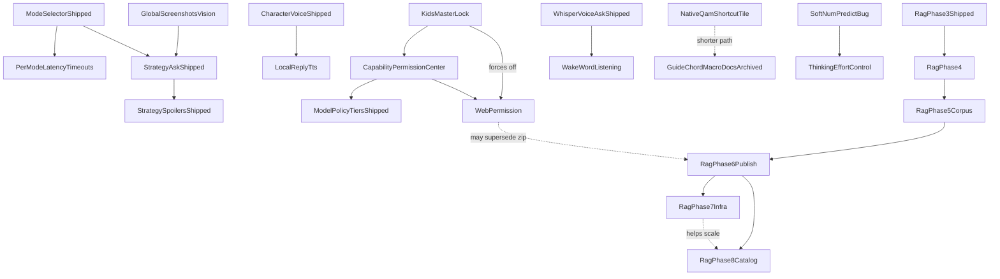

# bonsAI Roadmap

**Next session:** refactor handoff is at [execution order](audit/maintainer-decisions-locked.md#execution-order-locked-amended-2026-08-03) — **every step is complete.** Steps 9 (KB download Cancel), 10 (evidence hygiene / **D4**) and 11 (the deferred friction test) all landed 2026-08-05; step 12 (`main.py` extractions) ran after step 8. **The execution order is closed — what remains is a work list, not a plan.** The friction test's ranked findings are in [audit/03-friction.md](audit/03-friction.md); its top item is the settings/prop plumbing that **D14** deferred, now with outside evidence that it is the largest cost a newcomer pays and that its failure mode is silent. REFACTOR-PLAN Phases 4 (handoff docs) and 5 (postmortem + prevention) have not been run. Sizes verified 2026-08-04: `index.tsx` closed step 8 at **1291** and is **1308** today after the tab-resume feature; `main.py` closed step 12 at **2743** and is **2755**. Refactor QA still owed: **SHELL-PAYLOAD-01** and **KB-CANCEL-01** ([testing.md](testing.md)) — the step 8 modal batch (**MODAL-EXTRACT-01…04**) and the step 12 extractions (**MAINPY-EXTRACT-01**) are Verified on-Deck. Other follow-ups: [Needs verification](#needs-verification), open [Bugs](#bugs). Reorg commit: `ba2e5c5` (`git show ba2e5c5`).

**Moved (same commit):** locked maintainer decisions, execution order, and cleanup candidates → [audit/maintainer-decisions-locked.md](audit/maintainer-decisions-locked.md). Fixed-bug writeups → [archive/roadmap-bugs-fixed.md](archive/roadmap-bugs-fixed.md). Web permission discovery → [planning/web-permission-discovery.md](planning/web-permission-discovery.md).

Tracks **bugs** ([In Progress](#in-progress)), deferred **QA** ([QA backlog](#qa-backlog)), the **backlog** ([Planned](#planned)), **needs verification** ([Needs verification](#needs-verification)), and pointers to shipped work ([Completed](#completed)).

Setup and vision tuning: [troubleshooting.md](troubleshooting.md). QA: [testing.md](testing.md). Release: [development.md](development.md), [CHANGELOG.md](../CHANGELOG.md).

Star ratings use the GTA scale: `★` easiest … `★★★★★` very high complexity; `★★★★★★` extreme scope.

---

## In Progress

Known **defects** only. Deferred QA lives under [QA backlog](#qa-backlog). *QAMP Phase 1 (safe default) is shipped. Phase 2 (experimental profile sync) remains backlog-only.*

### Bugs

Status tags: **OPEN** · **PARTIAL** · **FOLDED** (tracked in linked plan) · **NOTE** (recon, not a defect).

- ★ **Static seed tells you to enable the knowledge base when it is already on** — **OPEN.** `"Enable local knowledge base for better game tips"` ([presets.ts:66](../src/data/presets.ts)) is an ordinary static seed with **no gate on `use_local_knowledge_base`**, so it appears in the carousel for users who already have the KB enabled. Spotted by the maintainer during the 2026-08-03 RAG chip pass — a fair thing to find suspicious, since it implies the KB is off while the backend reports it on. **Fix lean:** filter KB-advice seeds out when the setting is on; needs the KB flag threaded into `getRandomPresets` / `getContextualPresets`, which currently take no settings context. **Corrected 2026-08-05 by the step 11 friction test — the lean above is incomplete and following it literally makes the bug worse.** There is a **third sampler**: `getRandomPresetExcluding`, called from [`MainTabPresetAnimatedChips.tsx:164`](../src/components/MainTabPresetAnimatedChips.tsx) and `:297` on `setTimeout` loops that run for `PRESET_CAROUSEL_ACTIVE_MS = 60_000` (`:35`). **That component re-samples the pool itself and does not merely render the `seeds` prop**, so a fix covering only the two named functions shows correct chips at mount and then fades the KB chip back in within seconds — intermittent, which is harder to diagnose than the current always-on bug. Two hand-maintained gates on the path also void the fix silently if missed: the `React.memo` comparator `presetChipsPropsEqual` (`:437`) and the ~50-entry `useMemo` dep array in `useMainTabPayload.tsx:293`. Also decide what "already on" means — `use_local_knowledge_base` is independent of whether a corpus is actually installed, and the preset path cannot see `installed` (it comes from an RPC read inside `KnowledgeBaseSection`). Detail: [audit/03-friction.md](audit/03-friction.md) § 3.
- ★ **Install voice engine button is actionable when the engine is already ready** — **OPEN.** Settings → Voice input offers **Install voice engine** even when `engine_readiness` reports `binary_ready` and `model_ready`; pressing it re-runs the full install, including a podman pull of `ghcr.io/ggml-org/whisper.cpp`. Observed 2026-08-03 while troubleshooting the voice `status()` bug — the user pressed it precisely because the Main tab claimed voice was broken while Settings said ready, so the misleading state came from that bug, but the button being live regardless is its own issue. **Fix lean:** when ready, show the state and offer *Reinstall* as a distinct, clearly-labelled secondary action rather than the primary one. Needs a focus-graph entry if the control count changes (`.cursor/rules/decky-focus-graph.mdc`).
- ★ **Strategy spoiler false-positive:** **OPEN.** Genre-aware spoiler policy + KB entity match (DRG Survivor boss names); verify **STRAT-SPOIL-DRG-01** on Deck. **Recon + decisions:** [04-strategy-spoiler-false-positive.md](planning/04-strategy-spoiler-false-positive.md) — ship options **1+2+4**; acceptance = **no fence rendered for the entity named in the question**; mid-stream unwrap = extra credit; option 3 = Deck-fail fallback only. Product rulebook (separate): [spoiler-constitution.md](planning/spoiler-constitution.md).
- ★ **Question Overlay Alignment Drift:** **OPEN.** The 3-line question overlay has minor horizontal spacing mismatch vs native `TextField` internals.
- ★ **Bonsai pot sits ~1px right of the canopy in both the tab icon and the Decky plugin-list icon** — **OPEN.** Reported on-Deck 2026-08-06, evidence `screenshots/DeckCapture_20260806_181957_game.png`. Subtle but real, and **it is a geometry bug in the path data, not a rendering artifact** — the same two path strings are duplicated in `BonsaiTreeTabIcon` ([icons.tsx:73/80](../src/components/icons.tsx), stroke-only, `size=36` via `TAB_TITLE_MAIN_TAB_ICON_PX`) and `BonsaiSvgIcon` ([icons.tsx:321/325](../src/components/icons.tsx), filled canopy, `size=26`), which is why both icons show it. **Measured on the 24-unit viewBox:** the canopy spans x **5.5 → 17.5**, so its bounding-box center is **11.5**; the trunk (`M12 14.5v3.2`), the pot rim (7.2 → 16.8) and the pot base (8.3 → 15.7) are all centered on **12.0**. The pot is therefore **0.5 user units right of the canopy** — 0.75px at the 36px tab size, 0.54px at 26px, matching the reported "about a pixel".
  - **Fix lean:** shift the pot/trunk path left by 0.5 (`M11.5 14.5v3.2m-4.8 0h9.6l-1.1 2.3H7.8l-1.1-2.3Z`) in **both** components, or extract the shared geometry so the next edit cannot touch only one. Do not "fix" it with the wrapper `transform: translateX(-5px)` at [index.tsx:1308](../src/index.tsx) — that positions the whole icon within Decky's plugin row and cannot correct an internal offset; likewise the `translateY(-2px)` on the tab SVG ([icons.tsx:70](../src/components/icons.tsx)) is an established vertical nudge and is not the cause here.
  - **Decide before implementing — the two fixes are not equivalent.** Moving the *pot* to 11.5 aligns it with the canopy but leaves the composite glyph centered at 11.5 inside a 24-wide box, so `IconShell` (which centers by box, not by ink) renders the whole mark half a unit left. Moving the *canopy* to 12.0 instead keeps the glyph centered in the shell. **The maintainer asked for the pot to move left**, so that is the default unless the shell shift is visible on-Deck. Also note the canopy is internally asymmetric (left lobe `A 3.2`, right lobe `A 3.8` plus a cubic), so its *ink centroid* is not necessarily its bbox center — the 11.5 figure above is the bbox, which is the part that is objectively measurable; a centroid-based nudge is a judgement call and should be eyeballed on device, not computed.
  - **Verify on-Deck, not in the preview** — at 26/36px a sub-pixel shift is resolved by the Deck's panel scaling, and `npm run test:preview` will not reproduce what the maintainer is seeing. Needs a new QA row in [testing.md](testing.md) when it ships.
- ★ **Token streaming stutters once at the start, then runs smoothly** — **FOLDED** into [05-token-streaming-review.md](planning/05-token-streaming-review.md). Maintainer call 2026-08-04: chase the initial hitch there, not as a standalone bug fix. Verify **STREAM-REVEAL-01** ([testing.md](testing.md)) before any memo-deps change.

- ★★ **LB/RB tab switch flicker when scrolled:** Switching tabs with shoulder buttons while focus is deep in a scrolled panel (not on tab icons) flashes/jitters. Investigate carousel + remount/scroll/focus survival (partial anti-flicker CSS already on `TabContentsScroll`). **OPEN.** Discovery locked 2026-07-29. **Recon: [03-lbrb-tab-flicker.md](planning/03-lbrb-tab-flicker.md)** — ranked hypotheses, fix tracks, on-Deck probe P0 to run first.
  - **Downgraded and re-scoped 2026-08-04 from a fresh on-Deck pass.** The severe symptom is **gone**: no whole-frame judder, none of the jarring effect that made this ★★★. What remains is narrower and is worth re-aiming the recon at: the **tab icon strip** looks busy and the icons **shuffle**, most reproducibly when pressing **LB on the leftmost tab or RB on the rightmost** — i.e. on a switch that cannot go anywhere. A no-op switch still perturbing the strip points at the strip re-rendering or re-measuring on every shoulder press regardless of whether the active tab changed, which is a much smaller target than the original carousel/remount/scroll hypotheses. Focus retention across a normal LB/RB switch was confirmed **working** in the same pass. Not caused by step 8 — the tab strip content (`DECKY_TAB_TITLES`) was not touched, only how tab bodies are built.
- ★★ **KB compat retrieval phrase gate:** **FIXED 2026-08-06** under decision **D16** — see [audit/rag-pr2-signoff.md](audit/rag-pr2-signoff.md) § 2 for the measurement that forced the call. A separate `compat_topic_router.py` now routes an Ask to the compat corpus when it names a topic the tip sheet covers, instead of when it happens to contain the literal word `deck` or `proton`. Reachability went **3/40 → 39/40** on the drafted intents (**13/13** on the blind holdout) with **0/107** strategy false positives. Kept separate from `question_matches_troubleshooting_log_context` on purpose: that predicate has five consumers, and widening it would also attach Proton logs, re-frame the prompt, change stream tags, and move the client permission hint. On-Deck **KB-ROUTER-01**. Original report below, kept for context.
  

Original report

  Troubleshooting KB (compat hybrid / **Keyword + meaning**) only runs when `question_matches_troubleshooting_log_context` matches a **hardcoded phrase list** in `ollama_prompts.py` (preset-style strings like `proton issue`, `why is my game crashing`). Natural-language asks (e.g. `deck sleep resume proton black screen`) skip the KB entirely — no chip, no hybrid, no **Source: shared troubleshooting tips**. **Intent:** when **Use local knowledge base** is on, attempt compat tip retrieval for general troubleshooting-shaped Asks without growing a brittle regex/preset farm in bonsAI. **Fix lean:** broaden gate (e.g. KB-on + not strategy-with-game → compat shortlist; or lightweight intent/heuristic separate from carousel presets); keep Strategy path AppID-gated. Regression: **KB-SMOKE-07/08** queries in [testing-manual.md](testing-manual.md) must pass without adding new hardcoded strings per smoke case. **Phase 4 discovery (2026-07-30):** lean gate fix (**B1**) ships with Phase 4 when implemented — not a separate forever-defer.
  

- ★★ **Model routing try-order modal focus + chrome:** **OPEN.** Text/vision **Set … try order…** fullscreen (`ModelRoutingOrderModal`) — D-pad focus lands on leaf Up/Down buttons and feels broken; layout/chrome does not match other fullscreen pickers (Pull Models / Character picker / Models hub `ConfirmModal` pattern). Screenshot `DeckCapture_20260730_144925`. Discovery locked 2026-07-30. **Defer** — fetch-on-open + save already shipped; polish later.
- ★★ **Live-turn transparency UI missing after successful Ask:** **OPEN.** Backend `ensure_context_chips_on_snapshot` + slimmer dev chip JSON + frontend `transparencyUiAvailable` gating; verify **CONTEXT-LADDER-01** on Deck.
- ★★ **Strategy live-turn D-pad graph skips branches/feedback:** **OPEN.** Geometry scroll gate + yield-to-parent (`return false`) with Focusable branch picker as turn-slot sibling; verify **MICRO-04** on Deck.
- ★★ **Main tab answer D-pad scroll choppy / multi-line jumps:** **OPEN.** Scrolling the Strategy reply with D-pad Down still advances many lines per press (choppy, hard to read line-by-line). Do not remove scroll-step logic until on-Deck confirmation after multi-day QA. Regression row: **D-PAD-SCROLL-02** in [testing-manual.md](testing-manual.md).
- ★★ **Audit every `onButtonDown` — two failure modes, both already caught in the wild.** **OPEN.** `onButtonDown` fires for **every** button and receives a `GamepadEvent` whose id is at `evt.detail.button` (`OK = 1`, `CANCEL = 2`, `SECONDARY = 3`, `DIR_UP = 9`, `DIR_DOWN = 10`). Three controls were fixed 2026-08-04 after each one acted on a D-pad press aimed at moving past it; the sites below were found by grep in the same pass and are **not** fixed. **(1) Acts on any button — a state change on every press, including directions:** [`ContextChipLadder.tsx:79`](../src/components/ContextChipLadder.tsx) (`onButtonDown={() => setExpandedBoth(true)}` — the collapsed hint expands on any press, so D-pad past it is impossible), [`SessionContextStrip.tsx:133`](../src/components/SessionContextStrip.tsx) (sets the active row), [`MainTabChatTranscript.tsx:318`](../src/components/MainTabChatTranscript.tsx) (sets the highlighted turn). Fix by whitelisting with `isOkDeckButtonEvent` from [focusNavigation.ts](../src/utils/focusNavigation.ts), the same shape the two spoiler fences and the session header now use. **(2) Tests a direction with a string predicate, so it never matches and the handler is inert:** [`buildTurnHeaderElement.tsx:49`](../src/utils/buildTurnHeaderElement.tsx), [`buildAnswerBubbleElement.tsx:184`](../src/utils/buildAnswerBubbleElement.tsx), [`SettingsTabUiScaleSection.tsx:123`](../src/components/SettingsTabUiScaleSection.tsx), [`DeckFocusSlider.tsx:45`](../src/components/deck/DeckFocusSlider.tsx). `String(gamepadEvent)` is `"[object CustomEvent]"` and matches nothing. **These are believed harmless** because `onMove*` covers the same directions on a `Focusable` — but that reasoning only holds where the element *is* a `Focusable`, and `onMove*` does nothing on a Decky `Button`, so **check the element type per site before concluding a handler is redundant rather than missing.** Where a site turns out to be load-bearing, switch it to `isDeckDirectionDownEvent` / `isDeckDirectionUpEvent` and drop the `onMove*` twin so one press cannot fire both. **Pinned already:** `focusNavigation.test.ts` documents that the string predicates do not match events, so a future reader does not rediscover it the hard way. **Worth doing as one audit rather than per-bug** — both fixed instances were found by accident while chasing something else.
- ★★ **Sweep the remaining global-`document` lookups — same root cause as the spoiler bug, 8 files.** **OPEN.** Every one is a focus or scroll helper that silently does nothing on device, because plugin JS runs in SharedJSContext while the UI lives in the QAM popup document ([docs/audit/decky-realms.md](audit/decky-realms.md)). Line numbers re-derived 2026-08-04 after the fixes landed: [`chatPanelScroll.ts:80`](../src/utils/chatPanelScroll.ts) (`activeElement` as scroll anchor), [`focusNavigation.ts:130`](../src/utils/focusNavigation.ts) (`getFocusableWithin` root query), [`settingsPanelScroll.ts:21`](../src/utils/settingsPanelScroll.ts) (`.bonsai-scope` fallback), [`MainTabChatTranscript.tsx:211/222/223`](../src/components/MainTabChatTranscript.tsx), [`MainTabUnifiedAskBar.tsx:737`](../src/components/MainTabUnifiedAskBar.tsx), [`MainTabPresetAnimatedChips.tsx:157`](../src/components/MainTabPresetAnimatedChips.tsx), [`AboutTab.tsx:99`](../src/components/AboutTab.tsx), [`useBonsaiAskOrchestration.ts:730`](../src/hooks/useBonsaiAskOrchestration.ts). **Start with `useBonsaiAskOrchestration.ts:730`** — it guards on `instanceof HTMLElement`, which is **false** for a node from the other realm because that realm has its own constructor, so the blur never fires and never will. The fix per site is mechanical (a ref, an element-scoped query, or `getUiDocument()` / `elementHasFocus()` from [uiDocument.ts](../src/utils/uiDocument.ts)), but each is a behaviour change on a path with no test, so take them in small batches with on-Deck confirmation rather than one sweep. **Do not assume a fixed lookup means a working focus move** — that was the trap in the reply-row bug: reaching the element is necessary and not sufficient, and a cross-container move needs `TakeFocus` ([navFocusRegistry.ts](../src/utils/navFocusRegistry.ts)). **Related:** the character-picker focus graph below drives D-pad focus with `shell.querySelector(...)`; confirm which document `showModal` portals into before assuming this fix reaches it.
- **NOTE — D-pad reachability sweep, 2026-08-04 — result: no new unreachable controls, and the method has a blind spot worth knowing.** Prompted by finding two touch-only controls by accident. Three passes over `src/**/*.tsx`: (1) raw `<button>` with no enclosing `Focusable` — **0** after the Session-context fix, the only two hits being a comment and a false positive; (2) clickable `div`/`span`/`img` outside a `Focusable` — **0**; (3) `Focusable` nested inside another `Focusable`, reachable only if the parent yields — 17 sites, of which only **3** have a parent that intercepts vertical movement (`MainTabUnifiedAskBar.tsx:529`, `buildReplyActionsElement.tsx:169` and `:233`), and all three are known-working paths in daily use.
  - **The blind spot: the spoiler fence does not appear in any of these results.** Its `Focusable` is rendered from `MainTabBonsaiAiMarkdownChunk.tsx` while the intercepting parent lives in `buildAnswerBubbleElement.tsx`, so **per-file static analysis cannot see the nesting**. Both real bugs found so far were of the cross-file kind. A future sweep needs to follow component composition, not file text — or the reachability question has to be answered on-device per control, which is what `docs/testing-manual.md` focus rows are for.
- ★★ **Ask-bar caret sits left of the AI-character avatar instead of at the text.** **OPEN.** Reported on-Deck 2026-08-04, evidence `screenshots/DeckCapture_20260804_121851_game.png`. With **AI character on**, focusing the Ask field puts the blinking caret hard against the **left edge of the input row, to the left of the `?` avatar badge**, while the placeholder ("Describe the level, boss, or puzzle you're stuck on.") begins to the *right* of the badge. Typing therefore appears to start somewhere other than where the caret is. Only visible with the character avatar enabled, which is what makes it look like a layout bug rather than a caret bug — the avatar is laid out inside the same row as the field, so the caret renders at the row's origin rather than at the field's text origin. **Fix lean:** make the avatar a sibling *outside* the text field's box rather than a leading element inside it, or give the field a `text-indent`/`padding-left` that clears the badge — the first is preferable; padding that has to match an avatar width will drift the next time the avatar resizes (UI scale profiles already resize it). Check `MainTabUnifiedAskBar` and the `bonsai-askbar-*` rules.
- ★★ **Focus ring consistency — half fixed, half reverted 2026-08-04** — **PARTIAL.** **Kept:** wrapping the character picker, desktop-note and plugin-help modals in `BonsaiModalScope`, which is what makes any bonsAI focus styling reach portalled content. **Reverted:** the blanket `button.gpfocus` / `:focus-visible` rule added the same day. It made rings *consistent* by painting bonsAI's **thick rounded ring** onto controls SteamOS already outlines with a **faint white rectangle** — the maintainer wants the native outline, not ours. **The goal stands and the method was wrong:** consistency should come from controls being real Decky `Focusable`s so SteamOS styles them natively, not from widening our own ring. A comment in `gamepadAndPullModels.ts` says not to re-add a catch-all rule. Original diagnosis, still accurate: Maintainer: *"white rings everywhere, follows focus"*, and the Ollama-tab inconsistency and the desktop-note/plugin-help rings all confirmed fixed. **The mechanism already existed and three modals simply did not use it:** `BonsaiModalScope` puts `.bonsai-scope` on portalled content and injects the ring sheet; the models hub and Pull Models used it, the character picker, desktop-note save and plugin help did not. Those three are now wrapped. The second half — plain Decky buttons falling through to `:focus-visible` heuristics — is fixed by a default rule matching `button` / `[role=button]` inside the scope, so a new control is styled by default instead of by remembering to add a class. **Original diagnosis, kept:** Maintainer ask: *"I want white focus rings everywhere, make them all consistent."* Two separate gaps produce this:
  - **Yellow rings: root-caused and fixed 2026-08-04 — they were ours, not Steam's. Confirmed white on-Deck.** Reported as *"the yellow outline stuff is back partially"* (`screenshots/DeckCapture_20260804_135650_game.png`). Measured on device: a focused `.bonsai-preset-glass` chip computes `outline: rgba(241, 196, 15, 0.92) solid 2px` — that is bonsAI's own ring, not a `:focus-visible` fallback. `buildGamepadFocusRingStylesheet` drew it with `var(--bonsai-ui-tab-focus-1/-2, <white>)`, and those variables are the **tab strip's accent pair**, set from the active AI character in [characterUiAccent.ts:153](../src/data/characterUiAccent.ts) — `#f1c40f` gold for Ali G and the TF2 Announcer. So the gamepad ring silently followed the character: gold here, purple for Shadowheart, and so on. **The white fallbacks written in that file show white was the intent all along** — it only ever looked white because no character accent was applied. It turned yellow once character selection started sticking (`c9ad633`), which is why it reads as a regression of an unrelated fix. **Fix:** the gamepad ring is now white literals, independent of accent, matching the maintainer ask *"white focus rings everywhere"*. The tab strip keeps its accent tint ([section-1.ts:204](../src/styles/sections/section-1.ts)), where the same variables are correct. **Reversible in one place** if accent-tinted rings turn out to be wanted after all.
  - **Modals get no bonsAI focus styling whatsoever.** The scoped stylesheet is emitted inside the scope div ([BonsaiPluginShell.tsx:20-21](../src/components/BonsaiPluginShell.tsx)) and **every rule is prefixed `.bonsai-scope …`** ([gamepadAndPullModels.ts](../src/styles/sections/gamepadAndPullModels.ts) defines the white `.gpfocus` / `:focus-visible` rings). `showModal` portals its content **outside** that div, so not one of those selectors matches inside the character picker, the models hub, or any other picker. That is why the character picker shows no ring anywhere — **not** a missing focus claim, which is what two attempted fixes wrongly assumed.
  - **In-panel buttons are styled by enumerated class, so unclassed ones fall through to Steam's default.** The white rings are attached to specific bonsAI classes (`bonsai-chat-secondary-btn`, `bonsai-preset-glass`, `bonsai-preset-help-chip`, …). Plain Decky `Button`s in the Ollama install row — **Browse models**, **Install options**, **Test connection** — carry none, so they fall back to `:focus-visible`, whose heuristics make the ring *sometimes yellow, sometimes invisible*. **Update AI 7 models** has a bonsAI class and shows white, which is exactly the inconsistency reported. Recordings: `DeckRecord_20260804_113056_game.mkv`, `DeckRecord_20260804_113728_game.mkv`.
  - **Fix lean (needs a maintainer nod before it ships — it touches CSS reach):** give the ring rules a selector that also matches modal content — either drop the `.bonsai-scope` ancestor for bonsAI-specific class selectors, which is safe because those class names are ours, or put a `bonsai-focus-ring` class on each modal root and repeat the rules for it. Then broaden from enumerated classes to a general rule for buttons inside those roots, so a new control is styled by default rather than by remembering to add a class. **Do not emit the rules fully unprefixed** — they would style Steam's own UI outside the plugin.
- ~~★ **Fullscreen pickers return you to the right tab, but not to the right control**~~ — **PARTIAL on Deck (1 of 3 pass).** Code shipped 2026-08-04; New `modalReturnFocusRegistry`: each opener control registers its element by id while mounted, its own `onClick` arms that id, and the modal-close path focuses it one animation frame after the tab is restored. **Registry rather than a DOM query on purpose** — `.cursor/rules/decky-focus-graph.mdc` forbids `querySelector` / `document.activeElement` for focus targets because they miss under Decky and land focus somewhere wrong. Wired for all four: plugin help, desktop-note save, character picker (Settings), models hub. Focus target ladder copied from `replyStopRegistry` — Decky's `.Panel.Focusable` wrapper first, then the native button. **If the opener is not mounted when the modal closes, nothing happens**, which is exactly the previous behavior, so a miss cannot be worse than before. **11 tests.**
  - **On-Deck result 2026-08-04: 1 of 3 tested passes.** **Character picker → Settings: works** — closing lands on the AI-character button. **Models hub → Ollama: fails.** **Desktop-note save → Main: fails.** Both failures land focus in the **tab icon row at the top**, not merely on the wrong control. Plugin help was skipped (chip previously dismissed, so it does not render).
  - **What the failure shape rules out.** Landing on the tab strip is where Decky puts focus when a tab body (re)mounts, so either the restore never ran, or it ran and was then overridden. The registry cannot tell those apart, and `.cursor/rules/decky-focus-graph.mdc` forbids settling it with a `document.activeElement` check. **Next step is instrumentation, not another guess:** log the `restoreModalReturnFocus()` return value through `bonsaiDebugLog` / `dbg_fe_log` on device, then apply one evidence-backed fix. If it returns true and focus still ends up on the strip, the fix is re-asserting after the tab body settles; if false, the opener is not registered at that moment and the fix is in the timing of registration, not of focus.
  - **Why Settings passing is a useful clue:** the two failing returns are to **Main** and **Ollama**, the two tabs with their own mount-time focus wiring; Settings has none. That is consistent with "restored, then stolen" rather than "never ran".
- ★★★ **Character picker: focus ring is invisible, D-pad does not move, so you cannot pick a character** — **OPEN (selection fixed).** Reported on-Deck 2026-08-04 as *"select a character, it stays on random"* plus *"the focus ring on that screen is invisible so you can't navigate via dpad"*. **These are one bug, not two, and the save path is innocent** — `useCharacterPickerModal.onOK` applies the choice locally and then writes it ([useCharacterPickerModal.tsx:64-83](../src/features/plugin-shell/useCharacterPickerModal.tsx)); it stays on random because the selection never moves off random, so OK commits what was already there. **Not caused by the step 8 extraction:** `CharacterPickerModal.tsx` was untouched by it (last real changes are `4b62886`, `7983414`, `3191b18`), and the extraction moved the opener, not the modal. **Root cause is in the modal's own focus graph:** it drives D-pad focus with `shell.querySelector(...)` lookups ([CharacterPickerModal.tsx:192-231](../src/components/CharacterPickerModal.tsx) — `focusRandomToggle`, `focusCustomCharacterField`, and friends). `.cursor/rules/decky-focus-graph.mdc` names that exact pattern as one that **misses on Deck and yields wrong spatial nav**, which is precisely the reported symptom: nothing visibly focused, D-pad inert. **Fix lean:** convert those helpers to the registered-owner pattern (`replyStopRegistry` / the new `modalReturnFocusRegistry`) instead of DOM queries. This is the same class as the document-sweep entry and they should be fixed together. **Blocks the AI-character feature entirely on a Deck** — it is only usable with a mouse today, which is why it rates higher than the picker-escape audit.
  - **Two attempted fixes failed, 2026-08-04, and the reason matters.** Both assumed nothing was *claiming* focus and added claims — first for the locked state, then unconditionally. Neither changed what the maintainer saw. The root cause is the entry above: **modal content is outside `.bonsai-scope`, so bonsAI's white ring CSS cannot match it**. Focus may well have been landing correctly the whole time with nothing drawn to show it. **Fix the CSS reach first, then re-test before touching the focus claims again** — and be prepared to revert them if the ring alone solves it, since an unnecessary claim fights Decky for the starting position.
  - **Selection not sticking — fixed 2026-08-04** (`patchPendingSessionSettingsSnapshot` after save, matching models hub). Re-test D-pad navigation after CSS reach is fixed.
- ★★★ **Fullscreen picker D-pad edge-escape (audit):** **OPEN.** Audit **Pull Models**, **Character picker**, **Ollama models hub**, and other `showModal` pickers for below-list / above-list escape (left from row → primary action; right from trailing control → Close).
- ★★★ **Soft** `num_predict` **+ thinking budget:** **OPEN.** `options.num_predict` is a hard Ollama wall (500 Speed/Expert, 900 Strategy) with no overshoot/continue; `"think": False` avoids empty replies when thinking ate the wall (`done_reason=length`, zero content) but leaves quality on the table for thinking models. **Intent:** length preference with small overshoot OK — not a hard cut, not unlimited. **Fix lean:** (1) raise base caps; (2) continuation on `done_reason=length` (small extra budget, capped continues — especially when content empty/short); (3) optional Reply verbosity → answer `num_predict`; (4) **budget thinking separately** (application policy): re-enable thinking with a fixed Deck default effort (`low`/`medium`) plus answer-floor / continue-if-content-starved; log thinking vs content lengths. Ollama has no true dual hard budgets in one completion — levels + continue stand in. **Not in scope:** delete the ceiling entirely; Settings UI for effort (→ **Thinking effort control**); parallel second Ask; spoiler chip work.

---

> **Decisions needed / locked / execution order / cleanup candidates** moved to [audit/maintainer-decisions-locked.md](audit/maintainer-decisions-locked.md) (commit `ba2e5c5`). **No decisions are open** — D1–D15 locked; implement from that file.

---

## QA backlog

Maintainer on-Deck / qualitative work — **not** active feature engineering. Detail and checklists: [testing.md](testing.md), [testing-manual.md](testing-manual.md).

- ★★ **Device QA — Tier 0–1:** Execute Tier 0 smokes (SMOKE-A, C, F) then Tier 1 (SMOKE-B, E, H); update coverage with Pass / Partial / Fail + build id. Tier 2+ before release.
- ★ **VAC / `bonsai:vac-check` (Phase 1) — on-device QA:** Implementation complete; finish **VAC-02…06** after Tier 0 **SMOKE-F** passes.
- ★★★ **QAMP verification checklist:** Per-game profile on/off, QAM Performance reopen, Steam restart/reboot, GPU-clock recommendation paths. See [testing-manual.md](testing-manual.md) § QAMP.
- ★★ **Prompt testing pass:** Broader systematic validation beyond the shipped prompt-testing MVP matrices.

---

## Planned

Stars are **effort/risk** within bands. Grouped by **horizon**; **within each horizon sorted ascending by star rating**.

- **Near-term:** Incremental product work, bounded research spikes.
- **Medium-term:** Larger features inside the plugin + user-hosted stack.
- **Long-term:** ★★★★★★ scope and/or ★★★★★ work gated on upstream APIs or broad surface area.

**GitHub tracking:** Each **Planned** item rated **★★★★★** or **★★★★★★** includes a placeholder link to **[bonsAI Issues](https://github.com/cantcurecancer/bonsAI/issues)** (replace with a specific issue URL when created).

**Planned titles:** Short **noun-first** label (about 3–6 words); secondary context in parentheses. Detail under **Goal** / **Primary work**.

### Near-term

Within this section: ascending stars (★ → ★★★★).

- ★ **Intent packs later review** (keep / quiet / Developer — discovery leftover 2026-07-30)
  - **Goal:** Decide whether the quiet intent-pack search aliases should be deleted, left quiet, or revived under Developer.
  - **Proton journal half closed 2026-08-02.** The 5 journal RPCs and `proton_experiment_journal_service.py` are gone (`309c386`, `ebdc0f2`); only the file wipe survived, relocated into `plugin_data_reset.py` because **Clear all data** still needs it. The last of the plumbing — the `journal_text` parameter on `stack_context_blocks` — was removed on the Ask path in the cleanup pass. Reviving the feature now means rebuilding the store, not re-enabling a flag.
  - **Not in scope:** rewriting unified search ranking; re-shipping journal inject without a redesign.
- ★★ **Preset chip expansion** (streaming / LAN / Steam Input — incremental)
  - **Baseline shipped:** `PRESET_PROMPTS` in [`src/data/presets.ts`](../src/data/presets.ts).
  - **Goal:** Add or refresh preset strings as related features land — content tuning only.
  - **Not in scope:** treating each string batch as a versioned feature ship. AppID/session RAG chips → shipped (**Session RAG preset chips**).
- ★★ **Stream preset chip animation** (fourth `presetChipAnimation` mode — proposed 2026-08-06)
  - **Goal:** A `stream` mode alongside `fade` / `carousel` / `static` ([bonsaiSettingsSchema.ts:41](../src/data/bonsaiSettingsSchema.ts)) where each preset prompt types itself in character-by-character behind the blinking block caret, holds for `holdMsForPresetText`, then clears — so suggestions read as the model thinking out loud rather than as decoration.
  - **Why this shape rather than another animation:** it reuses motion the app already owns instead of inventing a vocabulary. The caret and its keyframes exist (`bonsai-stream-caret-blink`, [section-6.ts:371-382](../src/styles/sections/section-6.ts)), and a paced reveal already ships in [`useSmoothStreamReveal.ts`](../src/hooks/useSmoothStreamReveal.ts). It also touches neither transform nor opacity, so it cannot desync the Steam `gpfocus` ring from the chip — the failure mode the carousel's focus-model comment documents ([MainTabPresetAnimatedChips.tsx:179-185](../src/components/MainTabPresetAnimatedChips.tsx)).
  - **Primary work:** a third branch in `MainTabPresetAnimatedChipsInner` ([MainTabPresetAnimatedChips.tsx:248](../src/components/MainTabPresetAnimatedChips.tsx)) reusing the existing per-slot `setTimeout` loop and `PRESET_SLOT_STAGGER_MS` so the three chips cascade; reveal by substring, which is safe because the label is fixed-width with `nowrap` + ellipsis ([section-4.ts:61-68](../src/styles/sections/section-4.ts)). Chips must stay `focusable` throughout the reveal — do not gate on a partial string the way `fade` gates on `slotOpacity > 0` (`:385`), or a chip is unpressable while it types.
  - **Reduced motion:** degrade to an instant swap. The repo already branches on `prefers-reduced-motion` for the ask-bar breathe ([section-6.ts:36-43](../src/styles/sections/section-6.ts)); a new mode that ignores it would be the only one that does.
  - **Known drift point, two-language:** the enum lives in `PRESET_CHIP_ANIMATION_OPTIONS` ([bonsaiSettingsSchema.ts:237](../src/data/bonsaiSettingsSchema.ts)) and is validated independently by `sanitize_preset_chip_animation` ([settings_service.py:137](../py_modules/backend/services/settings_service.py)) — Python is authoritative per **D13**, so a TS-only edit silently falls back to `fade` on next load. The Developer-tab picker **hardcodes** `["fade", "carousel", "static"]` ([DeveloperTab.tsx:389](../src/components/DeveloperTab.tsx)) instead of reading the exported list, so it will not gain the button on its own; fixing that to read `PRESET_CHIP_ANIMATION_OPTIONS` is the better first commit. The derived `preset_chip_fade_animation_enabled` (`=== "fade"` in both languages) stays correct unchanged.
  - **Not in scope:** replacing `fade` as the default (`DEFAULT_PRESET_CHIP_ANIMATION`); changing which prompts are sampled; the other four styles considered in the same pass (`odometer` per-slot roll, `settle` scale-in, `sweep` mask wipe, `sprout` clip-path unfurl) — `sweep` in particular needs an on-Deck measurement first, since animating `mask-position` is not reliably compositor-accelerated there.
- ★★ **Spoiler confidence chip** (transparency estimate — decisions locked 2026-07-29)
  - **Goal:** Concise Show details context-chip estimate of topic spoiler likelihood on **all Ask modes** — chip label `Spoiler risk: med` (bands `low` / `med` / `high`; keep ≤ ~18 chars).
  - **Status:** Decisions locked; ready to implement (standalone). Distinct from hybrid retrieval.
  - **Discovery locked (2026-07-29):** bands only; score from genre + intent + KB `section_type` + entity match + optional model tag `<bonsai-spoiler-risk>` (~60% when parsed); always show under Show details; v1 transparency-only (no fencing change); heuristic ASAP while streaming; no parallel rater Ask.
  - **Related:** **User-adjustable spoiler fencing**; **Unfenced spoiler feedback**; **Spoiler constitution**.
  - **Not in scope (v1):** Calibrated ML probability; percent chip copy; parallel rater Ask; changing fencing from this chip.
- ★★ **Unfenced spoiler feedback** (thumbs-down category)
  - **Goal:** After thumbs-down, refinement chip for **unfenced spoilers** (and optional over-fenced sibling). Improves future Asks — does not fix the current turn.
  - **Depends on:** reply micro-actions; **Spoiler confidence chip** signals useful later.
- ★★ **User-adjustable spoiler fencing** (hide by risk band)
  - **Goal:** Settings control for when to apply tap-to-reveal / fence masking from estimated risk — e.g. hide when risk ≥ **high** / **med** / **low**, or **never hide**.
  - **Depends on:** **Spoiler confidence chip**; shipped `strategy_spoiler_masking_enabled`.
  - **Related:** **Spoiler constitution** (when risk bands should drive mask vs soft-omit).
- ★★ **Thinking effort control** (Settings Off / Low / Medium / High)
  - **Goal:** User-adjustable Ollama thinking effort mapped to `think: false | "low" | "medium" | "high"` (global v1).
  - **Depends on:** **Soft** `num_predict` **+ thinking budget** (Bugs).
  - **Not in scope:** shipping Settings before the soft-budget bug fix.
- ★★★ **Dynamic keep-alive / smart unload** (research spike — discovery locked 2026-07-29)
  - **Goal:** Research-only: hold models loaded vs unload when a game takes focus, safely on Deck APU shared memory? Spike decides go/no-go. No ship commitment until spike writes outcome.
  - **Not in scope:** promising true per-game VRAM detection; production unload before spike doc.
- ★★★ **Per-mode latency timeouts** (warn vs hard limit profiles)
  - **Goal:** Separate warning and timeout values per selected mode.
  - **Depends on:** Mode selector (shipped).
- ★★★ **Custom model in Pull Models picker** (custom pull + Ask pin + New badges)
  - **Goal:** Pull any valid Ollama-library tag not in curated catalog; **Use for Ask** pin; **New** badge (released within 30 days). Custom pull is backup to living overlay; background catalog refresh when stale.
  - **Primary work:** Phase 1 Pull UI + Ask pin + routing prepend + New badge; Phase 2 hooks to future text model chains.
  - **Depends on:** shipped Pull Models picker + living overlay merge.
  - **Not in scope:** LAN/remote `ollama pull` (→ **LAN custom model pull**); Modelfile UI; full chain editor in v1.
- ★★★ **Search density UX** (match emphasis + tighter rows)
  - **Goal:** Tighter, more scannable results: spacing, wider lines, incremental filtering, highlighted match tokens.
- ★★★ **KB visual maps** (strategy maps — light prelim)
  - **Goal:** Optional visual strategy maps in KB-grounded replies — light prelim discovery only until closer to implementation.
  - **Depends on:** mature strategy corpus + Phase 3/4 retrieval quality.
  - **Note:** Separate roadmap row — not folded into RAG Phase 4–8.
- ★★★★ **Spoiler constitution** (product rules → runtime encoding)
  - **Goal:** Encode the living spoiler rulebook into prompts, title/risk signals, and (later) mask-vs-omit behavior so Strategy guidance matches product intent across narrative vs low-narrative games — not genre substring alone.
  - **Draft:** [planning/spoiler-constitution.md](planning/spoiler-constitution.md) (rules 1–13; commonality; omit+soft-invite parked).
  - **Status:** Draft locked 2026-08-04 from maintainer planning chat. False-positive bug ([04](planning/04-strategy-spoiler-false-positive.md)) ships only the **named-entity display slice** (options 1+2+4); this row owns the rest.
  - **Depends on / feeds:** **Spoiler confidence chip** (rule 9 lean); **User-adjustable spoiler fencing**; optional soft-omit follow-on; STRAT-SPOIL false-positive fix for the enforceable named-entity contract.
  - **Not in scope (this row alone):** Closing STRAT-SPOIL-DRG-01; calibrated ML spoiler judgment; expanding genre allowlists as the primary policy.
- ★★★★ **Llama.cpp provider spike** (Deck perf / replacement eval)
  - **Goal:** Research-only: can Deck-local llama.cpp beat Deck-local Ollama enough to justify a possible long-term replacement? **No code** in this spike. Supersedes the 2026-05-20 go/no-go in [llama-cpp-provider.md](archive/spikes/llama-cpp-provider.md).
  - **Discovery locked (2026-07-17):** Baseline Deck-local Ollama **gemma4 E2B**; go bar must win **both** game FPS hitch **and** peak GPU memory; load = DRG Survivor. Write `docs/archive/spikes/llama-cpp-provider-eval.md` (the spike's deliverable — does not exist yet).
  - **Not in scope:** Production provider UI/code; LAN/remote llama.cpp; cloud APIs.
- ★★★★ **SteamOS Share path** (capture → attach)
  - **Goal:** Faster path from SteamOS **Share** / capture flows into screenshot attach where APIs allow.
  - **Not in scope:** kernel framebuffer hacks as default.
- ★★★★ **SteamOS spin hint card** (immutable spins)
  - **Goal:** Detection + deep link to troubleshooting for immutable spins.
  - **Not in scope:** auto-fix firewall rules.
- ★★★★ **RAG Deck query — extended retrieval (Phase 4)**
  - **Goal:** Richer retrieval and content shapes after Phase 3 — session chip **visibility**, structured enemy/item sample cards + light reply bullets, T1 per-game AppID compat tips, lean compat phrase-gate fix.
  - **Status:** Discovery locked 2026-07-30; **docs only** — not implementing yet. Full lock: [knowledge-base.md](knowledge-base.md) § Phase 4.
  - **Discovery locked (2026-07-30):** All three tracks in one ship when implemented. Track 1 = visibility first (**V1+V3+V4**): guarantee ≥1 RAG chip when candidates exist (prefer game RAG → **Tip** badge; compat fallback); reseed so remix actually runs; **Tip** badge on **game** RAG chips only. Track 2 = **C3** corpus + reply shape, **R1** light bullets, **S1** sample on DRG Survivor + OoT/SoH, **F2** fields, both enemies+items, unfenced when user named the entity. Track 3 = **P1** prefer per-game tips then shared; **T1** ~3–5 tips × sample titles; same hybrid; **B1** lean phrase-gate fix; **N1** no game → shared only; **U1** no new Settings.
  - **Depends on:** Phase 3 (shipped 2026-07-29).
  - **Not in scope (Phase 4):** Chip **vector ranking** (→ Phase 5); broad per-game tips beyond T1 (→ Phase 5); structured cards beyond DRG+OoT sample (→ Phase 5); custom UI enemy/item cards / **KB visual maps**; public HF publish (→ Phase 6); sqlite-vss / auto-pull nomic (→ Phase 7).
- ★★★★ **KB online / versus strategy content** (gap found 2026-08-06 during PR2 query drafting)
  - **Goal:** Cover **online multiplayer** strategy for any title that has it — versus, co-op coordination, map callouts, tier lists — not just single-player progression. Applies to every online title the corpus carries, now and later.
  - **Why it is a gap, not a nicety:** the corpus is beginner-and-singleplayer shaped end to end. Card types are `boss` / `area` / `dungeon` / `quest`, which cannot express *"death charge spots on the roof of No Mercy"*, *"rank melee weapons"*, or *"best infected coordination spots on Dark Carnival"*. Those are the questions experienced players actually ask, and the corpus has **no content and no card shape** for any of them. Of the current 11 titles the affected set is small — L4D2 versus/survival, BG3 co-op, RDR2 Online — but the rule is forward-looking.
  - **Needs before content:** new `section_type` values. At minimum a **ranking/tier-list** shape ("rank melee weapons") and a **map-callout** shape ("death charge spots on X"); both are lists, which the current one-card-one-paragraph format handles badly.
  - **Source options (maintainer call needed — see § Sourcing below):** cleanest is **Fandom / official game wikis** already permitted under CC BY-SA, which for L4D2 carry per-campaign and versus detail. **Liquipedia** (CC BY-SA 3.0) is clean for esports titles but thin for this set. **Community competitive docs** (config/ruleset wikis, competitive league guides) need a per-source licence check — several are unlicensed. **Steam Community Guides and GameFAQs are out**: user-authored under platform ToS with no redistribution grant, same reasoning that already excludes ProtonDB and Reddit bulk.
  - **Not in scope:** live match data, ladder/rank lookups, anything needing network at Ask time.
  - **Depends on:** nothing shipped — can start once card types are decided. Independent of remediation PR2, which deliberately keeps the existing 11 titles and adds no new types.
- ★★★★ **RAG retrieval quality remediation** (hybrid fix + eval honesty — discovery locked 2026-08-02)
  - **Goal:** Fix shipped hybrid defects (nomic prefixes, RRF instead of cosine-only rerank, relevance floor, query/transparency bugs) and re-validate with a deepened seed + honest eval (tune/holdout; no self-referential card→query pairs).
  - **Status:** **PR1 (Stages 1–5) shipped 2026-08-05** — five commits, `d111491`…`82d379f`. **PR2 (Stage 6) started 2026-08-06**: seed corpus rebuilt at schema v3 and verified running the hybrid path live; stage 6a (hybrid kill-switch setting) landed. Active plan: [rag-retrieval-quality-remediation-implementation-plan.md](rag-retrieval-quality-remediation-implementation-plan.md). Analysis (archived): [archive/rag-retrieval-quality-remediation-plan.md](archive/rag-retrieval-quality-remediation-plan.md). What PR1 changed, with a before/after table: [knowledge-base.md](knowledge-base.md) § Retrieval quality remediation.
  - **PR1 landed:** task prefixes paired and owned by one module (the eval imports them); corpus schema **v3** + `embedding_variant`, with a gate that fails closed on a v2 corpus; RRF over FTS+vector on **both** strategy and compat; loose BM25 floor + column weighting; retrieval searches the user's question rather than the follow-up header or the app name; stopword filtering; manifest-first vector checks, cached availability, batched builder, single-file corpus (`VACUUM` + `immutable=1`); lowest-tier trust labels, whole-card budget drops, transparency built after stacking; `keyword_hybrid_disabled` literal + label.
  - **Two things worth knowing before PR2.** (1) **Naive RRF re-creates the exile it removes** — a card missing from the vector list scores 0 from it, and on a 30-card shortlist the worst vectored card then beats the best keyword hit; missing entries are backfilled one rank past the end, and that backfill rank is another PR2 knob. (2) **`ORDER BY rank` is the *unweighted* bm25**, so column weights do nothing to ordering unless the ORDER BY repeats the weighted expression.
  - **Every fusion constant is provisional and must not be tuned on the current seed** — 22 sections against `HYBRID_FTS_SHORTLIST_K = 30` means the shortlist swallows the corpus and any number derived from it measures the harness. PR2 deepens the seed first, then tunes on **tune** and gates on **holdout**.
  - **PR1 QA owed on Deck:** **KB-RRF-01**, **KB-VARIANT-01**, **KB-FLOOR-01**, **KB-FOLLOWUP-01**, **KB-TRANSPARENCY-01** ([testing.md](testing.md)); **KB-SMOKE-02/04 re-opened** because PR1 changed the behaviour its Verified evidence described. **Existing corpora must be rebuilt** — schema v3 has no migration (Decision 6).
  - **PR2 stage 6a landed 2026-08-06:** `rag_hybrid_retrieval_enabled` (default **on**) with a Developer-tab toggle under *Knowledge base (dev QA)*. Checked **before** the corpus-format gate so the switch reports itself rather than blaming the corpus. QA owed: **KB-KILLSWITCH-01**, **FOCUS-GRAPH-DEV-KB-01**.
  - **PR2 stage 6b landed 2026-08-06, and it measured the Q8 gap:** the eval now runs keyword / vector-only / RRF on one corpus with bootstrap CIs, honours a tune/holdout split, and derives gate reachability from the live `should_retrieve_knowledge`. **Only 3 of 18 compat fixtures reach retrieval in production** — 83% of the compat eval set is traffic the phrase gate never routes, which is why the 2026-07-31 bake-off's compat half is now flagged as measuring nothing. Strategy is 22/22 reachable. First arm run (tune split, current shallow corpus) shows keyword 90.0% top-3, vector-only 90.0%, RRF 85.0%, **all intervals overlapping** — no separation, and not a number to act on until the corpus is deepened.
  - **PR2 stage 6c landed 2026-08-06 and is now BLOCKED on maintainer sign-off:** 147 query intents drafted **before** any card exists (R1), tune 102 / holdout 45, 10 topics per title across the existing 11 titles. The no-verbatim-echo rule is a passing test, not a review item. **Sign-off packet: [audit/rag-pr2-signoff.md](audit/rag-pr2-signoff.md).** It carries one question that changes PR2's shape: the compat phrase gate needs the literal word `deck` or `proton`, so **only 3 of 40** new compat intents reach retrieval — and **0 of 19** phrased the way a player types. Roughly 24 of the corpus's 27 compat topics are unreachable in production. Q8 stays deferred or the gate widens; that is a product call.
  - **The holdout split is empty on purpose.** Every existing fixture was written from the card it matches, so none can serve as a ship gate (R1). The eval says so out loud rather than reporting a tie.
  - **D16 locked and shipped 2026-08-06 — the gate is widened, not deferred.** New `compat_topic_router.py` routes on corpus topics rather than on the literal words `deck` / `proton`. Reachability **3/40 → 39/40** on the drafted intents, **13/13** on the blind holdout split (rules were written without reading it), **0/107** strategy false positives. Old fixtures go 3/18 → 18/18. A drift test fails if a corpus topic has no routing rule — the failure mode that made eight anti-cheat tips unreachable. The one remaining miss (`V1-C-04`) names no troubleshooting term at all and is left as a recorded miss rather than patched for. On-Deck **KB-ROUTER-01**.
  - **D17 locked and shipped 2026-08-06 — game knowledge is no longer gated on the Ask mode toggle.** Strategy cards required Strategy mode, so Speed and Expert attached nothing for the same question about the same running game; Expert is where somebody stuck on a hard fight most likely is. Mode still sets *how many* cards (1 / 3 / 5). Two guards on the new route: a higher relevance bar (`IMPLICIT_ROUTE_RELEVANCE_FLOOR`, **provisional**, tuned in 6d) and no generic genre-card consolation, so an ordinary Ask made while a game is open does not grow a boilerplate block. Details and the two bugs found while shipping it — a cross-game leak and the porter stemmer clearing the floor — in [audit/maintainer-decisions-locked.md](audit/maintainer-decisions-locked.md) § D17. On-Deck **KB-ASKMODE-01**.
  - **Query intents need re-authoring before cards (maintainer review 2026-08-06).** The drafted set is written in full sentences and assumes players describe rather than name. Both are wrong for the target: Deck / Steam Frame / couch-with-a-controller input is terse, and players *do* know the names the game puts on screen — Deathclaw, Tank, Witch, Water Temple, Los Santos. The genuinely vague cases are hard-to-recall names (Volvagia, Twinrova) and unfamiliar terminology (DRG). The set is also uniformly beginner-level and needs a beginner / familiar / power-user mix per title. Authoring rules: [audit/rag-eval-query-style.md](audit/rag-eval-query-style.md).
  - **Open:** eval reports gate-reachable vs overall compat scores as of stage 6b; PR2 stage 6d still blocked on card sign-off; **online/versus content is a separate tracked feature**, not part of PR2.
  - **Not in scope:** sqlite-vss/ANN; auto-pull nomic; public HF; Phase 5 chip ranking / wiki ingest; trust-tier-in-RRF.
- ★★★★ **RAG Deck query — corpus expansion (Phase 5)**
  - **Goal:** Finish Phase 3 **11-title** corpus maturity after Phase 4 sample paths — profiled tips/structured cards + heavier wiki ingest; then session chip **vector ranking** (baked cold-open / live after Ask).
  - **Status:** Discovery locked 2026-07-30; **partially rescoped 2026-08-02** — **strategy seed deepening (~8–12 sections/game) ships in RAG retrieval quality remediation PR2** for eval honesty; Phase 5 keeps the rest. Full lock: [knowledge-base.md](knowledge-base.md) § Phase 5.
  - **Discovery locked (2026-07-30):** Content → ranking. Depth-first on all 11 (no net-new titles); profiled minimum bar (~3–5 tips + strategy sections; enemy/item handful where genre fits); heavier wiki ingest with complete attribution as added; shared tip sheet stays ~as-is; no size budget; Dev-tab install only. Chip ranking hybrid with precomputed cold path; keep ~30% + Phase 4 ≥1 guarantee; no new Settings. Spoiler high-flag metadata only (no runtime). Non-Steam/alias must retrieve (SoE). Speed/Expert light KB only. Exit = content bar + KB-EVAL + smoke on DRG, OoT/SoH, Cyberpunk, RDR2, SoE.
  - **Strict gate amended (2026-08-02):** Seed deepening for remediation eval may proceed **without** waiting for Phase 4 implement + smoke. Remaining Phase 5 work still depends on Phase 4 sample paths where noted.
  - **Depends on:** Phase 4 implementation + on-Deck QA of sample paths (except remediation seed depth — see above).
  - **Not in scope:** Public HF/GitHub publish (→ Phase 6); sqlite-vss/ANN; auto-pull `nomic` (→ Phase 7); catalog-scale titles (→ Phase 8); custom UI cards / **KB visual maps**; new Settings; net-new titles; material shared-tip growth; runtime spoiler behavior from corpus flags; RRF FTS+vector (→ remediation, then Phase 7 for trust/ANN extensions).
- ★★★★ **RAG Deck query — public publish (Phase 6)**
  - **Goal:** First public versioned corpus + manifest (HF primary, GitHub Releases mirror) after Phase 5 maturity + legal scrub — closes **KB-DOWNLOAD** Partial.
  - **Status:** Light discovery locked 2026-07-30; **docs only** — fuller Phase 6 discovery later. Lock: [knowledge-base.md](knowledge-base.md) § Phase 6.
  - **Discovery locked (light, 2026-07-30):** Publish **Phase 5’s matured 11** + shared tips only (not catalog). Full ATTRIBUTIONS / no placeholder licenses on first public tag; NOTICE that sources can err → fix forward. Point-release updates. Manifest **forward-hooks** for future packs/deltas (unused at v1 OK). sqlite-vss/ANN + nomic + Phase 7 optional paths → **Phase 7**; catalog scale → **Phase 8**.
  - **Depends on:** Phase 5 corpus expansion + extended on-Deck KB testing; legal scrub of published zip.
  - **Not in scope:** sqlite-vss/ANN; auto-pull `nomic`; demote/vision→KB (→ Phase 7); core RRF FTS+vector (→ remediation); Steam ~1000 / Deck ~100 / emu catalog (→ Phase 8). Pack/delta **wire format** is Phase 7+ (hooks only in Phase 6).
- ★★★★ **RAG Deck query — retrieval infra (Phase 7)**
  - **Goal:** Optional **sqlite-vss / ANN**; optional **auto-pull `nomic`** (consent); plus optional paths — **RRF extensions** (trust/demote lists; ANN as another RRF list), **vision→entity→retrieve**, retrieval **thumbs + local demote**, **delta/packs**, **named thinking hit**; plus **intent retrieval** (keyword-heavy blend + meaning when FTS weak; gated translate for non-English).
  - **Status:** Tight discovery locked 2026-07-30; **intent / cross-lingual locks extended 2026-07-31**; **RRF FTS+vector pulled forward 2026-08-02** into [RAG retrieval quality remediation](rag-retrieval-quality-remediation-implementation-plan.md). **Docs only** for remaining tracks — fuller discovery later. One umbrella; tracks not gated on each other; UX may ship earlier when deps exist. May spike in parallel with Phase 6; **must not block** first public publish. Full lock: [knowledge-base.md](knowledge-base.md) § Phase 7.
  - **Discovery locked (tight, 2026-07-30):** Silent RRF (FTS+vector+trust; +demote when ready) — **FTS+vector ships in remediation**; trust/demote/ANN extensions remain here. ANN↔RRF deferred (hypothesize ANN as another RRF list); vision same-Ask piggyback (no extra extract call; lean Strategy+screenshot+KB, gate deferred); thumbs `wrong_tip`/`outdated`/`wrong_edition`; demote = JSONL + index, soft then hard, needs `section_id`s; Phase 6 manifest forward-hooks; core + optional packs; delta = goal only; name thinking hits (fence on reply); screenshot+KB preset deferred; first-run wow out.
  - **Discovery locked (intent, 2026-07-31):** From bake-off [kb-embed-bakeoff-2026-07-31.md](archive/research/kb-embed-bakeoff-2026-07-31.md) — keep **`nomic-embed-text`**. Ranking = **C** (strong FTS → keyword-heavy blend; empty/weak FTS → meaning/ANN fallback into RRF). Cross-lingual v1 = **gated translate → English → search** (chat/routing model, not nomic; rare second call; prefer one reply Ask). Fuzzy Deck-term glossary = nice-to-have. **Avoid:** dual vector tables in one zip; mixing a second embed against nomic-baked vectors; routine translate. Multilingual embed only later via **second corpus** or **on-device re-embed** (explicit follow track). **Note (2026-08-02):** bake-off “keyword beat hybrid” conclusion is **under remediation** — do not treat as settled architecture truth until the superseding report lands.
  - **Depends on:** Phase 6 publish path healthy (or spike-only until then). Demote needs KB slice `section_id`s; some UX can precede ANN. Remediation PR1/PR2 preferred before relying on RRF in production.
  - **Not in scope:** Replacing Phase 6 publish; catalog authoring (→ Phase 8); cite-to-source tap; faithfulness chip; abstain; KB browser; cross-encoder; cloud demote sync; first-run wow; multilingual default embed; dual nomic+multilingual vectors in one download.

### Medium-term

Within this section: ascending stars (★★★★ → ★★★★★★).

- ★★★★ **LAN custom model pull** (remote host — decision review)
  - **Goal:** When Ask uses a **LAN Ollama host**, let users add/pull models not in the bonsAI catalog — **blocked until mechanism is chosen** (R1 instructions-only / R2 Deck pull while LAN Ask / R3 remote execution / R4 pin-only).
  - **Depends on:** **Custom model in Pull Models picker** (Deck-local v1).
  - **Not in scope:** shipping without explicit mechanism sign-off.
- ★★★★ **Steam Input layout parse** (VDF → AI context)
  - **Goal:** Parse controller VDF configs and feed actionable control context to AI.
  - **Not in scope:** editing/writing controller configs.
- ★★★★ **Web permission** (Ask live search + online deps)
  - **Goal:** Opt-in capability so Ask can fetch live answers about current games/patches/news (web search spine). Offline Ask + local KB remain usable when Web is off.
  - **Status:** Discovery locked 2026-07-30; **docs only** — not implementing yet. Full discovery: [web-permission-discovery.md](planning/web-permission-discovery.md).
  - **Depends on:** Capability Permission Center; Kids Master Lock; Show details / Source patterns.
  - **Not in scope:** shipping search/HF stream code in v1.

- ★★★★★ **Named chat slots** (labeled threads — redesign only)
  - **GitHub (tracking placeholder):** [bonsAI Issues](https://github.com/cantcurecancer/bonsAI/issues) — dedicated issue TBD.
  - **History:** We previously implemented named chat slots. It was **seriously bugged** (persistence/picker/overwrite behavior) and was **removed**. Leftover folders on device are harmless — see [troubleshooting.md](troubleshooting.md) § leftover named-chat folders.
  - **Goal:** Multiple labeled threads beyond single persisted QA — **only if redesigned**; do not re-ship the old mini-list / fullscreen picker approach without a clean redesign.
  - **Depends on:** unified Ask state machine.
  - **Not in scope:** re-implementing the failed design; cross-device merge or server-backed sync.
- ★★★★★ **Deck health snapshot** (full diagnostics + Ollama)
  - **GitHub (tracking placeholder):** [bonsAI Issues](https://github.com/cantcurecancer/bonsAI/issues) — dedicated issue TBD.
  - **Goal:** **Read-only** full diagnostics; save markdown/JSON to Desktop when **Save files to Desktop** is on. **Magic Ask** `bonsai:diagnostics` + natural-language confirm modal. No new capability.
  - **Not in scope:** New permission tier; telemetry upload; privileged repair commands.
- ★★★★★ **Local reply TTS** (Phase 1–2 character voice)
  - **GitHub (tracking placeholder):** [bonsAI Issues](https://github.com/cantcurecancer/bonsAI/issues) — dedicated issue TBD.
  - **Dedup:** distinct from Whisper voice Ask (shipped) and **Wake-word listening**. Phase 1 offline TTS play/stop; Phase 2 character-aligned read-aloud (legal research gate before ship).
  - **Not in scope:** Cloud celebrity voice cloning; wake-word; claiming official voices.
- ★★★★★ **Kids master lock** (Steam parental restricted)
  - **GitHub (tracking placeholder):** [bonsAI Issues](https://github.com/cantcurecancer/bonsAI/issues) — dedicated issue TBD.
  - **Goal:** Disable plugin capabilities when Steam reports a restricted kids account.
  - **Depends on:** Capability Permission Center and a detectable Steam signal.
- ★★★★★ **Steam Controller copilot** (Ibex gen-2)
  - **GitHub (tracking placeholder):** [bonsAI Issues](https://github.com/cantcurecancer/bonsAI/issues) — dedicated issue TBD.
  - **Goal:** AI and in-app copy tuned to gen-2 hardware + Steam Input–aligned suggestions.
  - **Not in scope:** Writing controller configs.
- ★★★★★ **Wake-word listening** (beta; Deck first)
  - **GitHub (tracking placeholder):** [bonsAI Issues](https://github.com/cantcurecancer/bonsAI/issues) — dedicated issue TBD.
  - **Goal:** Opt-in always-on local wake on fixed keyword **bonsAI** → STT → quiet Ask. New capability + mic permission; ConfirmModal on enable.
  - **Depends on:** Shipped Whisper voice Ask; Reply ready toast; Voice STT session daemon.
  - **Not in scope (v1):** Custom wake phrases; always-on full Whisper; cloud STT; auto-open QAM on wake.
- ★★★★★★ **Remote Play diagnostics layer** (streaming host/client)
  - **GitHub (tracking placeholder):** [bonsAI Issues](https://github.com/cantcurecancer/bonsAI/issues) — dedicated issue TBD.
  - **Goal:** When gameplay is streamed, answers weight encode latency and host-vs-client fixes.
  - **Not in scope:** Packet inspection or kernel hacks.
- ★★★★★★ **Steam Frame companion UX** (VR / LAN Deck)
  - **GitHub (tracking placeholder):** [bonsAI Issues](https://github.com/cantcurecancer/bonsAI/issues) — dedicated issue TBD.
  - **Goal:** Research-first companion workflows for Steam Frame; comfort/framerate/wrong-display disclaimers.
  - **Not in scope:** Shipping a full VR overlay inside Frame as v1.

### Long-term

Within this section: ascending stars (★★★★ → ★★★★★★).

- ★★★★ **Session context and user stash** (deck-first context)
  - **Goal:** Unified deck-first context for Ask — live session facts + user-editable stash notes. No embeddings/cloud. Explicit alternative to RAG for deck-only quality.
  - **Not in scope:** embeddings, vector DBs, cloud sync, auto web fetch.
- ★★★★★ **QAMP Phase 2 profiles** (experimental Steam opt-in)
  - **GitHub (tracking placeholder):** [bonsAI Issues](https://github.com/cantcurecancer/bonsAI/issues) — dedicated issue TBD.
  - **Status:** Backlog-only. Phase 1 verification lives in [QA backlog](#qa-backlog) / [testing-manual.md](testing-manual.md).
  - **Goal:** Experimental opt-in tying QAMP reflection UX to Steam per-game performance profiles.
  - **Not in scope:** silent sysfs or profile applies without consent.
- ★★★★★ **VAC Phase 2 opponent IDs** (lobby/session API research)
  - **GitHub (tracking placeholder):** [bonsAI Issues](https://github.com/cantcurecancer/bonsAI/issues) — dedicated issue TBD.
  - **Status:** Phase 1 complete; on-device QA still in [QA backlog](#qa-backlog).
  - **Goal:** When metadata allows, surface live opponent Steam identities for ban checks. Research spike first; if no stable API → enhanced manual flow.
  - **Not in scope:** automated reporting or punitive automation.
- ★★★★★★ **Deep mod AI hints** (install paths + compatdata)
  - **GitHub (tracking placeholder):** [bonsAI Issues](https://github.com/cantcurecancer/bonsAI/issues) — dedicated issue TBD.
  - **Goal:** Detect mod frameworks/files; mod-aware AI guidance.
  - **Not in scope:** downloading/installing mods automatically.
- ★★★★★★ **RAG Deck query — catalog corpus (Phase 8)**
  - **GitHub (tracking placeholder):** [bonsAI Issues](https://github.com/cantcurecancer/bonsAI/issues) — dedicated issue TBD.
  - **Goal:** Large offline catalog after Phase 6’s matured-11 publish — sketch: ~top **1000** Steam titles; ~top **100** Steam Deck (priority slice); ~**50 emulated** per era Genesis→Xbox 360/PS3 (~300–500 emu) with verified alias/Non-Steam matching.
  - **Status:** Intent only 2026-07-30; **fuller discovery later**. Not Phase 6 v1.
  - **Depends on:** Phase 6 public publish + legal lessons; likely Phase 7 infra for scale.
  - **Not in scope:** Shipping catalog as the first public HF corpus; thin stubs that drown hybrid retrieval without a tiering plan.
- ★★★★★★ **Native QAM shortcut tile** (under Decky; upstream research)
  - **GitHub (tracking placeholder):** [bonsAI Issues](https://github.com/cantcurecancer/bonsAI/issues) — dedicated issue TBD.
  - **Goal:** Separate QAM left-rail entry for bonsAI beneath the Decky Loader icon (fewer steps than Decky plugin list). Requires upstream Steam/Decky support — plugins cannot register sibling QAM icons from `plugin.json` alone.
  - **Related:** Guide-chord macro docs remain in [troubleshooting.md](troubleshooting.md) §5 for power users; not a casual-user priority (archived from Planned).
  - **Not in scope:** Shipping a forked Steam client or undocumented UI injection as default.

---

## Needs verification

Code-fixed or shipped; on-Deck / qualitative QA still owed. Detail: [testing.md](testing.md), [testing-manual.md](testing-manual.md). Full writeups: [archive/roadmap-bugs-fixed.md](archive/roadmap-bugs-fixed.md).

- ★★★★★ **Global quick-launch macro** — Guide-chord → QAM → Decky → bonsAI documentation in [troubleshooting.md](troubleshooting.md) §5. Shipped; verification checklist not run on hardware.
- ~~★★ **Session context header is not D-pad focusable**~~ — fixed 2026-08-04; confirm on-Deck.
- ~~★ **Developer toggle for "resume last tab" (D15 B)**~~ — shipped 2026-08-04 as three-way control; **TAB-RESUME-MODE-01**, **TAB-RESUME-FOCUS-01** Open/Partial in [testing.md](testing.md).
- ~~★★ **Your tab is not remembered when you leave and reopen the plugin**~~ — **TAB-RESUME-01** Partial — tab + scroll restore; focus-after-reopen gap tracked separately.
- ~~★ **A finished voice install survives "Clear all plugin data"**~~ — **VOICE-CLEAR-01** Partial (backend verified; UI half open).
- **Voice input `status()` missing (2026-08-03 fix)** — on-Deck retry of a live recording still needed ([archive/roadmap-bugs-fixed.md](archive/roadmap-bugs-fixed.md)).
- **Reply-language snapshot RPC (2026-08-03 fix)** — verified on-device via `probe_deck_rpc_surface.py`; UI translation path spot-check optional.
- **Session RAG / routing merge RPCs (2026-08-02)** — **SESSION-RAG-CHIPS-01** Verified; **ROUTING-MERGE-01** Open ([testing.md](testing.md)).
- **D11 legacy-loader shim removal** — **D11-SHIM-01** Partial (RPC probe ok; Main-tab Ask UI pass open).
- **Shell state + tab payload extractions (step 8)** — **SHELL-PAYLOAD-01** Open ([testing.md](testing.md)). No new D-pad surface, so it needs a smoke, not a full pass: open each of the six tabs, confirm controls respond, run one Ask end to end, and look specifically at the **Ollama tab after Clear all plugin data** (its remount key moved into `useOllamaTabPayload`).
- **KB download Cancel (step 9)** — **KB-CANCEL-01** Open ([testing.md](testing.md)). Shipped 2026-08-05 with 6 mutation-checked tests. The D-pad half is what needs a Deck: while a download runs, Cancel is the action row's **only** enabled stop, so if it is not reachable the row is a dead end exactly as it was before the fix.

---

## Completed

Shipped features: [archive/roadmap-completed.md](archive/roadmap-completed.md). Fixed bugs (full notes): [archive/roadmap-bugs-fixed.md](archive/roadmap-bugs-fixed.md).

Recent bug fixes (verified on-Deck unless noted in Needs verification):

- ~~★★ **Session RAG chip candidate pool is 86% filler**~~ — fixed 2026-08-03; detail in [archive/roadmap-bugs-fixed.md](archive/roadmap-bugs-fixed.md).
- ~~★★ **Preset chips never re-roll once a session survival snapshot exists**~~ — fixed 2026-08-03.
- ~~★ **Session RAG chips are hard to QA — 30% per-slot probability**~~ — fixed 2026-08-03 (Developer QA toggle).
- ~~★★★ **Session RAG chips could never appear: the mount reseed raced `load_settings`**~~ — fixed 2026-08-03; **SESSION-RAG-CHIPS-01** Verified.
- ~~★★★ **Spoiler "tap to reveal" cannot be focused with a D-pad**~~ — fixed 2026-08-04; confirmed on-Deck.
- ~~★★★ **Nothing below Retry / Show details is reachable by D-pad**~~ — fixed 2026-08-04; confirmed on-Deck.
- ~~★★ **No persistent indicator of which tab you are on**~~ — fixed 2026-08-04; **TAB-MARKER-01** Verified.
- ~~★ **Stopping an Ask in its first second keeps markup debris as the answer**~~ — fixed and verified 2026-08-04.
- ~~★★ **Your tab is not remembered when you leave and reopen the plugin**~~ — fixed 2026-08-04 (D15 B); focus-after-reopen is follow-up.
- ~~★ **Fullscreen pickers return you to the right tab, but not to the right control**~~ — partial on-Deck; remains **PARTIAL** under [Bugs](#bugs) (**PICKER-FOCUS-01**).

Coverage for shipped work: [testing.md](testing.md).

---

> **Cleanup candidates (locked and executed 2026-08-02)** moved to [audit/maintainer-decisions-locked.md](audit/maintainer-decisions-locked.md#cleanup-candidates--locked-and-executed-2026-08-02) (commit `ba2e5c5`).

## Appendix

### Cross-feature dependency summary

- **Mode selector (shipped)** → **Per-mode latency timeouts**; Strategy Guide path shipped as `strategy` Ask mode.
- **Character voice roleplay (shipped)** → accent intensity, avatars, UI accent theme, Random “?”, running-game suggestions, Pyro easter egg (all shipped); → **Local reply TTS** Phase 2.
- **Whisper voice Ask (shipped)** + mic → **Wake-word listening**.
- **Reply ready toast (shipped)** → required for hands-free wake when QAM closed.
- **Capability Permission Center** → gates filesystem, Steam/Proton log + screenshot reads, mic, Steam Web API; web/Steam jumps always allowed; TDP/GPU suggestions read-only (no apply); → planned **Web permission** (Ask live search; Kids Lock forces off).
- **Llama.cpp provider spike** → research-only; related **Dynamic keep-alive / smart unload**.
- **Preset carousel (shipped)** → incremental **Preset chip expansion**; **Session RAG preset chips (shipped)**.
- **RAG / offline KB** → Phase 2–3 shipped → **retrieval quality remediation** (PR1/PR2, docs locked) → Phase 4–8 Planned (4 extended retrieval, 5 corpus expansion remaining after remediation seed depth, 6 public publish, 7 infra — ANN/nomic/RRF extensions/vision→KB/demote/delta-packs/named hit, 8 catalog corpus); **KB visual maps** separate; **Spoiler confidence chip** → fencing + unfenced feedback (distinct from Phase 7 retrieval thumbs); **Spoiler constitution** (product rules → later encoding; named-entity slice via STRAT-SPOIL bug); **Web permission** may eventually replace zip download with HF AppID card stream (open decision vs Phases 4–8).
- **Web permission** → citations / allowlist / freshness chip; HF stream + catalog refresh are dependents/follow-ons (catalog not in this bullet).
- **Soft** `num_predict` **+ thinking budget** (Bugs) → **Thinking effort control**.
- **Native QAM shortcut tile** → shorter path than Guide-chord macro docs (§5).
- **Steam Input jump Phase 1 (shipped)** → **Steam Input layout parse**.
- **Offline intent packs (quiet)** → **Proton journal / intent packs later review**.
- **Deck health snapshot** → `steam_logs_read` + Proton log helpers; Desktop save needs `filesystem_write`.

### Implementation notes

#### Iconography pass — plugin list icon lesson

Decky sizes icons via CSS `font-size`. Font Awesome works because it renders `<svg width="1em">`. An `` with fixed pixels is ignored. Fix: inline SVG into `<svg width="1em" height="1em" fill="currentColor">` (`BonsaiSvgIcon`). Source SVG needs `viewBox` for scaling.
