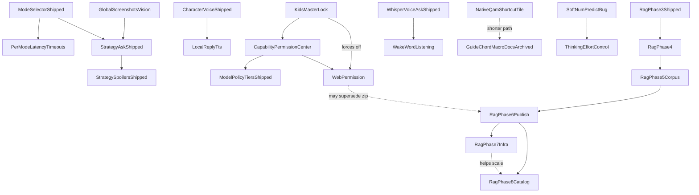

# bonsAI Roadmap

Tracks **bugs and active engineering** ([In Progress](#in-progress)), **known dead code awaiting a call** ([Cleanup candidates](#cleanup-candidates)), **refactor decisions** ([Decisions needed](#decisions-needed) — locked 2026-08-02), deferred **QA** ([QA backlog](#qa-backlog)), the **backlog** ([Planned](#planned)), and pointers to shipped work ([Completed](#completed)).

Setup and vision tuning: [troubleshooting.md](troubleshooting.md). QA: [testing.md](testing.md). Release: [development.md](development.md), [CHANGELOG.md](../CHANGELOG.md).

Star ratings use the GTA scale: `★` easiest … `★★★★★` very high complexity; `★★★★★★` extreme scope.

---

## In Progress

Known **defects** only. Deferred QA lives under [QA backlog](#qa-backlog). *QAMP Phase 1 (safe default) is shipped. Phase 2 (experimental profile sync) remains backlog-only.*

### Bugs

- ★ **Strategy spoiler false-positive:** Genre-aware spoiler policy + KB entity match (DRG Survivor boss names); verify **STRAT-SPOIL-DRG-01** on Deck.
- ★ **Question Overlay Alignment Drift:** The 3-line question overlay has minor horizontal spacing mismatch vs native `TextField` internals.
- ★★★ **Fullscreen picker D-pad edge-escape (audit):** Audit **Pull Models**, **Character picker**, **Ollama models hub**, and other `showModal` pickers for below-list / above-list escape (left from row → primary action; right from trailing control → Close).
- ★★ **Main tab answer D-pad scroll choppy / multi-line jumps:** Scrolling the Strategy reply with D-pad Down still advances many lines per press (choppy, hard to read line-by-line). Do not remove scroll-step logic until on-Deck confirmation after multi-day QA. Regression row: **D-PAD-SCROLL-02** in [testing-manual.md](testing-manual.md).
- ★★ **Live-turn transparency UI missing after successful Ask:** Backend `ensure_context_chips_on_snapshot` + slimmer dev chip JSON + frontend `transparencyUiAvailable` gating; verify **CONTEXT-LADDER-01** on Deck.
- ★★ **Strategy live-turn D-pad graph skips branches/feedback:** Geometry scroll gate + yield-to-parent (`return false`) with Focusable branch picker as turn-slot sibling; verify **MICRO-04** on Deck.
- ★★★ **Soft** `num_predict` **+ thinking budget:** `options.num_predict` is a hard Ollama wall (500 Speed/Expert, 900 Strategy) with no overshoot/continue; `"think": False` avoids empty replies when thinking ate the wall (`done_reason=length`, zero content) but leaves quality on the table for thinking models. **Intent:** length preference with small overshoot OK — not a hard cut, not unlimited. **Fix lean:** (1) raise base caps; (2) continuation on `done_reason=length` (small extra budget, capped continues — especially when content empty/short); (3) optional Reply verbosity → answer `num_predict`; (4) **budget thinking separately** (application policy): re-enable thinking with a fixed Deck default effort (`low`/`medium`) plus answer-floor / continue-if-content-starved; log thinking vs content lengths. Ollama has no true dual hard budgets in one completion — levels + continue stand in. **Not in scope:** delete the ceiling entirely; Settings UI for effort (→ **Thinking effort control**); parallel second Ask; spoiler chip work.
- ★★ **Model routing try-order modal focus + chrome:** Text/vision **Set … try order…** fullscreen (`ModelRoutingOrderModal`) — D-pad focus lands on leaf Up/Down buttons and feels broken; layout/chrome does not match other fullscreen pickers (Pull Models / Character picker / Models hub `ConfirmModal` pattern). Screenshot `DeckCapture_20260730_144925`. Discovery locked 2026-07-30. **Defer** — fetch-on-open + save already shipped; polish later.
- ★★ **KB compat retrieval phrase gate:** Troubleshooting KB (compat hybrid / **Keyword + meaning**) only runs when `question_matches_troubleshooting_log_context` matches a **hardcoded phrase list** in `ollama_prompts.py` (preset-style strings like `proton issue`, `why is my game crashing`). Natural-language asks (e.g. `deck sleep resume proton black screen`) skip the KB entirely — no chip, no hybrid, no **Source: shared troubleshooting tips**. **Intent:** when **Use local knowledge base** is on, attempt compat tip retrieval for general troubleshooting-shaped Asks without growing a brittle regex/preset farm in bonsAI. **Fix lean:** broaden gate (e.g. KB-on + not strategy-with-game → compat shortlist; or lightweight intent/heuristic separate from carousel presets); keep Strategy path AppID-gated. Regression: **KB-SMOKE-07/08** queries in [testing-manual.md](testing-manual.md) must pass without adding new hardcoded strings per smoke case. **Phase 4 discovery (2026-07-30):** lean gate fix (**B1**) ships with Phase 4 when implemented — not a separate forever-defer.
- ★★★ **LB/RB tab switch flicker when scrolled:** Switching tabs with shoulder buttons while focus is deep in a scrolled panel (not on tab icons) flashes/jitters. Investigate carousel + remount/scroll/focus survival (partial anti-flicker CSS already on `TabContentsScroll`). Discovery locked 2026-07-29.

**Fixed 2026-08-02 — session RAG preset chips never appeared.** `get_session_rag_chip_candidates` is now implemented at [main.py:1681](../main.py); the frontend at [sessionRagChipCandidates.ts:54](../src/utils/sessionRagChipCandidates.ts) had called it since the feature shipped, so with **Use local knowledge base** on the call always rejected and the carousel silently fell back to static seeds. The backend it needed already existed — `suggest_chip_candidates` and `session_rag_chip_candidates_to_rpc` in `knowledge_base_service.py`, with tests — so this is the missing RPC adapter only; **no ranking or candidate policy was designed or changed**, per **D1b**. KB-off, missing corpus and corpus read errors all return `{ok: false}` with a reason rather than rejecting. An **unreadable corpus** is additionally written to the plugin log — it is a real fault rather than "this game has no tips", and the console warning the frontend emits is not somewhere anyone looks on a Deck. It is logged once per distinct fault, not per Ask, because the carousel re-queries whenever it has no cached suggestions ([useBonsaiAskOrchestration.ts:244-249](../src/hooks/useBonsaiAskOrchestration.ts)). Coverage: `tests/test_session_rag_chip_candidates_rpc.py` (7 tests) over the existing service tests; on-Deck row **SESSION-RAG-CHIPS-01** in [testing.md](testing.md).

**Fixed 2026-08-02 — pulled model tags never merged into routing order.** `merge_pulled_tags_into_routing_orders` is now implemented at [main.py:1776](../main.py); the frontend call at [OllamaWhereAiRunsSection.tsx:576](../src/components/OllamaWhereAiRunsSection.tsx) had no Python counterpart since the feature shipped. Pulled tags append to a saved try order (or go to the top when they are high-VRAM and that toggle is on), and vision-capable tags also join the vision list. **Deliberate no-op:** when the user has no saved try order, the RPC writes nothing — `resolve_routing_order` derives the chain from installed models ([ollama_routing.py:366-370](../py_modules/backend/ollama_routing.py)) and already includes anything just pulled, so writing a one-tag list would have *narrowed* the chain rather than extended it. Coverage: `tests/test_merge_pulled_tags_rpc.py` (8 tests); on-Deck row **ROUTING-MERGE-01** in [testing.md](testing.md).

---

## Decisions needed

Open questions that need a maintainer call before the work can continue. Written
in plain language on purpose — each one says what the situation is, what your
choices are, and what happens either way. **Locked calls (2026-08-02)** are in
[Maintainer decisions locked](#maintainer-decisions-locked--2026-08-02) below
**D6**; implement from that section when it disagrees with an option above.

Evidence for all of these lives in [docs/audit/](audit/), especially
[05-plan.md](audit/05-plan.md).

---

### D1 — Two features were built with a frontend but no backend. Build them, or remove them?

**What's going on.** Two buttons/flows in the UI call into Python functions that
were never written. The names exist only in TypeScript. Because both call sites
threw the error away, nothing ever surfaced — no crash, no log, no message. They
now log to the console, and both are listed as bugs above.

The two are very different sizes, so you may want a different answer for each.

**Option A — build the small one, delete the big one.** *(my recommendation)*

`merge_pulled_tags_into_routing_orders` is small: after you install models with a
custom setup profile, it should add those models to your try-order list. The
setting it needs (`model_routing_order`) and its validator already exist, so this
is a short piece of work with a clear right answer.

`get_session_rag_chip_candidates` is the bigger one: it should suggest preset
prompts drawn from your local knowledge base for whatever game is running. There
is no backend for it at all, and building one means deciding what counts as a
good suggestion and how to rank them — that is product design, not a refactor.
Deleting the frontend path means the preset carousel keeps using its fixed
built-in prompts, which is exactly what it does today, so users would notice no
change.

**Option B — build both.** You get the RAG preset chips feature you originally
planned. It costs real design time and it is new behavior, so it should not ride
along inside refactor work.

**Option C — delete both.** Smallest and safest. You lose the pulled-model
try-order convenience, which means setting try-order by hand after installing
models.

**Option D — leave them as they are.** They now log loudly, so they are no longer
invisible. Costs nothing, but two dead paths stay in the code and a future reader
has to work out why they are there.

**Either way:** the CHANGELOG entry that announced "Session RAG preset chips" as
a shipped feature has been corrected to say it is frontend-only and not working.

---

### D2 — A whole group of backend functions is unused. Safe to delete?

**What's going on.** When the Proton experiment journal UI was removed on
2026-07-30, the backend behind it was left in place. Five backend functions and
their service module are still there with nothing calling them. The same cleanup
removed the "tiny model thinking blurbs" feature and left
`thinking_tiny_model_service.py` behind — that file is now imported by literally
nothing. There are also six other backend functions with no caller, and a TDP
power-adjustment function whose only remaining caller is its own test.

Altogether that is roughly 12 unused entry points plus two modules.

**Option A — delete it all after one check.** *(my recommendation)*

The check: I looked at the app code only, not the preview test suite. Before
deleting anything I would grep `tests/preview-suite/` to confirm none of these
are driven from there. That is a couple of minutes' work. If it comes back clean,
deleting is safe and makes every future search through the codebase smaller and
less confusing.

**Option B — delete the certain ones, keep the ambiguous ones.** The Proton
journal group and `thinking_tiny_model_service.py` are unambiguous — the features
were removed on purpose. Two others are worth a second thought:

- `ask_game_ai` is described in the code as the *foreground* Ask path. The app
  only uses the background one now. If you ever want a synchronous Ask, this is
  the code for it; if not, it is dead weight.
- `cancel_rag_corpus_download` suggests knowledge-base downloads were meant to be
  cancellable and the button was never wired up. That might be a missing feature
  rather than dead code.

**Option C — keep everything.** No risk, but the confusion stays: a newcomer
reading `main.py` cannot tell which of the 55 functions are live.

---

### D3 — The riskiest refactor has no safety net. How do you want to handle it?

**What's going on.** This is the most important decision here.

The plan's Phase 3.4 wants to break up the two biggest frontend files —
`src/index.tsx` (1,965 lines, changed more often than any other file) and
`useBonsaiAskOrchestration.ts` (the whole Ask flow: submit, cancel, polling,
streaming, follow-ups).

Neither has a single automated test. More broadly, 44 UI component files share
one test file between them. The practical meaning: **`npm test` passing tells you
nothing about whether a UI change broke something.** It would still pass if every
component were deleted. So a refactor that is supposed to change structure
without changing behavior cannot actually be *shown* to have done that.

**Option A — write safety-net tests first, then refactor.** *(my recommendation
if this refactor matters to you)*

Write tests that capture what these files do today, then move code and confirm
the tests still pass. The groundwork exists — there is already a fake backend for
tests (`fakeDeckyRpc.ts`) and three working hook tests — so this is a known
quantity, not an experiment. It is real extra work up front, and it is the only
option where a mistake gets caught before it reaches your Deck.

**Option B — refactor anyway, verify by hand on the Deck.** Faster to start. Each
change needs you to install to the Deck and click through it, and a subtle
regression (focus behaviour, a race in Ask polling) can slip through a manual
pass. If you choose this, the work should be sequenced last and done in small
commits so anything broken is easy to undo.

**Option C — leave those two files alone.** Do the lower-risk items instead
(there are plenty) and accept that the two biggest files stay big. Honest and
zero-risk; the handoff goal is only partly met, since these are exactly the files
a newcomer finds hardest.

The smaller `MainTab.tsx` is a useful middle ground under any option: it is only
187 lines and changes constantly purely because every new feature has to thread
props through it. Fixing that is structural and easy to eyeball.

---

### D4 — Old QA evidence: keep or prune?

**What's going on.** `docs/test-evidence/` holds 263 files across nine folders of
past test-run output. Only three of those folders are linked from any document;
the other six are referenced by nothing. It is the largest directory in `docs/`
and about 96% of it is unreferenced. `testing.md` already anticipated this,
noting orphan evidence folders may be pruned once nothing links them.

**Option A — prune the six unreferenced folders.** Keeps the three that are cited
as evidence. Makes `docs/` much smaller and easier to look through.

**Option B — keep everything.** It is only disk space, and old run output can be
useful when chasing a regression that reappears.

**Option C — prune, but archive first.** Zip the removed folders somewhere
outside the repo, same approach used for the v0 drafts in Phase 0.

I have no strong view — this is about what QA history is worth to you, not about
code quality. I did not touch it.

---

### D5 — Import graph: keep the built-in one, or switch to madge?

**What's going on.** You approved adding a dependency graph so the refactor can
answer "who imports this file?" reliably. The plan suggested the `madge` tool.
madge was not installed, and this generator runs on **every commit** via the
pre-commit hook, so adding a tool plus a multi-second graph build to every commit
seemed like the wrong trade. I wrote a small built-in version instead — about 50
lines, no new dependency, instant.

It currently reports 479 imports, no circular dependencies, no orphans. It has
already proved more accurate than searching by hand: checking what imports
`deckyCall.ts`, it found 15 files where my own grep found 14.

**Option A — keep the built-in one.** *(my recommendation)* Fast, no dependency,
and it does what the refactor needs.

**Option B — switch to madge.** More battle-tested and handles exotic import
styles this codebase does not currently use. Costs a dependency and slows every
commit slightly. Worth doing if you ever add TypeScript path aliases, which would
make the simple version unreliable.

---

### D6 — Sequencing: what should I do next?

Not a hard decision, just a checkpoint. The audit produced a ranked plan in
[05-plan.md](audit/05-plan.md). The first four items are all low-risk, mechanical,
and verifiable by the compiler and existing tests:

1. Delete the unused backend code (needs **D2**)
2. Fix four one-line inaccuracies in the docs, and move a plan document that
   declares itself archived into the archive folder
3. Delete `refactor_helpers.py` — a leftover forwarding file that adds nothing
   (careful: the deploy scripts copy it, so that has to be updated too)
4. Delete `settingsAndResponse.ts` — another forwarding file, this one with 22
   files pointing at it

Together these measurably shrink the codebase without requiring any design
decision. **D3** is the one that changes the shape of everything after it.

Also worth knowing: the friction test (having a fresh pair of eyes try a real
task and log everywhere they got stuck) is deferred until after the refactor, per
your earlier call, so it will measure the improved codebase rather than the
starting point.

---

### Maintainer decisions locked — 2026-08-02

The options above stay as the decision record. **Locked below** is what we are
doing and why. Where a locked call disagrees with an earlier recommendation in
**D1–D6**, the locked call wins — some premises were corrected after reading the
current tree (especially **D1b** and parts of **D2** / **D4**).

| Id | Locked decision | Why |
|----|-----------------|-----|
| **D1** | **Finish both missing RPCs** — `merge_pulled_tags_into_routing_orders` and `get_session_rag_chip_candidates` | Both are wiring gaps, not greenfield features. Routing merge reuses `merge_pulled_tag` / `sanitize_model_routing_order` for `text_model_routing_order` and `vision_model_routing_order`. Session RAG already has `suggest_chip_candidates` + tests in `knowledge_base_service.py`; only the public RPC adapter on `class Plugin` is missing. Restores intended UX without reopening Phase 4 visibility / Phase 5 vector ranking. |
| **D2** | **Targeted dead-code cleanup** — delete confirmed orphans; **archive** tiny-model thinking code; keep active Ask, debug, and KB-cancel paths | Proton journal RPCs + service, `apply_tdp` (+ its test-only caller), `log_navigation`, and legacy `capture_screenshot` are safe to remove after preview-suite grep. **`ask_game_ai`** stays — preview suite drives it. **`ask_ollama`** stays — every Ask calls it internally. **`dbg_fe_log`** stays — intentional on-Deck debug bridge. **`cancel_rag_corpus_download`** stays — backend cancel path exists; UI Cancel is planned (**D2 follow-up**). **`thinking_tiny_model_service.py`** is **deleted outright** in `c8ed045`; git history is the archive. To restore the tiny-model thinking blurbs: `git show c8ed045^:py_modules/backend/services/thinking_tiny_model_service.py`. An in-tree archive folder was rejected — the file would still surface in greps and still need explaining, which defeats the point of the cleanup. |
| **D3** | **Option A — characterization tests first, then refactor** | `index.tsx` and `useBonsaiAskOrchestration.ts` have zero automated coverage; `npm test` would pass if every component were deleted. `fakeDeckyRpc.ts` + existing hook tests prove the pattern. Preview and on-Deck QA still required for D-pad and layout. |
| **D4** | **Prune by policy, not by folder count** | Keep evidence linked from current or archived QA docs; keep the latest useful pass per tier and meaningful failure runs. Audit links before deleting anything. Remove only duplicate, incomplete, or truly unreferenced generated runs. Add a retention rule so future `--write` runs do not grow `docs/test-evidence/` without bound. |
| **D5** | **Option A — keep the built-in import graph** | Fast, no dependency, runs on every commit, and matches today's relative-import-only `tsconfig`. Revisit only if path aliases land, unresolved internal imports appear, or a parser-based tool finds real discrepancies. |
| **D6** | **Sequencing below** | Fix real user-visible gaps before shrinking/refactoring; build the safety net before the risky split; measure handoff friction on the improved tree. |

**Execution order (locked, amended 2026-08-02):**

1. **Record decisions** — this section; turn accepted work into implementation rows as work ships. *(done — `dcbcccf`, `e2111f9`, plus this amendment)*
2. **D1 — wire both RPCs** — **done 2026-08-02**, see Bugs § *Fixed*. D1a routing merge (`510139d`) and D1b session RAG adapter, 13 new unit tests between them. On-Deck QA still open: **ROUTING-MERGE-01** and **SESSION-RAG-CHIPS-01** in [testing.md](testing.md). **This is feature work, not refactor** — separate commits, not labeled behavior-preserving, and it changes what `useBonsaiAskOrchestration.ts` does at runtime. Sequenced before step 5 on purpose so the characterization tests capture intended behavior rather than the silent-fallback bug.
3. **D2 — targeted cleanup** — **done 2026-08-02** (`309c386`, `ebdc0f2`, `c8ed045`, `45cb0ff`, `d93027b`, `36f34cd`). Removed: 5 Proton-journal RPCs + their service, `thinking_tiny_model_service.py`, `log_navigation`, `capture_screenshot`, and the TDP sysfs write path. Kept per D2: `ask_game_ai`, `ask_ollama`, `dbg_fe_log`, `cancel_rag_corpus_download`. RPC surface 57 → 50. Two things the audit got wrong are recorded in [05-plan.md](audit/05-plan.md) §1.1: the journal service was not dead (`clear_plugin_data` needed its file wipe) and `find_amdgpu_hwmon` was not apply-only (`read_current_tdp_watts` calls it). Still orphaned and deliberately not pursued: `try_kmsgrab_screenshot` and `_desktop_session_active` in `screenshot_media.py`.

   **Preview-suite gate — first pass was incomplete.** Grepping `tests/preview-suite/` and `scripts/` for *symbol* names returns zero hits for `proton_experiment`, `apply_tdp`, `log_navigation`, `capture_screenshot`, `dbg_fe_log`, `cancel_rag_corpus_download`, `thinking_tiny`, and 22 hits for `ask_game_ai` across five tiers (keep, per D2). **That grep missed file-level references.** `tests/preview-suite/unit-gates.json:25` runs `tests/test_tdp_sandbox_sysfs.py` by filename under a gate tagged `TDP-APPLY`, and `tier-manifest.json:96` advertises "sysfs TDP apply + clamp asserts" in the Tier 2 description. Only two test files are referenced this way — the other is `test_capabilities.py` — so no other deletion in this pass was affected. **When checking whether a deletion is preview-safe, grep the preview suite for the test filename as well as the symbol.**
4. **Mechanical refactors** — **done 2026-08-02** (`3813764`, `666e3e3`, `2156441`, `ef65f8e`), one behavior-preserving commit each, all gates green between. Four stale doc claims fixed and the self-declared-archived RAG analysis moved to `archive/`; `refactor_helpers.py` shim deleted and its 9 importers repointed; `settingsAndResponse.ts` barrel deleted and its 22 importers repointed (`tsc --noEmit` is the safety net here); `settingsPayload.ts` split, with reply-text formatting moved to `appliedTuningText.ts`.

   **Deploy gate — passed, and it mattered.** The shim was referenced by `build.sh`, `build.ps1` and `verify-decky-plugin-zip.sh`, none of which any test covers. Deployed to the Deck and confirmed `bonsAI plugin loaded!`. **The first load proved nothing**: the deploy scripts copy without pruning, so the deleted shim was still sitting on the Deck from an earlier deploy and would have satisfied any import that had been missed. Deleting it plus `__pycache__` on-device and restarting `plugin_loader` is what made the check real. See [05-plan.md](audit/05-plan.md) §1.3 — **any future deletion of a Deck-facing Python file needs the same step.**
5. **D3 — safety net** — **done 2026-08-02.** 22 new tests (suite 217 → 239): `useBonsaiAskOrchestration.test.ts` covers submit guards, request payload, the invalid / blocked / completed / thrown-error branches, polling, cancel, and thread archiving; `index.test.tsx` covers the Decky contract, a real mount, settings wiring, the tab set, and error containment. Both **mutation-checked** — three deliberate breaks in each turn the suite red — because a characterization test that cannot fail is worse than none. Three harness defects had to be fixed first and are recorded in [04-coverage.md](audit/04-coverage.md): vitest collected only `*.test.ts` so **a `.tsx` test could never run**, jsdom lacks `ResizeObserver` so the tree silently rendered the ErrorBoundary fallback, and `globals: false` left renders leaking between tests.
5b. **D3 — entry-point split, in progress 2026-08-02.** `index.tsx` 1955 → 1709 across three commits: `984498e` moved the stateless shell pieces (error boundary, localStorage helpers, tab titles) to `src/features/plugin-shell/`; `26c67e6` moved voice Ask input to `src/features/voice/`; `fda8051` moved the try-order modal to `src/features/model-routing/`. Destination follows REFACTOR-PLAN §3.4 (vertical slices), not the type-buckets.

   **Measured finding that redirected the work:** extracting the tab JSX — the obvious first move — is a *lateral* change. The six tab payloads thread 94 (`mainTab`), ~30 (`ollamaTab`), 27 (`settingsTab`) and 21 (`developerTab`) props out of `Content`'s scope, so moving one to its own module means declaring those props a second time as an args type. `index.tsx` would shrink while the codebase got worse. The threading is a *symptom* of state living in `Content`; each state extraction deletes props instead of copying them, and the tab JSX becomes cheap to move only afterwards. **Do the state first.**

   **Remaining in `Content`:** character-picker modal (~76 lines, ~11 deps), Ollama models hub (~84, ~10), desktop-note modal (~49), plugin-help modal (~11), plus connection/IP, session-reset, UI-scale and error-capture state. Then the tab payloads.

6. **2.3 — `main.py` extraction investigation** — read-only; produce a `file:line` inventory of what logic remains inline in `main.py` and where each piece belongs ([05-plan.md](audit/05-plan.md) §2.3). Feeds both step 7 and the `main.py` half of step 8.
7. **2.2 — settings single source of truth** — REFACTOR-PLAN §3.1, the highest-value item in the audit and the best-covered by existing tests (`tests/test_settings_service.py` asserts per-setting round-trips). Expect that suite to break on shape, not behavior — rewrite the assertions, do not contort the design.
8. **D3 — entry-point split** — `index.tsx` / orchestration refactor in small commits; preview pass per commit; on-Deck for focus and Ask regressions.
9. **KB download Cancel button** — wire `cancel_rag_corpus_download` in `KnowledgeBaseSection.tsx`; D-pad row in `testing.md` / `testing-manual.md`.
10. **D4 — evidence hygiene** — link audit, prune orphans only. The retention rule must live **in the script that writes evidence**, not in a doc — a rule that depends on remembering is not a mechanism.
11. **Deferred friction test** — run Phase 2c newcomer task on the post-refactor tree; file `docs/audit/03-friction.md`.

**Amendment rationale (2026-08-02):** steps 6 and 7 were missing from the original
order. As first written it ran the riskiest, least-covered work (entry-point
split) while skipping the highest-value, best-covered work (settings SSOT), and
left step 8 without the `main.py` inventory it needs. Both are restored ahead of
the split.

**Corrections to audit premises (for implementers):**

- **D1b:** `suggest_chip_candidates` ([knowledge_base_service.py:685](../py_modules/backend/services/knowledge_base_service.py)) and `session_rag_chip_candidates_to_rpc` (`:744`) already exist with four tests in `tests/test_knowledge_base_service.py`. **`main.py:163-164` already imports both and never calls them** — the work was interrupted between the import and the method. The frontend sends `[appId, appName, shortcutName]` ([sessionRagChipCandidates.ts:55](../src/utils/sessionRagChipCandidates.ts)), which matches the service signature exactly. This is an adapter of roughly ten lines. Do not redesign ranking before wiring it.
- **D2:** `ask_game_ai` is not dead — `tests/preview-suite/` calls it extensively. `ask_ollama` is the internal Ask engine, not an orphan RPC.
- **D4:** Six of nine evidence folders are not all unreferenced — several are cited from [archive/testing-results-2026.md](archive/testing-results-2026.md) and [archive/testing-failures-2026.md](archive/testing-failures-2026.md). Prune only after a link audit.

---

## Cleanup candidates — locked and executed 2026-08-02

Dead or hazardous code found during the 2026-08-02 refactor. All five rows were
locked by the maintainer and, except the deferred one, executed the same day.
Nothing here changed product behavior.

| # | Locked decision | Outcome |
|---|---|---|
| 1 | **Delete the one-shot migration scripts** | `071221e` — `scripts/extract_ollama_section.py` and `scripts/trim_settings_tab.py` gone. They rewrote `SettingsTab.tsx` / `OllamaWhereAiRunsSection.tsx` from source text hardcoded inside the scripts; running either would have reverted real components and reintroduced the deleted `settingsAndResponse` barrel import. Keeping them was the hazard |
| 2 | **Delete the orphaned kmsgrab capture sub-tree** | `4a26cfa` — six functions, not the four enumerated. `_build_kmsgrab_argv` was called only by `try_kmsgrab_screenshot`, and `gamescope_session_active` only by `_desktop_session_active`, so stopping at four would have left the same problem one node deeper. Preview gate run on **symbols and filenames** both, per the TDP lesson: clean. Live capture paths untouched |
| 3 | **Remove the `journal_text` plumbing** | `a029c2d` — parameter dropped from `stack_context_blocks`, caller stopped passing `""`. Its ordering test asserted a three-block arrangement that can no longer occur and was replaced with one covering what the stacker still guarantees. The duplicate roadmap note under Planned is collapsed |
| 4 | **Remove the `sysfs_writes` reader and field; keep the preview hook empty** | `a9353cc` — `read_sandbox_sysfs_writes` and the `get_input_transparency` field gone; `sandbox_sysfs_root` stays because `find_amdgpu_hwmon` needs it. `getSysfsWrites` kept returning `[]`: the in-repo runner never calls it, but `__bonsaiTestHooks` is consumed by DPS scenarios outside this repo, so the contract stands |
| 5 | **Defer the `docs/archive/` broken links to D4** | Not actionable here by decision. 272 relative links in historical files point at a `docs/` layout that no longer exists; fixing them is evidence hygiene, not code legibility. Folded into **D4** — see [06-doc-triage.md](audit/06-doc-triage.md) § Link audit. Live docs are already link-clean |

**Found while executing, not in the lock and not actioned:**
`_reencode_oversized_capture` and `_mirror_capture_to_plugin_dir` in
`screenshot_media.py` have no callers **and had none before this work** — they
are pre-existing dead code, not a cascade from these deletions, so they were
left for a separate decision rather than folded in.

---

## QA backlog

Maintainer on-Deck / qualitative work — **not** active feature engineering. Detail and checklists: [testing.md](testing.md), [testing-manual.md](testing-manual.md).

- ★★ **Device QA — Tier 0–1:** Execute Tier 0 smokes (SMOKE-A, C, F) then Tier 1 (SMOKE-B, E, H); update coverage with Pass / Partial / Fail + build id. Tier 2+ before release.
- ★ **VAC / `bonsai:vac-check` (Phase 1) — on-device QA:** Implementation complete; finish **VAC-02…06** after Tier 0 **SMOKE-F** passes.
- ★★★ **QAMP verification checklist:** Per-game profile on/off, QAM Performance reopen, Steam restart/reboot, GPU-clock recommendation paths. See [testing-manual.md](testing-manual.md) § QAMP.
- ★★ **Prompt testing pass:** Broader systematic validation beyond the shipped prompt-testing MVP matrices.

---

## Planned

Stars are **effort/risk** within bands. Grouped by **horizon**; **within each horizon sorted ascending by star rating**.

- **Near-term:** Incremental product work, bounded research spikes.
- **Medium-term:** Larger features inside the plugin + user-hosted stack.
- **Long-term:** ★★★★★★ scope and/or ★★★★★ work gated on upstream APIs or broad surface area.

**GitHub tracking:** Each **Planned** item rated **★★★★★** or **★★★★★★** includes a placeholder link to **[bonsAI Issues](https://github.com/cantcurecancer/bonsAI/issues)** (replace with a specific issue URL when created).

**Planned titles:** Short **noun-first** label (about 3–6 words); secondary context in parentheses. Detail under **Goal** / **Primary work**.

### Near-term

Within this section: ascending stars (★ → ★★★★).

- ★ **Intent packs later review** (keep / quiet / Developer — discovery leftover 2026-07-30)
  - **Goal:** Decide whether the quiet intent-pack search aliases should be deleted, left quiet, or revived under Developer.
  - **Proton journal half closed 2026-08-02.** The 5 journal RPCs and `proton_experiment_journal_service.py` are gone (`309c386`, `ebdc0f2`); only the file wipe survived, relocated into `plugin_data_reset.py` because **Clear all data** still needs it. The last of the plumbing — the `journal_text` parameter on `stack_context_blocks` — was removed on the Ask path in the cleanup pass. Reviving the feature now means rebuilding the store, not re-enabling a flag.
  - **Not in scope:** rewriting unified search ranking; re-shipping journal inject without a redesign.
- ★★ **Preset chip expansion** (streaming / LAN / Steam Input — incremental)
  - **Baseline shipped:** `PRESET_PROMPTS` in [`src/data/presets.ts`](../src/data/presets.ts).
  - **Goal:** Add or refresh preset strings as related features land — content tuning only.
  - **Not in scope:** treating each string batch as a versioned feature ship. AppID/session RAG chips → shipped (**Session RAG preset chips**).
- ★★ **Spoiler confidence chip** (transparency estimate — decisions locked 2026-07-29)
  - **Goal:** Concise Show details context-chip estimate of topic spoiler likelihood on **all Ask modes** — chip label `Spoiler risk: med` (bands `low` / `med` / `high`; keep ≤ ~18 chars).
  - **Status:** Decisions locked; ready to implement (standalone). Distinct from hybrid retrieval.
  - **Discovery locked (2026-07-29):** bands only; score from genre + intent + KB `section_type` + entity match + optional model tag `<bonsai-spoiler-risk>` (~60% when parsed); always show under Show details; v1 transparency-only (no fencing change); heuristic ASAP while streaming; no parallel rater Ask.
  - **Related:** **User-adjustable spoiler fencing**; **Unfenced spoiler feedback**.
  - **Not in scope (v1):** Calibrated ML probability; percent chip copy; parallel rater Ask; changing fencing from this chip.
- ★★ **Unfenced spoiler feedback** (thumbs-down category)
  - **Goal:** After thumbs-down, refinement chip for **unfenced spoilers** (and optional over-fenced sibling). Improves future Asks — does not fix the current turn.
  - **Depends on:** reply micro-actions; **Spoiler confidence chip** signals useful later.
- ★★ **User-adjustable spoiler fencing** (hide by risk band)
  - **Goal:** Settings control for when to apply tap-to-reveal / fence masking from estimated risk — e.g. hide when risk ≥ **high** / **med** / **low**, or **never hide**.
  - **Depends on:** **Spoiler confidence chip**; shipped `strategy_spoiler_masking_enabled`.
- ★★ **Thinking effort control** (Settings Off / Low / Medium / High)
  - **Goal:** User-adjustable Ollama thinking effort mapped to `think: false | "low" | "medium" | "high"` (global v1).
  - **Depends on:** **Soft** `num_predict` **+ thinking budget** (Bugs).
  - **Not in scope:** shipping Settings before the soft-budget bug fix.
- ★★★ **Dynamic keep-alive / smart unload** (research spike — discovery locked 2026-07-29)
  - **Goal:** Research-only: hold models loaded vs unload when a game takes focus, safely on Deck APU shared memory? Spike decides go/no-go. No ship commitment until spike writes outcome.
  - **Not in scope:** promising true per-game VRAM detection; production unload before spike doc.
- ★★★ **Per-mode latency timeouts** (warn vs hard limit profiles)
  - **Goal:** Separate warning and timeout values per selected mode.
  - **Depends on:** Mode selector (shipped).
- ★★★ **Custom model in Pull Models picker** (custom pull + Ask pin + New badges)
  - **Goal:** Pull any valid Ollama-library tag not in curated catalog; **Use for Ask** pin; **New** badge (released within 30 days). Custom pull is backup to living overlay; background catalog refresh when stale.
  - **Primary work:** Phase 1 Pull UI + Ask pin + routing prepend + New badge; Phase 2 hooks to future text model chains.
  - **Depends on:** shipped Pull Models picker + living overlay merge.
  - **Not in scope:** LAN/remote `ollama pull` (→ **LAN custom model pull**); Modelfile UI; full chain editor in v1.
- ★★★ **Search density UX** (match emphasis + tighter rows)
  - **Goal:** Tighter, more scannable results: spacing, wider lines, incremental filtering, highlighted match tokens.
- ★★★ **KB visual maps** (strategy maps — light prelim)
  - **Goal:** Optional visual strategy maps in KB-grounded replies — light prelim discovery only until closer to implementation.
  - **Depends on:** mature strategy corpus + Phase 3/4 retrieval quality.
  - **Note:** Separate roadmap row — not folded into RAG Phase 4–8.
- ★★★★ **Llama.cpp provider spike** (Deck perf / replacement eval)
  - **Goal:** Research-only: can Deck-local llama.cpp beat Deck-local Ollama enough to justify a possible long-term replacement? **No code** in this spike. Supersedes the 2026-05-20 go/no-go in [llama-cpp-provider.md](archive/spikes/llama-cpp-provider.md).
  - **Discovery locked (2026-07-17):** Baseline Deck-local Ollama **gemma4 E2B**; go bar must win **both** game FPS hitch **and** peak GPU memory; load = DRG Survivor. Write `docs/archive/spikes/llama-cpp-provider-eval.md` (the spike's deliverable — does not exist yet).
  - **Not in scope:** Production provider UI/code; LAN/remote llama.cpp; cloud APIs.
- ★★★★ **SteamOS Share path** (capture → attach)
  - **Goal:** Faster path from SteamOS **Share** / capture flows into screenshot attach where APIs allow.
  - **Not in scope:** kernel framebuffer hacks as default.
- ★★★★ **SteamOS spin hint card** (immutable spins)
  - **Goal:** Detection + deep link to troubleshooting for immutable spins.
  - **Not in scope:** auto-fix firewall rules.
- ★★★★ **RAG Deck query — extended retrieval (Phase 4)**
  - **Goal:** Richer retrieval and content shapes after Phase 3 — session chip **visibility**, structured enemy/item sample cards + light reply bullets, T1 per-game AppID compat tips, lean compat phrase-gate fix.
  - **Status:** Discovery locked 2026-07-30; **docs only** — not implementing yet. Full lock: [knowledge-base.md](knowledge-base.md) § Phase 4.
  - **Discovery locked (2026-07-30):** All three tracks in one ship when implemented. Track 1 = visibility first (**V1+V3+V4**): guarantee ≥1 RAG chip when candidates exist (prefer game RAG → **Tip** badge; compat fallback); reseed so remix actually runs; **Tip** badge on **game** RAG chips only. Track 2 = **C3** corpus + reply shape, **R1** light bullets, **S1** sample on DRG Survivor + OoT/SoH, **F2** fields, both enemies+items, unfenced when user named the entity. Track 3 = **P1** prefer per-game tips then shared; **T1** ~3–5 tips × sample titles; same hybrid; **B1** lean phrase-gate fix; **N1** no game → shared only; **U1** no new Settings.
  - **Depends on:** Phase 3 (shipped 2026-07-29).
  - **Not in scope (Phase 4):** Chip **vector ranking** (→ Phase 5); broad per-game tips beyond T1 (→ Phase 5); structured cards beyond DRG+OoT sample (→ Phase 5); custom UI enemy/item cards / **KB visual maps**; public HF publish (→ Phase 6); sqlite-vss / auto-pull nomic (→ Phase 7).
- ★★★★ **RAG retrieval quality remediation** (hybrid fix + eval honesty — discovery locked 2026-08-02)
  - **Goal:** Fix shipped hybrid defects (nomic prefixes, RRF instead of cosine-only rerank, relevance floor, query/transparency bugs) and re-validate with a deepened seed + honest eval (tune/holdout; no self-referential card→query pairs).
  - **Status:** Decisions locked; **docs only** until PR1. Active plan: [rag-retrieval-quality-remediation-implementation-plan.md](rag-retrieval-quality-remediation-implementation-plan.md). Analysis (archived): [archive/rag-retrieval-quality-remediation-plan.md](archive/rag-retrieval-quality-remediation-plan.md).
  - **Ship shape:** **PR1** = Stages 1–5 infra (provisional loose floor); **PR2** = Stage 6 corpus/eval/kill-switch; maintainer sign-off on cards + eval before bake-off; holdout is the ship gate.
  - **Open:** Compat phrase gate product fix deferred (roadmap Bugs row); eval must report gate-reachable vs overall compat scores.
  - **Not in scope:** sqlite-vss/ANN; auto-pull nomic; public HF; Phase 5 chip ranking / wiki ingest; trust-tier-in-RRF.
- ★★★★ **RAG Deck query — corpus expansion (Phase 5)**
  - **Goal:** Finish Phase 3 **11-title** corpus maturity after Phase 4 sample paths — profiled tips/structured cards + heavier wiki ingest; then session chip **vector ranking** (baked cold-open / live after Ask).
  - **Status:** Discovery locked 2026-07-30; **partially rescoped 2026-08-02** — **strategy seed deepening (~8–12 sections/game) ships in RAG retrieval quality remediation PR2** for eval honesty; Phase 5 keeps the rest. Full lock: [knowledge-base.md](knowledge-base.md) § Phase 5.
  - **Discovery locked (2026-07-30):** Content → ranking. Depth-first on all 11 (no net-new titles); profiled minimum bar (~3–5 tips + strategy sections; enemy/item handful where genre fits); heavier wiki ingest with complete attribution as added; shared tip sheet stays ~as-is; no size budget; Dev-tab install only. Chip ranking hybrid with precomputed cold path; keep ~30% + Phase 4 ≥1 guarantee; no new Settings. Spoiler high-flag metadata only (no runtime). Non-Steam/alias must retrieve (SoE). Speed/Expert light KB only. Exit = content bar + KB-EVAL + smoke on DRG, OoT/SoH, Cyberpunk, RDR2, SoE.
  - **Strict gate amended (2026-08-02):** Seed deepening for remediation eval may proceed **without** waiting for Phase 4 implement + smoke. Remaining Phase 5 work still depends on Phase 4 sample paths where noted.
  - **Depends on:** Phase 4 implementation + on-Deck QA of sample paths (except remediation seed depth — see above).
  - **Not in scope:** Public HF/GitHub publish (→ Phase 6); sqlite-vss/ANN; auto-pull `nomic` (→ Phase 7); catalog-scale titles (→ Phase 8); custom UI cards / **KB visual maps**; new Settings; net-new titles; material shared-tip growth; runtime spoiler behavior from corpus flags; RRF FTS+vector (→ remediation, then Phase 7 for trust/ANN extensions).
- ★★★★ **RAG Deck query — public publish (Phase 6)**
  - **Goal:** First public versioned corpus + manifest (HF primary, GitHub Releases mirror) after Phase 5 maturity + legal scrub — closes **KB-DOWNLOAD** Partial.
  - **Status:** Light discovery locked 2026-07-30; **docs only** — fuller Phase 6 discovery later. Lock: [knowledge-base.md](knowledge-base.md) § Phase 6.
  - **Discovery locked (light, 2026-07-30):** Publish **Phase 5’s matured 11** + shared tips only (not catalog). Full ATTRIBUTIONS / no placeholder licenses on first public tag; NOTICE that sources can err → fix forward. Point-release updates. Manifest **forward-hooks** for future packs/deltas (unused at v1 OK). sqlite-vss/ANN + nomic + Phase 7 optional paths → **Phase 7**; catalog scale → **Phase 8**.
  - **Depends on:** Phase 5 corpus expansion + extended on-Deck KB testing; legal scrub of published zip.
  - **Not in scope:** sqlite-vss/ANN; auto-pull `nomic`; demote/vision→KB (→ Phase 7); core RRF FTS+vector (→ remediation); Steam ~1000 / Deck ~100 / emu catalog (→ Phase 8). Pack/delta **wire format** is Phase 7+ (hooks only in Phase 6).
- ★★★★ **RAG Deck query — retrieval infra (Phase 7)**
  - **Goal:** Optional **sqlite-vss / ANN**; optional **auto-pull `nomic`** (consent); plus optional paths — **RRF extensions** (trust/demote lists; ANN as another RRF list), **vision→entity→retrieve**, retrieval **thumbs + local demote**, **delta/packs**, **named thinking hit**; plus **intent retrieval** (keyword-heavy blend + meaning when FTS weak; gated translate for non-English).
  - **Status:** Tight discovery locked 2026-07-30; **intent / cross-lingual locks extended 2026-07-31**; **RRF FTS+vector pulled forward 2026-08-02** into [RAG retrieval quality remediation](rag-retrieval-quality-remediation-implementation-plan.md). **Docs only** for remaining tracks — fuller discovery later. One umbrella; tracks not gated on each other; UX may ship earlier when deps exist. May spike in parallel with Phase 6; **must not block** first public publish. Full lock: [knowledge-base.md](knowledge-base.md) § Phase 7.
  - **Discovery locked (tight, 2026-07-30):** Silent RRF (FTS+vector+trust; +demote when ready) — **FTS+vector ships in remediation**; trust/demote/ANN extensions remain here. ANN↔RRF deferred (hypothesize ANN as another RRF list); vision same-Ask piggyback (no extra extract call; lean Strategy+screenshot+KB, gate deferred); thumbs `wrong_tip`/`outdated`/`wrong_edition`; demote = JSONL + index, soft then hard, needs `section_id`s; Phase 6 manifest forward-hooks; core + optional packs; delta = goal only; name thinking hits (fence on reply); screenshot+KB preset deferred; first-run wow out.
  - **Discovery locked (intent, 2026-07-31):** From bake-off [kb-embed-bakeoff-2026-07-31.md](archive/research/kb-embed-bakeoff-2026-07-31.md) — keep **`nomic-embed-text`**. Ranking = **C** (strong FTS → keyword-heavy blend; empty/weak FTS → meaning/ANN fallback into RRF). Cross-lingual v1 = **gated translate → English → search** (chat/routing model, not nomic; rare second call; prefer one reply Ask). Fuzzy Deck-term glossary = nice-to-have. **Avoid:** dual vector tables in one zip; mixing a second embed against nomic-baked vectors; routine translate. Multilingual embed only later via **second corpus** or **on-device re-embed** (explicit follow track). **Note (2026-08-02):** bake-off “keyword beat hybrid” conclusion is **under remediation** — do not treat as settled architecture truth until the superseding report lands.
  - **Depends on:** Phase 6 publish path healthy (or spike-only until then). Demote needs KB slice `section_id`s; some UX can precede ANN. Remediation PR1/PR2 preferred before relying on RRF in production.
  - **Not in scope:** Replacing Phase 6 publish; catalog authoring (→ Phase 8); cite-to-source tap; faithfulness chip; abstain; KB browser; cross-encoder; cloud demote sync; first-run wow; multilingual default embed; dual nomic+multilingual vectors in one download.

### Medium-term

Within this section: ascending stars (★★★★ → ★★★★★★).

- ★★★★ **LAN custom model pull** (remote host — decision review)
  - **Goal:** When Ask uses a **LAN Ollama host**, let users add/pull models not in the bonsAI catalog — **blocked until mechanism is chosen** (R1 instructions-only / R2 Deck pull while LAN Ask / R3 remote execution / R4 pin-only).
  - **Depends on:** **Custom model in Pull Models picker** (Deck-local v1).
  - **Not in scope:** shipping without explicit mechanism sign-off.
- ★★★★ **Steam Input layout parse** (VDF → AI context)
  - **Goal:** Parse controller VDF configs and feed actionable control context to AI.
  - **Not in scope:** editing/writing controller configs.
- ★★★★ **Web permission** (Ask live search + online deps — discovery in progress)
  - **Goal:** Opt-in capability so Ask can fetch live answers about current games/patches/news (web search spine). Offline Ask + local KB remain usable when permission is off or network is down. HF AppID card streaming and Ollama catalog freshness are dependents / related follow-ons, not the primary job.
  - **Status:** Discovery in progress (2026-07-30); **docs only** — not implementing yet. Resume discovery or say “ready to plan” to lock a full plan into this bullet.
  - **Discovery locked (2026-07-30):**
    - Spine = **web search for Ask**; HF stream + Ollama catalog updates are dependents/follow-ons (**bundle model C**).
    - Primary user job = live patches/news/current-game answers (not smaller KB first).
    - Offline contract = always usable when Web off or network down; only live/extra bits skipped.
    - Wanted product pieces: **citations in Show details**, **domain allowlist**, **freshness chip**, **HF card stream by AppID**.
    - Auto-search when question looks “current” (**consent A**).
    - Kids Master Lock → Web **forced off** (cannot enable).
    - Enabling Web → **ConfirmModal** explaining in simple terms that Ask text (and maybe game AppID/title) may leave the Deck to a search provider.
    - Search implementation tech = undecided; choose for Deck latency + privacy at implement time.
    - Domain allowlist starter set OK for now (Steam news/changelog, ProtonDB, relevant wikis; HF host for cards).
    - HF stream intended to **replace the big zip download over time**.
    - Ollama “constantly updates models it can pull” = **related follow-on Planned item**, not in this bullet’s ship scope.
  - **Useful ideas deferred / not locked:** per-Ask opt-in, cache+TTL, bandwidth caps, Steam context in query, KB vs web conflict policy (see open decisions).
  - **Depends on:** Capability Permission Center; Kids Master Lock; existing Show details / Source patterns; Strategy spoiler fencing (interaction TBD).
  - **Related (separate):** Ollama Pull Models living catalog refresh / Update AI & models (already partly shipped) — do not merge into this item; track as follow-on if needed. RAG Phases 4–8 (zip/corpus) may need reconcile when HF stream replaces zip.
  - **Not in scope (this item):** shipping search/HF stream code yet; merging catalog refresh into v1; requiring agentic multi-hop search.
  - **Open decision points** (hold for implement / next discovery — do not block this stub):
    1. **“Current” heuristic triggers** — Which intents auto-search? (patch/changelog, news/release, live MP/outage, prices/sales, SteamOS/Proton version, date words, other)
    2. **False-positive preference** — Extra search OK vs prefer miss vs cancelable “Searching web…” affordance
    3. **Latency budget** — +2–5s / +5–15s / progress UI only
    4. **KB vs web conflict** — Web-by-freshness / KB for strategy·web for patches / always both+Show details / defer
    5. **Citations v1** — title+domain+link vs title+domain only; snippet quote optional?
    6. **Freshness chip placement** — Show details only / bubble chip / both; clock = fetched-at vs page published/updated
    7. **Local-only transparency** — Silence when heuristic skips vs quiet “Local only” under Show details
    8. **Roadmap shape vs HF stream** — Search-first then HF phase of same epic / one Planned with phases / two Planned items
    9. **Reconcile with RAG Phases 4–8** — Evolve Phase 6+ to card API / parallel track superseding zip / note conflict and resolve later
    10. **End-state without zip** — Web ON → on-demand AppID cards; Web OFF → local corpus or model-only — confirm
    11. **Metered / weak Wi‑Fi** — Hard skip / soft toast / nothing in v1
    12. **Spoilers + web** — Fence like KB / exclude from Strategy / allow with citation only
  - **Follow-up discovery prompts** (when resuming):
    - Non-goals: upload of screenshots/logs with web search? telemetry?
    - Provider choice constraints (no API key vs user-supplied vs bonsAI-proxied)?
    - Cache retention of search snippets / HF cards on disk (privacy wipe on Clear all data)?
    - Star weight / hard deps on Phase 4–6 (revisit if scope grows)
    - D-pad: Permissions row + ConfirmModal focus graph; any Main-tab “Searching…” control
    - Testing rows: Web on/off, Kids Lock, offline failover, allowlist miss, Show details cites
- ★★★★★ **Named chat slots** (labeled threads — redesign only)
  - **GitHub (tracking placeholder):** [bonsAI Issues](https://github.com/cantcurecancer/bonsAI/issues) — dedicated issue TBD.
  - **History:** We previously implemented named chat slots. It was **seriously bugged** (persistence/picker/overwrite behavior) and was **removed**. Leftover folders on device are harmless — see [troubleshooting.md](troubleshooting.md) § leftover named-chat folders.
  - **Goal:** Multiple labeled threads beyond single persisted QA — **only if redesigned**; do not re-ship the old mini-list / fullscreen picker approach without a clean redesign.
  - **Depends on:** unified Ask state machine.
  - **Not in scope:** re-implementing the failed design; cross-device merge or server-backed sync.
- ★★★★★ **Deck health snapshot** (full diagnostics + Ollama)
  - **GitHub (tracking placeholder):** [bonsAI Issues](https://github.com/cantcurecancer/bonsAI/issues) — dedicated issue TBD.
  - **Goal:** **Read-only** full diagnostics; save markdown/JSON to Desktop when **Save files to Desktop** is on. **Magic Ask** `bonsai:diagnostics` + natural-language confirm modal. No new capability.
  - **Not in scope:** New permission tier; telemetry upload; privileged repair commands.
- ★★★★★ **Local reply TTS** (Phase 1–2 character voice)
  - **GitHub (tracking placeholder):** [bonsAI Issues](https://github.com/cantcurecancer/bonsAI/issues) — dedicated issue TBD.
  - **Dedup:** distinct from Whisper voice Ask (shipped) and **Wake-word listening**. Phase 1 offline TTS play/stop; Phase 2 character-aligned read-aloud (legal research gate before ship).
  - **Not in scope:** Cloud celebrity voice cloning; wake-word; claiming official voices.
- ★★★★★ **Kids master lock** (Steam parental restricted)
  - **GitHub (tracking placeholder):** [bonsAI Issues](https://github.com/cantcurecancer/bonsAI/issues) — dedicated issue TBD.
  - **Goal:** Disable plugin capabilities when Steam reports a restricted kids account.
  - **Depends on:** Capability Permission Center and a detectable Steam signal.
- ★★★★★ **Steam Controller copilot** (Ibex gen-2)
  - **GitHub (tracking placeholder):** [bonsAI Issues](https://github.com/cantcurecancer/bonsAI/issues) — dedicated issue TBD.
  - **Goal:** AI and in-app copy tuned to gen-2 hardware + Steam Input–aligned suggestions.
  - **Not in scope:** Writing controller configs.
- ★★★★★ **Wake-word listening** (beta; Deck first)
  - **GitHub (tracking placeholder):** [bonsAI Issues](https://github.com/cantcurecancer/bonsAI/issues) — dedicated issue TBD.
  - **Goal:** Opt-in always-on local wake on fixed keyword **bonsAI** → STT → quiet Ask. New capability + mic permission; ConfirmModal on enable.
  - **Depends on:** Shipped Whisper voice Ask; Reply ready toast; Voice STT session daemon.
  - **Not in scope (v1):** Custom wake phrases; always-on full Whisper; cloud STT; auto-open QAM on wake.
- ★★★★★★ **Remote Play diagnostics layer** (streaming host/client)
  - **GitHub (tracking placeholder):** [bonsAI Issues](https://github.com/cantcurecancer/bonsAI/issues) — dedicated issue TBD.
  - **Goal:** When gameplay is streamed, answers weight encode latency and host-vs-client fixes.
  - **Not in scope:** Packet inspection or kernel hacks.
- ★★★★★★ **Steam Frame companion UX** (VR / LAN Deck)
  - **GitHub (tracking placeholder):** [bonsAI Issues](https://github.com/cantcurecancer/bonsAI/issues) — dedicated issue TBD.
  - **Goal:** Research-first companion workflows for Steam Frame; comfort/framerate/wrong-display disclaimers.
  - **Not in scope:** Shipping a full VR overlay inside Frame as v1.

### Long-term

Within this section: ascending stars (★★★★ → ★★★★★★).

- ★★★★ **Session context and user stash** (deck-first context)
  - **Goal:** Unified deck-first context for Ask — live session facts + user-editable stash notes. No embeddings/cloud. Explicit alternative to RAG for deck-only quality.
  - **Not in scope:** embeddings, vector DBs, cloud sync, auto web fetch.
- ★★★★★ **QAMP Phase 2 profiles** (experimental Steam opt-in)
  - **GitHub (tracking placeholder):** [bonsAI Issues](https://github.com/cantcurecancer/bonsAI/issues) — dedicated issue TBD.
  - **Status:** Backlog-only. Phase 1 verification lives in [QA backlog](#qa-backlog) / [testing-manual.md](testing-manual.md).
  - **Goal:** Experimental opt-in tying QAMP reflection UX to Steam per-game performance profiles.
  - **Not in scope:** silent sysfs or profile applies without consent.
- ★★★★★ **VAC Phase 2 opponent IDs** (lobby/session API research)
  - **GitHub (tracking placeholder):** [bonsAI Issues](https://github.com/cantcurecancer/bonsAI/issues) — dedicated issue TBD.
  - **Status:** Phase 1 complete; on-device QA still in [QA backlog](#qa-backlog).
  - **Goal:** When metadata allows, surface live opponent Steam identities for ban checks. Research spike first; if no stable API → enhanced manual flow.
  - **Not in scope:** automated reporting or punitive automation.
- ★★★★★★ **Deep mod AI hints** (install paths + compatdata)
  - **GitHub (tracking placeholder):** [bonsAI Issues](https://github.com/cantcurecancer/bonsAI/issues) — dedicated issue TBD.
  - **Goal:** Detect mod frameworks/files; mod-aware AI guidance.
  - **Not in scope:** downloading/installing mods automatically.
- ★★★★★★ **RAG Deck query — catalog corpus (Phase 8)**
  - **GitHub (tracking placeholder):** [bonsAI Issues](https://github.com/cantcurecancer/bonsAI/issues) — dedicated issue TBD.
  - **Goal:** Large offline catalog after Phase 6’s matured-11 publish — sketch: ~top **1000** Steam titles; ~top **100** Steam Deck (priority slice); ~**50 emulated** per era Genesis→Xbox 360/PS3 (~300–500 emu) with verified alias/Non-Steam matching.
  - **Status:** Intent only 2026-07-30; **fuller discovery later**. Not Phase 6 v1.
  - **Depends on:** Phase 6 public publish + legal lessons; likely Phase 7 infra for scale.
  - **Not in scope:** Shipping catalog as the first public HF corpus; thin stubs that drown hybrid retrieval without a tiering plan.
- ★★★★★★ **Native QAM shortcut tile** (under Decky; upstream research)
  - **GitHub (tracking placeholder):** [bonsAI Issues](https://github.com/cantcurecancer/bonsAI/issues) — dedicated issue TBD.
  - **Goal:** Separate QAM left-rail entry for bonsAI beneath the Decky Loader icon (fewer steps than Decky plugin list). Requires upstream Steam/Decky support — plugins cannot register sibling QAM icons from `plugin.json` alone.
  - **Related:** Guide-chord macro docs remain in [troubleshooting.md](troubleshooting.md) §5 for power users; not a casual-user priority (archived from Planned).
  - **Not in scope:** Shipping a forked Steam client or undocumented UI injection as default.

### Reference — vision model fallback order

When a screenshot is attached, `select_ollama_models(..., requires_vision=True)` tries `qwen2.5vl:3b` **first**, then `qwen3.5:4b`, then legacy `llava:7b`, then Tier 2 `gemma4:e2b-it-qat` / `gemma4:e2b`. **Settings → Model policy → Allow high-VRAM model fallbacks** appends large tags after the essentials chain.

---

## Completed

Shipped features live in the archive for readability.

**Full checklist:** [archive/roadmap-completed.md](archive/roadmap-completed.md).

**Archived from Planned (low casual-user value):**

- ★★★★★ **Global quick-launch macro** — Guide-chord → QAM → Decky → bonsAI documentation and verification checklist shipped in [troubleshooting.md](troubleshooting.md) §5. Cool for power users; **not worth further product effort** for casual users. Refresh only if Steam/Decky QAM layout changes or **Native QAM shortcut tile** lands. Detail also in [archive/roadmap-completed.md](archive/roadmap-completed.md).

Coverage for shipped work: [testing.md](testing.md).

---

## Appendix

### Cross-feature dependency summary

- **Mode selector (shipped)** → **Per-mode latency timeouts**; Strategy Guide path shipped as `strategy` Ask mode.
- **Character voice roleplay (shipped)** → accent intensity, avatars, UI accent theme, Random “?”, running-game suggestions, Pyro easter egg (all shipped); → **Local reply TTS** Phase 2.
- **Whisper voice Ask (shipped)** + mic → **Wake-word listening**.
- **Reply ready toast (shipped)** → required for hands-free wake when QAM closed.
- **Capability Permission Center** → gates filesystem, Steam/Proton log + screenshot reads, mic, Steam Web API; web/Steam jumps always allowed; TDP/GPU suggestions read-only (no apply); → planned **Web permission** (Ask live search; Kids Lock forces off).
- **Llama.cpp provider spike** → research-only; related **Dynamic keep-alive / smart unload**.
- **Preset carousel (shipped)** → incremental **Preset chip expansion**; **Session RAG preset chips (shipped)**.
- **RAG / offline KB** → Phase 2–3 shipped → **retrieval quality remediation** (PR1/PR2, docs locked) → Phase 4–8 Planned (4 extended retrieval, 5 corpus expansion remaining after remediation seed depth, 6 public publish, 7 infra — ANN/nomic/RRF extensions/vision→KB/demote/delta-packs/named hit, 8 catalog corpus); **KB visual maps** separate; **Spoiler confidence chip** → fencing + unfenced feedback (distinct from Phase 7 retrieval thumbs); **Web permission** may eventually replace zip download with HF AppID card stream (open decision vs Phases 4–8).
- **Web permission** → citations / allowlist / freshness chip; HF stream + catalog refresh are dependents/follow-ons (catalog not in this bullet).
- **Soft** `num_predict` **+ thinking budget** (Bugs) → **Thinking effort control**.
- **Native QAM shortcut tile** → shorter path than Guide-chord macro docs (§5).
- **Steam Input jump Phase 1 (shipped)** → **Steam Input layout parse**.
- **Offline intent packs (quiet)** → **Proton journal / intent packs later review**.
- **Deck health snapshot** → `steam_logs_read` + Proton log helpers; Desktop save needs `filesystem_write`.

### Implementation notes

#### Iconography pass — plugin list icon lesson

Decky sizes icons via CSS `font-size`. Font Awesome works because it renders `<svg width="1em">`. An `` with fixed pixels is ignored. Fix: inline SVG into `<svg width="1em" height="1em" fill="currentColor">` (`BonsaiSvgIcon`). Source SVG needs `viewBox` for scaling.
