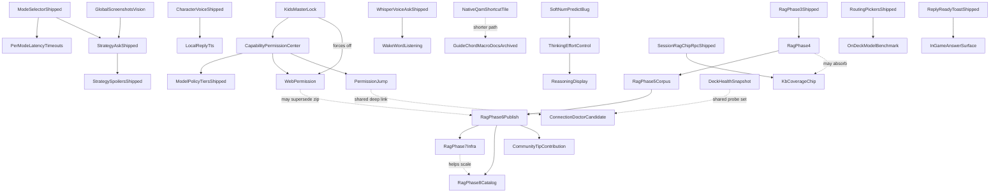

# bonsAI Roadmap

**Next:** [Bugs](#bugs) → [Verify](#verify) → lowest ★ in your lane.

Tracks open defects ([Bugs](#bugs)), on-Deck confirmation ([Verify](#verify)), and the themed backlog ([Backlog](#backlog)). Shipped work: [archive/roadmap-completed.md](archive/roadmap-completed.md) · fixed bugs: [archive/roadmap-bugs-fixed.md](archive/roadmap-bugs-fixed.md). Locked decisions: [audit/maintainer-decisions-locked.md](audit/maintainer-decisions-locked.md) (open **D18**; **D23–D25** locked 2026-08-21, **D26–D31** locked 2026-08-22). RAG session handoff: [audit/session-handoff-2026-08-21.md](audit/session-handoff-2026-08-21.md).

Setup: [troubleshooting.md](troubleshooting.md). QA: [testing.md](testing.md), [testing-manual.md](testing-manual.md). Release: [development.md](development.md), [CHANGELOG.md](../CHANGELOG.md).

**House rule for this file (2026-08-27):** an entry is at most **five lines**, in plain language, and says what a
user would notice — not how the code is wired. Tables and diagrams are exempt. Anything longer goes to
[roadmap-details.md](roadmap-details.md) (open items) or [archive/](archive/) (finished ones) and is **linked, never deleted**,
so no measurement has to be taken twice.

Star ratings use the GTA scale: `★` easiest … `★★★★★` very high complexity; `★★★★★★` extreme scope. Within each list: **ascending stars**; ties alphabetical.

---

## Bugs

Status tags: **OPEN** · **PARTIAL**. Fixed entries move to [archive/roadmap-bugs-fixed.md](archive/roadmap-bugs-fixed.md) with their QA row
intact. Long-form investigation notes live in [roadmap-details.md](roadmap-details.md) — an entry here should be readable in a few
seconds; anything that would otherwise have to be re-measured goes there rather than being deleted.

### Blocking a feature on the couch

- ~~★★★ **You can get stuck inside the Session context panel**~~ — **FIXED, and confirmed on device 2026-08-27.**
  With *Show details* collapsed and *Session context* expanded, Down enters the panel and Up now walks back out to **Retry**,
  then **Helpful**, then the branch buttons — nothing is stranded. Evidence: `runs/SESSION-CTX-TRAP-verify-2026-08-27.json`
  (`escaped: true`, `neverReached: []`). The fix had sat unproven since 2026-08-23.

- ~~★★★ **The D-pad may not escape the full-screen pickers**~~ — **audited on device 2026-08-28. Two pass, one fails badly.**
  The character picker and the AI models hub (which is also where *Browse models* goes) both walk cleanly from the first control to
  **OK** / **Pull selected** at the bottom; the top and bottom presses hold still rather than trapping you. The **try-order picker**
  fails, and is now its own ★★★ entry below. Detail: [roadmap-details.md](roadmap-details.md).

- ★★★ **Pressing down in the try-order picker reorders your models instead of moving the highlight** — **OPEN, found on device 2026-08-28.**
  Each press down shuffles the highlighted model one place down the list and then loses the highlight completely: nothing on screen is
  selected, and **B stops closing the picker** until a further press brings the ring back. The only way out downward is to keep pressing
  until the model reaches the bottom. Both the text and the vision list are affected. A user trying to read the list silently reorders it.
  Needs a maintainer call on how reordering should work on a controller — see [D36](audit/maintainer-decisions-locked.md).

- ~~★★ **Choosing a character: focus ring now visible**~~ — **CLOSED.** The maintainer confirmed on device 2026-08-27 that focus is visible
  and the picker is usable; the edge behaviour it was still waiting on passed the 2026-08-28 audit above. Nothing left open here.

### Wrong or missing content in a reply

- ★★ **Unrelated questions still get game cards stapled on** — **PARTIAL; the maintainer chose to live with it 2026-08-27.** With a game running,
  *"thank you very much"* still attaches a Nitra card and *"what time is it"* attaches three. Two of the six test phrases were fixed by the D28
  floor change; the other two come from the keyword half, and raising that floor pushes against D25. Confirmed on hardware, card for card.
  The residue is judged acceptable because the model mostly ignores an irrelevant card. Tables, method and the D28 numbers:
  [roadmap-details.md](roadmap-details.md#ordinary-phrases-attach-game-cards).

- ★★ **Spoiler warnings appear mid-reply on a game with no story** — **PARTIAL — the *when* is fixed, the *where* is not.** The fence now only
  appears for questions the spoiler check actually flags, but it can still land in the middle of an answer rather than at the end. Root cause of
  the remaining half is known: the asked-entity extractor returns nothing for the one question that fences.
  Workaround while open: turn spoiler masking off in Settings. Detail: [roadmap-details.md](roadmap-details.md#the-spoiler-fence-on-a-no-story-game-lands-mid-reply).

- ★ **An answer that arrives instantly loses its branch buttons and checklist** — **OPEN, found 2026-08-27.** When a reply comes back on the
  first call instead of after polling, the code builds its own summary of the result and drops both strategy payloads from it. Not reachable on
  this hardware, where replies take 6–32s, so it needs a fast or cached model to see. One-line fix, but confirm the data is there first:
  [roadmap-details.md](roadmap-details.md#an-ask-that-completes-instantly-loses-its-branch-picker-and-checklist).

- ★ **The safety guard has not been checked with streaming turned off** — **owed from the 2026-08-27 QA batch.** The guard itself is fixed and
  confirmed with streaming on. With streaming off the notice should behave the same; nobody has run it.

### Fixed in code, never confirmed on the Deck

*Each of these has a fix and tests. None has been watched on hardware, so none can be called done.*

- ★★ **Focus lands on answer text that does nothing when you press A** — **audited on device 2026-08-28; the reported cause was wrong.** The
  Developer chip's JSON sits inside the chip strip, so the ring never lands on it, and stopping on each paragraph is on purpose. The real one
  was next door: a checklist the model got wrong is left in the reply as raw JSON, and *that* is its own stop that does nothing on A.
  **Fixed the same day** — a rejected checklist block is now dropped from the reply, the way a rejected branch block already was.
  Owed: one sighting on device of a reply where this happens. Detail: [roadmap-details.md](roadmap-details.md).
- ★★ **Pickers return you to the right tab but not the right control** — 1 of 3 confirmed; the models hub and desktop-note cases still land on
  the tab strip. **The models hub half reproduced again on 2026-08-28** during the picker audit, unchanged. Next step is instrumentation,
  not another attempt.

### Open, but measure before spending anything

*Each of these was filed from an observation that later work may have already changed. Re-measure first; do not fix from the description.*

- ★★ **Show details is missing on a live turn after a successful Ask** — **the premise is doubtful.** Filed as a blocker for CONTEXT-LADDER-01;
  much has changed since. Retest before treating it as real.
- ★★ **Answer scrolling by D-pad feels choppy and jumps several lines** — the 2026-08-07 work made every answer section its own stop, which may
  have removed this. Re-measure.
- ★★ **Token streaming reveals text in chunks while a game is running** — measured smooth at idle in an earlier pass, chunky under load in a
  later one. The two runs were not comparable; neither is trustworthy on its own.
- ★★ **The D-pad skips the branch buttons and the feedback row on a live Strategy turn** — check **MICRO-04** on device. The 2026-08-27 picker
  work changed this area, so the old description may no longer describe what happens.

### Small and cosmetic

- ★ **After reopening the panel, a branch-pick turn's header shows the internal prompt** — **OPEN, found on-Deck 2026-08-27**
  during the verification sweep. The header reads `[Strategy follow-up] I'm at: Tell me what you want to know…` instead of the
  friendly *I'm at: …* caption it shows while live. The friendly caption is a display-only value; the reopen rebuilds headers from
  the saved chat, which stores the composed prompt. Cosmetic, but it is internal plumbing on screen.

- ★ **The active chip in Show details is hard to spot** — no focus ring, and the "Chip 1 of 6" counter is easy to miss. Filed by the maintainer.
- ★ **The question overlay is a few pixels out of line** with the native text field underneath it, most visible on a three-line question and on
  the empty-field placeholder.
- ★ **Spoiler false-positive on a named entity** — **PARTIAL.** The mid-stream flash is fixed; the remaining case is narrow.
- ★ **Focus ring gets clipped on grid layouts** — **OPEN, found 2026-08-27.** Tiles sit flush against the edge of their grid, so the
  highlight around a focused tile is cut off instead of drawn in full. Most visible on the AI character picker; check any other
  screen that lays tiles out in a grid. Needs each grid to leave a margin outside its own edge for the ring to fit.
- ★★ **Focus ring styling is inconsistent** between plugin controls and Steam's own — **PARTIAL.** Modal scoping shipped; a blanket rule was
  tried and reverted in favour of Steam's native outline.
- ★★ **The model routing try-order modal** chrome does not match the other full-screen pickers — deferred polish. The focus half of this
  entry turned out to be much worse than "lands on the leaf buttons" and moved to its own ★★★ entry at the top of this file.

### Documentation bookkeeping

- ★ **Two different QA rows share the ID `KB-NEWTITLE-01`**, and **two different decisions are both filed as D19**. Both are resolved on paper
  (D30 and D31 say which keeps the name) but the documents have not been edited to match, so a search still returns two hits for one ID.

---

## Verify — shipped, QA owed

Code-fixed or shipped; on-Deck / qualitative QA still owed. Detail: [testing.md](testing.md), [testing-manual.md](testing-manual.md). Full writeups: [archive/roadmap-bugs-fixed.md](archive/roadmap-bugs-fixed.md).

**This list is a curated front page, not the QA queue.** [testing.md](testing.md) holds **92** rows, of which **13 are Verified** and 55 Open / 15 Partial (counted 2026-08-17). Work the rows below first because they carry the most recent fixes; when picking up anything else, read testing.md rather than assuming an absence here means coverage.

**The 2026-08-23 parallel bug session left seven fixes proven only at a desk.** Their on-Deck run is planned as two batches of six frozen test chips, grouped by game, in [20-frozen-chip-qa-batches.md](planning/20-frozen-chip-qa-batches.md) — question wording agreed and not to be reworded. Note that a pinned batch **suppresses session RAG chips**, so corpus-chip rows cannot pass until it is cleared.

- ★★★ **Clear cache cleared the screen but not the session** — **fixed and device-confirmed 2026-08-27**, after three separate causes. Two halves stay owed: what a clear does to the **orphan chat slots** it leaves behind (one per clear-and-reask), and clearing **while a reply is still being written** — unit-tested, but not reproducible by hand because this model answers faster than the walk to the button. [why](roadmap-details.md#shipped-qa-owed--why-each-was-built-this-way)
- ★ **A finished voice install survives "Clear all plugin data"** — **VOICE-CLEAR-01** Partial (backend verified; UI half open).
- ★ **Bonsai pot ~1px right of canopy (tab + plugin-list icon)** — fix landed 2026-08-07 (Wave 1 D); **BONSAI-ICON-GEOM-01**. [wave1.md](wave1.md).
- ★ **Developer toggle for "resume last tab" (D15 B)** — shipped 2026-08-04; **TAB-RESUME-MODE-01**, **TAB-RESUME-FOCUS-01** Open/Partial.
- ★ **Install voice engine button when already ready** — fix landed 2026-08-07 (Wave 1 B); **VOICE-REINSTALL-01**. [wave1.md](wave1.md).
- ★ **Rows span the QAM panel width** — bug **fixed 2026-08-16** (`0fcaf00`), measured on-Deck: unified host and Ask row `x=63.99 w=268.02` → `x=48 w=300`, 32px reclaimed. **ASK-WIDTH-01** still Open in testing.md — the *visual* walk was never run, only the probe. Confirm the three Main rows look flush and nothing overflows the 300px column. Writeup: [archive/roadmap-bugs-fixed.md](archive/roadmap-bugs-fixed.md); rule earned: [design-language.md](design-language.md) Rule 1.
- ★ **British spellings found nothing** — *armour* returned nothing while *armor* returned the card. Fixed 2026-08-19 by searching for **both** spellings rather than rewriting the question, so a British spelling can never lose a result an American one finds. **KB-SPELLING-01** owed on device.
- ★ **Static seed tells you to enable KB when it is already on** — fixed 2026-08-07 (Wave 2 F); **PRESET-KB-SEED-01**.
- ★ **Thinking blurb italicizes emojis** — fix landed 2026-08-07 (Wave 1 A); **THINKING-EMOJI-01**. [wave1.md](wave1.md).
- ★ **Thinking line vanishes mid-Ask (lazy status tag)** — fix landed 2026-08-08; **THINKING-SANITIZE-01**. [06-thinking-blurbs-review.md § 10.1](planning/06-thinking-blurbs-review.md#101-landed-2026-08-08--7-items-13).
- ★ **Token streaming stutters once at start** — fix landed 2026-08-07 (Phase A); **STREAM-REVEAL-01**. [05-token-streaming-review.md § 3.1](planning/05-token-streaming-review.md).
- ★ **VAC / `bonsai:vac-check` (Phase 1) — on-device QA** — implementation complete; finish **VAC-02…06** after Tier 0 **SMOKE-F** passes.
- ★ **~22% of Asks show bare emoji for every phase change** — fix landed 2026-08-08; **THINKING-EMOJI-CLUSTER-01**.
- ★★ **Asked-entity extraction (player typing patterns)** — fixed 2026-08-09; **STRAT-ENTITY-01**.
- ★★ **Device QA — Tier 0–1** — execute Tier 0 smokes (SMOKE-A, C, F) then Tier 1 (SMOKE-B, E, H); update coverage with Pass / Partial / Fail + build id.
- ★★ **Expert mode attached fewer knowledge cards than Strategy** — fixed 2026-08-18; **KB-EXPERT-01** owed, and it re-opens **KB-ASKMODE-01** for a re-run. The route flag asked for Strategy by name, so Expert silently took the small budget. [why](roadmap-details.md#shipped-qa-owed--why-each-was-built-this-way)
- ★★ **KB compat retrieval phrase gate** — fixed 2026-08-06 (**D16**); **KB-ROUTER-01**. [audit/rag-pr2-signoff.md](audit/rag-pr2-signoff.md) § 2.
- ★★ **Named chat slots persist a turn** — bug **fixed 2026-08-16** (`d167f8e`); **CHAT-SLOTS-V2-01…06** all Open and **gated on one check first**: run a single Ask, then confirm (1) no `chat_slots: no slot for request_id=` line in the plugin log and (2) `/home/deck/homebrew/settings/bonsAI/chat_slots/` now exists holding `index.json` plus a slot file with **both** question and answer. Only then run 01…06 — before the fix a reopen test read as "empty thread" and pointed nowhere. Writeup: [archive/roadmap-bugs-fixed.md](archive/roadmap-bugs-fixed.md).
- ★★ **KB coverage chip says "no game running" instead of "could not be matched"** — fixed 2026-08-23; **KB-COVERAGE-NOAPP-01** Open on-Deck. Split the coverage status that used to conflate desktop context with an unmatched running game — see [testing.md](testing.md). Writeup: [archive/roadmap-bugs-fixed.md](archive/roadmap-bugs-fixed.md).
- ★★ **The destructive-advice guard** — built 2026-08-23, and **fixed and confirmed on device 2026-08-27** after it failed to fire on a real reply telling the user to delete a folder. It appends a visible safety notice to a finished reply that describes deleting saves, a Proton prefix or compatdata with no backup step. **Owed: the same check with token streaming off.**
- ★★ **Prompt testing pass** — broader systematic validation beyond shipped prompt-testing MVP matrices.
- ★★ **Session context header is not D-pad focusable** — fixed 2026-08-04; confirm on-Deck.
- ★★ **Thinking blurbs — three writers disagree** — fix landed 2026-08-08; re-verify **THINKING-COPY-01**, **THINKING-SLOW-01**, **THINKING-LIVE-01**, **THINKING-SPOILER-01**. [06-thinking-blurbs-review.md § 10](planning/06-thinking-blurbs-review.md#10-implementation-log).
- ★★ **Wave 4 G slider direction handlers** — Deck-check: **ONBUTTONDOWN-AUDIT-01** (distinguish nothing happens vs double-step; cover Ollama keep-alive, Reply verbosity, Connection timeout sliders).
- ★★ **Your tab is not remembered when you leave and reopen** — **TAB-RESUME-01** Partial (tab + scroll restore; focus-after-reopen separate).
- ★★★ **D11 legacy-loader shim removal** — **D11-SHIM-01** Partial (RPC probe ok; Main-tab Ask UI pass open).
- ★★★ **KB coverage chip (Show details)** — shipped 2026-08-07 (Wave 3 I); **KB-COVERAGE-01 Partial.** On-Deck 2026-08-16 the live-turn ladder rendered and the chip read `KB: 9 sections` on a Portal 2 Strategy Ask. **Still open: the two negative cases** — KB off must read `KB: off`, and an uncovered title must read `KB: none for this game`. Distinct from the per-turn `kb` retrieval chip; this one is corpus honesty.
- ★★★ **KB download Cancel** — shipped 2026-08-05; **KB-CANCEL-01 is not testable as written, and that is the blocker.** The whole download finishes in about a second on device, so there is no window to press Cancel in. Needs a slower fixture or a throttle before it can be QA'd at all. [why](roadmap-details.md#shipped-qa-owed--why-each-was-built-this-way)
- ★★★ **Kids master lock** — shipped 2026-08-09; on-Deck **KIDS-LOCK-01**, **KIDS-FOCUS-01**, **KIDS-REGRESS-01** (and **KIDS-LOCK-02** if child account) Open. Live CEF Stage 0 confirmation still owed.
- ★★★ **QAMP verification checklist** — per-game profile on/off, QAM Performance reopen, Steam restart/reboot, GPU-clock paths. [testing-manual.md](testing-manual.md) § QAMP.
- ★★★ **Soft reply-length cap and thinking budget** — shipped 2026-08-10. Sub-checks: 02 verified, 01/03/04 automated with on-Deck confirmation owed, 05 needs a real thinking model. [why](roadmap-details.md#shipped-qa-owed--why-each-was-built-this-way)
- ★★★ **Source attribution on knowledge chips** — shipped 2026-08-09; **KB-ATTRIB-01 Partial after 2026-08-16 — one sub-check looks like a fail** and needs a second look before it is called a bug. [why](roadmap-details.md#shipped-qa-owed--why-each-was-built-this-way)
- ★★★ **The eval harness scored every troubleshooting tip against the wrong vector** — fixed 2026-08-21. Two independent id sequences were used as one key, so tips were compared against unrelated vectors. Any eval number from before that date is void. [why](roadmap-details.md#shipped-qa-owed--why-each-was-built-this-way)
- ★ **The eval harness's model sweep could not run at all** — fixed 2026-08-21. A required argument was added to the retrieval helper and two of its four callers were never updated, so the sweep crashed on entry. Any sweep result from before that date is void.
- ★★★ **The vector half of retrieval now has its own recall pass** — fixed 2026-08-18; **KB-RECALL-01** owed on device, **KB-RECALL-02** verified at the desk. It searches the game's cards directly instead of only re-ordering the keyword shortlist. [why](roadmap-details.md#shipped-qa-owed--why-each-was-built-this-way)
- ★★★★★ **Global quick-launch macro** — Guide-chord docs in [troubleshooting.md](troubleshooting.md) §5; verification checklist not run on hardware.
- **D-pad reachability sweep blind spot (2026-08-04)** — cross-file nested `Focusable` (spoiler fence) not visible to per-file static analysis; answer on-device per [testing-manual.md](testing-manual.md) focus rows.
- **Reply-language snapshot RPC (2026-08-03 fix)** — verified via `probe_deck_rpc_surface.py`; UI translation spot-check optional.
- **Session RAG / routing merge RPCs (2026-08-02)** — **SESSION-RAG-CHIPS-01** Verified; **ROUTING-MERGE-01** Open.
- **Shell state + tab payload extractions (step 8)** — **SHELL-PAYLOAD-01** Open. Smoke: six tabs, one Ask, Ollama tab after Clear all plugin data.
- **Token streaming Phase B — multi-stop navigation + scroll follow (2026-08-07)** — **STREAM-09**, **STREAM-FOLLOW-01** Open. [05-token-streaming-review.md § 3.2](planning/05-token-streaming-review.md).
- **Voice input `status()` missing (2026-08-03 fix)** — on-Deck retry of live recording still needed. [archive/roadmap-bugs-fixed.md](archive/roadmap-bugs-fixed.md).

---

<a id="planned"></a>

## Backlog

Stars are **effort/risk**. Grouped by **theme**; within each lane sorted ascending by ★.

**GitHub tracking:** Items rated **★★★★★** or **★★★★★★** include a placeholder link to **[bonsAI Issues](https://github.com/qd313/bonsAI/issues)** (replace with a specific issue URL when created).

### Ask / reply

- ★ **Intent packs later review** (keep / quiet / Developer)
  - **Goal:** Decide whether quiet intent-pack search aliases should be deleted, left quiet, or revived under Developer.
  - **Not in scope:** re-shipping Proton journal inject without redesign.
- ★★ **Copy reply to clipboard** (reply micro-action)
  - **Goal:** One reply action copies visible answer text to host clipboard.
  - **Depends on:** shipped reply micro-actions + read clipboard pattern. Spike Wayland selection ownership first.
  - **Source:** [13-roadmap-feature-ideas.md](planning/13-roadmap-feature-ideas.md) A2.
- ★★ **Preset chip expansion** (incremental content)
  - **Goal:** Add or refresh preset strings as related features land. Wave 1 shipped four prompts; **PRESET-EXPAND-W1-01** open. [wave1.md](wave1.md).
  - **Not in scope:** replacing `fade` default animation; session RAG chips (shipped).
- ★★ **Thinking effort control** — **Phase 1 shipped 2026-08-15; Phase 2 Backlog**
  - **Phase 1 (shipped):** Ollama tab → **Thinking** row, Off / Brief / Balanced / Deep, defaulting **Off**. Sends `think: true` for all three on levels — named levels are gpt-oss-only and qwen3 / deepseek-r1 reject a string (**D21**, superseding doc 16) — with effort carried by the reserved budget (256 / 512 / 1024) added to `num_predict`. A model that cannot think gets one silent retry with thinking off, is remembered for the session, and the user is told once. On-Deck **THINK-EFFORT-04**, **THINK-EFFORT-05** Open.
  - **Phase 2 (Backlog):** Replace the cosmetic `<bonsai-status>` blurb outright with hand-curated bonsAI tips — feature tips ("Ask-mode Speed trims replies for a quick answer") for generic asks, KB-strategy tips ("A run spent only kiting is a run that ends underpowered") for game-specific asks, selected contextually by current game/mode. Not a fallback for otherwise-empty moments — the generic filler copy goes away entirely. Data file shaped like `data/kb/strategy_seed.json`.
  - **Not in scope:** Reply verbosity → token budgets; caveman / lowering `num_predict`; native gpt-oss levels (needs per-model capability detection — see D21).
  - **Related:** **Reasoning display** (below) — once raw `thinking` streams live, it takes over the slot Phase 2 tips otherwise fill.
- ★★ **Make token streaming the default and drop the setting** (maintainer direction 2026-08-23)
  - **Goal:** `bonsai_token_streaming_enabled` goes away and streaming is simply how replies
    arrive. Stated by the maintainer 2026-08-23 as the intended end state, not a proposal.
  - **Gate:** the outstanding streaming bugs are fixed and the reveal performs well on the Deck.
    The live blocker is *Token streaming reveal is chunky under game load* in [Bugs](#bugs),
    measured 2026-08-22 with a game running; the earlier idle-Deck measurement that called it
    smooth does not cover this case.
  - **What it shrinks:** every QA row currently written as "with streaming on and with it off"
    loses half its work — **DESTRUCT-ADVICE-01** most directly, whose accepted limitation only
    exists on the streaming path. Do not spend on hardening the non-streaming path meanwhile.
  - **Two-language removal, so budget for the plumbing:** dropping a boolean is not the reverse of
    adding one. Python is authoritative (**D13**), both settings contracts need the key gone, and
    a Deck whose `settings.json` still carries it must not read as "the setting reset itself".
- ★★ **Unfenced spoiler feedback** (thumbs-down category)
  - **Goal:** Thumbs-down refinement chip for unfenced spoilers (and optional over-fenced sibling).
  - **Depends on:** reply micro-actions; spoiler confidence chip (shipped).
  - **Related:** [spoiler-constitution.md](planning/spoiler-constitution.md).
- ★★ **User-adjustable spoiler fencing** (hide by risk band)
  - **Goal:** Settings control for tap-to-reveal / fence masking by estimated risk band.
  - **Depends on:** spoiler confidence chip; shipped `strategy_spoiler_masking_enabled`.
  - **Related:** [spoiler-constitution.md](planning/spoiler-constitution.md).
- ★★★ **Custom model in Pull Models picker** (custom pull + Ask pin + New badges)
  - **Goal:** Pull any valid Ollama-library tag; **Use for Ask** pin; **New** badge (≤30 days).
  - **Depends on:** shipped Pull Models picker + living overlay merge.
  - **Not in scope:** LAN/remote `ollama pull` (→ **LAN custom model pull**).
- ★★★ **Dynamic keep-alive / smart unload** (research spike)
  - **Goal:** Research-only: hold models loaded vs unload when a game takes focus on Deck APU? Spike decides go/no-go.
  - **Not in scope:** production unload before spike doc.
- ★★★ **Per-mode latency timeouts** (warn vs hard limit profiles)
  - **Goal:** Separate warning and timeout values per selected mode.
  - **Depends on:** Mode selector (shipped).
- ★★★★ **Connection doctor** (guided first-Ask repair — candidate)
  - **Status:** Candidate, not accepted — decide vs **Deck health snapshot** (shared probe set).
  - **Goal:** **Fix this** on Ask failure walks probes → one next action with Ollama-tab deep link.
  - **Source:** [13-roadmap-feature-ideas.md](planning/13-roadmap-feature-ideas.md) § B3.
- ★★★★ **LAN custom model pull** (remote host — decision review)
  - **Goal:** LAN Ask host: add/pull models not in catalog — blocked until mechanism chosen (R1–R4).
  - **Depends on:** **Custom model in Pull Models picker**.
- ★★★★ **Session context and user stash** (deck-first context)
  - **Goal:** Live session facts + user-editable stash notes for Ask; no embeddings/cloud.
  - **Not in scope:** vector DBs; cloud sync.
- ★★★★ **Speed-mode VRAM preload** (dev-toggle; keep a small model warm from boot)
  - **Goal:** On plugin/daemon boot, preload the user's default Ask model into VRAM so the first Ask of a session skips the cold-load penalty. Ships behind a developer toggle first; graduates to user-facing only after the suspend/resume question below is answered on-device.
  - **Model eligibility:** hard ceiling ≤3B params, but steered rather than merely gated — Pull Models picker surfaces vision/thinking-capable distilled models as "recommended for speed mode," and preload auto-substitutes the best shortlisted model if the user's chosen default doesn't qualify.
  - **Sits alongside, not instead of:** the existing Ollama-tab Unload-delay slider (`ollama_keep_alive`, [ollamaKeepAlive.ts](../src/data/ollamaKeepAlive.ts)) — that setting still governs how long a model lingers after use; this only changes when the *first* load happens.
  - **VRAM safety:** check pressure via existing TDP/telemetry chip data before every attempt; skip silently on pressure or an unreachable Ollama host, retry opportunistically next QAM open. No hard retry cap and no background polling — a skipped attempt costs nothing, so it can never contend with a running game.
  - **Open questions:** whether VRAM/model residency survives Deck suspend/resume — boot-only preload may need to also fire on wake — needs on-device research before this can leave the developer toggle.
  - **Related:** **Dynamic keep-alive / smart unload** (below) covers unloading on game focus, a separate question this feature doesn't answer.
- ★★★★★ **Deck health snapshot** (full diagnostics + Ollama)
  - **GitHub:** [bonsAI Issues](https://github.com/qd313/bonsAI/issues) — issue TBD.
  - **Goal:** Read-only diagnostics dump to Desktop; Magic Ask `bonsai:diagnostics`.
- ★★★★★ **Local reply TTS** (Phase 1–2 character voice)
  - **GitHub:** [bonsAI Issues](https://github.com/qd313/bonsAI/issues) — issue TBD.
  - **Goal:** Phase 1 offline TTS play/stop; Phase 2 character-aligned read-aloud (legal gate).
- ★★★★★ **Named chat slots** (labeled threads — redesign only)
  - **GitHub:** [bonsAI Issues](https://github.com/qd313/bonsAI/issues) — issue TBD.
  - **Goal:** Up to 5 named, persistent chats with Main-tab LB/RB carousel (option C). Do not re-ship old mini-list picker.
  - **Status:** Code landed 2026-08-09 (storage, RPC, row UI). **On-Deck QA open** — all **CHAT-SLOTS-V2-01…06** must pass before Completed. **P-0 bumper spike** result still pending on device ([major-redesign.md](major-redesign.md) § 7 R1).
  - **Unblocked 2026-08-16** (`d167f8e`). The data-loss bug that made all six rows unrunnable — every turn dropped before it reached `chat_slots/` — is fixed; run the one-Ask persistence check in [Verify](#verify) before starting 01…06.
  - **Design:** [major-redesign.md](major-redesign.md), [07-named-chat-slots-postmortem.md](planning/07-named-chat-slots-postmortem.md).
- ★★★★★ **On-Deck model benchmark** (measured routing order)
  - **GitHub:** [bonsAI Issues](https://github.com/qd313/bonsAI/issues) — issue TBD.
  - **Goal:** Rank installed models by measured speed/completion; offer as try order (with confirmation).
  - **Depends on:** shipped routing pickers; overlaps **Dynamic keep-alive** measurements.
  - **Source:** [13-roadmap-feature-ideas.md](planning/13-roadmap-feature-ideas.md) § C1.
- ★★★★★ **Reasoning display** (real model `thinking`, not the status blurb)
  - **GitHub:** [bonsAI Issues](https://github.com/qd313/bonsAI/issues) — issue TBD.
  - **Goal:** Read and stream the model's actual `thinking`/reasoning content from Ollama — never consumed today; the Ollama tab only sends the `think` boolean and spends a hidden budget, nothing reads `message.thinking` back. Renders inline with the reply (italic, muted, single-line-truncated while streaming), collapses to a "12s · 340 tokens" summary once the reply completes, expandable to the full transcript. New **thinking** transparency chip shows effort level + actual token spend alongside the existing model/kb chips in `ContextChipLadder`.
  - **No spoiler redaction inside the reasoning body** — the collapse/expand gesture is itself the consent fence, the same shape as an existing `` ```bonsai-spoiler `` fence ([spoilerFenceRegistry.ts](../src/utils/spoilerFenceRegistry.ts), [unwrapAskedEntitySpoilerFences.ts](../src/utils/unwrapAskedEntitySpoilerFences.ts)). A spoiler-risk caveat is instead surfaced once, as a dismissible notice the first time thinking-effort is turned on, plus an inline note on the first reasoning toggle a session sees.
  - **Persistence:** stored per-turn in chat-slot storage so archived/restored turns keep their reasoning text — closes part of the existing "Session context strip never lists archived turns" bug ([chat_slot_service.py](../py_modules/backend/services/chat_slot_service.py)).
  - **Spike required before build:** two open questions, either of which can fail without blocking the rest of the feature — (1) whether Ollama reasoning models interleave thinking with content per-paragraph, or emit one solid reasoning block before any content starts (decides whether **segmented per-paragraph reasoning** — a separate toggle under each paragraph rather than one end-of-turn block — is a real attribution or an approximate backend split of one block); (2) whether a single-line-truncated live display (cheap, current default design) or a bounded multi-line auto-scrolling pane (matches Claude/Cursor's live-thinking treatment, costs more of the 300px column) reads better once real local-model reasoning verbosity is seen on-device. If segmentation isn't feasible, falls back cleanly to the single end-of-turn block.
  - **Depends on:** Thinking effort control Phase 1 (shipped).

### Focus / Deck UI

- ★★ **Fold "Show diagnostics" into "Show details"** (one reply-inspection surface)
  - **Goal:** One place to inspect a reply. Today the panel carries **two** disclosure buttons doing
    the same job at different depths — **Show details** (the context chip ladder: retrieval method,
    coverage, trust tier, source credit) and **Show diagnostics** (`ask_diagnostics` raw JSON:
    models before/after policy, routing strategy, attachment counts). They sit adjacent, look alike,
    and neither name says which is which. It cost a QA cycle on 2026-08-17: the raw-JSON panel was
    opened while looking for the source-credit line, which only ever renders in the other one.
  - **Fix lean:** keep **Show details** as the single entry point and move the diagnostics JSON
    behind the existing **Developer details** chip already in the ladder — the ladder is the natural
    home for it, and that chip is already the "deeper than the chips" affordance. Then drop the
    second button. Gating stays as-is: diagnostics render only with desktop verbose logging on
    ([MainTabChatTranscript.tsx:651](../src/components/MainTabChatTranscript.tsx)).
  - **Watch for:** the diagnostics block owns a `registerNavFocus("ask-diagnostics", …)` entry and
    `focusDownFromReplyUtilityRow` falls through to it ([liveTurnFocusGraph.ts:221](../src/utils/liveTurnFocusGraph.ts)).
    Removing the button without updating that chain leaves a D-pad step pointing at nothing — the
    same class of gap that made the archived-turn Show details row unreachable the same day.
- ★★★ **Ghost in the Shell preset chip decode** (replaces the `stream` typewriter mode)
  - **Goal:** Replace the plain left-to-right typewriter on preset chips with the *Ghost in the
    Shell* title-sequence look: each chip arrives as a full-width block of scrambled green glyphs
    that resolve into the real prompt, character by character, behind a blinking block caret. It is
    a **replacement, not a fifth mode** — `stream` goes away, its slot in the mode list is taken by
    the new one.
  - **What exists today.** Mode `stream` (Wave 4 J) already owns the whole scaffold: the enum
    ([bonsaiSettingsSchema.ts:48](../src/data/bonsaiSettingsSchema.ts) plus
    `PRESET_CHIP_ANIMATION_OPTIONS` at `:253`), the Python allow-list
    `_VALID_PRESET_CHIP_ANIMATION` ([settings_service.py:129](../py_modules/backend/services/settings_service.py)),
    the Developer tab picker ([DeveloperTab.tsx:412](../src/components/DeveloperTab.tsx)), the caret
    CSS ([section-4.ts:93](../src/styles/sections/section-4.ts)), and the reveal loop
    `MainTabPresetStreamSlots` ([MainTabPresetAnimatedChips.tsx:217](../src/components/MainTabPresetAnimatedChips.tsx)).
    So this is a rewrite of one function plus a rename, not new plumbing.
  - **The effect, concretely.** Per slot: fill the label with a scrambled string **of the prompt's
    final length** from the first frame, then lock characters left to right at
    `PRESET_STREAM_CHAR_MS` (42ms today) while the unlocked tail keeps churning; caret sits at the
    lock boundary; hold for `holdMsForPresetText`, then the next prompt. Green comes from
    `--bonsai-ui-accent-main` (`BONSAI_FOREST_GREEN` `#2e8753`), never a hardcoded colour, per
    [design-language.md](design-language.md).
  - **Reserve the width from frame 0 — this is the point of the rewrite.** The chip label is
    `white-space: nowrap` + `text-overflow: ellipsis` ([section-4.ts:85](../src/styles/sections/section-4.ts)),
    and today's reveal grows the string one character at a time, so the chip reflows on every tick.
    Scrambling at final length ends that. It also means the churn glyphs must be **half-width** —
    ASCII plus half-width katakana (U+FF66–U+FF9D). Full-width CJK is double-width and would push a
    long prompt into the ellipsis mid-animation, changing which chip is truncated frame to frame.
  - **Watch the frame cost.** Today's loop fires one `setState` per character per slot; a churn
    effect fires one per *frame* per slot, three slots at once, on Deck hardware. Drive it from a
    single `requestAnimationFrame` loop writing one batched state object (or a ref plus direct
    `textContent`), not three independent timer chains — three React re-renders per frame in the
    300px QAM column is the failure mode to design out, not to discover on device.
  - **Rules that must survive the rewrite** (they are the `stream` QA row and each was earned):
    chips stay D-pad focusable while glyphs are still churning and **A selects the full prompt, not
    the partial** — easier here, since the real text is known from frame 0; and
    `prefers-reduced-motion: reduce` swaps instantly with no churn and no caret blink.
  - **Migration is the two-language half.** Dropping `"stream"` from the TS union and from
    `_VALID_PRESET_CHIP_ANIMATION` orphans any Deck whose `settings.json` already holds it. Map the
    old value to the new one in `sanitize_preset_chip_animation` rather than letting it fall through
    to the `fade` default — a silent downgrade to fade reads as "the setting reset itself". Python is
    authoritative here (**D13**), and both settings contracts
    (`tests/contracts/settings-defaults.json`, `settings-hostile-inputs.json`) need the new value.
  - **QA:** rewrite **PRESET-STREAM-ANIM-01** in [testing-manual.md](testing-manual.md) rather than
    adding a row — the old mode will not exist to test.
- ★★★ **Search density UX** (match emphasis + tighter rows)
  - **Goal:** Tighter, more scannable search results with highlighted match tokens.
- ★★★★ **SteamOS Share path** (capture → attach)
  - **Goal:** Faster path from SteamOS Share / capture flows into screenshot attach where APIs allow.
- ★★★★ **SteamOS spin hint card** (immutable spins)
  - **Goal:** Detection + deep link to troubleshooting for immutable spins.

### Knowledge base

- ★★★ **DRG Survivor glossary terms** (tap-to-define jargon)
  - **Goal:** Curated glossary entries — starting with "kiting," already used undefined in the existing DRG Survivor card at `data/kb/strategy_seed.json:163` — back model prompt guidance so jargon gets defined without derailing the reply. Terms render as a tappable inline element: a floating tooltip above the term (not inline-push). D-pad focus alone shows a short peek (first few words, no action) before the user presses to open the full definition; dismiss via any D-pad direction or B. The full definition includes an **explain further** chip that auto-sends a new Ask turn about the term.
  - **Not in scope (for now):** general jargon-detection across every game's KB content — scoped to DRG Survivor only until this proves out.
  - **Depends on:** focus-graph entry for D-pad reachability (`.cursor/rules/decky-focus-graph.mdc`) — required before shipping, not optional polish.
- ★★ **Eval fixture cannot see a recall failure** (paraphrase rows)
  - **Goal:** `kb_eval_v2` has **1** labeled case out of 138 where keyword search returns nothing, so the slice that proves the vector half adds recall is a sample of one. Measured 2026-08-18 by the re-aligned harness. Add paraphrase rows — questions that ask for a card without using its words — until that slice can gate a regression.
  - **Starting material:** the 15 paraphrased questions in [audit/rag-vector-recall-floor-2026-08-18.md](audit/rag-vector-recall-floor-2026-08-18.md) are already written, measured and labelled with the card each one should return. `tests/fixtures/kb_eval_paraphrase_v0.json` (15 rows) exists but the arms run does not read it.
  - **Needs a maintainer call first:** the v2 fixture is approved and the PR2 bake-off was measured against it — new rows change what the numbers mean, so decide whether they join v2, form a v3, or stay a separate reported slice.
- ★★★ **KB visual maps** (strategy maps — later wave)
  - **Goal:** Optional visual strategy maps in KB-grounded replies after brief callout cards exist.
  - **Plan / depends on:** [17-kb-online-versus-strategy-content.md](planning/17-kb-online-versus-strategy-content.md) Stage 5; callout cards (OV-3.1). Phase 4 chip work remains orthogonal.
- ★★★★ **Card relevance needs a second signal** (the score alone cannot decide)
  - **Goal:** Stop deciding "is this card relevant?" from a single similarity score. Measured
    2026-08-23 while implementing **D28**: junk questions and genuine questions score in the
    **same range**, so no cutoff value can separate them. *"one sentence"* scores 0.5034 against a
    Deep Rock Survivor card; a real paraphrase question (`V2-PARA-S04`, Mind Flayer) scores 0.5169
    against its own correct card. The shipped floor of 0.515 sits in the 0.0135 gap between them.
    That is a property of the current card set, not a margin — new cards or a different embedding
    model move both numbers. The 2026-08-18 measurement found the same overlap, so this is twice
    observed, not a one-off.
  - **Why a second signal rather than a better number:** a third retune buys the same fragility
    again. Candidates, none chosen: score *relative to the rest of the pool* rather than absolute
    (a question whose best card barely beats its tenth-best is probably noise); whether the
    question contains any content word at all after filler removal; agreement between the keyword
    and vector halves as evidence in its own right rather than only as a rank-fusion input.
  - **What must not regress:** **D25** — short real questions like *"the boss"* and *"gels"* stay
    reachable; and `BM25_RELEVANCE_FLOOR` stays at 1.0 per **D28**.
  - **Measure against:** the six ordinary phrases recorded under **D28** (four still attach cards
    today: two through the keyword half, two through the vector half above the floor), plus the
    `kb_eval_v2` tune / holdout / tips series — noting that **the eval cannot see this bug**, since
    every question in it is a real question about a real game. Both are needed; neither is enough.
  - **Depends on:** nothing. Blocked by nothing. Deliberately **not** a bug — the shipped floor
    works as designed; this is the design being insufficient.
- ★★★★ **KB online / versus strategy content**
  - **Goal:** Online multiplayer strategy — versus, co-op, map callouts — new `section_type` values + spoiler table updates. Tier lists parked. Visual maps later wave in same plan.
  - **Plan:** [17-kb-online-versus-strategy-content.md](planning/17-kb-online-versus-strategy-content.md) (discovery locked 2026-08-09).
  - **Source policy:** WikiTeam / archive.org dumps only; hybrid attribution (short chip + snapshot in `ATTRIBUTIONS.md`).
- ★★★★ **RAG Deck query — corpus expansion (Phase 5)**
  - **Goal:** Corpus maturity after Phase 4 sample paths; session chip vector ranking.
  - **Status:** Seed deepening largely in remediation PR2; remainder depends Phase 4. [knowledge-base.md](knowledge-base.md) § Phase 5.
- ★★★★ **RAG Deck query — extended retrieval (Phase 4)** — **tracks 1–2 shipped 2026-08-19, track 3 blocked**
  - **Goal:** Richer retrieval shapes — chip visibility, structured cards, per-game compat tips.
  - **Track 1 (shipped):** chip guarantee (≥1 corpus chip when candidates exist), game chips preferred over
    shared Deck tips, **Tip** badge on game chips only. The chip pool now draws **one kind at a time** rather than filling from the highest-priority kind first: the track 2 cards took Ocarina of Time to six boss cards and its whole pool became six *"How do I beat X?"*, with its items and enemies unreachable and six boss names offered in a carousel a player is only browsing. Enemy and item cards get their own wording (*"How do I deal with X?"*, *"How do I use X?"*). Costs nothing where a title's cards are lopsided — Left 4 Dead 2 files seventeen cards as `mechanic` and returns the same six chips, reordered. On-Deck **PHASE4-CHIPS-01** Open.
  - **Track 2 (shipped):** 16 structured cards for the two sample titles — 6 enemy, 6 item, 4 boss —
    authored with labelled lines (`Summary:` / `Weak points:` / `Uses:` / `Phases:` / `Tips:`), plus a
    conditional prompt clause that keeps those labels as light bullets in the reply. Corpus 117 → 133
    sections. Measured against the built corpus with the real embedding model: of 18 questions naming or
    describing a new card, **0 reached one before and 15 after** (16 once the type-recall preference was
    narrowed, below). The misses are pure paraphrases sharing no word with the card —
    `what do i do about the big one that tanks everything`, `something keeps grabbing me and sending me
    to the start`. No regression on the six questions that already worked.
    On-Deck **PHASE4-CARDS-01** Open.
  - **Track 3 (blocked):** per-game troubleshooting tips need an `app_id` column on `compat_patterns` —
    a **schema v4 bump and a corpus rebuild**, which by Decision 6 (no migration) makes every installed
    corpus stale until re-downloaded. Retrieval side is already built: it is the same recall-plus-flat-
    preference shape D22 introduced, so it reuses `preferred_ids` rather than adding a mechanism.
    Plan: [18-phase4-track3-per-game-compat-tips.md](planning/18-phase4-track3-per-game-compat-tips.md).
  - **Ship-shape lock relaxed:** Phase 4 was locked to ship all three tracks together. Two shipped without
    the third because the blocker is a release action rather than effort, and the two that shipped are the
    visible ones. **Maintainer call owed:** either accept the split or hold tracks 1–2 from the release
    notes until track 3 lands. [knowledge-base.md](knowledge-base.md) § Phase 4.
- ★★★★ **RAG Deck query — retrieval infra (Phase 7)**
  - **Goal:** Optional sqlite-vss/ANN, auto-pull nomic, RRF extensions, vision→KB, demote, packs, intent retrieval.
  - **Status:** FTS+vector shipped in remediation; the locked **meaning-fallback** track (vector list into RRF when FTS is empty/weak) shipped 2026-08-18 as the per-game recall pass — sqlite-vss/ANN is now an optimisation of a path that exists, not a prerequisite. Remainder docs only. [knowledge-base.md](knowledge-base.md) § Phase 7.
- ★★★★★ **Community tip contribution** (corpus inbound path)
  - **GitHub:** [bonsAI Issues](https://github.com/qd313/bonsAI/issues) — issue TBD.
  - **Goal:** Reply → **Suggest as a tip** writes schema-valid card to Desktop + GitHub attach URL.
  - **Depends on:** **RAG Phase 6** public publish — **shipped 2026-08-16, so this is unblocked** ([archive/roadmap-completed.md](archive/roadmap-completed.md)).
  - **Source:** [13-roadmap-feature-ideas.md](planning/13-roadmap-feature-ideas.md) § C2.
- ★★★★★★ **RAG Deck query — catalog corpus (Phase 8)**
  - **GitHub:** [bonsAI Issues](https://github.com/qd313/bonsAI/issues) — issue TBD.
  - **Goal:** Large offline catalog after Phase 6 publish (~top 1000 Steam, ~100 Deck, emulated slice).
  - **Status:** Locked intent only. [knowledge-base.md](knowledge-base.md) § Phase 8.
  - **Depends on:** Phase 6 (shipped 2026-08-16) + likely Phase 7 infra.

### Permissions / safety

- ★★★★ **Web permission** (Ask live search + online deps)
  - **Goal:** Opt-in capability for live web answers; offline Ask + local KB when off.
  - **Status:** Discovery locked; docs only. [web-permission-discovery.md](planning/web-permission-discovery.md).
  - **Depends on:** Capability Permission Center; Kids master lock (shipped — forces Web off when that key lands).
- ★★★★★ **QAMP Phase 2 profiles** (experimental Steam opt-in)
  - **GitHub:** [bonsAI Issues](https://github.com/qd313/bonsAI/issues) — issue TBD.
  - **Status:** Backlog-only. Phase 1 verification in [Verify](#verify).
- ★★★★★ **VAC Phase 2 opponent IDs** (lobby/session API research)
  - **GitHub:** [bonsAI Issues](https://github.com/qd313/bonsAI/issues) — issue TBD.
  - **Status:** Phase 1 complete; on-device QA in [Verify](#verify).
  - **Goal:** Surface live opponent Steam identities for ban checks when metadata allows.

### Platform / upstream

- ★★★★ **Llama.cpp provider spike** (Deck perf / replacement eval)
  - **Goal:** Research-only go/no-go vs Deck-local Ollama. Deliverable: `docs/archive/spikes/llama-cpp-provider-eval.md`. Prior: [llama-cpp-provider.md](archive/spikes/llama-cpp-provider.md).
- ★★★★ **Steam Input layout parse** (VDF → AI context)
  - **Goal:** Parse controller VDF configs for actionable control context.
  - **Not in scope:** editing/writing controller configs.
- ★★★★★ **Controller macro test rig + live view** (real gamepad input; DPS-owned)
  - **GitHub:** [bonsAI Issues](https://github.com/qd313/bonsAI/issues) — issue TBD.
  - **Goal:** Close the last missing capability for unattended on-Deck QA — [01-qa-automation-plan.md](planning/01-qa-automation-plan.md) **F1**, "there is no input injection on the Deck." A bridge board the Deck sees as a real controller (wired USB on the dock by default, Bluetooth for handheld-geometry runs, both from day one), a macro runner whose steps are gated on real UI state (`gpfocus` markers, never `activeElement` — the P1-5 lesson), and one PipeWire pipeline teeing the QA `.mkv` to file **and** a live analyzer stream for a single encoder's APU cost.
  - **Status:** **Discovery locked 2026-08-23** — decisions L1–L10, architecture, serial protocol, spikes and phasing in [19-controller-macro-test-rig.md](planning/19-controller-macro-test-rig.md). Board ordered 2026-08-24. Next concrete step: spikes S1–S3 (board bring-up, QAM Guide-chord from the bridge pad, tee-pipeline latency + scoped sudoers).
  - **This is one track of five.** The program plan — including the two tracks that need no hardware and should land first (CI gate, static focus checks, both above) — is [21-ai-owned-testing-program.md](planning/21-ai-owned-testing-program.md), with effort, milestones and the autonomy boundaries.
  - **Owner split:** primitives (`deck_pad*`, `deck_macroRun`, `deck_stream*`, extension kill switch + always-visible agent-control status) land upstream in decky-plugin-studio per [AGENTS.md](../AGENTS.md); bonsAI keeps only its macro files and CDP assertions (`tests/macros/`). Answers findings-log **P1-5**; retires DPS's "Deck UI cannot be automated in v1" note.
  - **V1 acceptance:** one unattended golden-path smoke — QAM chord → bonsAI tab → question via the existing injector → real A-press on Ask → reply-finished signal → recording, step log and plugin log land on the PC, no human touch after invocation.
  - **Safety (locked):** QAM-open interlock (presses halt if the overlay closes), neutral-on-silence firmware watchdog, extension kill switch; dev tooling only, never shipped inside the plugin.
  - **Depends on / related:** deliberately **not** blocked on **Frozen test chips** (typed-question path first; chip-select macros when chips land). Makes **STREAM-09 / D-PAD-SCROLL-02** and the chunky-streaming row repeatable, but corroborates rather than replaces the poll/paint timestamp instrumentation that row calls for.
- ★★★★★ **Steam Controller copilot** (Ibex gen-2)
  - **GitHub:** [bonsAI Issues](https://github.com/qd313/bonsAI/issues) — issue TBD.
  - **Goal:** AI copy tuned to gen-2 hardware + Steam Input–aligned suggestions.
- ★★★★★ **Wake-word listening** (beta; Deck first)
  - **GitHub:** [bonsAI Issues](https://github.com/qd313/bonsAI/issues) — issue TBD.
  - **Goal:** Opt-in always-on local wake **bonsAI** → STT → quiet Ask.
  - **Depends on:** Whisper voice Ask; Reply ready toast; Voice STT session daemon (shipped).
  - **Feasibility:** [10-wake-word-listening-feasibility.md](planning/10-wake-word-listening-feasibility.md).
- ★★★★★★ **Deep mod AI hints** (install paths + compatdata)
  - **GitHub:** [bonsAI Issues](https://github.com/qd313/bonsAI/issues) — issue TBD.
  - **Goal:** Detect mod frameworks/files; mod-aware AI guidance. [12-deep-mod-ai-hints-feasibility.md](planning/12-deep-mod-ai-hints-feasibility.md).
- ★★★★★★ **In-game answer surface** (no-QAM reply; overlay research)
  - **GitHub:** [bonsAI Issues](https://github.com/qd313/bonsAI/issues) — issue TBD.
  - **Goal:** Read answer without leaving game. Full overlay upstream-gated; unblocked slice: toast carries ~2 lines (suppress Strategy/fenced replies).
  - **Source:** [13-roadmap-feature-ideas.md](planning/13-roadmap-feature-ideas.md) § C3.
- ★★★★★★ **Native QAM shortcut tile** (under Decky; upstream research)
  - **GitHub:** [bonsAI Issues](https://github.com/qd313/bonsAI/issues) — issue TBD.
  - **Goal:** Separate QAM left-rail entry beneath Decky Loader icon.
  - **Feasibility:** [11-native-qam-tile-feasibility.md](planning/11-native-qam-tile-feasibility.md).
- ★★★★★★ **Remote Play diagnostics layer** (streaming host/client)
  - **GitHub:** [bonsAI Issues](https://github.com/qd313/bonsAI/issues) — issue TBD.
  - **Goal:** Streamed gameplay answers weight encode latency and host-vs-client fixes.
  - **Related:** noted (not folded) in [09-steam-frame-companion-feasibility.md](planning/09-steam-frame-companion-feasibility.md) § B8.
- ★★★★★★ **Steam Frame companion UX** (VR / LAN Deck)
  - **GitHub:** [bonsAI Issues](https://github.com/qd313/bonsAI/issues) — issue TBD.
  - **Goal:** Research-first companion workflows for Steam Frame. [09-steam-frame-companion-feasibility.md](planning/09-steam-frame-companion-feasibility.md).

---

## Appendix

### Cross-feature dependency summary

- **Mode selector (shipped)** → **Per-mode latency timeouts**; Strategy Guide path shipped as `strategy` Ask mode.
- **Character voice roleplay (shipped)** → accent intensity, avatars, UI accent theme, Random “?”, running-game suggestions, Pyro easter egg (all shipped); → **Local reply TTS** Phase 2.
- **Whisper voice Ask (shipped)** + mic → **Wake-word listening**.
- **Reply ready toast (shipped)** → required for hands-free wake when QAM closed; → **In-game answer surface** (toast snippet is the unblocked slice).
- **Capability Permission Center** → gates filesystem, Steam/Proton log + screenshot reads, mic, Steam Web API; → planned **Web permission** (Kids Lock forces off); → **Permission jump** shipped.
- **Llama.cpp provider spike** → research-only; related **Dynamic keep-alive / smart unload**.
- **Speed-mode VRAM preload** → boot-time preload, distinct from **Dynamic keep-alive / smart unload**'s unload-on-game-focus question; both are VRAM-residency decisions but answer different halves.
- **Soft** `num_predict` **+ thinking budget** (shipped) → **Thinking effort control** (Phase 1 shipped 2026-08-15; Phase 2 bonsAI tips Backlog) → **Reasoning display** (raw `thinking`, Backlog; segmentation gated on its own spike).
- **DRG Survivor glossary terms** → depends on the existing DRG Survivor KB seed content (`data/kb/strategy_seed.json`) and the shipped focus-graph D-pad convention.
- **Preset carousel (shipped)** → **Preset chip expansion**; **Session RAG preset chips** (shipped).
- **RAG / offline KB** → Phase 2–3 shipped → **retrieval quality remediation** (PR1/PR2 closed 2026-08-09; vector recall pass 2026-08-18) → Phase 4–8 Backlog; **KB visual maps** separate; **Spoiler constitution** runtime encoding shipped 2026-08-07; **Spoiler confidence chip** → fencing + unfenced feedback.
- **Web permission** → citations / allowlist / freshness chip.
- **Native QAM shortcut tile** → shorter path than Guide-chord macro docs ([troubleshooting.md](troubleshooting.md) §5).
- **Steam Input jump Phase 1 (shipped)** → **Steam Input layout parse**.
- **Offline intent packs (quiet)** → **Intent packs later review**.
- **Deck health snapshot** ↔ **Connection doctor** — one probe stack, two presentations; decide before building either.
- **Session RAG chip candidates RPC (shipped)** → **KB coverage chip**; adjacent to **RAG Phase 4** Track 1 visibility.
- **User-owned model routing pickers (shipped)** → **On-Deck model benchmark**; overlaps **Dynamic keep-alive / smart unload**.
- **RAG Phase 6 publish** (shipped 2026-08-16) → **Community tip contribution** (now unblocked).
- **Permission jump** (shipped) → shared deep-link for **Connection doctor**.
- **Ordinary phrases attach game cards** (floor retuned, D28) → **Card relevance needs a second signal** — the overlap the floor cannot fix; blocked by nothing, and the trigger to start it is any third retune of `VECTOR_RECALL_FLOOR`.
- **Controller macro test rig** (DPS-owned) → closes QA-plan F1 (on-device input) and findings-log P1-5; **Frozen test chips** → deterministic chip-select macros for it; corroborates **STREAM-09/11** measurement runs.



### Implementation notes

#### Iconography pass — plugin list icon lesson

Decky sizes icons via CSS `font-size`. Font Awesome works because it renders `<svg width="1em">`. An `` with fixed pixels is ignored. Fix: inline SVG into `<svg width="1em" height="1em" fill="currentColor">` (`BonsaiSvgIcon`). Source SVG needs `viewBox` for scaling.
